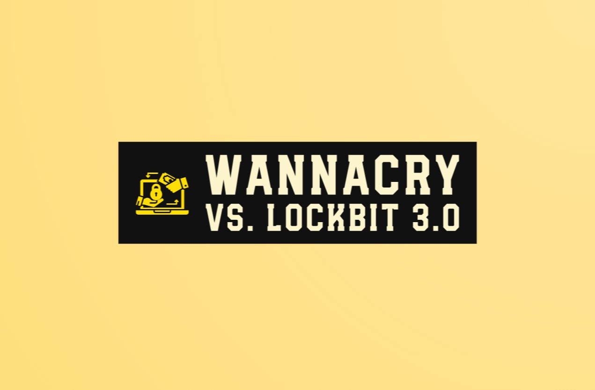
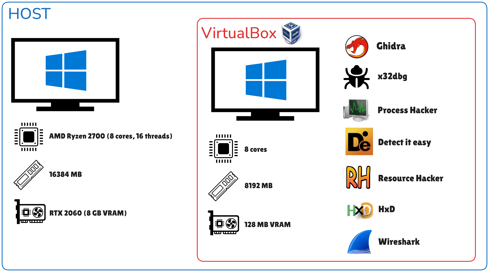
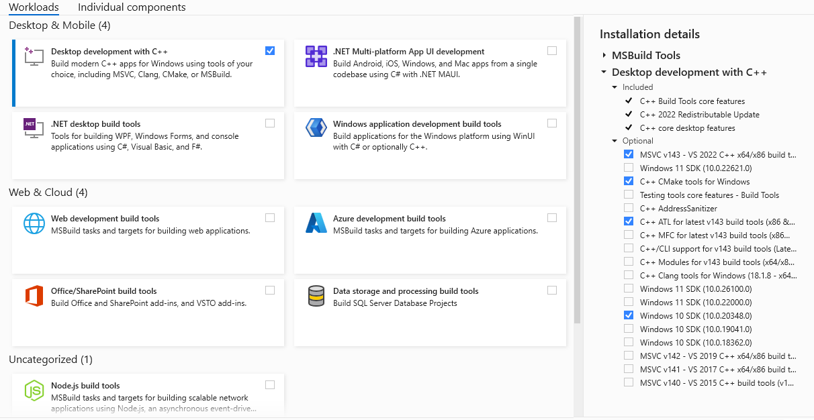

<a id="readme-top"></a>

<!-- PROJECT SHIELDS -->
[![Contributors][contributors-shield]][contributors-url]
[![Forks][forks-shield]][forks-url]
[![Stargazers][stars-shield]][stars-url]
[![Issues][issues-shield]][issues-url]
[![CC BY 4.0][cc-by-shield]][cc-by]
[![LinkedIn][linkedin-shield]][linkedin-url]

<!-- PROJECT LOGO -->
<br />
<div align="center">
  <a href="https://github.com/victorkvor/wannacry-vs-lockbit">
    
  </a>
  <h3 align="center">Comparative Analysis of Ransomware: WannaCry and LockBit 3.0</h3>

  <p align="center">
    This repository is based on my Bachelor's Thesis for my Computer Engineering degree at the University of Valencia and contains all my findings, reports, and scripts of two ransomware families: <b>WannaCry</b> and <b>LockBit 3.0</b>, with a reverse engineering approach.
The goal is to expose in-depth the mechanisms of evasion, persistence, obfuscation, and propagation, employed by both malware samples in order to make an evolutionary comparison of how the ransomware improved from WannaCry (2017) to LockBit 3.0 (2022). Also, both samples will be completely analysed, besides the encryption process, as it was not relevant for the project.
    <br />
    <a href="https://github.com/victorkvor/wannacry-vs-lockbit"><strong>Explore the docs »</strong></a>
    <br />
    <br />
    <a href="https://github.com/victorkvor/wannacry-vs-lockbit">View Demo</a>
    ·
    <a href="https://github.com/victorkvor/wannacry-vs-lockbit/issues/new?labels=bug&template=bug-report---.md">Report Bug</a>
    ·
    <a href="https://github.com/victorkvor/wannacry-vs-lockbit/issues/new?labels=enhancement&template=feature-request---.md">Request Feature</a>
  </p>
</div>

<!-- TABLE OF CONTENTS -->
<details>
  <summary>Table of Contents</summary>
  <ol>
    <li>
      <a href="#about-the-project">🔎 About The Project</a>
      <ul>
        <li><a href="#objectives">🎯 Objectives</a></li>
        <li><a href="#environment">💿 Environment</a></li>
        <ul>
            <li><a href="#vbox">💻 VirtualBox - Windows 10 Pro (VM)</a></li>
            <li><a href="#tools">🧰 Tools</a></li>
        </ul>
        <li><a href="#files-guide">📁 Files Guide</a></li>
      </ul>
    </li>
    <li>
      <a href="#getting-started">🚀 Getting Started</a>
      <ul>
        <li><a href="#prerequisites">📝 Prerequisites</a></li>
        <li><a href="#installation">📥 Installation</a></li>
      </ul>
    </li>
    <li>
      <a href="workflow-mitre">🧭 Sample Execution Workflow + MITRE ATT&CK Mapping</a>
      <ul>
        <li><a href="#wannacry">🦠 WannaCry</a></li>
        <li><a href="#lockbit">🦠 LockBit 3.0</a></li>
      </ul>
    </li>
    <li><a href="#comparative">⚖️ Comparative Analysis: WannaCry (2017) vs LockBit 3.0 (2022)</a></li>
    <li><a href="#resources">📚 Resources</a></li>
    <li><a href="#contributing">🤝 Contributing</a></li>
    <li><a href="#license">©️ License</a></li>
    <li><a href="#contact">☎️ Contact</a></li>
  </ol>
</details>

<!-- ABOUT THE PROJECT -->
## 🔎 About The Project <a id="about-the-project"></a>
  <p align="justify">
    This repository based on my Bachelor's Thesis presents a comprehensive technical and documente study that compares two major ransomware families from different eras: WannaCry (2017) and LockBit 3.0 (2022). The research follows a reverse engineering process, employing both static and dynamic analysis techniques to dissect malware samples and thoroughly analyze the program's workflow, exposing its behavior. Special attention is given to anti-debugging techniques, lateral movement, obfuscation methods, persistence mechanisms, process and service termination, dynamic payload loading, backup deletion, and log clearance.

The analysis is conducted primarily using open-source and freeware tools, including disassemblers, debuggers, network sniffers, process monitors, and auxiliary programs that assist in the reverse engineering process. All analysis is performed within a virtual machine to isolate the lab environment from the host system, providing a solid protection barrier against accidental infection.
    
Ultimately, beyond documenting and justifying the workflow of the malware samples, this research also provides practical detection mechanisms through YARA rules, which are designed to detect specific patterns that trigger the rule. Additionally, the techniques used by the malware samples are classified into tactics within the MITRE ATT&CK framework.
  </p>
<p align="right">(<a href="#readme-top">back to top</a>)</p>

### 🎯 Objectives <a id="objectives"></a>
- **Ransomware Impact and Evolution Study:** Compare the impact, evolution, and sophistication of malware, with a special focus on the ransomware subtype due to its prevalence and destructive effects.
- **Controlled Analysis Environment:** Establish an isolated laboratory environment to enable secure execution and thorough analysis of malware samples.
- **Static Analysis:** Perform in-depth static analysis using disassemblers and decompilers, entropy checkers, packer detection tools, embedded resource extraction, and auxiliary scripts.
- **Dynamic Analysis:** Perform in-depth dynamic analysis using debuggers and supplementary tools to monitor system behavior, network activity, and runtime execution.
- **Evasion Technique Classification:** Identify and categorize the evasion mechanisms used by both ransomware samples, comparing their complexity and sophistication.
- **Attack Pattern Representation:** Design detailed flowcharts and map techniques to the MITRE ATT&CK framework to visualize the internal logic of each ransomware.
- **Custom YARA Signatures:** Develop YARA rules to detect the malware samples, including their variants, by identifying distinctive code patterns and strings.
- **Evolutionary Comparison:** Conduct a reverse engineering comparison of the malware samples, focusing on the evolution of obfuscation methods, stealth capabilities, and evasion techniques across different generations.
- **Academic Knowledge Application:** Apply concepts in computer architecture, assembly, and cybersecurity acquired during the Computer Engineering degree to a professional malware analysis scenario.
- **Professional Foundations:** Establish a solid base in reverse engineering and malware forensics, oriented towards future certifications such as **OSED**, **OSEE**, or **GREM**.

<p align="right">(<a href="#readme-top">back to top</a>)</p>

### 💿 Environment <a id="environment"></a>

<div align="center">
    <a href="https://github.com/victorkvor/wannacry-vs-lockbit">
      
    </a>
</div>

#### 💻 VirtualBox - Windows 10 Pro (VM) <a id="vbox"></a>
VirtualBox is a type 2 hypervisor and open-source software that, thanks to its ease of use and strong community support, was chosen as the optimal solution for virtual machine virtualization. An isolated environment is necessary to safely contain the malicious behavior of ransomware samples, while also ensuring no network connection (manually configured). A Windows 10 Pro virtual machine is used because it was the contemporary operating system for the malware samples and is compatible with all tools employed in the lab environment.

<p align="right">(<a href="#readme-top">back to top</a>)</p>

#### 🧰 Tools <a id="tools"></a>
- **Ghidra:** Ghidra is an open-source reverse engineering framework developed and maintained by the NSA, which enables the disassembly and decompilation of binary files. It stands out as an excellent alternative to commercial tools like IDA Pro or Binary Ninja, being completely free and supported by an active community, making it an ideal entry-level solution for malware analysis.

- **x64dbg/x32dbg:** x64dbg and x32dbg are open-source debuggers for Windows that support 64-bit and 32-bit applications, respectively. These tools allow the use of breakpoints, memory and register inspection, and controlled execution of a program. Compared to older debuggers like OllyDbg, they are more robust and benefit from continuous support and updates.

- **Process Hacker:** Process Hacker is an open-source system monitoring tool designed to inspect running processes and services, loaded libraries, and active privileges and tokens. Compared to proprietary alternatives like Microsoft’s Process Explorer, Process Hacker provides more detailed insights and offers greater transparency into everything being executed on the system.

- **Wireshark:** Wireshark is the standard tool for network analysis. It is an open-source packet sniffer that provides advanced filtering, protocol decoding, real-time capture capabilities, and support for hundreds of network protocols. It is essential for analyzing malware-related network activity, such as data exfiltration or propagation attempts.

- **Detect It Easy (DIE):** Detect It Easy is an open-source, lightweight tool with an intuitive interface designed to provide preliminary context of a binary before in-depth analysis. It can detect if an executable is packed, identify its programming language based on signatures, and visualize its entropy level. Currently, there is no comparable alternative that offers such a quick and efficient general overview of an executable.

- **Resource Hacker:** Resource Hacker is a freeware utility used to extract embedded resources from executables. Although it is not open-source, its simplicity and effectiveness make it the most suitable tool for this specific task.

- **HxD:** HxD is a lightweight hexadecimal editor used to analyze and modify the raw binary content of files. Although it is not open-source, it was chosen for this project due to familiarity with the tool. However, reliable open-source alternatives, such as ImHex, are also available.

- **Visual Studio Code & Visual Studio:** Visual Studio Code is a lightweight, open-source code editor known for its versatility and extensive support for extensions, making it essential for writing auxiliary Python scripts. In contrast, Visual Studio is a full-featured integrated development environment (IDE) used to compile C/C++ programs, which is useful to replicate malware functionalities that rely on C++ functions.

<p align="right">(<a href="#readme-top">back to top</a>)</p>

### 📁 Files Guide <a id="files-guide"></a>
- 📂 `images/` → Screenshots from reverse engineering (x32dbg, Ghidra, etc.).  
- 📂 `rules/` → YARA rules for detecting WannaCry and LockBit 3.0.  
- 📂 `scripts/` → Helper scripts for LockBit 3.0 (AES key and payload decryption).
- 📜 `README.md` → This file.
- 📜 `Memoria_TFG.pdf` → Final Bachelor's Thesis report in PDF format (compiled version).  
- 📜 `LockBit_3_0.md` → Notes of LockBit 3.0 analysis.  
- 📜 `WannaCry.md` → Notes of WannaCry analysis. 

<p align="right">(<a href="#readme-top">back to top</a>)</p>

<!-- GETTING STARTED -->
## 🚀 Getting Started <a id="getting-started"></a>

To replicate the entire research under the same environment, follow the steps below.

### 📝 Prerequisites <a id="prerequisites"></a>
* Familiarity with:
  - Reverse engineering
  - Windows internals
  - Disassemblers and debuggers
  - Network analysis
  - Programming knowledge (especially low-level)
* Hardware with VT-x support, compatible with VirtualBox.
* A sufficiently powerful machine to run virtual machines smoothly, ideally with:
  - **At least 8 GB of RAM** (16 GB recommended)
  - **Quad-core CPU** or higher
  - **SSD storage** to avoid slowdowns during dynamic analysis
  - **40 GB of free disk space**, especially if compiling and executing C++ programs with Visual Studio inside the VM

### 📥 Installation <a id="installation"></a>
1. **Install VirtualBox or another virtualization software**:
    - To create a secure isolated environment for safely analyzing malware samples a virtualization software like VirtualBox must be used.
    - Allocate enough resources to the virtual machine, such as **at least 2 CPU cores** and **4–8 GB of RAM**, to ensure the malware executes properly and the analysis tools run smoothly.  
    - Once all tools are installed and the malware samples have been obtained, **disable the network adapter** from the virtualization settings to fully isolate the machine from external communication.
2. **Download the Windows 10 Pro ISO**:
    - From the [official Microsoft website](https://support.microsoft.com/en-us/windows/create-installation-media-for-windows-99a58364-8c02-206f-aa6f-40c3b507420d) or a trusted source, obtain an ISO of the desired operating system to prepare a virtual machine in VirtualBox or another hypervisor.
3. **Install the required tools listed in <a href="#tools">🧰 Tools</a>**:
    - Visual Studio: In the case of Visual Studio, select the options shown in the image below.

<div align="center">
    <a href="https://github.com/victorkvor/wannacry-vs-lockbit">
    
    </a>
</div>

4. **Clone this repository**:
    ```bash
    git clone https://github.com/victorkvor/wannacry-vs-lockbit.git
    ```
5. **Obtain malware samples (WannaCry and LockBit 3.0)**: 
    - Get the documented samples from [MalwareBazaar](https://bazaar.abuse.ch/).

<p align="right">(<a href="#readme-top">back to top</a>)</p>

## 🧭 Sample Execution Workflow + MITRE ATT&CK Mapping <a id="workflow-mitre"></a>

### 🦠 WannaCry <a id="wannacry"></a>

**Workflow:**

<div align="center">
    <a href="https://github.com/victorkvor/wannacry-vs-lockbit">
      
    </a>
</div>

**MITRE ATT&CK Mapping:**

| **Phase**                  | **Technique**                                                                                    | **ID**    | **Evidence**                                                                                                               |
| -------------------------- | ------------------------------------------------------------------------------------------------ | --------- | -------------------------------------------------------------------------------------------------------------------------- |
| **1. Initial Access**      | *There are multiple ways to distribute the malware*                                              | —         | The malware copy was obtained manually from MalwareBazaar, so no initial access vector was observed in the sample.         |
| **2. Execution**           | Command and Scripting Interpreter: Windows Command Shell                                         | T1059.003 | Uses cmd command at `create_tasksche_service()` to execute tasksche.exe                                                    |
|                            | System Services: Service Execution                                                               | T1569.002 | Starts tasksche.service at `create_tasksche_service()`                                                                     |
|                            | Windows Management Instrumentation                                                               | T1047     | Uses WMI at `UndefinedFunction_004064d0()` to delete shadow copies at `@WanaDecryptor@.exe`                                |
| **3. Persistence**         | Boot or Logon Autostart Execution: Registry Run Keys                                             | T1547.001 | Sets persistence via the registry at `FUN_10004cd0()`.                                                                     |
| **4. Defense Evasion**     | File and Directory Permissions Modification: Windows File and Directory Permissions Modification | T1222.001 | Uses `icacls . /grant Everyone:F /T /C /Q` to grant permissions to everyone at wWinMain in the main executable             |
|                            | Hide Artifacts: Hidden Files and Directories                                                     | T1564.001 | Uses `attrib +h .` at wWinMain in the main executable                                                                      |
| **6. Discovery**           | File and Directory Discovery                                                                     | T1083     | Searches user files for encryption based on specific file extension in mysterious_executable                               |
|                            | Remote System Discovery                                                                          | T1018     | The main executable does the exploit EternalBlue and looks for active local IPs and public IPs `FUN_00407bd0()`            |
|                            | System Network Configuration Discovery                                                           | T1016     | The main executable gets the subnet to iterate over the local IPs to perform the EternalBlue exploit at `FUN_00407bd0()`   |
| **7. Lateral Movement**    | Exploitation of Remote Services                                                                  | T1021     | The main executable does the exploit EternalBlue and exploits other hosts through and SMBv1 vulnerability `FUN_00407bd0()` |
| **8. Command and Control** | Proxy: Multi-hop Proxy                                                                           | T1090.003 | Uses TOR to communicate with the C&C server                                                                                |
| **9. Impact**              | Data Destruction                                                                                 | T1485     | Deletes shadow copies at `UndefinedFunction_004064d0()` from `@WanaDecryptor@.exe`.                                        |
|                            | Data Encrypted for Impact                                                                        | T1486     | WannaCry’s primary objective is to encrypt user files and demand ransom.                                                   |
|                            | Defacement: Internal Defacement                                                                  | T1491.001 | Changes wallpaper on infected systems.                                                                                     |
|                            | Inhibit System Recovery                                                                          | T1490     | Deletes VSS shadow copies at `UndefinedFunction_004064d0()` from `@WanaDecryptor@.exe`.                                    |
|                            | Service Stop                                                                                     | T1489     | Stops services such as Microsoft Exchange and SQL at `FUN_100057c0()` in mysterious_executable.                            |

---

### 🦠 LockBit 3.0 <a id="lockbit"></a>

**Workflow:**

<div align="center">
    <a href="https://github.com/victorkvor/wannacry-vs-lockbit">
      
    </a>
</div>

**MITRE ATT&CK Mapping:**

| **Phase**                   | **Technique**                                        | **ID**    | **Evidence**                                                                                                                                      |
| --------------------------- | ---------------------------------------------------- | --------- | ------------------------------------------------------------------------------------------------------------------------------------------------- |
| **1. Initial Access**       | *There are multiple ways to distribute the malware*  | —         | The malware copy was obtained manually from MalwareBazaar, so no initial access vector was observed in the sample.                                |
| **2. Execution**            | Command and Scripting Interpreter: PowerShell        | T1059.001 | Uses PowerShell commands at `FUN_004146a8()` to force `gpupdate` on network hosts.                                                                |
|                             | Inter-Process Communication: Component Object Model  | T1559.001 | Uses COM objects like `ICMLuaUtil` to execute commands with elevated privileges in `bypass_uac_icmluautil_spoof_peb_and_relaunch()`.              |
|                             | Native API                                           | T1106     | Indirect use of native API functions after dynamically loading them at `construct_api_addresses_antidbg()`.                                       |
|                             | Scheduled Task/Job                                   | T1053.005 | Sets scheduled tasks to AD hosts at `FUN_004150e0()`.                                                                                             |
|                             | Windows Management Instrumentation                   | T1047     | Uses WMI at `FUN_0040782a()` to delete shadow copies.                                                                                             |
| **3. Persistence**          | Boot or Logon Autostart Execution: Registry Run Keys | T1547.001 | Sets persistence via the registry at `FUN_00411934()`.                                                                                            |
|                             | Boot or Logon Autostart Execution: LSASS Driver      | T1547.008 | Injects a named pipe into `lsass.exe` at `inject_named_pipe_handle_lsass_or_explorer()`.                                                          |
| **4. Privilege Escalation** | Abuse Elevation Control Mechanism: Bypass UAC        | T1548.002 | Uses `ICMLuaUtil` COM object to bypass UAC and relaunch LockBit with elevated privileges.                                                         |
|                             | Access Token Manipulation: Token Impersonation/Theft | T1134.001 | Impersonates the token of `explorer.exe` at `get_explorer_securitydelegation_token()`.                                                            |
|                             | Valid Accounts                                       | T1078     | Uses AD accounts from a credential list tested at `attempt_dclogon_and_get_token()`.                                                              |
| **5. Defense Evasion**      | Debugger Evasion                                     | T1622     | Multiple anti-debugging techniques: `construct_api_addresses_antidbg()`, `hide_thread_from_dbg_func()`, `rtl_freeheap_antidbg_func()` and others. |
|                             | Deobfuscate/Decode Files or Information              | T1140     | Deobfuscation via mask `0x10035fff`, Base64 decoding, and two-round XOR decryption in `decrypt_payload_xor_custom_func()`.                        |
|                             | Group Policy Modification                            | T1484.001 | Disables Microsoft Defender via GPO at `FUN_004157b4()` and configures GPO to execute LockBit from SYSVOL at `FUN_004150e0()`.                    |
|                             | Hide Artifacts: Process Argument Spoofing            | T1564.010 | Spoofs the command line in the PEB to make LockBit appear as `dllhost.exe` at `spoof_peb_imagepath_commandline_to_dllhost()`.                     |
|                             | Impair Defenses: Disable or Modify Tools             | T1562.001 | Stops and deletes Windows Security Services at `FUN_00407ca4()` and security tools (e.g., Sophos) at `FUN_00414e50()`.                            |
|                             | Impair Defenses: Disable or Modify System Firewall   | T1562.004 | Disables Windows Defender firewall policies on AD hosts at `FUN_004157b4()`.                                                                      |
|                             | Indicator Removal: Clear Windows Event Logs          | T1070.001 | Deletes Windows event logs at `FUN_004091c8()`.                                                                                                   |
|                             | Indirect Command Execution                           | T1202     | Dynamically resolves APIs and builds trampolines for execution at `load_apis_func()`.                                                             |
|                             | Obfuscated Files or Information                      | T1027     | Obfuscated payload decoded via XOR and decompressed with aPLib-like algorithm at `some_aplib_decompressor_func()`.                                |
|                             | Process Injection: Thread Execution Hijacking        | T1055.003 | Injects payload remotely to hijack execution at `inject_payload_and_wait_remote_thread()`.                                                        |
|                             | Reflective Code Loading                              | T1620     | Reflectively loads code dynamically during execution at `decompress_obfuscated_code_func()`.                                                      |
| **6. Credential Access**    | Brute Force: Password Spraying                       | T1110.003 | Tries a list of common credentials against the domain controller at `store_valid_dc_credential_from_list()`.                                      |
| **7. Discovery**            | System Information Discovery                         | T1082     | Collects system info before exfiltration at `FUN_0040cd04()`.                                                                                     |
|                             | System Language Discovery                            | T1614.001 | Retrieves user language to decide execution at `whitelist_language_func()`.                                                                       |
| **8. Lateral Movement**     | Taint Shared Content                                 | T1080     | Drops a copy of LockBit into `SYSVOL` and uses GPOs to force execution on all domain hosts at `FUN_004150e0()`.                                   |
| **9. Collection**           | Data from Local System                               | T1005     | Collects local system data for exfiltration at `FUN_0040cd04()`.                                                                                  |
| **10. Exfiltration**        | Exfiltration Over Web Service                        | T1567     | Exfiltrates collected data via HTTP POST at `FUN_0040cfcc()`.                                                                                     |
| **11. Impact**              | Data Destruction                                     | T1485     | Deletes shadow copies at `FUN_0040782a()`.                                                                                                        |
|                             | Data Encrypted for Impact                            | T1486     | LockBit’s primary objective is to encrypt user files and demand ransom.                                                                           |
|                             | Defacement: Internal Defacement                      | T1491.001 | Changes file icons and wallpaper on infected systems.                                                                                             |
|                             | Inhibit System Recovery                              | T1490     | Deletes VSS shadow copies used for recovery at `FUN_0040782a()`.                                                                                  |
|                             | Service Stop                                         | T1489     | Stops services such as SQL and backup tools like Veeam at `FUN_00414e50()`.                                                                       |

---

*MITRE ATT&CK® is a trademark of The MITRE Corporation. Techniques are referenced from the official [MITRE ATT&CK framework](https://attack.mitre.org/).*  

<p align="right">(<a href="#readme-top">back to top</a>)</p>

## ⚖️ Comparative Analysis: WannaCry (2017) vs LockBit 3.0 (2022) <a id="comparative"></a>

| Aspect | **WannaCry (2017)** | **LockBit 3.0 (2022)** |
|--------|------------------|-------------|
| **📅 Context of Appearance** | First major ransomware to exploit SMB vulnerabilities in Windows (EternalBlue). | Highly sophisticated and modular Ransomware-as-a-Service (RaaS), part of the professionalization of cybercrime. |
| **💼 Business Model** | Massive, indiscriminate attack without victim targeting or customization. | RaaS model with affiliates. Targeted attacks against specific organizations with double extortion (encryption + data leak). |
| **🔁 Propagation Method** | Worm-like self-propagation via EternalBlue over LAN/WAN; also spread manually (phishing, RATs, etc.). | Manual propagation via phishing, RDP service exploitation, and internal tools. Occasional self-propagation in networks with shared administrator credentials in Active Directory. |
| **🧪 Technical Evolution** | Simple code, static analysis sufficient. Direct API usage. | Highly evolved: versions 1.0, 2.0, 3.0, and 4.0. Requires dynamic analysis due to advanced evasion techniques. |
| **🧱 Language and Architecture** | Written in C++, for Windows x86/x64 systems. Size: 3.55 MB. | Written in assembly, for Windows x86/x64 systems. Size: 146 KB. |
| **🔐 Encryption Techniques** | Basic, inefficient encryption scheme. | Fast, efficient, and more advanced encryption engine. |
| **🧨 Exploits** | Uses EternalBlue and DoublePulsar (zero-day exploits leaked by ShadowBrokers). | Exploits ICM LuaUtil for UAC bypass. Less reliant on exploits, more on credentials and manual access. |
| **🎭 Evasion and Stealth** | Basic techniques: hides working folder, uses legitimate service names, minimal obfuscation, and conventional compression. | Advanced techniques: obfuscation, non-standard encrypted/compressed payloads, anti-debugging, indirect API loading, EDR evasion (Sophos/Defender), and UAC privilege escalation. |
| **📦 Post-Infection Behavior** | Displays ransom note and encrypts files. No additional actions. | Encrypts and exfiltrates sensitive data. Threatens to leak it if payment is not made (double extortion). |
| **💸 Payment Mechanism** | Bitcoin only. No payment panel. | Uses a dark web portal with untraceable cryptocurrencies like Monero. |
| **🛡️ Response and Mitigation** | MS17-010 patch, disable SMBv1, basic YARA rules, network segmentation. | Hard to mitigate. Variants evade YARA rules and signatures. Requires EDR/XDR solutions with up-to-date threat intelligence. |

<p align="right">(<a href="#readme-top">back to top</a>)</p>

<!-- RESOURCES -->
## 📚 Resources <a id="resources"></a>

Here are some additional resources that you may find useful, and the ones used for the project:

### 📖 Documentation and Technical References
- **[Microsoft Docs](https://learn.microsoft.com/)**: Official documentation for Windows APIs, internals, and development tools.
- **[MITRE ATT&CK](https://attack.mitre.org/)**: Framework for classifying and describing adversary behavior.
- **[Qualys](https://www.qualys.com/)**: Technical breakdowns on vulnerabilities such as EternalBlue and DoublePulsar.
- **[File Signatures by Gary Kessler](https://www.garykessler.net/library/file_sigs.html)**: Extensive database of known file headers and magic numbers.
- **[Geoff Chappell](https://www.geoffchappell.com/)**: In-depth research on Windows undocumented structures and APIs.
- **[Vergilius Project](https://www.vergiliusproject.com/)**: NT kernel structures and system call information.
- **[Checkpoint Anti-Debug](https://anti-debug.checkpoint.com/techniques/debug-flags.html#manualchecks-heap-flags)**: Anti-debugging techniques focused on heap flags and debug registers.
- **[Undocumented NT Internals](http://undocumented.ntinternals.net/)**: Deep reference for Windows internal functions.
- **[Docs.rs](https://docs.rs/)**: Rust documentation but useful for low-level system crates and FFI.
- **[NTDOC by M417z](https://github.com/m417z/ntdoc)**: Clean documentation of many Windows NT native functions and structures.
- **[ReactOS](https://reactos.org/)**: Open-source Windows-compatible OS, useful for understanding Windows internals.
- **[MagnumDB](magnumdb.com)**: Searchable database of API and function names, often used in malware analysis.
- **[Dogbolt (Compiler Explorer)](https://dogbolt.org/)**: Interactive online decompiler which shows equivalent C-like output of decompiled programs from many popular decompilers
- **[Stroncic CLSID/IID](https://strontic.github.io/xcyclopedia/index-com-objects)**: Comprehensive CLSID and IID index for COM objects.
- **[NirSoft Windows10DLL](https://www.nirsoft.net/dll_information_in_windows10.html)**: Detailed DLL export function reference for Windows 10.
- **[Sunshine2k PE format](https://www.sunshine2k.de/reversing/tuts/tut_pe.htm)**: Guide explaining the PE file format and headers.
- **[WinSDK 10 (TPN)](https://github.com/tpn/winsdk-10)**: Complete Windows SDK headers and definitions.
- **[UACME](https://github.com/hfiref0x/UACME)**: Collection of UAC bypass techniques using undocumented Windows features.
- **[Process Hacker NT API](https://processhacker.sourceforge.io/doc/index.html)**: Reference for NT system calls, security structures, and undocumented Windows internals used by Process Hacker.
- **[YaraDbg](https://yaradbg.dev/)**: Online YARA debugger and visualizer for testing custom rules.

<p align="right">(<a href="#readme-top">back to top</a>)</p>

<!-- CONTRIBUTING -->
## 🤝 Contributing <a id="contributing"></a>
Contributions are what make the open-source community such an amazing place to learn, inspire, and create. Any contributions you make are **greatly appreciated**.

1. Fork the Project
2. Create your Feature Branch (`git checkout -b feature/AmazingFeature`)
3. Commit your Changes (`git commit -m 'Add some AmazingFeature'`)
4. Push to the Branch (`git push origin feature/AmazingFeature`)
5. Open a Pull Request

<p align="right">(<a href="#readme-top">back to top</a>)</p>

<!-- LICENSE -->
## ©️ License <a id="license"></a>
Distributed under the MIT License. See `LICENSE` for more information.

<p align="right">(<a href="#readme-top">back to top</a>)</p>

<!-- CONTACT -->
## ☎️ Contact <a id="contact"></a>
Victor Kravchuk Vorkevych - victorkravchuk19@gmail.com

Project Link: [https://github.com/victorkvor/wannacry-vs-lockbit](https://github.com/victorkvor/wannacry-vs-lockbit)

<p align="right">(<a href="#readme-top">back to top</a>)</p>

<!-- MARKDOWN LINKS & IMAGES -->
<!-- https://www.markdownguide.org/basic-syntax/#reference-style-links -->
[contributors-shield]: https://img.shields.io/github/contributors/victorkvor/wannacry-vs-lockbit.svg?style=for-the-badge
[contributors-url]: https://github.com/victorkvor/wannacry-vs-lockbit/graphs/contributors
[forks-shield]: https://img.shields.io/github/forks/victorkvor/wannacry-vs-lockbit.svg?style=for-the-badge
[forks-url]: https://github.com/victorkvor/wannacry-vs-lockbit/network/members
[stars-shield]: https://img.shields.io/github/stars/victorkvor/wannacry-vs-lockbit.svg?style=for-the-badge
[stars-url]: https://github.com/victorkvor/wannacry-vs-lockbit/stargazers
[issues-shield]: https://img.shields.io/github/issues/victorkvor/wannacry-vs-lockbit.svg?style=for-the-badge
[issues-url]: https://github.com/victorkvor/wannacry-vs-lockbit/issues
[cc-by]: http://creativecommons.org/licenses/by/4.0/
[cc-by-shield]: https://img.shields.io/badge/License-CC%20BY%204.0-lightgrey.svg?style=for-the-badge
[license-shield]: https://img.shields.io/github/license/victorkvor/wannacry-vs-lockbit.svg?style=for-the-badge
[license-url]: https://github.com/victorkvor/wannacry-vs-lockbit/blob/master/LICENSE.txt
[linkedin-shield]: https://img.shields.io/badge/-LinkedIn-black.svg?style=for-the-badge&logo=linkedin&colorB=555
[linkedin-url]: https://linkedin.com/in/victorkvor
